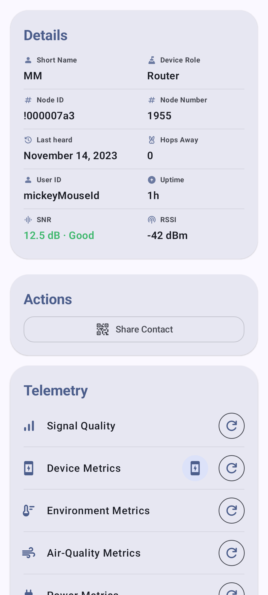
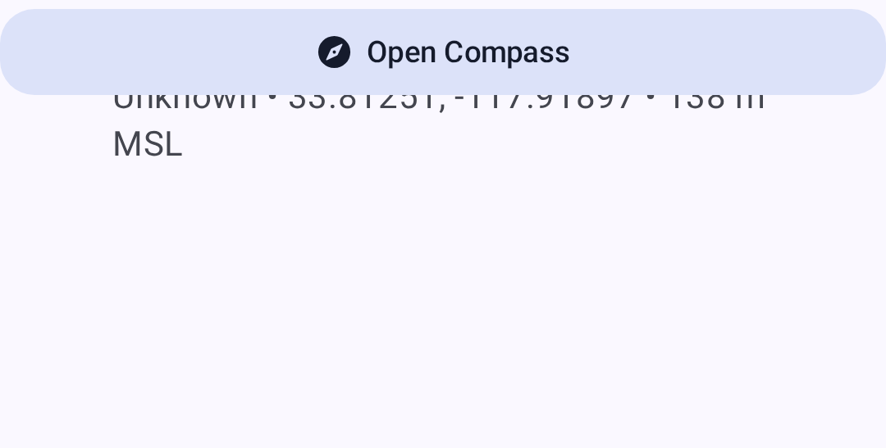
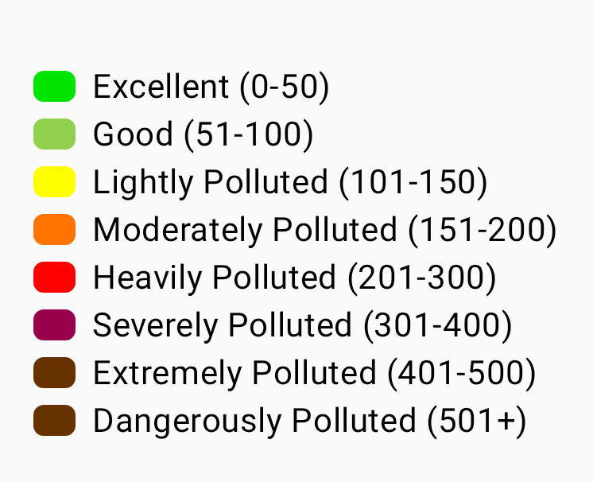
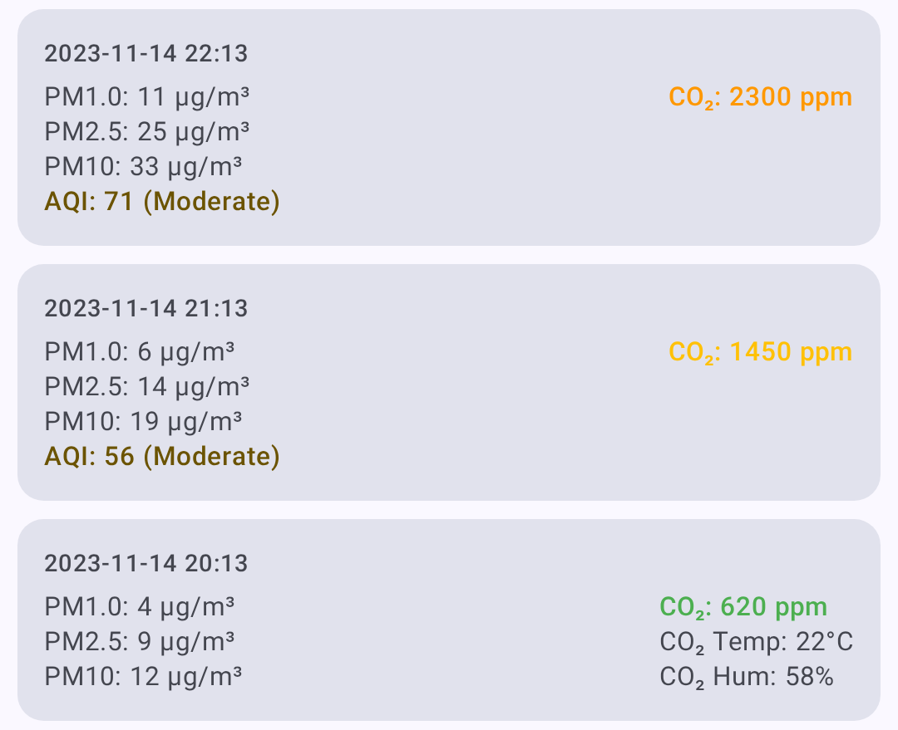

# Radion mittarit

Radion tietonäyttö tarjoaa kattavat telemetria- ja mittaritiedot jokaiselle verkon radiolle.

## Mittareiden tarkastelu

1. Siirry kohtaan **Radiot**.
2. Napauta radiota, jota haluat tarkastella.
3. Scroll to the **Telemetry** section and find the category you want — **Signal Quality**, **Device Metrics**, **Environment Metrics**, **Air-Quality Metrics**, **Power Metrics**, **Position**, and the rest.
4. Tap the refresh button on a row to ask the node for a fresh reading. The chart button beside it opens that category's history, and appears once the node has reported that kind of telemetry.

The **Position** row expands to show location data for nodes that share GPS:

> ℹ️ **Huomautus:** Mittarit näkyvät vain, jos etäradio on lähettänyt ne. Mittarit päivittyvät kunkin radion telemetria-asetuksissa määritetyin väliajoin.

## Laitteen mittausloki

Perustoimintatiedot, jotka jokainen radio raportoi:

| Metrijärjestelmä       | Kuvaus                                                   |
| ---------------------- | -------------------------------------------------------- |
| Akun varaustaso        | Nykyinen akun varaustaso                                 |
| Jännite                | Akun jännitelukema                                       |
| Kanavan käyttöaste     | Percentage of local airtime in use                       |
| Lähetysajan käyttöaste | Percentage of the last hour this node spent transmitting |
| Käyttöaika             | Aika viimeisestä uudelleenkäynnistyksestä                |

Device Metrics has no cards on the node detail screen. Use the chart button on its row to open the Device Metrics screen, where battery level, voltage, ChUtil, and AirUtil are plotted over time and every reading — uptime included — is listed with its timestamp underneath. Pick a time frame at the top of the screen, and use the save icon in the app bar to export the visible history as CSV.

> 💡 **Tip:** Where a category does show cards — Environment, Air Quality, and Power — touch & hold a card to copy its value to the clipboard. On a chart screen, pinch to zoom the time axis.

## Ympäristöarvot

Ympäristöanturien tiedot (edellyttää yhteensopivaa laitteistoa):

| Metrijärjestelmä                    | Anturiesimerkkejä     |
| ----------------------------------- | --------------------- |
| Lämpötila                           | BME280, BME680, SHT31 |
| Kosteus                             | BME280, BME680, SHT31 |
| Barometrinen paine                  | BME280, BMP280        |
| Kaasuvastus                         | BME680                |
| IAQ (ilmanlaatu) | BME680                |

Ympäristömittareista piirretään aikasarjat — lämpötila, ilmankosteus ja ilmanpaine näytetään kukin omana viivakaavionaan, ja mittayksikkö näkyy Y-akselilla.

BME680:n **IAQ (Indoor Air Quality)** -indeksi on yksi arvo väliltä 0–500+, joka perustuu kaasun resistanssiin. Se näytetään värikoodatulla asteikolla välillä _Erinomainen_–_Vaarallisen saastunut_:

> 💡 **Vinkki:** Ympäristömittarit edellyttävät etäradioon liitettyä anturia. Kaikki radiot eivät raportoi ympäristötietoja. Katso [Telemetria ja anturit](telemetry-and-sensors) saadaksesi täydellisen luettelon tuetuista antureista.

## Ilmanlaatumittarit

Ilmanlaatu on erillinen mittarinäkymä radioille, joissa on hiukkas- ja/tai CO₂-anturi. Se on **erillinen BME680:n IAQ-lukemasta**, joka on lueteltu ympäristömittareissa — IAQ on yksittäinen kaasuvastukseen perustuva indeksi, kun taas ilmanlaatunäkymä esittää varsinaiset hiukkas- ja CO₂-mittaukset kaavioina.

| Metrijärjestelmä      | Yksikkö     | Kuvaus                                                                                                                                                                                                                                                                                              |
| --------------------- | ----------- | --------------------------------------------------------------------------------------------------------------------------------------------------------------------------------------------------------------------------------------------------------------------------------------------------- |
| PM1.0 | µg/m³       | Enintään 1,0 mikrometrin kokoiset hiukkaset                                                                                                                                                                                                                                                         |
| PM2.5 | µg/m³       | Enintään 2,5 mikrometrin kokoiset hiukkaset                                                                                                                                                                                                                                                         |
| PM10                  | µg/m³       | Enintään 10 mikrometrin kokoiset hiukkaset                                                                                                                                                                                                                                                          |
| AQI                   | EPA-indeksi | EPA:n **NowCast**-ilmanlaatuindeksi lasketaan radion viimeaikaisen PM2.5-historian perusteella, ja sen vakavuus näytetään värikoodattuna. Näytetään PM2.5-arvon yhteydessä, kun mittauksia on kertynyt riittävästi. |
| CO₂                   | ppm         | Hiilidioksidipitoisuus                                                                                                                                                                                                                                                                              |
| CO₂ lämpötila         | °C / °F     | CO₂ anturin ilmoittama lämpötila (esim. SCD4x)                                                                                                                                                                                                                   |
| CO₂ kosteus           | %           | CO₂ anturin ilmoittama suhteellinen ilmankosteus                                                                                                                                                                                                                                                    |

CO₂-lukemat on värikoodattu vakavuuden mukaan, joten ilmanlaadun näkee yhdellä silmäyksellä:

| Taajuusalue | CO₂-pitoisuus (ppm) | Väri           |
| ----------- | -------------------------------------- | -------------- |
| Hyvä        | < 1000        | Vihreä         |
| Tunkkainen  | < 2000        | Keltainen      |
| Huono       | < 5000        | Oranssi        |
| Vaarallinen | < 30000       | Punainen       |
| Evakuoi     | ≥ 30000                                | Tummanpunainen |

Ilmanlaatu tai mittaripainike näkyy radion tietonäytössä **vain silloin, kun radio on raportoinut ilmanlaatutelemetriaa**. Ilmanlaatu-näkymässä voit:

- Valita kaavioille **aikajakson**.
- Suodattaa **mittarisiruilla** — vain mittarit, joista on dataa, näytetään.
- **Päivittää ja pyytää** uusimmat ilmanlaatutelemetriatiedot.
- **Viedä CSV-tiedostoon** analysoitavaksi taulukkolaskentaohjelmassa.

> 💡 **Vinkki:** Ilmanlaatumittarit edellyttävät yhteensopivaa ilmanlaatuanturia etäradiossa. Katso [Telemetria ja anturit](telemetry-and-sensors) saadaksesi lisätietoja tuetusta laitteistosta.

## Signaalin laatu

Radiosignaalin laatutiedot:

| Metrijärjestelmä | Kuvaus                                                                                                                    |
| ---------------- | ------------------------------------------------------------------------------------------------------------------------- |
| SNR              | Signaali-kohinasuhde (suurempi SNR on parempi)                                                         |
| RSSI             | Vastaanotetun signaalin voimakkuusindikaattori (RSSI) (lähempänä nollaa on parempi) |
| Kohinataso       | Paikallinen taustakohina dBm-arvona (negatiivisempi on hiljaisempi)                                    |
| Hyppylaskuri     | Verkon hyppymäärä viimeisimmälle viestille                                                                                |

### Signaalin laadun viitearvot

Signaalin laatu arvioidaan **SNR**-arvon perusteella suhteessa käytössä olevan LoRa-modeemiesiasetuksen **demodulaation alarajaan**, ei kiinteiden raja-arvojen perusteella. Sama SNR-arvo voi tarkoittaa eri asioita eri esiasetuksilla (esim. `-15 dB` on hyvä LongSlow-esiasetuksella, mutta käyttökelvoton ShortFast-esiasetuksella). RSSI näytetään, mutta sitä ei käytetä arvioinnissa. Taulukossa _raja_ tarkoittaa esiasetuksen SNR-rajaa.

| Laatu       | Kriteerit                          |
| ----------- | ---------------------------------- |
| Hyvä        | SNR esiasetuksen rajan yläpuolella |
| Kohtalainen | alle 5,5 dB rajan alapuolella      |
| Huono       | 5,5–7,5 dB rajan alapuolella       |
| ei mitään   | yli 7,5 dB rajan alapuolella       |

Katso [Signaalimittarin toiminta](signal-meter), jos haluat täydellisen selityksen.

Yhdistetyn radion paikalliset tilastot näytetään myös Signaalin laatu -näkymässä silloin, kun ne ovat saatavilla. Nämä kerätyt tiedot sisältävät kohinatason, liikennelaskurit, välityslaskurit, verkossa olevien radioiden määrän sekä radion käyttöajan. Kohinatason kaaviossa käytetään katkoviivalla merkittyä viiteviivaa arvossa -85 dBm, jotta kuormittunut RF-ympäristö on helpompi tunnistaa.

- **Pyydä** — pyydä yhdistettyä radiota lähettämään uusi Local Stats -telemetriaraportti
- **Tyhjennä** — poista tämän radion Local Stats -lokit
- **Tallenna** — vie näkyvä Local Stats -historia CSV-tiedostoon

## Virranhallinnan arvot

Virranhallintatelemetria (edellyttää INA-anturia tai yhteensopivaa laitteistoa):

| Metrijärjestelmä | Kuvaus                                        |
| ---------------- | --------------------------------------------- |
| Jännite          | Kanavakohtainen jännitelukema                 |
| Virta            | Kanavakohtainen virrankulutus milliampeereina |

The node detail screen shows cards for channels 1 to 3. Use the chart button on the **Power Metrics** row to open the chart screen, which lists a chip for every channel that reported data — up to eight — and charts the one you select. Use the label field under the chips to give a channel a name of your own, such as Solar or Battery. The app does not derive a wattage figure from voltage and current.

## Reitinselvitys

Reitinselvitys näyttää viestin kulkeman reitin verkossa:

1. From the node detail screen's **Telemetry** section, tap the refresh button on the **Traceroute** row. You cannot traceroute your own node, and the button accepts one request every 30 seconds.
2. Sovellus lähettää reitinselvityspyynnön kohderadiolle.
3. Results show each hop with its SNR.

### Reitinselvityksen tulosten lukeminen

A traceroute is a round trip, so each saved result carries a hop count in each direction — **Forward Hops** and **Return Hops** — and the **Round Trip** time in seconds. A result marked **Direct** reached the target with no relay in between. Tap a result to read the route traced toward the destination and the route traced back to you, with the SNR of every hop. On Android that view offers **View on map**, which draws the same path, as long as the start and destination nodes have both shared a position.

A result marked **No Response** means the target never answered. It may be out of range, asleep, or configured not to reply. Wait for the 30-second cooldown to clear and try again; if it keeps failing, send a direct message first to confirm the node is reachable at all.

## Sijainnin Loki

Historialliset sijaintitiedot radioille, jotka jakavat sijaintinsa:

- GPS-koordinaatit
- Korkeus
- Nopeus (jos radio liikkuu)
- Aikaleima jokaiselle sijaintiraportille

## Naapuritieto

Näyttää, mitkä radiot tietty radio voi kuulla suoraan, mikä auttaa ymmärtämään verkon topologiaa.

## Isäntälaitteen mittausarvot

Nodes that run Meshtastic on a Linux host, such as a Raspberry Pi, report the host's own health — free memory, free disk space, one-, five-, and fifteen-minute load averages, and how long the host has been up. The **Host Metrics** row is always listed; its chart button appears once a node has reported them.

## Pax mittarit

A node running the PAX counter module reports how many Wi-Fi and Bluetooth devices it saw nearby, as a crowd-size estimate, and charts the two counts alongside their total. The **PAX Metrics** row is always listed; its chart button appears once a node has reported them. The counts are of devices, not people.

## Aiheeseen liittyvät aiheet

- [Radiot](nodes) — radioluettelo, suodatus ja lajittelu
- [Telemetria ja anturit](telemetry-and-sensors) — tuetut anturit ja määritykset
- [Signaalimittari](signal-meter) — miten signaalin laatu lasketaan SNR- ja RSSI-arvoista
- [Paikallinen mesh-verkon etsintä](discovery) — reitiselvityksen tiedot ja naapuritiedot
- [Yksiköt ja aluekohtaiset asetukset](units-and-locale) — lämpötilan, etäisyyden ja nopeuden näyttömuodot
