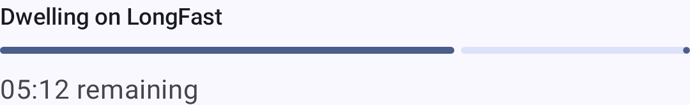
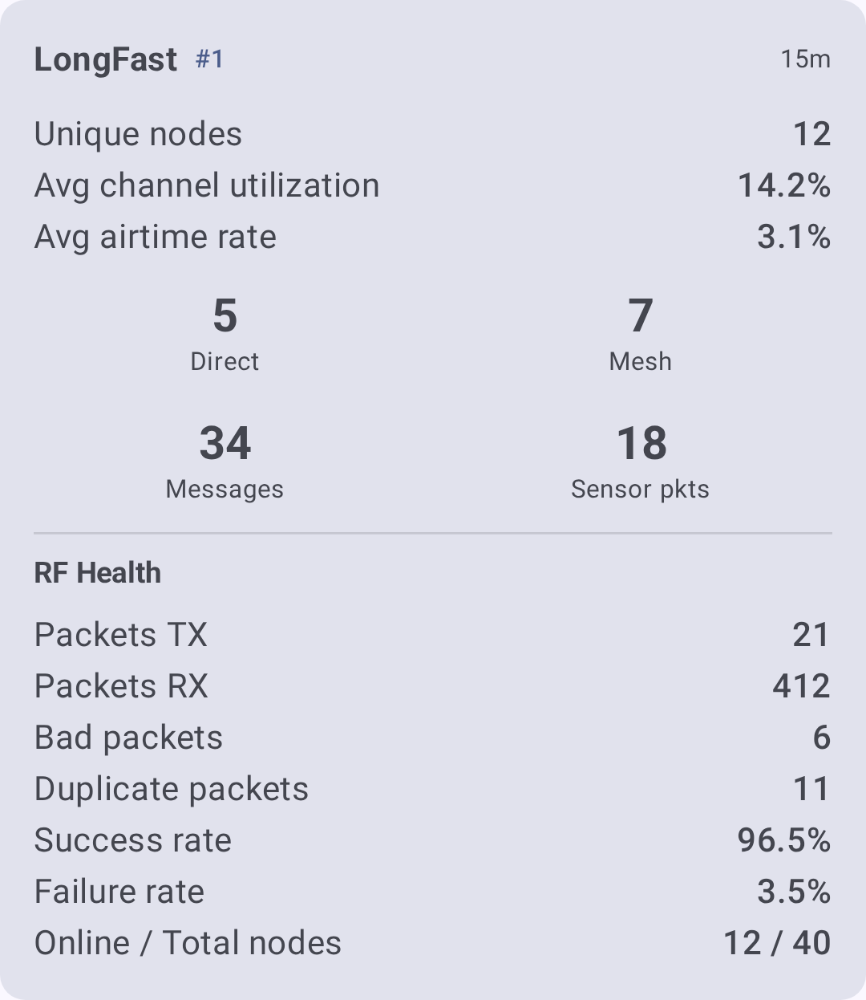

# Discovery

Discovery tools help you understand **how** your mesh network is connected — which nodes can hear each other, what paths messages take, and where bottlenecks or weak links exist.

The app offers two complementary approaches:

- **Local Mesh Discovery (Scanner)** — an automated mode that cycles your connected radio through different LoRa presets, listens on each, and ranks which preset performs best at your location.
- **Manual exploration** — traceroute, Neighbor Info, and the node list, which you can use at any time to investigate specific paths and topology.

---

## Local Mesh Discovery (Scanner)

Local Mesh Discovery is a dedicated scanning mode that helps you find the best LoRa modem preset for your location and see which nodes are active on each preset. It cycles your connected radio through one or more presets you choose, listens (or "dwells") on each one for a set time to collect packets, then analyzes and ranks the results.

Open it from **Settings → Local Mesh Discovery**.

> ⚠️ **Note:** Discovery temporarily changes your radio's LoRa settings while it scans, then restores your original configuration when it finishes. Your device must be connected to run a scan.

### Setting Up a Scan

Before starting, configure these controls:

| Control                | Cur síos                                                                                                                                                                                                                       |
| ---------------------- | ------------------------------------------------------------------------------------------------------------------------------------------------------------------------------------------------------------------------------ |
| **LoRa preset picker** | Select one or more presets to scan. Discovery dwells on each selected preset in turn.                                                                                                          |
| **Dwell time**         | Time to listen on each preset. Choose from 1, 5, 15, 30, 45, 60, 90, 120, or 180 minutes. Longer dwell times collect more packets and give a clearer picture, but take longer. |
| **Keep screen awake**  | Optional toggle that prevents the screen from sleeping during a long scan.                                                                                                                                     |

The **Start** button stays disabled — with an explanation of why — until the scan can run. Common reasons it's disabled:

- The device is **not connected**.
- **No presets** have been selected to scan.
- The selected preset uses **2.4 GHz**, which your hardware doesn't support.

### Live Progress

While a scan runs, Discovery shows its current stage:

| Stage                                                 | What's happening                                                                                       |
| ----------------------------------------------------- | ------------------------------------------------------------------------------------------------------ |
| **Preparing**                                         | Saving your current configuration and getting ready to scan.                           |
| **Shifting to \<preset\>** | Switching the radio to the next preset to test.                                        |
| **Reconnecting**                                      | Re-establishing the connection after the preset change.                                |
| **Dwell**                                             | Listening on the current preset to collect packets, with a countdown to the next step. |
| **Analysis**                                          | Processing the collected packets and ranking the presets.                              |
| **Restoring**                                         | Putting your original LoRa configuration back.                                         |



### Reading the Results

When the scan completes, Discovery presents a per-preset result card for each preset it tested, plus an overall summary.



Metrics include:

| Metric                                   | What it tells you                                                                              |
| ---------------------------------------- | ---------------------------------------------------------------------------------------------- |
| RF health                                | Overall quality of the radio environment on that preset.                       |
| Channel utilization                      | How busy the airwaves were during the dwell.                                   |
| Airtime                                  | Transmission time observed.                                                    |
| Direct vs. relayed nodes | How many mesh nodes were heard directly versus via a relay.                    |
| Bad / duplicate packets                  | Counts of corrupt and repeated packets, indicating congestion or interference. |

Additional features available from the results:

- **Scan History** — saved sessions you can revisit; view or delete past scans.
- **Discovery Map** — a map of the nodes found during the scan.
- **Report export** — export a report as a PDF on Android, or as text on other platforms.

> 💡 **Tip:** On Android, Discovery can generate an on-device AI summary (Gemini Nano) of your results. If the on-device model isn't available, an algorithmic summary is used instead — so you always get a readable interpretation of the scan.

---

## Mesh Beacon

Mesh Beacon lets nodes invite others to join their mesh. A beaconing node periodically broadcasts an invitation — optionally advertising a channel, region, and modem preset — that nearby devices can hear even before they share a configuration.

Configure it under **Settings → Module Config → Mesh Beacon**:

- **Listen for beacons** — receive invitations broadcast by other nodes.
- **Broadcast beacon** — send your own invitation at a set interval, with an optional message and an offered channel.

Received invitations appear as **Mesh invitations** cards on the Discovery screen. Each card shows the sender's message plus the offered channel, region, preset, and signal quality, with these actions:

- **Join** — switch to the offered channel and preset (retunes the radio and reboots). When the offer matches your current frequency slot, an **Add channel** action adds it without a reboot.
- **Discover** — seed a Discovery scan with the offered preset so you can survey that mesh before joining (shown only when the beacon offers a preset).
- **Dismiss** — ignore the invitation.

Channels advertised by beacons also show up in the scan setup as **Beacon channels** — select one to include it as a scan target.

---

## Manual Exploration

The tools below are available at any time from the node list and node detail screens. Use them to investigate specific paths and build a topology picture, alongside or instead of a full scan.

## Céim rianadóireachta

Traceroute reveals the exact path a message takes from your node to any other node on the mesh. It's the single most useful tool for debugging connectivity problems.

### Running a Traceroute

1. Navigate to **Nodes** and tap the node you want to trace.
2. On the node detail screen, tap **Traceroute**.
3. The app sends a traceroute request and waits for the response.
4. Results display each hop in order, with signal quality at every step.

### Reading the Results

A traceroute result looks like this:

```
You → Node A (SNR: 8.5, RSSI: -95) → Node B (SNR: 5.2, RSSI: -108) → Target
```

Each hop represents a relay node that forwarded the message. The SNR and RSSI values at each hop tell you about the link quality on that specific segment.

| What to look for                                                                  | What it means                                                               |
| --------------------------------------------------------------------------------- | --------------------------------------------------------------------------- |
| All hops show Good SNR (≥ −7 dB, green)                        | Healthy path — messages flow reliably                                       |
| One hop shows Bad SNR (< −15 dB, red) | Weak link — this relay segment is fragile                                   |
| Many hops (4+)                                                 | Long path — consider repositioning a node to shorten it                     |
| Different path on retry                                                           | Mesh is adapting — multiple routes exist (this is good!) |

> 💡 **Tip:** Run traceroute several times over a few minutes. If the path changes, your mesh has redundant routes — a sign of a well-connected network.

### Troubleshooting with Traceroute

- **"No route found"** — The target node may be offline, out of range, or on a different channel. Check that both nodes share at least one channel with the same encryption key.
- **Traceroute times out** — The path may be too long (exceeds hop limit) or a relay node is congested. Try increasing the hop limit in **Settings → LoRa Config**.
- **Asymmetric paths** — A traceroute from A→B may take a different path than B→A. This is normal — radio propagation is not always symmetric.

---

## Neighbor Info

The Neighbor Info module lets each node broadcast a list of the nodes it can **directly hear** (single-hop). When multiple nodes share their neighbor lists, you can piece together a topology map of the entire mesh.

### Enabling Neighbor Info

1. Navigate to **Settings → Module Config → Neighbor Info**.
2. Enable the module.
3. Set the broadcast interval (default: 900 seconds / 15 minutes).

Once enabled, your node periodically broadcasts its neighbor table. Other nodes with Neighbor Info enabled do the same.

### Viewing Neighbor Data

- Open any node's detail screen and look for the **Neighbors** section.
- Each neighbor entry shows the node that was directly heard and its signal quality.
- Combine neighbor data from multiple nodes to understand the full mesh topology.

> ⚠️ **Note:** Neighbor Info increases airtime usage because every enabled node periodically broadcasts its neighbor list. On busy meshes with many nodes, consider longer broadcast intervals (3600 seconds or more) to avoid congestion.

---

## Node List as a Discovery Tool

The node list itself is a powerful discovery tool when you use its filtering and sorting features effectively.

### Finding New Nodes

- Sort by **Last heard** to see the most recently active nodes at the top.
- Enable **Include unknown** to see nodes that have appeared on the mesh but haven't sent user info yet — these are often newly powered-on devices.

### Assessing Connectivity

- Sort by **Hops away** to see which nodes are directly reachable (0 hops) versus relayed.
- Sort by **Distance** to find nearby nodes and verify they're reachable.
- Use **Exclude MQTT** to focus on nodes reachable over radio (not via internet bridge).

### Infrastructure Audit

- Disable **Exclude infrastructure** to see Router, Router Late, and Client Base nodes.
- Check their signal quality and last-heard times to verify your infrastructure nodes are healthy.

See [Nodes](nodes) for full details on filtering and sorting options.

---

## Tips for Mesh Exploration

- **Start with traceroute** — it gives you immediate, actionable information about a specific path.
- **Enable Neighbor Info on key nodes** — especially routers and repeaters, to build a picture of the backbone.
- **Check the map** — node positions on the [Map](map-and-waypoints) combined with signal data help you understand why some links are strong and others are weak.
- **Compare signal over time** — use the [Signal Meter](signal-meter) guide to interpret SNR and RSSI values correctly.

---

