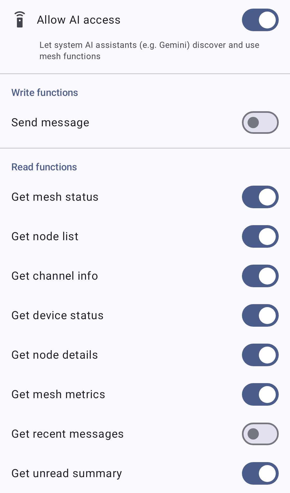

# アプリ機能

アプリ機能は、Android App Functions API を通じて、Meshtastic の機能を Android システムやオンデバイスの AI アシスタント（Gemini など）に公開します。 有効にすると、アシスタントがあなたに代わってメッシュのワークフロー（例：メッセージの送信やメッシュ状態の確認）を見つけて実行でき、アプリを開く必要がありません。

> ⚠️ **注意：** アプリ機能は、**Google 版の Android ビルドでのみ**利用できます。

> ⚠️ **注意：** これは、アプリ内の **Chirpy** アシスタントとは別のものです。 アプリ機能&#x306F;_&#x30B7;ステ&#x30E0;_&#x306E; AI アシスタントがあなたのメッシュを操作できるようにするもので、Chirpy は Meshtastic アプリ内の対話型アシスタントです。

## アプリ機能を有効にする

アプリ機能は「**設定 → システム AI**」から制御します（アプリ内の画面は「System AI」と表示されます）。 この画面には次があります：

- 「**AI のアクセスを許可**」というラベルの**マスタートグル**。サブタイトルは _「システムの AI アシスタント（例：Gemini）がメッシュ機能を見つけて使えるようにする」_ です。 オフの場合、システムには機能が一切公開されません。
- **各機能ごとの個別トグル**。公開したい機能だけを公開できます。

機能は、**書き込み**セクション（何かを変更したり、メッシュにデータを送信したりする機能）と、**読み取り**セクション（情報を返すだけの機能）に分かれています。

### 書き込み機能

| 機能           | 内容                                                   |
| ------------ | ---------------------------------------------------- |
| **メッセージを送信** | 連絡先（ダイレクトメッセージ）またはチャンネルに、最大 237 バイトのテキストメッセージを送信します。 |

### 読み取り機能

| 機能               | 返す内容                |
| ---------------- | ------------------- |
| **メッシュ状態を取得**    | メッシュ全体の状態。          |
| **ノードリストを取得**    | メッシュ上のノードのリスト。      |
| **チャンネル情報を取得**   | チャンネルに関する情報。        |
| **デバイス状態を取得**    | 接続中の無線機の状態。         |
| **ノード詳細を取得**     | 特定のノードに関する詳細情報。     |
| **最近のメッセージを取得**  | 会話からの最近のメッセージ。      |
| **未読の概要を取得**     | 未読メッセージの概要。         |
| **メッシュメトリクスを取得** | メッシュからのテレメトリとメトリクス。 |

## プライバシー

> 🔒 **プライバシー：** 「**メッセージを送信**」機能は、アシスタントがあなたに代わってメッシュにメッセージを送信できるようにします。 アシスタントに使わせても信頼できる機能だけを有効にしてください。 読み取り機能は、ノード・メッセージ・メトリクスのデータをアシスタントに公開します。共有しても差し支えないものだけを有効にしてください。 各機能には独自のトグルがあり、マスタートグルはそれらすべてを一度にオフにします。

## 関連トピック

- [メッセージとチャンネル](messages-and-channels)：アプリで直接メッセージを送信する
- [ノード](nodes)：読み取り機能が参照するノードリスト
- [ノードメトリクス](node-metrics)：「メッシュメトリクスを取得」の背後にあるテレメトリ

---

