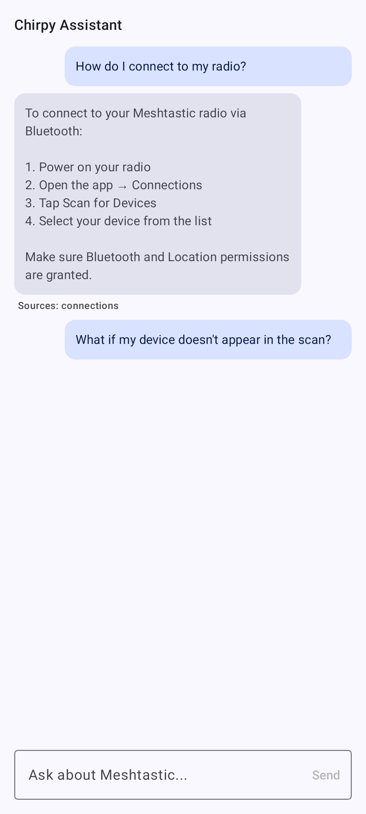

# ヘルプとアプリ内ドキュメント

このユーザードキュメントは**アプリ内**にも同梱されており、Meshtastic を離れることなくオフラインで読めます。 「**設定 → ヘルプとドキュメント**」から開きます。

## 閲覧する

ドキュメントブラウザーには、ユーザーガイドのすべてのページが一覧表示されます。 ページをタップすると読めます。画像や相互リンクも、ここと同じように機能します。

### 検索

検索アイコンをタップして入力すると、タイトルとキーワードでページを絞り込めます。結果は入力に応じて更新されます。

ブラウザーで開いたページ：

## Chirpy：AI アシスタント

**Chirpy** は、この同梱ドキュメントを情報源として、Meshtastic に関する平易な質問に答えます。 ドキュメントブラウザーで Chirpy ボタンをタップして質問を入力すると、回答と、関連ページへのリンクが返ってきます。

> 🔒 **プライバシー：** 対応する Google 版のデバイスでは、Chirpy は Gemini Nano を使って**オンデバイス**で動作します。質問がスマートフォンの外に出ることはありません。 初回使用時に、小さなモデルがダウンロードされます。

> ⚠️ **注意：** F-Droid 版、デスクトップ版、iOS 版では、Chirpy は生成モデルではなく、ドキュメントに対する**キーワード検索**にフォールバックします。 デバイスがオンデバイス AI に対応していない場合、アシスタントは非表示になり、ドキュメントの閲覧と検索は通常どおり行えます。

## 関連トピック

- [アプリを翻訳する](translate)：これらのページが他の言語にどう翻訳されるか
- [アプリ機能](app-functions)：Chirpy とは別の、システム AI 連携

---
