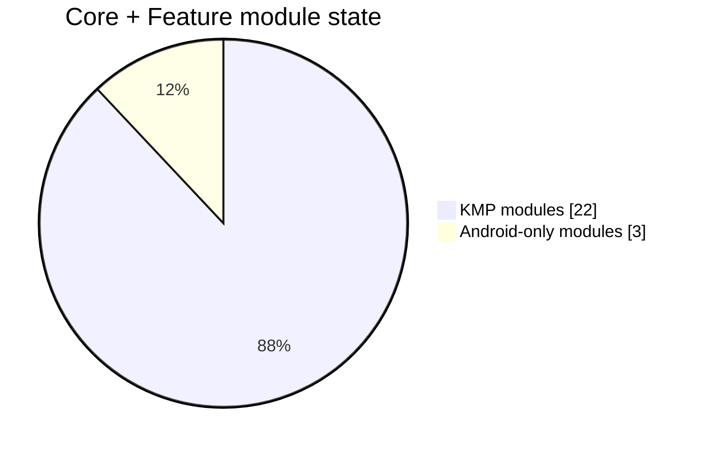
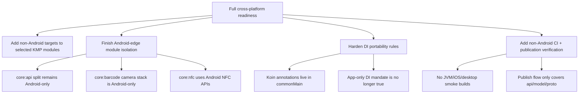

# KMP Progress Re-evaluation — March 2026

> Snapshot date: 2026-03-10
>
> This document is an evidence-backed re-baseline of Meshtastic-Android's Kotlin Multiplatform migration progress. It supplements and partially corrects the historical narrative in [`docs/kmp-migration.md`](./kmp-migration.md).

## Scope

This review covers:

- all `core:*` and `feature:*` modules in [`settings.gradle.kts`](../settings.gradle.kts)
- build conventions in [`build-logic/convention`](../build-logic/convention)
- current DI wiring in [`app/src/main/kotlin/org/meshtastic/app/di/AppKoinModule.kt`](../app/src/main/kotlin/org/meshtastic/app/di/AppKoinModule.kt)
- current application startup in [`app/src/main/kotlin/org/meshtastic/app/MeshUtilApplication.kt`](../app/src/main/kotlin/org/meshtastic/app/MeshUtilApplication.kt)
- local git history through 2026-03-10
- current dependency state in [`gradle/libs.versions.toml`](../gradle/libs.versions.toml)

---

## Executive summary

Meshtastic-Android has made **substantial structural KMP progress** very quickly in early 2026.

The migration is **farther along than a normal Android app**, but **not as far along as the existing migration guide sometimes implies**.

### Headline assessment

| Dimension | Status | Assessment |
|---|---:|---|
| Core + feature module structural KMP conversion | **22 / 25** | Strong |
| Core-only structural KMP conversion | **16 / 19** | Strong |
| Feature module structural KMP conversion | **6 / 6** | Excellent |
| Explicit non-Android target declarations | **1 / 25** | Very low |
| Android-only blocker modules left | **3** | Clear, bounded |
| Cross-target CI verification | **0 non-Android jobs** | Missing |

### Bottom line

- **If the question is “Have we mostly moved business logic into shared KMP modules?”** → **yes**.
- **If the question is “Could we realistically add iOS/Desktop with limited cleanup?”** → **not yet**.
- **If the question is “Are we now on the right architecture path?”** → **yes, strongly**.

### Progress scorecard

| Area | Score | Notes |
|---|---:|---|
| Shared business/data logic | **8.5 / 10** | `core:data`, `core:domain`, `core:database`, `core:prefs`, `core:network`, `core:repository` are structurally shared |
| Shared feature/UI logic | **8 / 10** | All feature modules are KMP; `core:ui` and Navigation 3 are in place |
| Android decoupling | **7 / 10** | `commonMain` is clean of direct Android imports, but edge modules still anchor to Android |
| Multi-target readiness | **2.5 / 10** | Nearly all KMP modules still declare only Android targets |
| DI portability hygiene | **5 / 10** | Koin works, but `commonMain` now contains Koin modules/annotations despite prior architectural guidance |
| CI confidence for future iOS/Desktop | **2 / 10** | CI is Android-only today |



---

## What is genuinely complete

### 1. The architectural center of gravity has moved into shared modules

This is the biggest success.

Evidence in current build files shows these are already on `meshtastic.kmp.library`:

- `core:ble`
- `core:common`
- `core:data`
- `core:database`
- `core:datastore`
- `core:di`
- `core:domain`
- `core:model`
- `core:navigation`
- `core:network`
- `core:prefs`
- `core:proto`
- `core:repository`
- `core:resources`
- `core:service`
- `core:ui`
- all feature modules: `intro`, `messaging`, `map`, `node`, `settings`, `firmware`

That is a major milestone. The repo is no longer “Android app with a few shared helpers”; it is now “Android app with a shared KMP core and KMP feature stack.”

### 2. Shared UI architecture is materially real, not aspirational

Current evidence supports the following:

- `core:ui` is KMP via [`core/ui/build.gradle.kts`](../core/ui/build.gradle.kts)
- `core:resources` uses Compose Multiplatform resources via [`core/resources/build.gradle.kts`](../core/resources/build.gradle.kts)
- `core:navigation` uses Navigation 3 runtime in `commonMain` via [`core/navigation/build.gradle.kts`](../core/navigation/build.gradle.kts)
- feature modules are KMP Compose modules via their `build.gradle.kts` files

This is unusually advanced for an Android-first app.

### 3. The Hilt → Koin migration is complete enough to unblock KMP

Current app startup and root assembly are clearly Koin-based:

- [`MeshUtilApplication.kt`](../app/src/main/kotlin/org/meshtastic/app/MeshUtilApplication.kt)
- [`AppKoinModule.kt`](../app/src/main/kotlin/org/meshtastic/app/di/AppKoinModule.kt)

This is strategically important because Hilt would have remained one of the strongest barriers to deeper KMP adoption.

### 4. The BLE architecture is moving in the correct direction

The repo's BLE direction is good:

- `core:ble` is KMP
- Android Nordic dependencies are isolated to `androidMain` in [`core/ble/build.gradle.kts`](../core/ble/build.gradle.kts)
- the repo already adopted an abstraction-first BLE shape instead of leaking vendor APIs through the domain layer

That makes future alternative platform implementations possible.

---

## What is **not** complete yet

## 1. The repo is structurally KMP, but not yet truly multi-target

This is the single most important correction.

Most KMP modules currently use the Android KMP library plugin and define only an Android target.

The clearest evidence is in build logic:

- [`KmpLibraryConventionPlugin.kt`](../build-logic/convention/src/main/kotlin/KmpLibraryConventionPlugin.kt) applies:
  - `org.jetbrains.kotlin.multiplatform`
  - `com.android.kotlin.multiplatform.library`
- [`KotlinAndroid.kt`](../build-logic/convention/src/main/kotlin/org/meshtastic/buildlogic/KotlinAndroid.kt) configures Android KMP targets automatically
- only [`core/proto/build.gradle.kts`](../core/proto/build.gradle.kts) explicitly adds `jvm()`

So today the repo has:

- **broad shared source-set adoption**
- **very little explicit second-target validation**

That means the current state is best described as:

> **“Android-first KMP-ready”**, not yet **“actively multi-platform validated.”**

## 2. Three core modules remain plainly Android-only

These are the biggest structural holdouts:

- [`core/api/build.gradle.kts`](../core/api/build.gradle.kts) → `meshtastic.android.library`
- [`core/barcode/build.gradle.kts`](../core/barcode/build.gradle.kts) → `meshtastic.android.library`
- [`core/nfc/build.gradle.kts`](../core/nfc/build.gradle.kts) → `meshtastic.android.library`

These are not minor details; they sit exactly at the platform edge:

- AIDL / service API surface
- camera + barcode scanning
- NFC hardware integration

This is acceptable in the short term, but it means the “full KMP core” is not done.

## 3. The historical migration narrative overstated `core:api`

Earlier migration wording grouped `core:service` and `core:api` together as if both had become KMP modules.

Current code shows a split reality:

- `core:service` **is** KMP
- `core:api` **is not**; it is still Android-only, which makes sense because AIDL is Android-only

The accurate statement is:

> `core:service` is KMP, while `core:api` remains an Android adapter/public integration module.

## 4. Shared-module DI became a real architecture change during the migration sprint

Earlier migration guidance aimed to keep DI-dependent components centralized in `app`.

That is **not how the current codebase ended up**.

Current codebase evidence:

- [`core/domain/src/commonMain/kotlin/org/meshtastic/core/domain/di/CoreDomainModule.kt`](../core/domain/src/commonMain/kotlin/org/meshtastic/core/domain/di/CoreDomainModule.kt) contains `@Module` + `@ComponentScan`
- [`feature/map/src/commonMain/kotlin/org/meshtastic/feature/map/di/FeatureMapModule.kt`](../feature/map/src/commonMain/kotlin/org/meshtastic/feature/map/di/FeatureMapModule.kt) contains `@Module`
- [`feature/settings/src/commonMain/kotlin/org/meshtastic/feature/settings/di/FeatureSettingsModule.kt`](../feature/settings/src/commonMain/kotlin/org/meshtastic/feature/settings/di/FeatureSettingsModule.kt) contains `@Module`
- [`feature/map/src/commonMain/kotlin/org/meshtastic/feature/map/SharedMapViewModel.kt`](../feature/map/src/commonMain/kotlin/org/meshtastic/feature/map/SharedMapViewModel.kt) contains `@KoinViewModel`

So the real state is:

> Koin has been pushed down into shared modules already.

That is not necessarily wrong, but it is a **material architectural change** from the old migration mandate and should be treated explicitly.

---

## Git-history timeline

Before the explicit KMP conversion wave in 2026, the repo spent roughly **20+ months** accumulating the architectural preconditions for KMP.

### Long-runway foundations before explicit KMP

- **2022-06-11 — `54f611290`**: LocalConfig moved to **DataStore**
  - This was an early signal away from Android-only preference plumbing and toward serializable/shared state management.
- **2024-02-06 — `c8f93db00`**: Repository pattern for **NodeDB**
  - This started separating storage/service concerns from direct consumers.
- **2024-08-25 — `0b7718f8d`**: Write to proto **DataStore** using dynamic field updates
  - Important because it normalized protobuf-backed state handling in a way that later mapped cleanly into shared logic.
- **2024-09-13 — `39a18e641`**: Replace service local node DB with **Room NodeDB**
  - A precursor to the later Room KMP move.
- **2024-11-21 — `80f8f2a59`**: Repository-pattern replacement for **AIDL methods**
  - Important platform-edge cleanup ahead of any `core:api` / `core:service` separation.
- **2024-11-30 — `716a3f535`**: **NavGraph decoupled** from ViewModel and entity types
  - This is classic KMP-enabling work: remove Android-navigation entanglement before trying to share navigation state.
- **2025-04-24 — `5cd3a0229`**: `DeviceHardwareRepository` moved toward **local + network data sources**
  - Strengthened repository boundaries and data-source isolation.
- **2025-05-22 — `02bb3f02e`**: Introduce **network module**
  - Module boundaries became real rather than conceptual.
- **2025-08-16 — `acc3e3f63`**: **Mesh service bind decoupled** from `MainActivity`
  - A high-value Android untangling step before service logic could be shared.
- **2025-08-18 to 2025-08-19 — prefs repo migration sweep**
  - This was a major cleanup of app-level preference access into repository abstractions.
- **2025-09-15 to 2025-10-12 — modularization burst**
  - `build-logic` modularized, nav routes moved to `:core:navigation`, new `:core:model/:core:navigation/:core:network/:core:prefs` modules added, then `:core:ui`, `:core:service`, `:feature:node`, `:feature:intro`, settings, map, and messaging code were progressively extracted.
- **2025-11-10 — `28590bfcd`**: `:core:strings` became a **Compose Multiplatform** library
  - This is one of the clearest pre-KMP waypoints because it introduced shared resource infrastructure ahead of wider KMP conversion.
- **2025-11-15 — `0f8e47538`**: BLE scanning/bonding moved to the **Nordic BLE library**
  - A major modernization that later made the BLE abstraction strategy viable.
- **2025-12-17 — `61bc9bfdd`**: `core:common` migrated to **KMP**
- **2025-12-28 — `0776e029f`**: **Timber → Kermit**
  - A direct removal of an Android/JVM-centric logging dependency.

```mermaid
gantt
    title Meshtastic Android KMP timeline
    dateFormat  YYYY-MM-DD
    axisFormat  %b %d

    section Early runway
    DataStore foundations begin             :milestone, a1, 2022-06-11, 1d
    NodeDB repository pattern               :milestone, a2, 2024-02-06, 1d
    Proto DataStore dynamic updates         :milestone, a3, 2024-08-25, 1d
    Room-backed NodeDB service move         :milestone, a4, 2024-09-13, 1d
    AIDL methods moved behind repositories  :milestone, a5, 2024-11-21, 1d
    NavGraph decoupled from VM/entities     :milestone, a6, 2024-11-30, 1d

    section Modular architecture runway
    network module introduced               :milestone, b1, 2025-05-22, 1d
    Mesh service bind decoupled             :milestone, b2, 2025-08-16, 1d
    prefs repo migration sweep              :active, b3, 2025-08-18, 2025-08-19
    App Intro -> Navigation 3               :milestone, b4, 2025-09-05, 1d
    build-logic modularized                 :milestone, b5, 2025-09-15, 1d
    nav routes -> core:navigation           :milestone, b6, 2025-09-17, 1d
    new core modules land                   :milestone, b7, 2025-09-19, 1d
    core:ui extracted                       :milestone, b8, 2025-09-25, 1d
    core:service extracted                  :milestone, b9, 2025-09-30, 1d
    feature:node extracted                  :milestone, b10, 2025-10-01, 1d
    settings + messaging modularization     :active, b11, 2025-10-06, 2025-10-12

    section KMP enablers
    core:strings -> Compose MP              :milestone, c1, 2025-11-10, 1d
    KMP strings cleanup                     :milestone, c2, 2025-11-11, 1d
    Nordic BLE migration                    :milestone, c3, 2025-11-15, 1d
    Navigation3 stable dep adopted          :milestone, c4, 2025-11-19, 1d
    DataStore 1.2 adopted                   :milestone, c5, 2025-11-20, 1d
    firmware update module lands            :milestone, c6, 2025-11-24, 1d
    core:common -> KMP                      :milestone, c7, 2025-12-17, 1d
    Timber -> Kermit                        :milestone, c8, 2025-12-28, 1d

    section Explicit KMP execution wave
    core:api created                        :milestone, d1, 2026-01-29, 1d
    Hilt -> Koin migration wave             :active, d2, 2026-02-20, 2026-02-24
    core:data / datastore / database KMP    :active, d3, 2026-02-21, 2026-03-03
    repository interfaces to common         :milestone, d4, 2026-03-02, 1d
    prefs + domain KMP                      :milestone, d5, 2026-03-05, 1d
    network + di + service KMP              :milestone, d6, 2026-03-06, 1d
    messaging + intro KMP                   :milestone, d7, 2026-03-06, 1d
    settings/node/firmware KMP              :active, d8, 2026-03-08, 2026-03-10
    core:ui KMP + Navigation 3 split        :milestone, d9, 2026-03-09, 1d
```

### Interpreting the timeline

The earlier version of this review understated how long the repo had been preparing for KMP.

The better reading is:

- **2022-2024:** early storage and repository abstraction groundwork
- **2025:** deliberate modularization, decoupling, shared resources, Navigation 3, BLE modernization, and logging abstraction
- **late 2025 to early 2026:** explicit KMP conversion work

So while the visible conversion burst did happen from **2026-02-20 through 2026-03-10**, it was built on a **much longer, roughly 18–24 month architectural runway**.

That suggests two things:

1. the migration momentum is real and recent
2. the team had already been systematically removing Android lock-in well before the KMP label appeared in commit messages
3. the architecture likely still has some “first-pass” decisions that need hardening before declaring the migration mature

---

## Main blockers, ranked



### Blocker 1 — No real non-Android target expansion yet

This is the largest blocker.

Until a meaningful subset of modules declares at least one additional target such as `jvm()` or `iosArm64()/iosSimulatorArm64()`, the migration remains mostly unproven outside Android.

**Impact:** high

**Why it matters:** this is where hidden dependency leaks, unsupported libraries, and source-set assumptions get discovered.

### Blocker 2 — Android-edge modules are still concentrated in the wrong places for reuse

The current Android-only modules are reasonable, but they still block a cleaner platform story:

- `core:api` bundles Android AIDL concerns directly
- `core:barcode` bundles camera + scanning + flavor-specific engines in one Android module
- `core:nfc` bundles Android NFC APIs directly

**Impact:** high

**Why it matters:** these modules define some of the user-facing input and integration surfaces.

### Blocker 3 — DI portability discipline drifted during the migration sprint

The repo originally aimed to keep DI packaging centralized in `app`, but now shared modules include Koin annotations and Koin component scans.

That may still be workable, but it creates two risks:

- cross-target packaging/tooling complexity grows inside shared modules
- the documentation and the implementation no longer agree

**Impact:** medium-high

**Why it matters:** DI entropy spreads silently and becomes expensive later.

### Blocker 4 — Platform-heavy integrations still dominate the outer shell

These are not failures; they are the expected “last 20%” items:

- BLE vendor SDKs
- DFU/update flows
- map engines
- camera stack
- NFC stack
- WorkManager, widgets, notifications, analytics, Play Services integrations

**Impact:** medium

**Why it matters:** the deeper your KMP story goes, the more these must be isolated as adapters instead of mixed into shared logic.

### Blocker 5 — CI does not yet enforce the future architecture

Current CI in [`.github/workflows/reusable-check.yml`](../.github/workflows/reusable-check.yml) runs Android build, lint, unit tests, and instrumented tests. It does **not** validate a non-Android KMP target.

**Impact:** medium

**Why it matters:** architecture not enforced by CI tends to regress.

---

## Remaining effort re-estimate

### Suggested effort framing

### Phase A — Make the current status truthful and enforceable

**Effort:** 2–4 days

- align docs with reality
- add a KMP status dashboard/update ritual
- define which modules are expected to remain Android-only
- define whether shared Koin annotations are accepted or temporary

### Phase B — Add one real secondary target as a smoke test

**Effort:** 1–2 weeks

Best first step:

- add `jvm()` to a small set of low-risk shared modules first:
  - `core:common`
  - `core:model`
  - `core:repository`
  - `core:domain`
  - `core:resources`
  - possibly `core:navigation`

This will expose library compatibility gaps quickly without forcing iOS immediately.

### Phase C — Finish the platform-edge seams

**Effort:** 1–3 weeks

Priorities:

1. split transport-neutral API/service contracts from Android AIDL packaging
2. turn barcode into a shared scan contract + platform camera implementations
3. keep NFC as a platform adapter, but make the interface intentionally shared

### Phase D — Bring up iOS/Desktop experimentation

**Effort:** 2–6 weeks depending on scope

- iOS is the cleaner next target for BLE relevance
- Desktop/JVM is the faster smoke target for compilation discipline
- Web remains longest-tail because of BLE, maps, scanning, and service assumptions

### Revised completion estimate

| Lens | Completion |
|---|---:|
| Android-first structural KMP migration | **~88%** |
| Shared business-logic migration | **~85–90%** |
| Shared feature/UI migration | **~80–85%** |
| True multi-target readiness | **~20–25%** |
| End-to-end “add iOS/Desktop without surprises” readiness | **~30%** |

---

## Best-practice review against the 2026 KMP ecosystem

### Where the repo aligns well with current guidance

### Strong alignment

1. **Use KMP for business logic and state, not for every platform concern**
   - The repo is doing this well in `core:data`, `core:domain`, `core:repository`, `core:model`, and most features.

2. **Prefer thin platform adapters over shared platform conditionals**
   - BLE direction is good.
   - Map providers being pushed to `app` is good.
   - `CommonUri` and file-handling abstractions in firmware are good.

3. **Use Compose Multiplatform resources for shared UI**
   - The repo already does this in `core:resources`.

4. **Keep Android framework imports out of `commonMain`**
   - Current grep checks show no direct Android imports in `core/**/src/commonMain` or `feature/**/src/commonMain`.

5. **Adopt Room KMP and Flow-based state for shared persistence/state**
   - Current architecture is aligned here.

6. **Use Navigation 3 shared backstack state**
   - This is one of the repo's most forward-looking choices.

### Where the repo diverges from the latest best-practice direction

### Divergence 1 — KMP modules are still mostly Android-only in practice

Modern KMP guidance increasingly assumes that teams will validate at least one non-Android target early, even if product delivery is Android-first.

Meshtastic has done the source-set work, but not yet the target-validation work.

### Divergence 2 — Shared modules now depend on Koin annotations more than the docs suggest

For portability, the cleanest 2026 guidance is still:

- keep shared logic framework-light
- keep DI declarative but minimally invasive
- avoid making shared modules too dependent on one DI plugin if you expect broad target expansion

Meshtastic's current Koin setup is productive, but it is a portability tradeoff.

### Divergence 3 — CI has not caught up to the architecture

KMP best practice in 2026 is not just “shared source sets exist”; it is “shared targets are continuously compiled and tested.”

Meshtastic is not there yet.

---

## Dependency review: prerelease and high-risk choices

Current prerelease entries in [`gradle/libs.versions.toml`](../gradle/libs.versions.toml) deserve explicit policy, not passive inheritance.

| Dependency | Current | Assessment | Recommendation |
|---|---|---|---|
| Compose Multiplatform | `1.11.0-alpha03` | Aggressive | Consider downgrading to stable `1.10.2` unless `1.11` features are required now |
| Koin | `4.2.0-RC1` | Reasonable short-term | Keep for now if Navigation 3 + compiler plugin behavior is required; switch to stable `4.2.x` once available |
| Dokka | `2.2.0-Beta` | Unnecessary risk | Prefer stable `2.1.0` unless a verified `2.2` feature is needed |
| Wire | `6.0.0-alpha03` | Moderate risk | Keep isolated to `core:proto`; avoid wider adoption until 6.x stabilizes |
| Nordic BLE | `2.0.0-alpha16` | High-value but alpha | Keep behind `core:ble` abstraction only; do not let it leak outward |
| Glance | `1.2.0-rc01` | Low KMP relevance | Fine to keep app-only if needed |
| AndroidX Compose BOM | alpha channel | App-side risk only | Reassess if instability shows up in previews/tests |
| Core location altitude | beta | Low impact | Acceptable if scoped and stable in practice |

### What the latest release signals suggest

- **Koin**: current repo version matches the latest GitHub release (`4.2.0-RC1`). This is defensible because it adds Navigation 3 support and compiler-plugin improvements.
- **Compose Multiplatform**: repo is ahead of the latest stable release (`1.10.2`). Unless the app depends on an unreleased fix or API, this is probably more bleeding-edge than necessary.
- **Dokka**: repo is on beta while latest stable is `2.1.0`. This is a good downgrade candidate.
- **Nordic BLE**: repo is already on the latest alpha (`2.0.0-alpha16`). Acceptable only because the abstraction boundary is solid.

### Dependency policy recommendation

Use this rule:

- **stable by default** for infrastructure and docs tooling
- **RC only when it directly unlocks needed KMP functionality**
- **alpha only behind hard abstraction seams**

By that rule:

- keep **Nordic BLE alpha** short-term
- probably keep **Koin RC** short-term
- strongly consider stabilizing **Compose Multiplatform** and **Dokka**

---

## Replacement candidates for Android-blocking dependencies

### 1. BLE

### Current state

- Android implementation depends on Nordic Kotlin BLE
- common abstraction shape is already present

### Recommendation

Keep current architecture, but evaluate **Kable** as a future non-Android implementation candidate for desktop/web-oriented expansion.

### Why

The current repo already did the hard part: it separated the interface from the implementation.

### 2. DFU / firmware updates

### Current state

- firmware feature is KMP, but Nordic DFU remains Android-side

### Recommendation

Do **not** force DFU into shared code prematurely.

Keep a shared firmware orchestration layer and separate platform update engines.

### Why

DFU is highly platform- and vendor-specific. Treat it as an adapter boundary, not a KMP purity target.

### 3. Maps

### Current state

- map feature is KMP
- actual map engines live in the `app` module by flavor

### Recommendation

Current direction is correct. If Android+iOS map unification becomes a real product goal, evaluate a **MapLibre-centered** provider strategy.

### Why

Google Maps and OSMdroid are not a future-proof shared-map stack.

### 4. Barcode scanning

### Current state

- `core:barcode` remains Android-only
- today it bundles camera, scanning engine, and flavor concerns together

### Recommendation

Split this into:

- shared scan contract + decoding domain helpers
- Android camera implementation
- future iOS camera implementation
- shared or per-platform decoding engine decision

A pragmatic direction is to push **QR decoding primitives toward ZXing/core-compatible shared logic** while keeping camera acquisition platform-specific.

### 5. NFC

### Current state

- `core:nfc` is Android-only

### Recommendation

Do not hunt for a “universal KMP NFC library.” Instead:

- define a tiny shared capability contract
- keep actual hardware integrations as `expect`/`actual` or interface bindings

### Why

NFC support varies too much by platform to justify a premature common implementation.

### 6. Android service API / AIDL

### Current state

- `core:api` is Android-only and should remain so at the transport layer

### Recommendation

Split any transport-neutral contracts from the Android AIDL packaging if reuse is desired, but keep AIDL itself Android-only.

### Why

AIDL is not a KMP concern; it is an Android integration concern.

---

## Recommended next moves

### Next 30 days

1. add this review to the KMP docs canon
2. keep [`docs/kmp-migration.md`](./kmp-migration.md) and this review in sync
3. add one JVM smoke target to selected low-risk modules
4. add one non-Android CI compile job

### Next 60 days

1. split `core:api` narrative into “shared service core” vs “Android adapter API”
2. define shared contracts for barcode and NFC boundaries
3. decide whether Koin-in-`commonMain` is the long-term architecture or a temporary migration convenience

### Next 90 days

1. bring up a small iOS or desktop proof target
2. stabilize dependency policy around prerelease libraries
3. publish a living module maturity dashboard

---

## Recommended canonical wording

If you want one sentence that is accurate today, use this:

> Meshtastic-Android has largely completed its **Android-first structural KMP migration** across core logic and feature modules, but it has **not yet completed the second stage of KMP maturity**: broad non-Android target validation, platform-edge abstraction completion, and cross-target CI enforcement.

---

## References

### Repository evidence

- [`docs/kmp-migration.md`](./kmp-migration.md)
- [`docs/koin-migration-plan.md`](./koin-migration-plan.md)
- [`docs/ble-kmp-abstraction-plan.md`](./ble-kmp-abstraction-plan.md)
- [`gradle/libs.versions.toml`](../gradle/libs.versions.toml)
- [`build-logic/convention/src/main/kotlin/KmpLibraryConventionPlugin.kt`](../build-logic/convention/src/main/kotlin/KmpLibraryConventionPlugin.kt)
- [`build-logic/convention/src/main/kotlin/KmpLibraryComposeConventionPlugin.kt`](../build-logic/convention/src/main/kotlin/KmpLibraryComposeConventionPlugin.kt)
- [`build-logic/convention/src/main/kotlin/org/meshtastic/buildlogic/KotlinAndroid.kt`](../build-logic/convention/src/main/kotlin/org/meshtastic/buildlogic/KotlinAndroid.kt)
- [`.github/workflows/reusable-check.yml`](../.github/workflows/reusable-check.yml)

### Official ecosystem references reviewed for this snapshot

- Kotlin Multiplatform docs: <https://kotlinlang.org/docs/multiplatform.html>
- Android KMP guidance: <https://developer.android.com/kotlin/multiplatform>
- Compose Multiplatform + Jetpack Compose: <https://kotlinlang.org/docs/multiplatform/compose-multiplatform-and-jetpack-compose.html>
- Koin Multiplatform docs: <https://insert-koin.io/docs/reference/koin-mp/kmp/>
- AndroidX Room release notes: <https://developer.android.com/jetpack/androidx/releases/room>
- Ktor client docs: <https://ktor.io/docs/client-create-and-configure.html>

For raw evidence tables, see [`docs/kmp-progress-review-evidence.md`](./kmp-progress-review-evidence.md).

