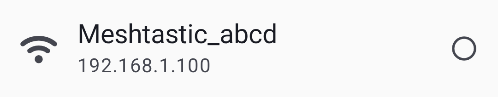
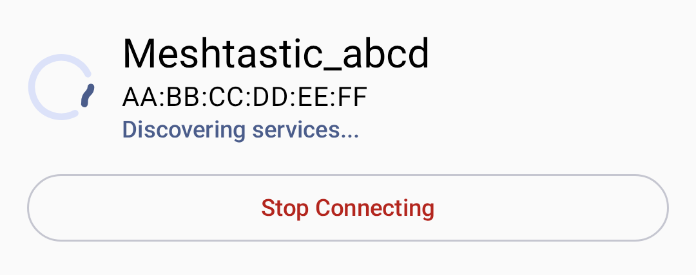
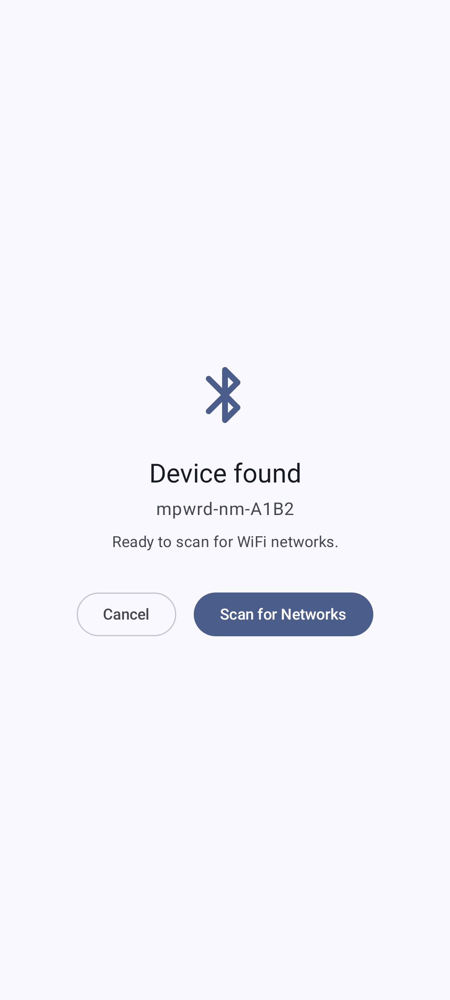
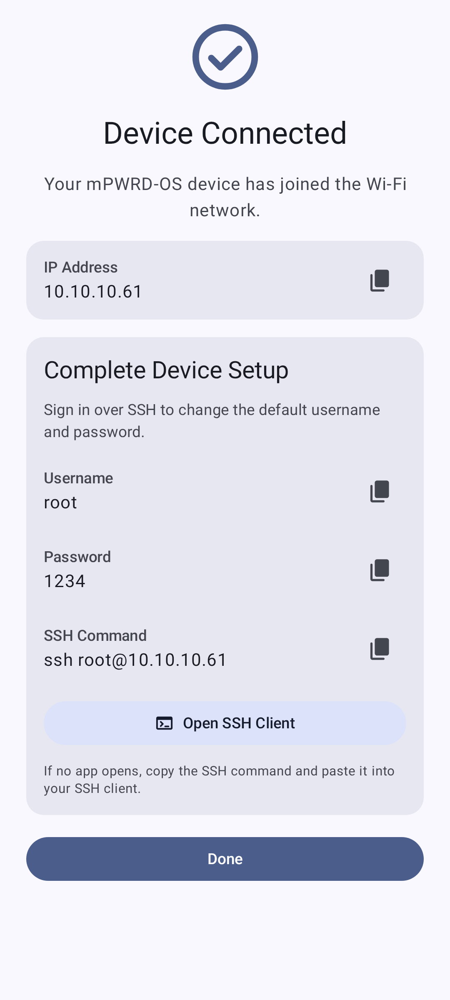
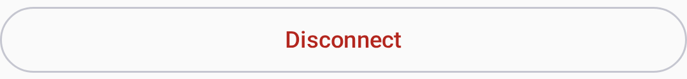

# Connections

Meshtastic supports multiple transport methods to communicate between your phone/desktop and a radio node.

## Bluetooth (BLE)

Bluetooth Low Energy is the default and most common connection method on Android.

### Pairing a Device

1. Ensure your Meshtastic radio is powered on and in pairing mode.
2. Open the app and navigate to the **Connect** tab.
3. Tap **Scan for Devices** — nearby Meshtastic radios will appear.
4. Select your device from the list.
5. Accept the Bluetooth pairing prompt if shown.

You can filter devices by transport type using the filter chips at the top:

> 💡 **Tip:** If your device doesn't appear, check that Bluetooth and Location permissions are granted, and that the radio is not already connected to another device.

### Connection Status

| Icon | State          | Beskrivelse                   |
| ---- | -------------- | ----------------------------- |
| 🟢   | Connected      | Active radio link established |
| 🟡   | Connecting     | Handshake in progress         |
| 🔴   | Frakoblet      | No active connection          |
| ⚪    | Not configured | No device selected            |

When connecting, a status indicator shows the current connection state:

If no devices are found, the app shows an empty state with instructions:

### Troubleshooting Bluetooth

- **Device not found:** Toggle Bluetooth off/on, ensure location is enabled.
- **Connection drops:** Move closer to the radio; check for interference.
- **Pairing rejected:** Forget the device in Android Bluetooth settings and retry.

## USB Serial

USB connections provide a wired alternative, useful for desktop or when Bluetooth is unavailable.

### Setup

1. Connect your radio via USB cable to your device.
2. The app will prompt for USB permission — tap **Allow**.
3. The connection is established automatically.

> ⚠️ **Note:** USB connections require OTG support on Android devices.

## TCP/IP (WiFi)

Some Meshtastic radios support WiFi connectivity, allowing TCP-based connections.

### Configuration

1. Connect your radio to a WiFi network via the radio's web interface or settings.
2. In the app, go to **Connect → TCP**.
3. Enter the radio's IP address and port (default: 4403).
4. Tap **Connect**.

When a device is found, it appears in the connection list:

A successful connection is confirmed with a status indicator:

### When to Use TCP

- Radio is on the same local network
- Testing with a simulated radio
- Environments where Bluetooth has interference issues

## Reconnection Behavior

The app reconnects to the **last selected device** on startup. You can switch transports from the Connect screen at any time.

To disconnect, tap the disconnect button on the Connect screen:

## Desktop Connections

On Desktop (Linux/macOS/Windows), the app supports:

- **Bluetooth (BLE)** — via the Kable library; works on macOS, Linux, and Windows
- **USB Serial** — primary wired connection method
- **TCP/IP** — for network-connected radios

See [Desktop App](desktop) for platform-specific details and keyboard shortcuts.

## Related Topics

- [Getting Started](onboarding) — first-launch setup and permissions
- [Settings — Radio & User](settings-radio-user) — Bluetooth and network configuration
- [Desktop App](desktop) — desktop-specific connection details
- [Supported devices](https://meshtastic.org/docs/hardware/devices) — full list of compatible radios on meshtastic.org

---

