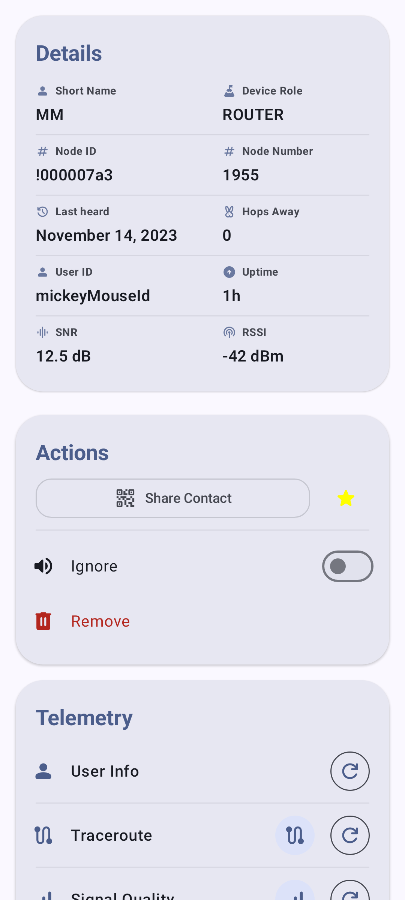
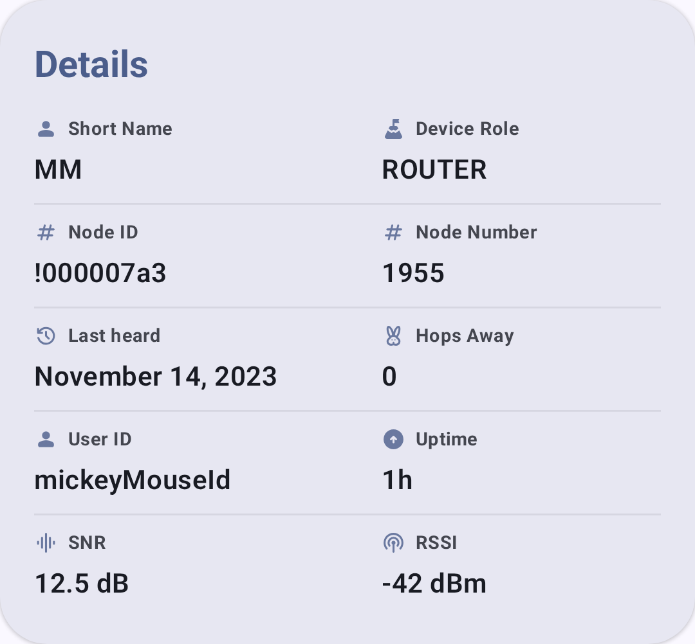
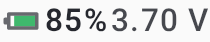

# Nodes

The Nodes screen displays all devices visible on your mesh network.

## Node List

The node list shows every node your radio has heard, including:

- **Node name** — user-configured long name
- **Short name** — 4-character identifier
- **Signal quality** — last heard signal strength
- **Last heard** — time since last communication
- **Distance** — estimated distance (if positions are shared)
- **Battery** — remote node battery level (if telemetry is enabled)

### Node Status Indicators

| Badge      | Meaning                             |
| ---------- | ----------------------------------- |
| 🟢 Online  | Node heard within the last 2 hours  |
| ⚪ Offline  | Node not heard for over 2 hours     |
| ⭐ Favorite | Node marked as favorite by the user |

A node is considered **online** if it was heard within the last 2 hours, and **offline** otherwise — there is no separate "away" tier.

### Node Roles

Nodes can be configured with different roles that affect their mesh behavior:

| Role                             | Beskrivelse                                                                                                                                            |
| -------------------------------- | ------------------------------------------------------------------------------------------------------------------------------------------------------ |
| Client                           | Standard end-user device                                                                                                                               |
| Client Base                      | Treats favorited-node traffic as Router Late priority; all other traffic as Client                                                                     |
| Client Mute                      | Receives but doesn't retransmit                                                                                                                        |
| Client Hidden                    | Like Client Mute, plus hides from node list                                                                                                            |
| Router                           | Prioritizes message forwarding; stays awake to relay                                                                                                   |
| Router Late                      | Infrastructure node that rebroadcasts once, but only after all other modes (provides supplemental coverage)                         |
| ~~Router Client~~                | ⚠️ **Deprecated** (removed in firmware 2.3.15) — no longer selectable; use Router or Client instead |
| ~~Repeater~~                     | ⚠️ **Deprecated** (removed in firmware 2.7.11) — no longer selectable; use Router instead           |
| Tracker                          | Optimized for position reporting at regular intervals                                                                                                  |
| Sensor                           | Optimized for telemetry reporting                                                                                                                      |
| TAK                              | Interoperates with TAK systems (sends/receives CoT)                                                                                 |
| TAK Tracker                      | TAK position reporting only                                                                                                                            |
| Lost & Found | Continuous position beacon for recovery                                                                                                                |

### Choosing a Role

Most users should keep the default **Client** role. Consider a different role when:

- **Router** — You have a node in a fixed, elevated location with reliable power (rooftop, hilltop). Routers stay awake continuously to relay messages for others and are essential for extending mesh coverage. Don't use Router on battery-powered handheld devices.
- **Router Late** — An infrastructure node that always rebroadcasts packets once but only after all other routing modes have had their turn. Provides supplemental coverage for local clusters without competing with primary routers.
- **Client Base** — Treats traffic from/to your favorited nodes with Router Late priority (ensuring those messages get extra relay coverage) while handling everything else as a normal Client.
- **Client Mute** — You want to receive mesh traffic but not contribute to relaying. Useful for monitoring-only devices or to reduce congestion in dense areas.
- **Tracker** — An unattended device whose sole purpose is broadcasting its GPS position (e.g., a vehicle, pet, or asset). Sleeps between broadcasts to conserve battery.
- **Sensor** — An unattended device reporting environmental telemetry (temperature, humidity, air quality). Similar power profile to Tracker.
- **TAK / TAK Tracker** — Only needed if interoperating with ATAK/WinTAK systems. See [TAK Integration](tak) for details.

> 💡 **Tip:** The mesh works best when most nodes are **Client** or **Router**. Too many Mute nodes reduces mesh resilience; too many Routers in a dense area can cause congestion. A good rule of thumb: one Router per 5–10 Clients in your area.

### Encryption Indicators

Nodes display encryption status icons next to their name:

| Icon        | Meaning                                                                                                             |
| ----------- | ------------------------------------------------------------------------------------------------------------------- |
| 🔒 Locked   | Communication uses PKI (public key infrastructure) — end-to-end encrypted with verified identity |
| 🔓 Unlocked | Communication uses shared channel PSK — encrypted but identity not individually verified                            |
| ⚠️ Mismatch | Public key mismatch — the node's key has changed since last seen (investigate before trusting)   |

> 💡 **Tip:** PKI encryption (firmware 2.5+) provides stronger security than channel PSK because each node has a unique key pair. If you see a key mismatch warning, the node may have been reset or compromised.

## Quick Actions

From the node list, you can:

- **Tap** a node to view its detail page
- **Long-press** for quick actions:
  - Mark/remove favorite
  - Mute/unmute notifications
  - Send a direct message
  - Trace route
  - Ignore/unignore
  - Remove node

## Filtering & Sorting

### Text Search

Type in the search field to filter nodes by name or short name. The filter updates in real time as you type.

### Filter Toggles

| Filter                     | Beskrivelse                                                                          |
| -------------------------- | ------------------------------------------------------------------------------------ |
| **Only online**            | Show only nodes heard within the last 2 hours                                        |
| **Only direct**            | Show only nodes with direct (non-relayed) connections             |
| **Include unknown**        | Show nodes that haven't sent user info yet                                           |
| **Exclude infrastructure** | Hide infrastructure-role nodes (Router, Router Late, Client Base) |
| **Exclude MQTT**           | Hide nodes heard only via MQTT internet bridge                                       |
| **Show ignored**           | Show nodes you've previously dismissed or muted                                      |

### Sort Options

| Sort                                        | Beskrivelse                                                        |
| ------------------------------------------- | ------------------------------------------------------------------ |
| **Last heard** (default) | Most recently heard nodes first                                    |
| **Alphabetical**                            | Sorted by node long name                                           |
| **Distance**                                | Nearest nodes first (requires position sharing) |
| **Hops away**                               | Fewest relay hops first                                            |
| **Channel**                                 | Grouped by channel index                                           |
| **Via MQTT**                                | Grouped by MQTT vs. radio-heard                    |
| **Favorites**                               | Favorited nodes first                                              |

## Nodes per Hop

Tap the hop-histogram icon in the node list's app bar to open a bar chart of how many nodes sit at each hop distance (0 = direct, 1 = one relay away, and so on). Filter the chart to a **last heard** window — All time, 1 hour, 8 hours, or 24 hours — to see how the mesh looks right now versus over a longer period. It's a quick way to gauge how busy and spread out your local mesh is.

## Node Detail

Tapping a node opens the detail view with comprehensive information. See [Node Metrics](node-metrics) for full details on metrics and telemetry.

The detail screen includes device info, position, and action buttons:

Inline status indicators show key metrics at a glance:

| Indicator      | Screenshot                                                    |
| -------------- | ------------------------------------------------------------- |
| Signal quality |      |
| Battery level  |    |
| Hop count      |          |
| Sist hørt      |   |
| Distanse       |  |

### Device Links ("I want one")

When a node's hardware is recognized, the detail view shows a collapsible **"I want one"** section linking to places to buy or learn more about that device: the vendor's product page, product variants, and regional marketplace listings (such as AliExpress, Amazon, and supported retailers), filtered to your country. Each link opens through the `msh.to` redirect service. Devices with no matching links don't show the section.

A full, browsable directory of every link is also available under **Settings → Device Links**.

## Related Topics

- [Node Metrics](node-metrics) — detailed telemetry dashboards for each node
- [Messages & Channels](messages-and-channels) — send a direct message to a node
- [Map & Waypoints](map-and-waypoints) — view node positions geographically
- [Discovery](discovery) — traceroute and neighbor info for topology exploration
- [Signal Meter](signal-meter) — understand what the signal bars mean

---

