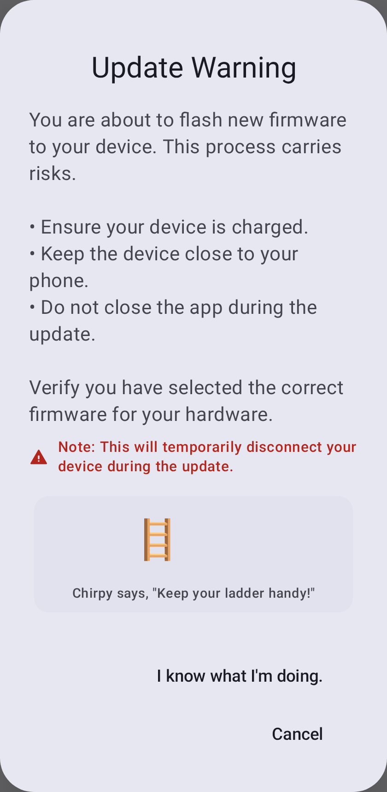
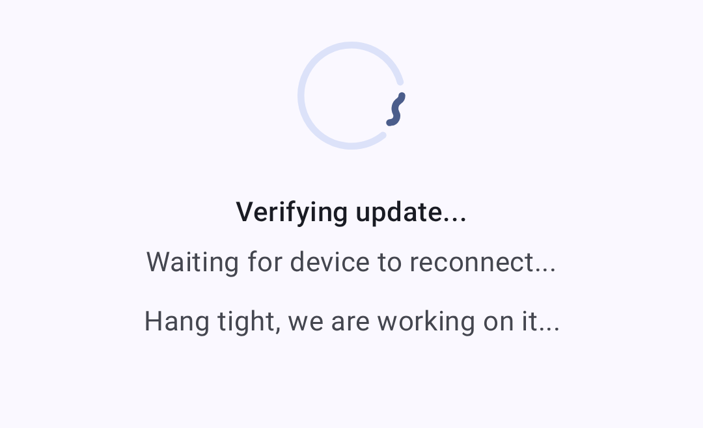

# Firmware Updates

Keep your Meshtastic radio up to date with the latest firmware for new features, bug fixes, and security improvements.

## Checking for Updates

1. Open the connected radio's configuration and, under **Advanced**, tap **Firmware Update**. The entry appears only for OTA-capable devices.
2. The app checks for available firmware versions.
3. Available updates show the version number and changelog summary.

## Update Methods

### OTA (Over-The-Air) via Bluetooth

The most common update method for Android users:

1. Ensure your radio is connected via Bluetooth.
2. Navigate to the Firmware Update screen.
3. Select the desired firmware version.
4. Tap **Update** to begin the OTA process.
5. Wait for the update to complete — **do not disconnect** during the update.

> ⚠️ **Warning:** Interrupting a firmware update can brick your device. Ensure your radio has sufficient battery (>50% recommended) and maintain Bluetooth proximity during the entire process.

### In-App USB Update

When your radio is connected over **USB/serial** (rather than Bluetooth), the Firmware Update screen offers **USB File Transfer**. The app reboots the device into DFU mode, then prompts you to save the `.uf2` file to the device's DFU drive using the system file picker. This option appears only on a USB/serial connection — it is not available over Bluetooth.

> ℹ️ **nRF bootloader note:** Some devices (e.g. RAK WisBlock RAK4631) need their bootloader flashed with the vendor's serial DFU tool (such as `adafruit-nrfutil`) — copying the `.uf2` alone won't update the bootloader. The app surfaces a hint when this applies.

### Other Flashing Options

For recovery or when neither OTA nor in-app USB is available:

- Use the [Meshtastic Web Flasher](https://flasher.meshtastic.org)
- Or the [Meshtastic CLI tool](https://meshtastic.org/docs/getting-started/flashing-firmware) on desktop

## Version Channels

| Canal        | Descriere                                                                  |
| ------------ | -------------------------------------------------------------------------- |
| Stabil       | Recommended for most users; tested releases                                |
| Alpha        | Preview releases; may contain bugs                                         |
| Fișier local | Flash a firmware file you select yourself, instead of a downloaded release |

## Pre-Update Checklist

Before updating:

- [ ] Battery > 50%
- [ ] Stable Bluetooth connection
- [ ] Note your current settings (they may reset on major version changes)
- [ ] Check the release notes for breaking changes

## Post-Update

After the firmware is written, the app verifies the update and waits for the device to come back online:

Once the update succeeds:

- The radio will reboot automatically
- Bluetooth connection will re-establish
- Verify your settings are intact
- Confirm the new version under **Currently Installed** on the Firmware Update screen — it's also shown on the node's detail page and the Connections screen

## Troubleshooting

### Update Stuck

If the update appears frozen:

- Wait at least 5 minutes before intervening
- If truly stuck, power-cycle the radio
- Attempt the update again

### Device Won't Boot After Update

If your device fails to boot:

1. Try connecting via USB to a computer
2. Use the web flasher in recovery/DFU mode
3. Flash a known-good firmware version
4. Check the Meshtastic Discord for device-specific recovery steps

### Compatibility Warnings

The app may show warnings when:

- Connected radio firmware is below minimum supported version
- Major version mismatch between app and firmware
- Deprecated features need migration

> ⚠️ **Important:** Always update the Meshtastic app before or alongside firmware updates to ensure compatibility.

## Related Topics

- [Connections](connections) — reconnecting after a firmware update
- [Flashing firmware guide](https://meshtastic.org/docs/getting-started/flashing-firmware) — full firmware flashing walkthrough on meshtastic.org
- [Supported devices](https://meshtastic.org/docs/hardware/devices) — check firmware compatibility by device
- [FAQ](https://meshtastic.org/docs/about/faq) — common questions on meshtastic.org

---

