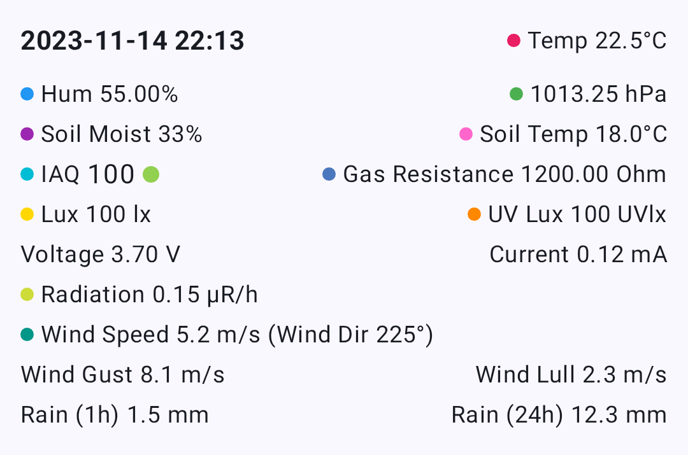

# Units, Measurement & Locale

The Meshtastic app automatically displays temperatures, distances, speeds, and times in the units your device is configured to use — no settings to change inside the app.

---

## How It Works

Meshtastic radios always transmit data in **metric units** (meters, °C, km/h, hPa, etc.). When the app receives this data, it uses the `MetricFormatter` utility to convert and display values in whatever unit system your device's locale specifies.

On Android, your measurement preferences are determined by your system **Language & Region** settings. On Desktop (JVM), the app uses the JVM's default `Locale`.

> **Tip — You never need to toggle units inside the app.** Change your system measurement preferences and every screen in Meshtastic updates automatically — node details, telemetry charts, weather, altitude, and more.

---

## Temperature

Temperature values from environment sensors are transmitted as **°C** and displayed based on your device's temperature unit preference.

| Your Setting | You See |
| ------------ | ------- |
| Celsius      | 22°C    |
| Fahrenheit   | 72°F    |

This affects all temperature displays throughout the app: node environment telemetry, soil temperature, dew point, and telemetry chart axes.

## Distance & Altitude

Distances between nodes and GPS altitudes are transmitted as **meters** and automatically scaled and converted.

| Your Setting                     | Small Distance | Large Distance         | Altitudine |
| -------------------------------- | -------------- | ---------------------- | ---------- |
| Metric                           | 350 m          | 2.5 km | 1,200 m    |
| Imperial (US) | 1,148 ft       | 1.6 mi | 3,937 ft   |

The app uses natural scaling — short distances stay in meters or feet, while longer distances switch to kilometres or miles automatically.

### Where these appear

- **Node list** — distance and bearing to each node
- **Node detail** — altitude, distance from your position
- **Map** — waypoint distances, traceroute hop distances
- **Compass** — distance to selected node

## Viteza

GPS ground speed is displayed in your locale's preferred speed unit.

| Your Setting                     | You See |
| -------------------------------- | ------- |
| Metric                           | 12 km/h |
| Imperial (US) | 7 mph   |

## Vânt

Wind speed and gust data from environment sensors are transmitted as **m/s** and converted for display.

| Your Setting                     | You See |
| -------------------------------- | ------- |
| Metric                           | 5 m/s   |
| Imperial (US) | 11 mph  |

Wind readings appear in the **Node Detail** environment section and the **Environment Telemetry** charts.

## Rainfall

Rainfall measurements (1-hour and 24-hour totals) are transmitted as **mm** and converted for display.

| Your Setting                     | You See                |
| -------------------------------- | ---------------------- |
| Metric                           | 12 mm                  |
| Imperial (US) | 0.5 in |

## Units That Never Change

Some units are international standards and are displayed the same way regardless of your locale:

| Measurement                      | Unit                           | Why                                   |
| -------------------------------- | ------------------------------ | ------------------------------------- |
| Barometric pressure              | hPa                            | International meteorological standard |
| Heading / bearing                | ° (degrees) | Universal navigation convention       |
| Radiație                         | μR/hr                          | Standard dosimetry unit               |
| GPS coordinates                  | decimal degrees                | Universal geographic standard         |
| Humidity, battery, soil moisture | %                              | Universal                             |

## Date & Time

All timestamps throughout the app — last heard, message times, telemetry logs, chart axes — follow your device's date and time preferences.

| Setting          | What It Controls | Example                                          |
| ---------------- | ---------------- | ------------------------------------------------ |
| **24-Hour Time** | Clock format     | 14:30 vs 2:30 PM |
| **Date Format**  | Date ordering    | 09/05/2026 vs 05/09/2026                         |

The app also uses **relative time** where it makes sense — for example, "5 min ago" or "2 hours ago" in the node list — which is automatically localised into your device language.

## Changing Your Measurement System (Android)

On Android, your measurement system (metric vs imperial) is tied to your region setting:

1. Open **Android Settings → System → Language & Region**
2. Change your **Region** or **Measurement units** preference
3. Return to Meshtastic — values update immediately

> **Tip — The app uses `MetricFormatter` from `core:common`.** All measurement formatting is handled by a shared KMP utility that respects your platform's locale. Developers adding new measurement displays should use `MetricFormatter` rather than hard-coding unit conversions.

