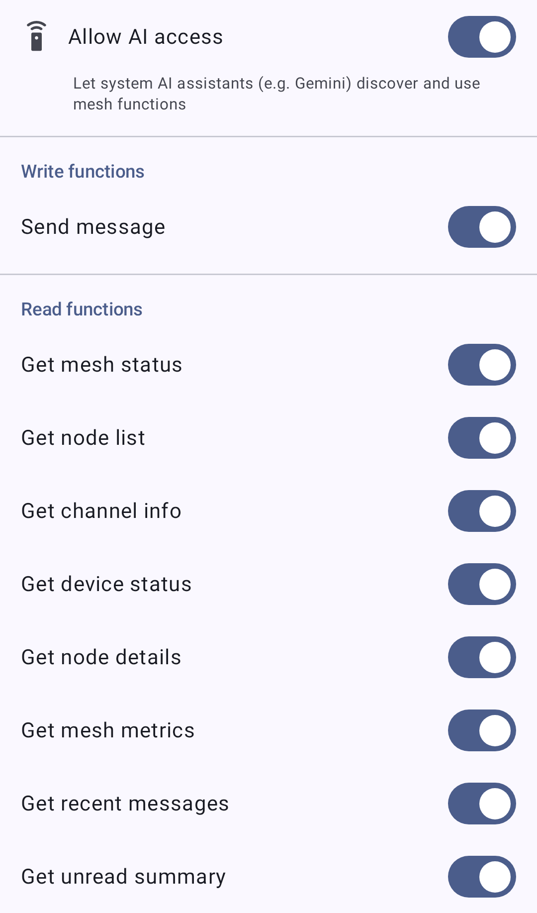

# Функции приложения

Функции приложения предоставляют возможности Meshtastic системе Android и встроенным AI-помощникам (таким как Gemini) через API функций приложения Android. С их включением помощник может находить и запускать сетевые рабочие процессы за тебя — например, отправлять сообщение или проверять статус сети — не утруждая тебя открытием приложения. Примечание:\*\* Функции приложения доступны только на **Android-версиях от Google**.

> ℹ️ **Примечание:** Это отличное от встроенного помощника **Chirpy**. Функции приложения позволяют _системному_ AI-помощнику действовать с вашей сетью; Chirpy — это голосовой помощник прямо внутри приложения Meshtastic.

## Включение функций приложения

Управление функциями приложения из **Настройки → Система ИИ**. Экран содержит:

- **Главный переключатель** с надписью **"Разрешить доступ ИИ"** и подзаголовком _"Позволь системным ИИ-ассистентам (например, Gemini) обнаруживать и использовать функции сети"_. Когда выключено, системе не доступны никакие функции.
- **Отдельный переключатель для каждой функции**, чтобы включать только те возможности, которые хочешь.

> ⚠️ **Важно:** Функции приложения включены. В сборке Google главный переключатель и все отдельные функции, включая **Отправить сообщение**, включены по умолчанию — так что помощник может считывать данные из сети и отправлять сообщения, пока ты не отключишь **Доступ для ИИ**.

Функции разделены на секцию **Запись** (функции, которые что-то меняют или отправляют данные в сеть) и **Чтение** (только возвращают информацию).

На скриншоте кнопки **Отправить сообщение** и **Получить последние сообщения** выключены, чтобы проиллюстрировать управление отдельными функциями. При первой установке все кнопки включены.

### Функции записи

| Функция                | Что она делает                                                                                                                                                                                                                                           |
| ---------------------- | -------------------------------------------------------------------------------------------------------------------------------------------------------------------------------------------------------------------------------------------------------- |
| **Отправка сообщения** | Отправляет текстовое сообщение контакту (личное сообщение) или в канал. В сообщении может быть не более 233 байт текста, поэтому старайтся, чтобы сообщения, составленные помощником, были короткими. |

### Функции записи

| Функция                           | Что она возвращает                                                       |
| --------------------------------- | ------------------------------------------------------------------------ |
| **Получить статус сети**          | Неважно, подключены ли ты к радио, и сколько нод в сети. |
| **Получить список нод**           | Список узлов в твоей сети.                               |
| **Получить информацию о канале**  | Информация о твоих каналах.                              |
| **Получить состояние устройства** | Состояние подключенного радиоустройства.                 |
| **Получить детали ноды**          | Подробная информация о конкретной ноде.                  |
| **Получить метрики сети**         | Телеметрия и метрики твоей сети.                         |
| **Получить последние сообщения**  | Последние сообщения из твоих разговоров.                 |
| **Получить обзор непрочитанного** | Сводка непрочитанных сообщений.                          |

## Приватность

> 🔒 **Конфиденциальность:** Функция **Отправить сообщение** позволяет ассистенту отправлять сообщения в сеть от твоего имени, и функции чтения выявляют в ней ноды, сообщения и метрические данные. Поскольку все они изначально включены, тебе нужно решить, что отключить, а не что включить. Каждая функция имеет свой собственный переключатель, и **Разрешить доступ к ИИ** отключает все их одновременно.

## Связанные темы

- [Сообщения и каналы](messages-and-channels) — отправка сообщений прямо в приложении
- [Ноды](nodes) — список нод, из которого берут данные функции чтения
- [Node Metrics](node-metrics) — телеметрия, лежащая в основе функции Получить метрики сети
