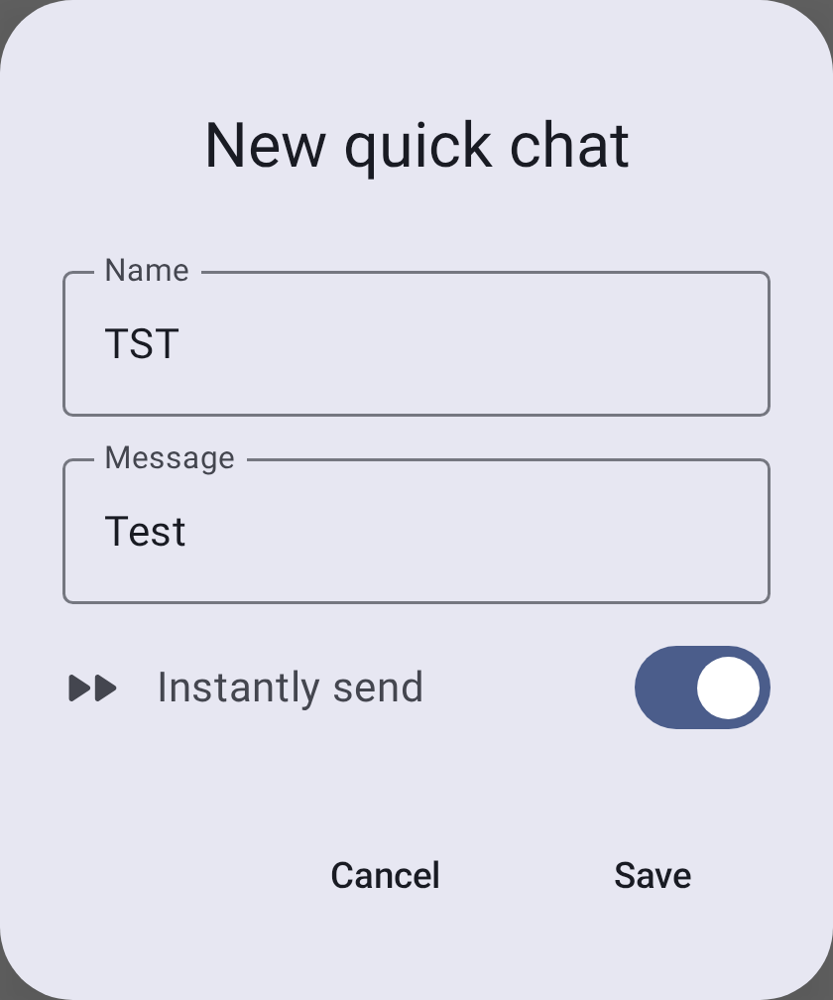

# Сообщения и каналы

Meshtastic поддерживает два режима связи: **вещание по каналам** и **личные сообщения**.

## Каналы

Каналы - это общие группы для связи. Все узлы, настроенные с одинаковым ключом канала, могут читать и отправлять сообщения в этом канале.

### Канал по умолчанию

Every Meshtastic radio comes with a default **LongFast** channel. It is encrypted with a well-known default key, so anyone running Meshtastic on the same preset can read it.

### Безопасность канала

Each channel carries a lock icon that shows how well it is protected. Tap the icon to see the same explanation inside the app.

| Иконка                             | Что это значит                                                                                                                                        |
| ---------------------------------- | ----------------------------------------------------------------------------------------------------------------------------------------------------- |
| Green closed lock                  | The channel is securely encrypted, with either a 128-bit or a 256-bit AES key.                                                        |
| Yellow open lock                   | The channel is not securely encrypted — it uses no key at all, or a well-known one-byte key — and it does not carry precise location. |
| Red open lock                      | Not securely encrypted, and the channel carries precise location data.                                                                |
| Red open lock with a warning badge | Not securely encrypted, carrying precise location data, and uplinking that data to the internet over MQTT.                            |

Key length alone does not change the icon: a 128-bit key and a 256-bit key both show the green lock.

> 🔒 **Security:** Always configure a unique PSK for private communications. Канал по умолчанию намеренно открыт, чтобы новые пользователи могли обнаружить mesh-сеть — но вам следует создать отдельный зашифрованный канал для любой конфиденциальной информации.

### Добавление канала

1. Connect to your radio. The **Channels** row stays grayed out until the app has a connection — see [Connections](connections).
2. Go to **Settings**, then tap **Channels** under **Configuration**.
3. Tap the **+** button to add a channel. The editor opens on the new entry.
4. Set the channel name and the **PSK**, and choose whether the channel uses MQTT uplink and downlink. Naming a new channel generates a fresh 256-bit key for you; the refresh icon beside **PSK** generates another one.
5. Tap **Save** to close the editor. The change is still only on your phone.
6. Tap **Send** at the bottom of the channel list to write the changes to the radio. **Cancel**, or leaving the screen without tapping **Send**, throws them away.
7. Optional: share the channel URL or QR code with the people who need access.

Tapping an existing channel opens the same editor, where you can change the name, the PSK, MQTT uplink and downlink, and position precision. Every edit on this screen — adding, editing, deleting, or dragging a channel into a new order — waits on **Send** the same way.

## Личные сообщения

Direct messages (DMs) go to one specific node. When both radios hold each other's public keys, your radio encrypts the message to that node's public key, so no one else on the mesh can read it — not even nodes that share your channel.

Your radio must already hold the other node's public key before it can send a DM. Keys travel inside node info, which nodes broadcast periodically, so the key usually arrives on its own once you have heard from that node. Until it does, a radio that has its own key pair — the default — refuses the send rather than falling back to channel encryption, and the message shows **Recipient key unavailable**.

A public-key conversation carries a key icon in its top bar. A green closed lock means the direct message is protected by public-key encryption; a red key-off icon means the node's public key changed and no longer matches the one your radio stored. Tap the icon for the details.

### Отправка личного сообщения

1. Откройте вкладку **Сообщения**.
2. Select a conversation, or tap a node in the node list.
3. Введите сообщение и нажмите **"Отправить"**.

### Managing the Conversation List

The **Messages** tab lists your conversations. Each row shows what you need at a glance, and you
can act on it directly:

- **Unsent drafts survive.** Type into a conversation and leave without sending, and the text is
  still there when you come back. The row shows it as `Draft: …` in place of the last message —
  an unsent draft is the thing the row is waiting on _you_ for.
- **Unread badge.** A count sits on the row until you open the conversation.
- **Swipe right to mute** (swipe again to unmute) and **swipe left to delete**. Deleting asks
  first; muting shows a snackbar with **Undo**.
- **Touch & hold to select** one or more conversations, then use the action bar to **Pin**,
  **Mark unread**, mute or delete them together. Pinned conversations carry a pin marker and rise
  to the top of **their own section**.
- **The list is split into Channels and Direct Messages**, each with a collapsible header and each
  sorted independently — so a pinned direct message rises within its own section, not above the
  Channels one.

### Conversation Bubbles

On Android 11 and later, a message notification can be opened as a floating **bubble** that
stays on top of whatever else you are doing. Tap the bubble icon on the notification to promote
a conversation; Android remembers the choice per conversation, and the system Bubbles settings
control whether they are offered at all.

### Состояние сообщения

Метка статуса отображается только **под твоими** исходящими сообщениями (входящие сообщения от других не имеют метки статуса):

| Состояние                             | Значение                                                                                                                                                                                                                                 |
| ------------------------------------- | ---------------------------------------------------------------------------------------------------------------------------------------------------------------------------------------------------------------------------------------- |
| Отправка…                             | Queued or already handed to the radio, not yet resolved either way. Both stages share this text, but the icon and color change as it progresses — a yellow upload cloud while queued, a blue arrow once the radio has it |
| Доставлено получателю                 | Самое надёжное подтверждение для личного сообщения — получено подтверждение о доставке                                                                                                                                                   |
| Отправлено в сеть                     | Для широковещательного сообщения в канале — сообщение достигло mesh-сети (у широковещательных сообщений нет подтверждений для каждого получателя)                                                                     |
| Передано, не подтверждено получателем | Для личного сообщения, отображается предупреждающим цветом — сообщение было ретранслировано, но подтверждение ещё не получено                                                                                                            |
| Маршрутизация по SF++ цепочке…        | Находится в процессе маршрутизации/буферизации в цепочке Store & Forward Plus Plus                                                                                                                                   |
| Подтверждено в цепочке SF++           | Подтверждена доставка через цепочку SF++                                                                                                                                                                                                 |
| Ошибки                                | Delivery failed — tap the status for the specific reason (see [Delivery Errors](#delivery-errors))                                                                                                                    |

### Ошибки доставки

Когда сообщение не удаётся доставить, индикатор ошибки показывает, что пошло не так:

| Ошибки                                                     | Значение                                                                                                                                                                      | Что делать                                                                                                                                    |
| ---------------------------------------------------------- | ----------------------------------------------------------------------------------------------------------------------------------------------------------------------------- | --------------------------------------------------------------------------------------------------------------------------------------------- |
| Нет маршрута                                               | Путь к целевой ноде отсутствует                                                                                                                                               | Получатель может быть не в сети или вне зоны действия mesh-сети. Повторите попытку позже или подойдите ближе. |
| Нет радиоинтерфейса                                        | Нет доступного радиоинтерфейса для отправки                                                                                                                                   | Проверь, подключено ли твоё радио и доступно ли оно.                                                                          |
| Не удалось доставить в сеть                                | Retries exhausted. The same label covers three underlying causes — a relay refusing (NAK), a plain timeout, and running out of retransmits | Move closer, improve signal, or wait for conditions to improve. Tap the error for the specific cause.         |
| Ограничение скорости                                       | The mesh is throttling you for sending too fast                                                                                                                               | Wait before sending again.                                                                                                    |
| Не авторизовано                                            | The destination refused the request                                                                                                                                           | Check you have the right channel and keys for that node.                                                                      |
| Получателю нужен ваш ключ                                  | Direct-message encryption could not complete because the other node does not have your public key yet                                                                         | Exchange node info — the key travels with it. Common on a first DM to a new contact.                          |
| Ключ получателя недоступен                                 | You do not have the recipient's public key                                                                                                                                    | Wait for their node info to arrive, or ask them to broadcast it.                                                              |
| Не удалось отправить зашифрованное сообщение               | Encryption failed for this direct message                                                                                                                                     | Verify both nodes have exchanged keys and are on compatible firmware.                                                         |
| Сеанс администратора истёк                                 | A remote-admin session timed out                                                                                                                                              | Reopen the remote node's settings to start a new session.                                                                     |
| Ключ администратора не авторизован                         | The target node does not accept your admin key                                                                                                                                | Проверьте соответствие ключа администратора на обоих узлах.                                                                   |
| Несовпадение канала/ключа                                  | Канал/ключ назначения не совпадает                                                                                                                                            | Убедитесь, что обе ноды используют один и тот же канал и PSK.                                                                 |
| Слишком большое сообщение для отправки                     | Сообщение превышает максимальный размер полезной нагрузки                                                                                                                     | Сократи сообщение и повтори попытку.                                                                                          |
| Нет ответа приложения                                      | Приложение или плагин не ответили на запрос                                                                                                                                   | Повтори попытку или проверь состояние приложения или модуля назначения.                                                       |
| Ограничение рабочего цикла (Dity cycle) | Достигнут региональный лимит эфирного времени                                                                                                                                 | Дождись сброса окна рабочего цикла.                                                                                           |
| Неверный запрос                                            | Повреждённый или неверный запрос                                                                                                                                              | Если проблема сохраняется, повтори попытку после обновления или перезапуска приложения.                                       |

> 💡 **Совет:** Большинство ошибок доставки разрешаются сами собой. Если нода доступна с перебоями, mesh-сеть будет повторять попытки. For persistent **No route** errors, check that intermediate Router nodes are online.

## Функции сообщений

### Быстрый чат

Pre-configured messages for rapid communication, useful when typing is impractical (gloves, small screen, urgent):

- The quick chat row is hidden until you turn it on. Open a conversation, tap the overflow menu in the top bar, then tap **Show quick chat menu**. **Hide quick chat menu** puts the row away again.
- The row carries one built-in entry, the 🔔 alert bell. It appends an alert message that includes a bell character, which clients that support it flag as an alert. Every other button on the row is one you created.
- Add, edit, reorder, and delete your own entries from the same overflow menu — tap **Quick chat options**.

Each quick chat entry has a **Name** — the button label, capped at five characters, forced to uppercase, and filled in for you from the message text — and the **Message** it carries. A switch decides what tapping the button does. A new entry starts on **Instantly send**, so a tap sends the message straight away; turn the switch off and the label changes to **Append to message**, which puts the text in the input field for you to edit first.

### Поиск сообщений

Ты можешь искать по всей истории любой переписки прямо на экране чата:

1. Откройте переписку (канал или личное сообщение).
2. Нажмите **значок поиска** в верхней панели.
3. Введите текст в поле **"Поиск сообщений…"**. Поиск выполняется по мере твоего ввода по всем сохранённым сообщениям в этой переписке.
4. Используйте счётчик результатов **N / M** и стрелки **вперёд / назад** для перехода между совпадениями, которые подсвечиваются в переписке.

> 💡 **Совет:** Поиск полнотекстовый и ограничивается перепиской, из которого ты его открыл — он не ищет по другим каналам или контактам. Он сопоставляет текст с сообщениями, уже сохранёнными на твоём устройстве, поэтому работает полностью офлайн.

### Пузырьки сообщения

Сообщения отображаются в виде пузырьков чата — отправленные справа, полученные слева. В каждом пузырьке отображаются отправитель, время и статус доставки. Сообщения с ответами содержат цитируемый предпросмотр исходного сообщения над ответом.

### Форматирование текста

Сообщения поддерживают облегчённую встроенную разметку Markdown. Полученные сообщения отображают оформление со скрытыми символами синтаксиса:

| Тип            | Синтаксис                      | Отображается как      |
| -------------- | ------------------------------ | --------------------- |
| Жирный         | `**жирный**`                   | **жирный**            |
| Курсив         | `*курсив*`                     | _курсив_              |
| Зачёркнутый    | `~~зачёркнутый~~`              | ~~зачёркнутый~~       |
| Встроенный код | `` `код` ``                    | моноширинный `код`    |
| Ссылка         | `[текст](https://example.com)` | нажимаемая **ссылка** |

При создании сообщения установите фокус на поле ввода и введите не менее трёх символов — под полем появится **панель форматирования**. Выделите текст и нажмите на стиль, чтобы применить его (повторное нажатие убирает форматирование); если текст не выделен, будет вставлена пустая пара символов разметки, а курсор окажется между ними. Кнопка вставки ссылки открывает диалог для ввода URL-адреса. As you type, the field shows the styled text, but the message you send still contains the Markdown characters.

> 💡 **Совет:** Форматирование передаётся по mesh-сети как есть — теми же байтами, что и iOS. Клиенты, не поддерживающие Markdown (старые приложения, простые клиенты на прошивке), отобразят сырые символы `**`/`~~`. URL-адреса, адреса электронной почты и номера телефонов всё равно автоматически становятся ссылками независимо от того, используете ли вы Markdown.

### Упоминания

Введите `@` при написании сообщения, чтобы упомянуть ноду — по мере твоего ввода будет появляться список подходящих контактов. В полученном сообщении упоминание отображается как выделенный элемент с именем ноды; нажмите на него, чтобы сразу перейти на страницу сведений о ноде.

### Реакции

Реагируйте на сообщения с помощью эмодзи:

- **Touch & hold** a message — or double-tap it — to raise a quick reaction bar above the bubble. Opening the bar sends nothing.
- Tap an emoji in the bar to send it; tap **More reactions** to open the full picker, or anywhere outside
  the bar to dismiss it without sending. A reaction is a real mesh packet, so it only goes out
  when you pick an emoji.
- Реакции появляются под пузырьком сообщения
- Несколько пользователей могут отреагировать на одно и то же сообщение
- Реагируйте на свои сообщения или сообщения других

> 💡 **Совет:** Реакции очень лёгкие — они потребляют гораздо меньше трафика mesh-сети по сравнению с полными текстовыми сообщениями.

### Replying

**Swipe a message to the right** to reply to it — the composer opens with that message quoted.
Swiping past the reply threshold arms the action; releasing before it springs back with nothing sent.
Reply is also in the actions sheet, reached by touching & holding and then tapping **More message actions**.

### Day Separators

Messages are grouped by day. The separator above the first message of each day reads **Today**
or **Yesterday** for the two most recent days, and the date itself for older ones.

### Jump to Latest

Scrolling back through a conversation raises a jump-to-latest control. When messages arrive
while you are scrolled up, it names the most recent sender and adds a count of the other unread
messages. That count is messages, not people — five unread from one person reads as their name
**+4**.

### Действия с сообщениями

Touch & hold or double-tap a message to open the quick reaction bar, then tap **More message actions**
(the overflow icon on that bar) to open the actions sheet. The emoji row runs across the top of the
sheet — that is where reactions live — and beneath it, along with the message's timestamp and
delivery status, are:

- **Ответить** — процитировать сообщение в твоём ответе
- **Copy** — copy the message text to the clipboard
- **Translate** — translate a received message into your device language, and toggle between the original and translated text (Google Play build only; uses on-device translation). The first translation into a language asks to download a one-time language model and tells you its size, then translates once the download finishes. If the download fails, or the message is already in your language, the app says so instead of translating
- **Select** — start multi-select, so you can act on several messages at once
- **Delete** — remove the message from this phone. It works on any message in the conversation, yours or not, and does not remove it from anyone else's radio or phone

### Приоритет сообщений

The app sends every message you compose at the same, default priority — there is no
emergency or alert tier to choose, and nothing in the app raises a direct message above a
channel broadcast. Any prioritising between them happens in firmware, not here. (The app
does mark some of its own internal traffic, such as admin and traceroute packets, as
reliable or background, but that is not something you control from the message composer.)

### Ограничения сообщений

- **Максимальная длина**: 200 байт (примерно 200 символов для текста в ASCII)
- The 200-byte cap applies to the in-app composer — the mesh payload limit itself is 233 bytes, so messages from other senders (e.g., App Functions) may arrive slightly longer
- **Ограничение скорости**: Mesh-сеть обеспечивает справедливое распределение эфирного времени; большой объем сообщений может быть ограничен
- **Доставка**: Сообщения автоматически повторяются при отсутствии подтверждения

## Рекомендации

- Используйте каналы для координации в группах
- Используйте личные сообщения для приватного общения один на один
- Пишите короткие сообщения — пропускная способность mesh-сети ограничена
- Настройте шифрование для конфиденциальной связи

## Связанные темы

- [Ноды](nodes) — нажмите на ноду, чтобы начать личный чат
- [Настройки — Радио и пользователь](settings-radio-user) — настройка шифрования каналов и пресетов
- [MQTT](mqtt) — мост для передачи сообщений канала в интернет
- [Конфигурация каналов](https://meshtastic.org/docs/configuration/radio/channels) — подробные параметры каналов на meshtastic.org
