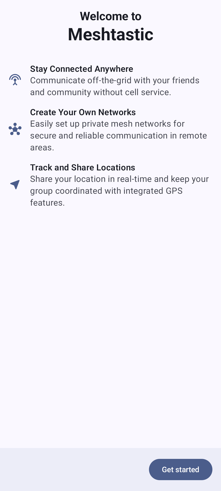

# Начало работы

Добро пожаловать в Meshtastic! Это руководство проведет тебя через начальную настройку приложения Meshtastic для Android.

## Первый запуск

Когда ты запускаешь приложение впервые, то будет предложено пройти через начальный процесс, который поможет настроить основные разрешения и параметры. Каждый шаг нужно выполнить по порядку, или же можешь пропустить его и настроить разрешения позже в настройках Android.

### Экран приветствия

Экран приветствия представляет Meshtastic и его основные возможности:

- Автономная mesh-связь
- Не требуется мобильная связь или интернет
- Сквозное шифрование сообщений

Нажми **Начать** для перехода к настройке.

## Разрешения

Приложение запрашивает несколько разрешений во время настройки. Каждое из них служит определенной цели, и некоторые необходимы для основной функциональности.

### Разрешения Bluetooth

Bluetooth является основным методом соединения между телефоном и радиостанцией Meshtastic:

- **Сканирование Bluetooth** — обнаружение ближайших радиостанций Meshtastic
- **Подключение по Bluetooth** — установка и поддержание соединения с сопряжёнными радиоустройствами

Предоставь оба разрешения при запросе. Без Bluetooth тебе придется использовать USB или TCP соединения.

### Разрешение на доступ к местоположению

> ⚠️ **Почему для Bluetooth требуется местоположение?** Android требует разрешение на определение местоположения для обнаружения устройств Bluetooth Low Energy поблизости. Это требование системы Android, а не специфический выбор Meshtastic.

Meshtastic также использует местоположение для:

- Показ вашего положения на карте
- Вычисление расстояний до других нод
- Обмен GPS-координатами с другими участниками сети (если включено)

Предоставь доступ **"При использовании приложения"** или **"Всегда"** в зависимости от своих предпочтений:

- **При использовании приложения** — обновление местоположения происходит только когда приложение открыто
- **Всегда** — включает обновления позиции в фоновом режиме для активного присутствия в сети

Если доступ будет запрещен, сканирование Bluetooth не будет работать, и нода не будет сообщать о положении.

### Разрешение на уведомления

Уведомления оповещают тебя о:

- Входящие сообщения из каналов и личных сообщений
- Новые ноды, присоединившиеся к сети
- Низкий заряд на удаленной ноде

> 💡 **Совет:** Ты можешь тонко настроить уведомления позже в настройках системы — приложение создает отдельный канал уведомлений по категориям (плюс несколько внутренних, как фоновая служба), поэтому ты можешь включить или заглушить их по отдельности.

### Разрешение на критические уведомления

На поддерживаемых устройствах приложение может запрашивать разрешение на критические уведомления:

- Это уведомления высокого приоритета, которые могут прерывать режим "Не беспокоить"
- Полезно для экстренных уведомлений в mesh-сети или срочных сообщений
- Вы можете **пропустить** этот шаг, если не нужны уведомления о прорывах
- Настроить или отменить можно позже в настройках уведомлений Android

## После настройки

Как только разрешения предоставлены, приложение переходит к основному интерфейсу. Ваше первое действие должно заключаться в подключении к радиостанции Meshtastic — см. [Подключения](connections) для подробных инструкций.

> 💡 **Совет:** Если ты пропустил какие-либо разрешения во время настройки, то можешь выдать их позже через **Настройки Android → Приложения → Meshtastic → Разрешения**. Приложение снова запросит у тебя разрешение, если отсутствующее разрешение блокирует функцию, которую ты пытаешься использовать.

## Что дальше?

После подключения к радиостанции, исследуй:

- [Подключения](connections) — соедини своё первое радиоустройство
- [Сообщения и каналы](messages-and-channels) — отправь  своё первое сообщение
- [Ноды](nodes) — посмотри, кто есть в сети
- [Карта и контрольные точки](map-and-waypoints) — просмотр позиций нод
- [Настройки](settings-radio-user) — настрой своё устройство и профиль пользователя

Новичок в Meshtastic? Руководство [по началу работы](https://meshtastic.org/docs/getting-started) на meshtastic.org охватывает выбор оборудования, начальную настройку радиостанции и первую установку сети.

---
