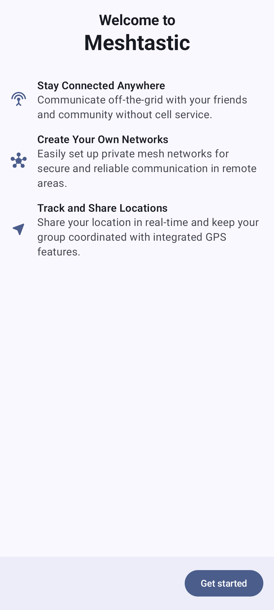

# Начало работы

На этой странице рассказывается о процессе первого запуска приложения Meshtastic для Android, для чего нужно каждое разрешение и как вернуться к нему позже.

## Первый запуск

Когда ты открываешь приложение впервые, оно проводит тебя через вводный процесс, который настраивает необходимые разрешения и параметры. Выполни каждый шаг по порядку или пропусти — здесь ничто не является одноразовым предложением. Каждое разрешение можно просмотреть и выдать позже в разделе **Разрешения** в **Настройках** внутри приложения.

### Экран приветствия

Экран приветствия знакомит с Meshtastic с тремя рядами функций:

|                                         |                                                                                                                          |
| --------------------------------------- | ------------------------------------------------------------------------------------------------------------------------ |
| **Будь на связи везде**                 | Общайтесь вне сети со своими друзьями и сообществом без использования сотовой связи.                     |
| **Создавай свои собственные сети**      | Легко создать частные сети для защищённой и надежной связи в удаленных районах.                          |
| **Отслеживай и делись местоположением** | Делитесь своим местоположением в режиме реального времени и поддерживайте работу группы с функциями GPS. |

Нажми **Начать**, чтобы пройти процесс настройки.

## Разрешения

Приложение запрашивает несколько разрешений во время настройки. Каждое из них служит определенной цели, и некоторые необходимы для основной функциональности.

### Разрешения Bluetooth

Bluetooth — это основной способ подключения твоего телефона к радиостанции Meshtastic. Экран **Bluetooth** показывает, что даёт тебе это разрешение:

- **Обнаружение** — найди и определи устройства Meshtastic рядом с тобой.
- **Настройки** — управляйте параметрами устройства и каналами по беспроводной сети.

На Android 12 и новее система спрашивает один раз про **ближайшие устройства**, и это разрешение покрывает и сканирование, и подключение. Без него придётся использовать USB или TCP-соединения.

### Разрешение на доступ к местоположению

> ℹ️ **Примечание:** Для Bluetooth на Android 12 и выше местоположение не требуется. **Android 11 и старше** показывают один шаг для местоположения на экране Bluetooth, а не два — эти версии рассматривают сканирование Bluetooth как функцию определения местоположения, поэтому приложение запрашивает доступ к Местоположению вместо "Ближайшие устройства". Если спросить дважды, это приведёт к тому, что Android вообще перестанет показывать диалог (второй отказ на Android 11; галочка "Больше не спрашивать" на Android 10 и старее). На **Android 12 и новее** это два разных момента: "Ближайшие устройства" объявлены как `neverForLocation`, и отказ от доступа к местоположению не мешает находить или подключаться к радио.

Meshtastic также использует местоположение для:

- Показ вашего положения на карте
- Вычисление расстояний до других нод
- Обмен GPS-координатами с другими участниками сети (если включено)

On Android 12 and newer, choose **Precise** to share your position with the mesh: an approximate grant still shows you on the map, but position sharing needs precise location.

Предоставьте **"При использовании приложения"**. Приложение не запрашивает фоновое определение местоположения — в его манифесте нет параметра `ACCESS_BACKGROUND_LOCATION` — поэтому Android не предлагает опцию "Всегда", и обновление местоположения происходит, когда приложение находится на переднем плане или выполняет функцию службы переднего плана.

При отключении остальная часть приложения продолжает работать: на Android 12 и более новых версиях Bluetooth не затрагивается, отключаются только отображение местоположения на карте и обмен данными о местоположении. На Android 11 и более ранних версиях сканирование Bluetooth также прекращается, поскольку для этого требуется разрешение, которое Android блокирует. Кроме того, для получения каких-либо результатов сканирования необходимо включить системные **службы определения местоположения**.

### Разрешение на уведомления

Уведомления оповещают тебя о:

- Входящие сообщения из каналов и личных сообщений
- Новые ноды, присоединившиеся к сети
- Низкий заряд на удаленной ноде

> 💡 **Совет:** Ты можешь тонко настроить уведомления позже в настройках системы — приложение создает отдельный канал уведомлений по категориям (плюс несколько внутренних, как фоновая служба), поэтому ты можешь включить или заглушить их по отдельности.

### Разрешение на критические уведомления

Критические оповещения — это уведомления с высоким приоритетом, которые проходят через режим «Не беспокоить» и предназначены для экстренных вызовов и срочных сообщений.

Этот шаг не является запросом на разрешение запуска. There is no grant/deny dialog: the button opens the Android system settings page for the app's **Alerts** notification channel, where you turn the breakthrough behavior on yourself. Tap **Configure Critical Alerts** to open that page, or **Skip** to move on — you can reach the same page later from Android's notification settings for Meshtastic. This step appears only if you granted notifications on the previous screen — skip or decline them and setup ends there.

### Пересмотреть разрешения позже

The **Permissions** section of **Settings** summarizes where every runtime permission stands. On Android 12 and newer it lists five: **Nearby devices permission** (Bluetooth), **Location permission**, **App Notifications**, **Camera permission** (scanning channel and contact QR codes) and **Local network permission** (finding radios over Wi-Fi by mDNS). On Android 11 and older a single **Location permission** row covers both Bluetooth and location, so there are four. The last two are never asked for during setup, only when a feature first needs them.

The section reads _All allowed_ when every permission is granted, _Nothing needs your attention_ when some have simply never been asked for, and names a count when one is denied — in which case it expands itself. Tap the row to expand or collapse it at any time:

| Состояние                                                    | What tapping the row does                                                                                           |
| ------------------------------------------------------------ | ------------------------------------------------------------------------------------------------------------------- |
| **Разрешено**                                                | Открывает страницу системы, на которой можно просмотреть или отозвать запрос                                        |
| **Ещё не спрашивали**                                        | Запросить                                                                                                           |
| **Отклонено — нажми для разрешения**                         | Объясняет, для чего нужно разрешение, а затем снова спрашивает, согласен ли ты.                     |
| **Заблокировано — нажми, чтобы открыть системные настройки** | Android больше не будет отображать диалоговое окно, поэтому откроется страница, на которой можно снова его включить |
| **Не требуется для данной версии Android**                   | Ничего — разрешения на твоём устройстве нет                                                                         |

Это больше всего важно для уведомлений. Если вы отклонил их во время настройки, эта строка станет обратной: Android перестанет показывать диалоговое окно, как только ты решительно откажешься (повторный отказ), после чего эта строка переключится на \*\* Заблокировано \*\* и вместо этого отправит тебя на страницу настроек системы. Подсказка уведомлений есть только на Android 13 и новее — на более старых версиях уведомления включены по умолчанию и ими управляют через настройки самого Android.

## После настройки

После предоставления разрешений, приложение открывает основной интерфейс. Ваше первое действие должно заключаться в подключении к радиостанции Meshtastic — см. [Подключения](connections) для подробных инструкций.

> 💡 **Совет:** Если ты пропустил какие-либо разрешения при настройке, открой раздел **Разрешения** в **Настройках** приложения. Там перечислены все разрешения во время работы с их текущим состоянием и возможностью вернуться к ним — включая уведомления, на которые система сама больше не будет выдавать запрос второй раз.

Возможности также спрашивают в контексте. На вкладке **Подключение** карточка над списком устройств объясняет, для чего нужен доступ к Bluetooth, и предлагает **Предоставить доступ**; как только Android перестанет показывать подсказки, эта кнопка станет **Открыть настройки**.

Новичок в Meshtastic? Руководство [по началу работы](https://meshtastic.org/docs/getting-started) на meshtastic.org охватывает выбор оборудования, начальную настройку радиостанции и первую установку сети.

## Связанные темы

- [Подключения](connections) — подключи своё первое радиоустройство
- [Сообщения и каналы](messages-and-channels) — отправь  своё первое сообщение
- [Ноды](nodes) — посмотри, кто ещё в твоей сети
- [Карта и контрольные точки](map-and-waypoints) — просмотр позиций нод
- [Настройки — Радио и пользователь](settings-radio-user) — настрой радио и свой профиль пользователя
