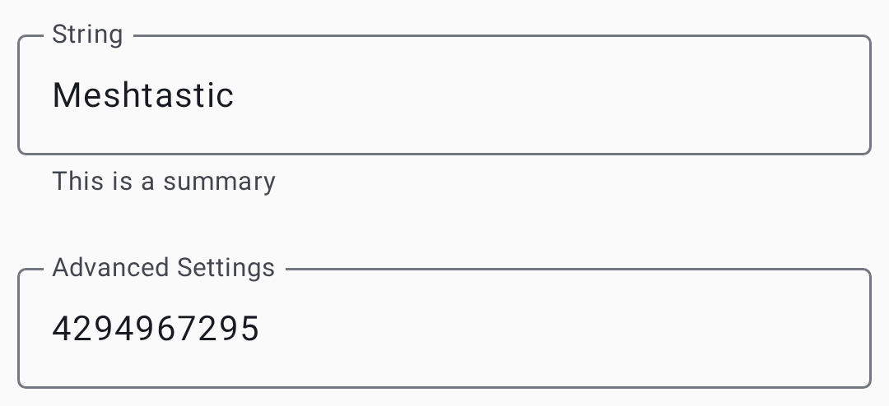

# Настройки — Модули и администрирование

Настрой дополнительные функциональные модули и выполняй управление устройством. Модули расширяют Meshtastic с помощью специализированных возможностей — каждый из них можно включать или отключать отдельно.

> 💡 **Совет:** Тебе нужно включать только те модули, которые действительно используешь. Отключение неиспользуемых модулей снижает время передачи, экономит батарею и упрощает конфигурацию.

Настройки модулей используют макет на основе карточек с переключателями, выпадающими списками, текстовыми полями и ползунками:

## Конфигурация модуля

### Модуль MQTT

Мосты передают сообщения туда и обратно от брокера MQTT для подключения к интернету. Ты так расширишь сеть за пределы радиуса действия или интегрируешь её с системами домашней автоматизации.

| Настройка        | Описание                                                                |
| ---------------- | ----------------------------------------------------------------------- |
| Включено         | Переключить MQTT мост                                                   |
| Сервер           | Адрес MQTT брокера                                                      |
| Имя пользователя | Имя пользователя для аутентификации                                     |
| Пароль           | Пароль аутентификации                                                   |
| Шифрование       | Зашифровать MQTT-пейлоады                                               |
| ~~Вывод JSON~~   | ⚠️ **Устарело** — поддержка JSON удалена из прошивки; поле игнорируется |
| TLS              | Использовать защищённое соединение                                      |
| Корневая тема    | Базовый путь темы MQTT                                                  |
| Отчет карты      | Опубликовать позицию на публичной карте                                 |

См. [MQTT](mqtt) для подробного руководства по использованию, включая шифрование, конфиденциальность и настройку брокера.

### Последовательный модуль

Позволяет общаться через последовательный порт с внешними устройствами (GPS-модулями, датчиками или собственной техникой). Когда включено, последовательный порт ноды может отправлять и получать данные в формате protobuf или текст, что позволяет внешним микроконтроллерам или компьютерам взаимодействовать с сетью.

| Настройка                                  | Описание                                     |
| ------------------------------------------ | -------------------------------------------- |
| Включено                                   | Включить последовательное соединение         |
| Эхо                                        | Echo получил обратно последовательные данные |
| Режим обмена                               | Вывод в формате текста, Protobuf или NMEA    |
| Пины RX/TX                                 | GPIO-пины для последовательного соединения   |
| Скорость передачи (бод) | Скорость последовательного соединения        |

### Модуль внешних уведомлений

Управляет зуммером, светодиодом или вибрацией на вашем радиооборудовании. Полезно для устройств, которым нужно физически сигнализировать о приходе сообщения — особенно удобно для неоснащенных персоналом или уличных установок.

| Настройка                                 | Описание                            |
| ----------------------------------------- | ----------------------------------- |
| Включено                                  | Включить уведомления                |
| Включить уведомление о входящем сообщении | Уведомлять о входящих сообщениях    |
| Зуммер при уведомлении                    | Использовать буззер для сообщений   |
| Вибрация при уведомлении                  | Использовать вибрацию для сообщений |
| Уведомлять при 🔔                         | Уведомлять о символе колокола       |
| Вывод (GPIO)           | Пин для вывода уведомления          |
| Активный выход                            | Высокая или низкая активность       |
| Длительность (мс)      | Длительность уведомления            |
| Использовать I2S как буззер               | Использовать аудиовывод I2S         |

### Модуль Store & Forward

Буферизирует сообщения для узлов, которые временно были недоступны, а затем ретранслирует их, когда эти узлы переподключаются. Важное значение для сеток, где узлы входят и выходят вне диапазона регулярно - обеспечивает отсутствие потери сообщений при коротких разъединениях.

| Настройка                                  | Описание                                                                                                                               |
| ------------------------------------------ | -------------------------------------------------------------------------------------------------------------------------------------- |
| Включено                                   | Активировать режим хранения и пересылки                                                                                                |
| Heartbeat                                  | Периодически объявлять о наличии функции хранения и пересылки у этого узла                                                             |
| Записи                                     | Максимальное количество сохраненных сообщений                                                                                          |
| История возврата (макс) | Максимум сообщений для повтора                                                                                                         |
| Возврат истории (окно)  | Окно времени для повтора                                                                                                               |
| Сервер                                     | Действовать как сервер хранения и пересылки для mesh-сети (требуется большой объем памяти, например, ESP32 с PSRAM) |

> 💡 **Совет:** Хранение и пересылка лучше всего работает на узлах с достаточной памятью (ESP32 с PSRAM). Узлы маршрутизатора являются идеальными кандидатами, так как они обычно всегда включены.

### Модуль проверки дальности

Автоматизированный инструмент для проверки дальности и оценки качества связи между нодами. Когда включено, нода периодически отправляет сообщения с увеличивающимся счетчиком. Приёмная нода записывает эти сообщения, что позволяет тебе уйти пешком или уехать на машине, а потом проанализировать, на каком расстоянии сообщения перестали приходить.

| Настройка                                | Описание                                      |
| ---------------------------------------- | --------------------------------------------- |
| Включено                                 | Активировать проверку дальности               |
| Интервал отправки (с) | Время между передачами проверок               |
| Сохранить в CSV                          | Журнал полученных тестовых данных на SD-карту |

### Модуль телеметрии

Контролирует какими телеметрическими данными ваш узел делится с сеткой. Телеметрия включает данные о состоянии устройства (заряд батареи, время работы) и данные с датчиков окружающей среды (температура, влажность, давление).

| Настройка                             | Описание                                       |
| ------------------------------------- | ---------------------------------------------- |
| Интервал обновления метрик устройства | Как часто сообщать о показателях устройства    |
| Интервал обновления метрик среды      | Как часто сообщать о датчиках окружающей среды |
| Телеметрия воздуха                    | Сообщить данные датчика частиц                 |
| Включены метрики энергии              | Сообщать об энергопотреблении                  |

Посмотрите [Телеметрия и датчики](telemetry-and-sensors) — для получения информации о поддерживаемых датчиках и рекомендациях по настройке.

### Модуль шаблонных сообщений

Предварительно настроенные сообщения, доступные через физические кнопки устройства (для радиостанций с поворотными энкодерами, кнопочными панелями или аналогичным оборудованием ввода). Определите список быстрых сообщений, которые могут быть переданы без подключённого телефона — идеально подходит для использования в поле.

| Настройка               | Описание                                                                 |
| ----------------------- | ------------------------------------------------------------------------ |
| ~~Включено~~            | ⚠️ **Устарело** — текущая прошивка может игнорировать этот переключатель |
| Сообщения               | Список сообщений, разделённых новой строкой                              |
| Отправлять 🔔           | Воспроизвести звук колокола при отправке                                 |
| Поворотный энкодер      | Включить ввод поворотного энкодера                                       |
| Пины поворота и нажатия | Задания GPIO PIN-кода для ввода                                          |

### Звуковой модуль

Поддержка аудио Codec2 для низкополосной голосовой связи через сетку. Это **экспериментальная функция**, которая кодирует голос в очень маленькие пакеты данных с помощью кодека Codec2.

| Настройка           | Описание                                               |
| ------------------- | ------------------------------------------------------ |
| Включено            | Активировать модуль аудио                              |
| Частота кодирования | Компромисс между качеством звука и полосой пропускания |
| Выбор слов I2S      | GPIO контакт для I2S WS                                |
| I2S Вход данных     | Пин GPIO для I2S DIN                                   |
| I2S Выход данных    | Пин GPIO для I2S DOUT                                  |

> ⚠️ Примечание: Для работы аудио требуется специальное аппаратное обеспечение (I2S-микрофон и динамик). Качество голоса очень низкополосное — представьте себе «разборчивую радиосвязь», а не качество телефонного звонка.

### Удаленный аппаратный модуль

Управление GPIO через mesh-сеть. Позволяет удалённому узлу читать и записывать состояния выводов GPIO на другом узле — полезно для активации реле, опроса переключателей или удалённого управления внешним оборудованием.

| Настройка                     | Описание                                                                        |
| ----------------------------- | ------------------------------------------------------------------------------- |
| Включено                      | Активировать удаленный GPIO доступ                                              |
| Разрешить неопределенные пины | Разрешить доступ к любому GPIO-пину (риск для безопасности)  |
| Доступные пины                | До 4 пинов GPIO, которые этот узел предоставляет для удалённого чтения и записи |

> ⚠️ Предупреждение: Включение опции «Разрешить неопределённые пины» даёт удалённым узлам доступ ко всем выводам GPIO, что может нарушить работу собственного аппаратного обеспечения радио. Включать только на выделенных GPIO-нодах.

### Модуль информации о соседях

Транслирует информацию о доступных услышанных соседей, включив ячейку сеточной топологии. Каждый включенный узел периодически делится списком других узлов которые он может слышать и их качество сигнала.

| Настройка                                  | Описание                                                                                                                                         |
| ------------------------------------------ | ------------------------------------------------------------------------------------------------------------------------------------------------ |
| Включено                                   | Включить трансляцию соседей                                                                                                                      |
| Интервал обновления (с) | Как часто транслировать список соседей                                                                                                           |
| Передача через LoRa                        | Также транслировать информацию соседей по LoRa, а не только MQTT/телефон. Недоступно на канале используя ключ по умолчанию и имя |

Смотрите [Discovery](discovery) за тем как использовать соседние данные для сеточно топологического исследования.

### Модуль окружающего освещения

Управляет встроенными светодиодами NeoPixel или другими адресуемыми RGB-светодиодами на поддерживаемом оборудовании. Может использоваться для визуальных статусовых индикаторов, световых уведомлений, или декоративных эффектов.

| Настройка                 | Описание                                                         |
| ------------------------- | ---------------------------------------------------------------- |
| Состояние светодиода      | Включить или выключить светодиод                                 |
| Ток                       | Текущий лимит светодиодов (0–31)              |
| Красный / Зеленый / Синий | Индивидуальные значения цветов канала (0–255) |

### Модуль определения датчика

Превращает ваш узел в систему сигнализации на основе датчика движения или открытия двери. При обнаружении изменения состояния на выводе GPIO (например, сработал датчик движения или открылась дверь) узел отправляет по меш-сети оповещение.

| Настройка                                                | Описание                                                                                                                                           |
| -------------------------------------------------------- | -------------------------------------------------------------------------------------------------------------------------------------------------- |
| Включено                                                 | Активировать датчик обнаружения                                                                                                                    |
| Пин датчика                                              | Пин GPIO, подключенный к датчику                                                                                                                   |
| Триггер срабатывания                                     | Как состояние пина интерпретируется как событие обнаружения (например, активный высокий/низкий уровень, срабатывание по фронту) |
| Использовать режим подтяжки входа                        | Включить внутренний подтягивающий резистор пина                                                                                                    |
| Минимальное количество трансляций (с) | Минимальный интервал между оповещениями                                                                                                            |
| Трансляция состояния (с)              | Интервал периодической отправки состояния                                                                                                          |
| Отправлять 🔔                                            | Включать символ колокола в оповещения                                                                                                              |
| Имя датчика                                              | Пользовательское имя для этого датчика                                                                                                             |

### Paxcounter Модуль

Подсчёт количества людей по Wi-Fi и BLE-запросам от устройств. Засчитывает ближайшие устройства, пассивно прослушивая зондирующие запросы, чтобы телефоны и ноутбуки излучали при сканировании сетей. Доступно только на устройствах ESP32.

| Настройка                                  | Описание                         |
| ------------------------------------------ | -------------------------------- |
| Включено                                   | Активировать подсчет людей       |
| Интервал обновления (с) | Как часто сообщать подсчитывания |

> 💡 **Совет:** Paxcounter полезен для приблизительной оценки пешеходного потока в местах начала маршрутов, на мероприятийных площадках или в других локациях. Счетчики приблизительны — один человек может иметь несколько устройств.

### Модуль TAK

Интеграция Team Awareness Kit для совместимости с ATAK и WinTAK. См. [TAK Integration](tak) для детальной настройки и использования.

## Администрирование

### Удаленное администрирование

Удалённо настраивай ноды, которые используют твой ключ администрирования:

1. Выбери целевую ноду в списке нод.
2. Перейди в **Настройки** этой ноды.
3. Измени конфигурацию.
4. Нажми **Сохранить** — изменения отправляются через сеть.

> ⚠️ **Требуется:** Ключ администратора настроенный как на вашем узле, так и на целевом узле.

### Очистить базу данных нод

Удаляет устаревшие узлы из локальной базы данных, которые не были услышаны в настраиваемом окне времени.

### Сброс к заводским настройкам

Сбрасывает все настройки к заводским. **Это действие нельзя отменить.**

### Перезагрузка

Удаленно перезагрузить подключенный или управляемый узел.

### Панель отладки

Открывает вкладки **Пакет** и **Журналы приложений** для просмотра, фильтрации и экспорта диагностических выходов. См. [Отладочные журналы](debug-logs) для полного прохождения.

### Устранение неполадок удалённого администрирования

- **"Нет ответа от целевого узла"** — цель может находиться вне диапазона, в автономном режиме или иметь несоответствующий ключ администратора. Проверьте соответствие ключа администратора на обоих узлах.
- **Изменения не применены** — чтобы некоторые настройки вступили в силу, нужно перезагрузить устройство. Попробуй перезагрузить после сохранения.
- **Не видны настройки удалённой ноды** — убедись, что твоя нода имеет админ-ключ для целевой ноды. Админ-канал настраивается автоматически, когда задан ключ администратора.

## Связанные темы

- [Настройки — Радио и Пользователь](settings-radio-user) — основные настройки радио и профиля пользователя
- [Ссылка на конфигурацию модуля](https://meshtastic.org/docs/configuration/module) — подробная документация по модулям на meshtastic.org
- [FAQ](https://meshtastic.org/docs/faq/) — общие вопросы на meshtastic.org

---

