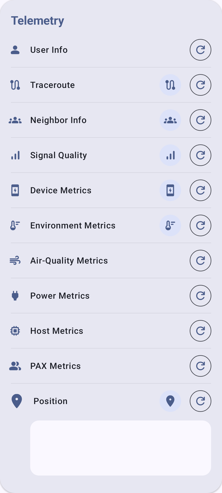

# Телеметрия и датчики

Ноды Meshtastic могут собирать и передавать данные датчиков по всей mesh-сети.

## Обзор

Телеметрия позволяет нодам, оснащённым датчиками, передавать информацию об окружающей среде, питании и состоянии устройства. Эти данные отображаются на экране сведений о ноде и могут регистрироваться с течением времени.

## Телеметрия устройства

Все ноды Meshtastic передают базовую телеметрию устройства:

| Метрика                                     | Описание                                       | Типичный диапазон                                                  |
| ------------------------------------------- | ---------------------------------------------- | ------------------------------------------------------------------ |
| Уровень заряда                              | Процент заряда                                 | 0–100%                                                             |
| Напряжение                                  | Напряжение батареи                             | 3.0–4.2V (LiPo) |
| Использование канала                        | % использованного локально эфирного времени    | 0–100%                                                             |
| Использование эфира (TX) | % эфирного времени, использованного этой нодой | 0–100%                                                             |
| Аптайм                                      | Секунд с последней загрузки                    | Варьируется                                                        |

## Датчики окружающей среды

Поддерживаемые датчики окружающей среды:

### Температура и влажность

| Sensor  | Температура | Влажность | Давление | Заметки                          |
| ------- | ----------- | --------- | -------- | -------------------------------- |
| BME280  | ✓           | ✓         | ✓        | Рекомендуемый "всё в одном"      |
| BME680  | ✓           | ✓         | ✓        | Добавляет сопротивление газа/IAQ |
| SHT31   | ✓           | ✓         | —        | Высокая точность                 |
| MCP9808 | ✓           | —         | —        | Прецизионная температура         |
| LPS22   | —           | —         | ✓        | Только давление                  |

### Качество воздуха

| Sensor   | Метрика                                            | Заметки                         |
| -------- | -------------------------------------------------- | ------------------------------- |
| BME680   | Сопротивление газа / IAQ                           | Летучие органические соединения |
| PMSA003I | PM1.0, PM2.5, PM10 | Взвешенные частицы              |
| SEN55    | PM, NOx, VOC, температура, влажность               | Мультисенсор                    |

### Освещённость и УФ

| Sensor   | Метрика                                           |
| -------- | ------------------------------------------------- |
| OPT3001  | Окружающая освещённость (люкс) |
| VEML7700 | Окружающая освещённость (люкс) |
| LTR390   | УФ-индекс                                         |

## Метрики питания

Ноды с датчиками питания серии INA могут сообщать:

| Метрика         | Описание                                    |
| --------------- | ------------------------------------------- |
| Напряжение шины | Напряжение линии питания                    |
| Ток             | Потребляемый ток (мА)    |
| Питание         | Расчётная мощность (мВт) |

Полезно для мониторинга солнечной зарядки или состояния батареи на удалённых нодах.

## Настройка телеметрии

1. Перейдите в **Настройки → Конфигурация модулей → Телеметрия**.
2. Установите интервалы передачи:
   - **Интервал метрик устройства** — как часто передавать метрики устройства
   - **Интервал метрик окружающей среды** — как часто передавать данные датчиков
3. Включайте нужные типы датчиков по необходимости.

### Рекомендуемые интервалы

| Сценарий использования                             | Устройство (сек.) | Окружающая среда (сек.) |
| -------------------------------------------------- | ---------------------------------------------------- | ---------------------------------------------------------- |
| Городская mesh-сеть (много нод) | 3600                                                 | 3600                                                       |
| Сельская mesh-сеть (мало нод)   | 900                                                  | 900                                                        |
| Метеостанция                                       | 900                                                  | 300                                                        |
| Экономия заряда батареи                            | 7200                                                 | 7200                                                       |

> ⚠️ **Примечание**: Более короткие интервалы увеличивают использование эфирного времени и расход батареи во всей mesh-сети.

## Метрики качества воздуха

Ноды с датчиками взвешенных частиц или CO₂ передают данные о качестве воздуха:

| Метрическая           | Единица | Описание                        |
| --------------------- | ------- | ------------------------------- |
| PM1.0 | мкг/м³  | Ультрамелкие взвешенные частицы |
| PM2.5 | мкг/м³  | Мелкие взвешенные частицы       |
| PM10                  | мкг/м³  | Крупные взвешенные частицы      |
| CO₂                   | ppm     | Концентрация углекислого газа   |

Датчики CO₂, такие как SCD4x, также сообщают собственную температуру и влажность, которые отображаются вместе с указанными выше показаниями. На основе истории PM2.5 приложение дополнительно вычисляет значение **AQI EPA по методу NowCast**.

Показания CO₂ окрашены по уровню опасности (Хорошо → Душно → Плохо → Опасно → Эвакуация). Точные диапазоны ppm, цвета и подробности AQI см. в разделе [Метрики нод — Качество воздуха](node-metrics#air-quality-metrics).

Данные о качестве воздуха можно просматривать в виде информационных карточек на экране сведений о ноде, строить графики за период и экспортировать в CSV.

## Просмотр телеметрии

1. Перейдите в **Ноды** и выберите ноду.
2. Разделы телеметрии отображаются на экране сведений:
   - Метрики устройства (доступны всегда)
   - Метрики окружающей среды (при наличии датчиков)
   - Метрики питания (при наличии датчика INA)
   - Метрики качества воздуха (при наличии датчика PM/CO₂)
3. Исторические графики показывают тенденции с течением времени.

## Устранение неполадок

- **Нет данных об окружающей среде?** К удалённой ноде должен быть физически подключён датчик (например, BME280 по I2C). Телеметрия устройства (заряд батареи, время работы) доступна всегда, но для метрик окружающей среды требуется оборудование.
- **Показания устарели?** Проверьте интервал передачи — очень большие интервалы (7200 с и более) означают, что данные обновляются редко. Также убедитесь, что удалённая нода всё ещё в сети.
- **Конфликт датчиков на шине I2C?** Некоторые датчики используют одинаковые адреса I2C. Если на одной шине несколько твоих датчиков, проверь последовательный отладочный вывод радио на предмет конфликтов адресов.

## Связанные темы

- [Метрики нод](node-metrics) — просмотр данных телеметрии на экране сведений о ноде
- [Настройки — Модули и администрирование](settings-module-admin) — конфигурация модуля телеметрии
- [Единицы измерения и регион](units-and-locale) — единицы отображения температуры и давления

---

