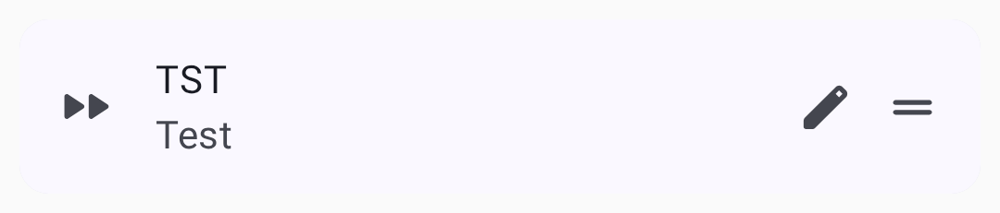
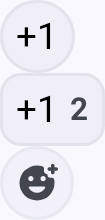

# Messages & Channels

Meshtastic supports two communication modes: **channel broadcasts** and **direct messages**.

## Kanallar

Channels are shared communication groups. All nodes configured with the same channel key can read and send messages on that channel.

### Default Channel

Every Meshtastic device comes with a default **LongFast** channel. This is an unencrypted channel used for general mesh communication.

### Channel Security

Channels support multiple encryption levels:

| Icon | Security Level                       | Açıklaması                                                                                                                             |
| ---- | ------------------------------------ | -------------------------------------------------------------------------------------------------------------------------------------- |
| 🔒   | PSK (256-bit AES) | Fully encrypted with a strong pre-shared key. Only nodes with the matching key can read messages.      |
| 🔐   | PSK (128-bit AES) | Encrypted with a shorter key. Secure for most uses but 256-bit is preferred for sensitive data.        |
| 🔓   | Default / Open                       | Uses the well-known default key. **Any Meshtastic device** on the same preset can read these messages. |
| ⚠️   | Insecure + Position                  | Open channel that also broadcasts your GPS position. Use with caution in public meshes.                |

> 🔒 **Security Tip:** Always configure a unique PSK for private communications. The default channel is intentionally open so new users can discover the mesh — but you should create a separate encrypted channel for anything sensitive.

### Adding a Channel

1. Navigate to **Settings → Channels**.
2. Tap **Add Channel** or scan a QR code.
3. Configure the channel name and encryption key.
4. Share the channel URL/QR code with others who need access.

Tapping a channel shows its details and sharing options.

## Direct Messages

Direct messages (DMs) are point-to-point encrypted communications between two specific nodes.

### Sending a Direct Message

1. Open the **Messages** tab.
2. Select a node from your contacts list or tap a node in the node list.
3. Type your message and tap **Send**.

### Message States

| State                             | Icon | Meaning                                                                                                           |
| --------------------------------- | ---- | ----------------------------------------------------------------------------------------------------------------- |
| Queued                            | ⏳    | Message waiting to be sent                                                                                        |
| En route                          | ✓    | Delivered to the radio, awaiting acknowledgment                                                                   |
| Delivered                         | ✓✓   | Acknowledgment received from recipient                                                                            |
| Received                          | ✓    | Message received from the mesh (incoming)                                                      |
| S&F Routing   | 🔗   | Store & Forward: message being routed through an S&F node |
| S&F Confirmed | 🔗   | Store & Forward: delivery confirmed via S&F node          |
| Hata                              | ✗    | Delivery failed after retries                                                                                     |

### Delivery Errors

When a message fails to deliver, the error indicator shows what went wrong:

| Hata             | Meaning                                  | What to Do                                                                                                                                                                  |
| ---------------- | ---------------------------------------- | --------------------------------------------------------------------------------------------------------------------------------------------------------------------------- |
| No Route         | No path exists to the destination node   | The recipient may be offline or out of mesh range. Try later or move closer.                                                                |
| Got NAK          | The next-hop node refused to relay       | The relay node may be congested. Wait and retry.                                                                                            |
| Zaman Aşımı      | No acknowledgment within retry window    | The recipient may be just out of range. Try increasing hop limit or moving to a better position.                                            |
| Arayüz Yok       | No radio interface available to send     | Check that your radio is connected and the channel is configured.                                                                                           |
| Max Retransmit   | All retry attempts exhausted             | The mesh path is unreliable. Try a different channel or wait for conditions to improve.                                                     |
| Kanal yok        | The destination channel doesn't exist    | Verify both nodes share the same channel configuration.                                                                                                     |
| Too Large        | Message exceeds maximum payload size     | Shorten your message (max ~230 characters).                                                                              |
| No Response      | Node received message but didn't respond | The recipient's radio may be busy or in low-power sleep mode.                                                                                               |
| Duty Cycle Limit | Regional airtime limit reached           | Your radio has used its allowed transmit time. Wait for the duty cycle window to reset (typically 1 hour in EU regions). |
| Geçersiz İstek   | Malformed or invalid message             | This usually indicates a software bug. Try restarting the app.                                                                              |

> 💡 **Tip:** Most delivery errors resolve themselves. If a node is intermittently reachable, the mesh will retry. For persistent "No Route" errors, check that intermediate Router nodes are online.

## Message Features

### Quick Chat

Pre-configured messages for rapid communication:

- Access via the Quick Chat button in the message input area
- Choose from built-in phrases or custom messages
- Customize quick chat messages in **Settings → Quick Chat**
- Useful when typing is impractical (gloves, small screen, urgent)

The channel list shows each channel with its latest message preview.

### Message Bubbles

Messages appear as chat bubbles — sent messages on the right, received messages on the left. Each bubble shows the sender, timestamp, and delivery status. Messages with replies include a quoted preview of the original message above the response.

### Reactions

React to messages with emoji:

- **Long-press** a message to open the actions menu
- Tap **Add Reaction** to choose an emoji
- Reactions appear below the message bubble
- Multiple users can react to the same message
- React to your own messages or others' messages

> 💡 **Tip:** Reactions are lightweight — they use minimal mesh bandwidth compared to full text messages.

### Message Actions

Long-press any message to access:

- **Copy** — copy message text to clipboard
- **Reply** — quote the message in your response
- **React** — add an emoji reaction
- **Delete** — remove a message you sent (local deletion)

### Message Priority

Messages are queued and transmitted based on priority:

1. Emergency/alert messages (highest)
2. Direct messages
3. Channel broadcasts (lowest)

### Message Limits

- **Maximum length:** 237 bytes (approximately 230 characters for ASCII text)
- **Rate limiting:** The mesh enforces airtime fairness; heavy message volume may be throttled
- **Delivery:** Messages are retried automatically if no acknowledgment is received

## Best Practices

- Use channels for group coordination
- Use direct messages for private person-to-person communication
- Keep messages short — mesh bandwidth is limited
- Configure encryption for sensitive communications

## Related Topics

- [Nodes](nodes) — tap a node to start a direct message
- [Settings — Radio & User](settings-radio-user) — configure channel encryption and presets
- [MQTT](mqtt) — bridge channel messages to the internet
- [Channel configuration](https://meshtastic.org/docs/configuration/radio/channels) — detailed channel settings on meshtastic.org

---

