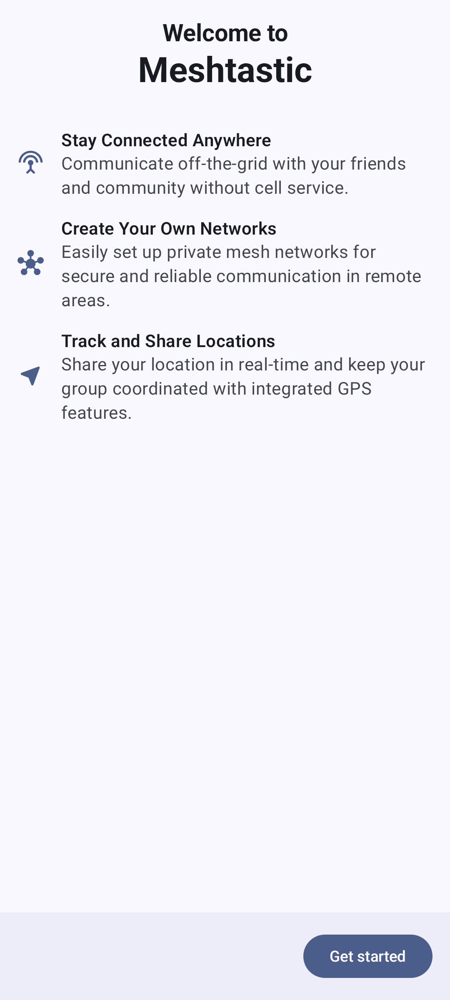

# # 入門指南

This page covers the first-launch flow of the Meshtastic Android app, what each permission is for, and how to revisit them later.

## First Launch

When you open the app for the first time, the app guides you through an introductory flow that configures essential permissions and settings. Complete each step in order or skip it — nothing here is a one-time offer. Every permission can be reviewed and granted later from **Settings → Permissions** inside the app.

### Welcome Screen

The welcome screen introduces Meshtastic with three feature rows:

|                               |                                  |
| ----------------------------- | -------------------------------- |
| **Stay Connected Anywhere**   | 無需手機訊號，也能與您的朋友和社群離線通訊。           |
| **Create Your Own Networks**  | 輕鬆設定私有網狀網絡，以實現偏遠地區安全可靠的通訊。       |
| **Track and Share Locations** | 透過整合的 GPS 功能，即時分享你的位置，並保持團隊協調一致。 |

Tap **Get started** to proceed through the setup flow.

## Permissions

The app requests several permissions during setup. Each one serves a specific purpose, and some are required for core functionality.

### Bluetooth Permission

Bluetooth is the primary connection method between your phone and Meshtastic radio:

- **Bluetooth scanning** — discover nearby Meshtastic radios
- **Bluetooth connect** — establish and maintain connections with paired radios

Grant both permissions when prompted. Without Bluetooth, you'll need to use USB or TCP connections instead.

### Location Permission

> ⚠️ **Is location required for Bluetooth?** **Android 11 and older** show one location step, on the Bluetooth screen, rather than two — those releases treat a Bluetooth scan as a location capability, so the app asks for Location instead of "Nearby devices". Asking twice would push you toward the point where Android stops offering the dialog at all (a second denial on Android 11; the "Don't ask again" checkbox on Android 10 and older). On **Android 12 and newer** the two are separate: "Nearby devices" is declared `neverForLocation`, and declining Location does not stop you finding or connecting to a radio.

Meshtastic also uses your location for:

- Showing your position on the mesh map
- Calculating distances to other nodes
- Sharing your GPS coordinates with other mesh members (if enabled)

Grant **"While using the app"**. The app does not request background location — `ACCESS_BACKGROUND_LOCATION` is not in its manifest — so Android will not offer an "Always" option, and position updates happen while the app is in the foreground or running its foreground service.

Declining leaves the rest of the app working: on Android 12 and newer, Bluetooth is unaffected and only the map position and position sharing are disabled. On Android 11 and older, Bluetooth scanning also stops, because that is the permission Android gates it behind — and system **Location Services** must also be switched on for a scan to return anything.

### Notifications Permission

Notifications alert you to:

- Incoming messages from channels and direct messages
- New nodes joining the mesh
- Low battery on a remote node

> 💡 **Tip:** You can fine-tune notification preferences later in Android system settings — the app creates a separate notification channel per category (plus a few internal ones, like the background service), so you can enable or silence them individually.

### Critical Alerts Permission

Critical alerts are high-priority notifications that break through Do Not Disturb — for emergency mesh alerts and urgent messages.

This step is not a runtime permission prompt. There is no grant/deny dialog: the button opens the Android system settings page for the app's **Alerts** notification channel, where you turn the breakthrough behavior on yourself. You can **skip** it, and reach the same page later from Android notification settings.

### Reviewing permissions later

**Settings → Permissions** summarizes where every runtime permission stands. It covers five: **Nearby devices** (Bluetooth), **Location**, **Notifications**, **Camera** (scanning channel and contact QR codes) and **Local network** (finding radios over Wi-Fi by mDNS) — the last two are never asked for during setup, only when a feature first needs them. It reads _All allowed_ when no permission needs attention; the row names the count and the Permissions screen opens automatically when something does. Tap the row to see the full list at any time:

| 狀態                                          | What tapping the row does                                                                    |
| ------------------------------------------- | -------------------------------------------------------------------------------------------- |
| **Allowed**                                 | Opens the system page, so you can review or revoke it                                        |
| **Not asked yet**                           | Requests it                                                                                  |
| **Denied — tap to allow**                   | Explains what the permission is for, then asks again if you agree                            |
| **Blocked — tap to open system settings**   | Android will no longer show its dialog, so this opens the page where you can turn it back on |
| **Not required on this version of Android** | Nothing — the permission does not exist on your device                                       |

This matters most for notifications. If you decline them during setup, this row is the way back: Android stops showing the dialog once you have declined firmly (a second denial), at which point this row switches to **Blocked** and sends you to the system settings page instead. The notification prompt exists only on Android 13 and newer — on older versions notifications are on by default and managed from Android's own settings.

## After Setup

After you grant permissions, the app opens the main interface. Your first action should be connecting to a Meshtastic radio — see [Connections](connections) for detailed instructions.

> 💡 **Tip:** If you skipped any permissions during setup, open **Settings → Permissions** in the app. Every runtime permission is listed there with its current state and a way back to it — including notifications, which the system will not prompt for a second time on its own.

Features also ask in context. Tapping **Scan** on the Connections screen with Bluetooth permission missing explains what it is for and offers to request it; once Android stops prompting, the same control opens the system settings page instead of doing nothing.

New to Meshtastic? The [getting started guide](https://meshtastic.org/docs/getting-started) on meshtastic.org covers hardware selection, initial radio configuration, and your first mesh setup.

## 相關主題

- [Connections](connections) — pair your first radio
- [Messages & Channels](messages-and-channels) — send your first message
- [Nodes](nodes) — see who else is on your mesh
- [Map & Waypoints](map-and-waypoints) — view node positions
- [Settings — Radio & User](settings-radio-user) — configure your radio and user profile
