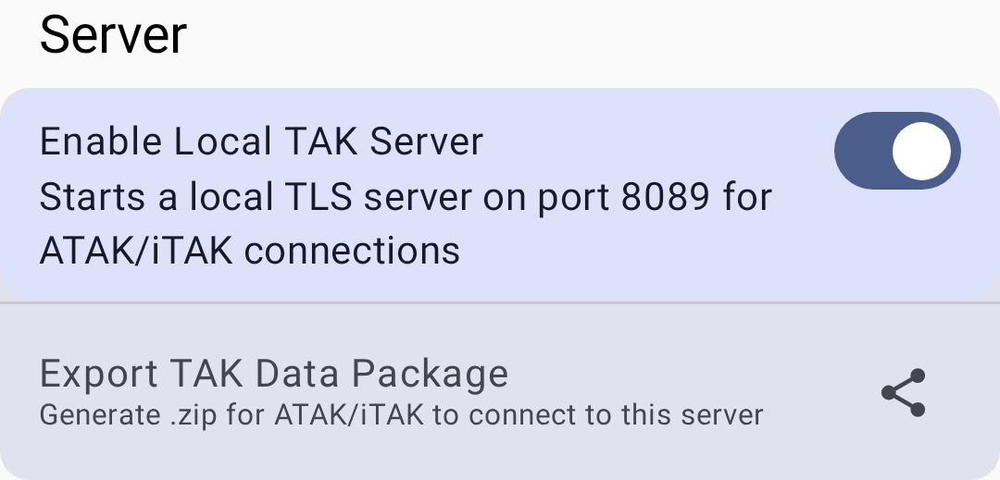

# TAK Integration

Meshtastic integrates with the Team Awareness Kit (TAK) ecosystem, enabling interoperability between Meshtastic mesh devices and TAK applications like ATAK and WinTAK.

## 概觀

The TAK module allows Meshtastic nodes to:

- Share position data in TAK-compatible CoT (Cursor on Target) format
- Appear as team members on TAK map displays
- Receive TAK PLI (Position Location Information) messages

## 設定

### 先決條件

- ATAK (Android Team Awareness Kit) or WinTAK installed
- Meshtastic ATAK Plugin installed
- TAK module enabled on your Meshtastic radio

### 設定

1. Navigate to **Settings → Module Config → TAK**.
2. Enable the TAK module.
3. Configure the TAK team/group settings:

| 設定  | 描述說明                       |
| --- | -------------------------- |
| 已啟用 | Activate TAK interop       |
| 模式  | TAK-compatible output mode |

### ATAK Plugin Setup

1. Install the Meshtastic ATAK Plugin from the plugin repository.
2. Open ATAK and enable the Meshtastic plugin.
3. The plugin bridges messages between ATAK and your mesh network.

### Local TAK Server

The app can also run a **local TAK server** so ATAK/iTAK clients on the same device or network can connect directly, without a remote TAK server. Open **Settings → Module Config → TAK → TAK Server**:

- **Enable Local TAK Server** — starts a local TLS server on port **8089** for ATAK/iTAK connections.
- **Export TAK Data Package** — generates a `.zip` data package that ATAK/iTAK can import to connect to this server.

## TAK Roles

Nodes configured with TAK-related roles behave differently from standard clients:

| 角色              | 描述說明                                                                                                                                                                                                                                                                                |
| --------------- | ----------------------------------------------------------------------------------------------------------------------------------------------------------------------------------------------------------------------------------------------------------------------------------- |
| **TAK**         | Full TAK interoperability — sends and receives CoT data, chat messages, and PLI updates. Functions as a standard client plus TAK bridge.                                                                                                            |
| **TAK Tracker** | Position-only TAK output — automatically broadcasts PLI at regular intervals without user interaction. Optimized for unattended position beacons (vehicles, equipment, waypoints). Does not relay chat messages. |

> 💡 **Tip:** Use **TAK Tracker** for devices that only need to report position (e.g., a radio mounted in a vehicle). Use **TAK** for devices where users actively participate in TAK operations.

### CoT (Cursor on Target) Format

TAK messages use the Cursor on Target XML format — a military standard for sharing situational awareness data. Meshtastic converts its internal protobuf messages to CoT format when bridging to TAK systems, so no manual format conversion is needed.

## TAK Identity

When using TAK roles, your node broadcasts identity information that appears on TAK maps:

| 設定   | 描述說明                                                                                                             |
| ---- | ---------------------------------------------------------------------------------------------------------------- |
| 隊伍顏色 | Your team color on the TAK map (e.g., Blue, Red, Cyan, Green) |
| 隊員角色 | Your operational role (Team Member, Team Lead, HQ, Medic, RTO, etc.)          |

These settings appear in **Settings → Module Config → TAK** when the TAK module is enabled. Your TAK callsign isn't a separate setting — it's derived automatically from your Meshtastic node name.

> 💡 **Tip:** Team/role colors are the standard TAK affiliation colors. Coordinate with your TAK team to use consistent team assignments.

## Wire Format (V1 / V2)

Meshtastic supports two TAK wire formats, chosen automatically based on the connected radio's firmware — no manual configuration needed:

| Format                          | 相容性                                                      | 特色                                                                                                                                                                                                                 |
| ------------------------------- | -------------------------------------------------------- | ------------------------------------------------------------------------------------------------------------------------------------------------------------------------------------------------------------------ |
| V1 (Legacy)  | Firmware 2.7.x and older | Bare protobuf encoding on port 72. Supports position sharing (PLI) and chat (GeoChat) only — shapes, markers, routes, and other typed CoT events are dropped |
| V2 (Current) | Firmware 2.8.0+          | Compact, zstd-compressed encoding on port 78. Adds shapes, markers, routes, aircraft, casevac, emergency, and task CoT types on top of everything V1 supports                                      |

A node still relays legacy V1 packets from older nodes even while running V2 itself, so mixed-firmware meshes keep working.

## Usage with ATAK

Once configured:

- Meshtastic nodes appear as markers on the ATAK map with callsign labels
- Chat messages can bridge between mesh and TAK networks
- Position updates flow bidirectionally between Meshtastic and TAK
- TAK Tracker nodes broadcast PLI automatically — their positions appear on ATAK maps without any ATAK-side configuration

> ⚠️ **Note:** TAK integration requires specific node roles and module configuration. Standard client nodes don't automatically participate in TAK operations.

## 故障排除

| Problem                                 | Cause                                                                                                     | Solution                                                                                        |
| --------------------------------------- | --------------------------------------------------------------------------------------------------------- | ----------------------------------------------------------------------------------------------- |
| Node doesn't appear on ATAK map         | TAK module disabled or wrong role                                                                         | Verify TAK module is enabled and node role is TAK or TAK Tracker                                |
| Position updates are stale              | GPS fix lost or interval too long                                                                         | Check GPS status; reduce position broadcast interval in Position Config                         |
| ATAK plugin shows "disconnected"        | BLE connection lost or plugin crashed                                                                     | Reconnect Bluetooth in Meshtastic app, then restart ATAK plugin                                 |
| Shapes, markers, or routes not bridging | Sending node is on legacy V1 (firmware 2.7.x or older) | Update the sending node's firmware to 2.8.0+ for V2 wire format |
| CoT data not flowing                    | Channel mismatch                                                                                          | All TAK nodes must be on the same channel with matching encryption                              |

## Security Considerations

- TAK data shares your position and callsign information
- Ensure your channel encryption is configured when using TAK in sensitive environments
- The TAK module respects the same channel encryption as other Meshtastic messages

## Related Topics

- [Settings — Modules & Admin](settings-module-admin) — TAK module configuration
- [Nodes](nodes) — TAK and TAK Tracker roles in the node list
- [Map & Waypoints](map-and-waypoints) — node positions on the map
- [ATAK plugin guide](https://meshtastic.org/docs/software/integrations/atak-plugin) — detailed ATAK setup on meshtastic.org

---

