```mermaid
graph TB
  :feature:connections[connections]:::kmp-feature
  :feature:connections -.-> :core:common
  :feature:connections -.-> :core:data
  :feature:connections -.-> :core:database
  :feature:connections -.-> :core:datastore
  :feature:connections -.-> :core:di
  :feature:connections -.-> :core:domain
  :feature:connections -.-> :core:model
  :feature:connections -.-> :core:navigation
  :feature:connections -.-> :core:prefs
  :feature:connections -.-> :core:proto
  :feature:connections -.-> :core:resources
  :feature:connections -.-> :core:service
  :feature:connections -.-> :core:ui
  :feature:connections -.-> :core:ble
  :feature:connections -.-> :core:network
  :feature:connections -.-> :feature:settings
  :feature:connections -.-> :core:testing

classDef android-application fill:#CAFFBF,stroke:#000,stroke-width:2px,color:#000;
classDef android-application-compose fill:#CAFFBF,stroke:#000,stroke-width:2px,color:#000;
classDef compose-desktop-application fill:#CAFFBF,stroke:#000,stroke-width:2px,color:#000;
classDef android-feature fill:#FFD6A5,stroke:#000,stroke-width:2px,color:#000;
classDef android-library fill:#9BF6FF,stroke:#000,stroke-width:2px,color:#000;
classDef android-library-compose fill:#9BF6FF,stroke:#000,stroke-width:2px,color:#000;
classDef android-test fill:#A0C4FF,stroke:#000,stroke-width:2px,color:#000;
classDef jvm-library fill:#BDB2FF,stroke:#000,stroke-width:2px,color:#000;
classDef kmp-feature fill:#FFD6A5,stroke:#000,stroke-width:2px,color:#000;
classDef kmp-library-compose fill:#FFC1CC,stroke:#000,stroke-width:2px,color:#000;
classDef kmp-library fill:#FFC1CC,stroke:#000,stroke-width:2px,color:#000;
classDef unknown fill:#FFADAD,stroke:#000,stroke-width:2px,color:#000;

```

# `:feature:connections`

## Overview

The `:feature:connections` module provides the **device discovery and connection management screen**. It enables users to scan for and connect to Meshtastic radios over BLE, USB serial, and TCP/NSD (network service discovery). The `ScannerViewModel` is platform-neutral; Android and JVM subclasses supply platform-specific bonding and permission workflows.

**Targets:** Android · JVM (Desktop) · iOS (via `meshtastic.kmp.feature` convention plugin)

## Key Responsibilities

- Scan for BLE devices and merge results with previously bonded devices (bonded first, then discovery order)
- Enumerate USB serial devices (CH340, FTDI, CP21xx, etc.) with permission gating on Android
- Discover TCP/NSD services and manage recent manual TCP addresses
- Surface a transport-filter UI (BLE / Network / USB chips) that persists to DataStore
- Manage the full connection flow: bond → connect → disconnect
- Show connection status and progress while a device is being configured

## Source Structure

```
src/
├── commonMain/kotlin/org/meshtastic/feature/connections/
│   ├── ScannerViewModel.kt          ← platform-neutral ViewModel
│   ├── Constants.kt
│   ├── model/
│   │   ├── DeviceListEntry.kt       ← sealed: Ble | Usb | Tcp | Mock
│   │   └── DiscoveredDevices.kt     ← GetDiscoveredDevicesUseCase interface + result
│   ├── domain/usecase/
│   │   ├── CommonGetDiscoveredDevicesUseCase.kt
│   │   ├── TcpDiscoveryHelpers.kt
│   │   └── UsbScanner.kt            ← common USB scanner interface
│   ├── navigation/
│   │   └── ConnectionsNavigation.kt
│   ├── ui/
│   │   ├── ConnectionsScreen.kt
│   │   └── components/
│   │       ├── ConnectingDeviceInfo.kt
│   │       ├── ConnectionActionButton.kt
│   │       ├── CurrentlyConnectedInfo.kt
│   │       ├── DeviceList.kt / DeviceListItem.kt / DeviceSectionHeader.kt
│   │       ├── DisconnectButton.kt
│   │       ├── EmptyStateContent.kt
│   │       └── TransportFilterChips.kt
│   └── di/
│       └── FeatureConnectionsModule.kt
├── androidMain/kotlin/
│   ├── AndroidScannerViewModel.kt   ← overrides bond/permission requests
│   └── domain/usecase/AndroidGetDiscoveredDevicesUseCase.kt
└── jvmMain/kotlin/
    ├── JvmScannerViewModel.kt
    └── domain/usecase/JvmGetDiscoveredDevicesUseCase.kt
```

## Key Types

### `DeviceListEntry` (sealed class)

```kotlin
sealed class DeviceListEntry {
    data class Ble(device: BleDevice, bonded: Boolean, node: Node?) : DeviceListEntry()
    data class Usb(usbData: UsbDeviceData, name: String, fullAddress: String, ...) : DeviceListEntry()
    data class Tcp(name: String, fullAddress: String, node: Node?) : DeviceListEntry()
    data class Mock(name: String, node: Node?) : DeviceListEntry()

    abstract val address: String          // strips transport prefix
    abstract fun copy(node: Node?): DeviceListEntry
}
```

Address format conventions: BLE → `x<MAC>`, USB → `s<path>`, TCP → `t<host:port>`, Mock → `m`.

### `ScannerViewModel`

Platform-neutral ViewModel. Exposes:

```kotlin
// Device lists
val bleDevicesForUi: StateFlow<List<DeviceListEntry>>
val usbDevicesForUi: StateFlow<List<DeviceListEntry>>
val discoveredTcpDevicesForUi: StateFlow<List<DeviceListEntry>>
val recentTcpDevicesForUi: StateFlow<List<DeviceListEntry>>

// Scan state
val isBleScanning: StateFlow<Boolean>
val isNetworkScanning: StateFlow<Boolean>

// Connection
val connectionProgressText: StateFlow<String?>
val selectedAddressFlow: StateFlow<String?>

// Actions
fun startBleScan() / stopBleScan() / toggleBleScan()
fun startNetworkScan() / stopNetworkScan()
fun onSelected(entry: DeviceListEntry): Boolean  // false if bond/permission still pending
fun disconnect()
fun addRecentAddress(address: String, name: String)
fun removeRecentAddress(address: String)
```

Android and JVM subclasses override `requestBonding(entry)` and `requestPermission(entry)` to perform OS-level Bluetooth pairing and USB permission dialogs respectively.

## Navigation

```kotlin
// Registration (in androidApp / desktopApp nav graph)
fun EntryProviderScope<NavKey>.connectionsGraph(backStack: BackStack<NavKey>) {
    // Registers ConnectionsRoute.Connections entry
    // Injects ScannerViewModel + RadioConfigViewModel via Koin
}
```

Route: `ConnectionsRoute.Connections`

## Dependency Graph

```
feature:connections
  ├── core:ble, core:network       (transports)
  ├── core:data, core:database, core:datastore, core:di
  ├── core:domain, core:model, core:navigation
  ├── core:prefs, core:proto, core:resources, core:service, core:ui
  ├── feature:settings             (RadioConfigViewModel)
  └── usb-serial-android           (Android only)
```

## Dependency Graph

<!--region graph-->

<!--endregion-->
