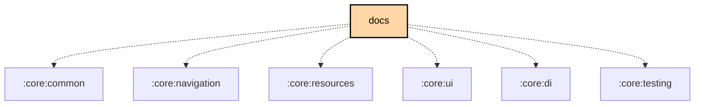

# `:feature:docs`

## Overview

The `:feature:docs` module is an **in-app documentation browser** with Compose Multiplatform UI. It bundles the Meshtastic user guide and developer guide as Compose resources at build time, provides full-text keyword search, Crowdin-backed multilingual content, optional ML Kit runtime translation (Google Play flavor), and a "Chirpy" AI Q&A assistant (Gemini Nano on Google Play; keyword fallback on F-Droid / Desktop / iOS).

**Targets:** Android · JVM (Desktop) · iOS (via `meshtastic.kmp.feature` convention plugin)

## Key Responsibilities

- Bundle `docs/en/user/**/*.md` and `docs/en/developer/**/*.md` as Compose resources at build time
- Sync Crowdin-translated locales into `composeResources/files/{locale}/docs/`
- Keyword search (TF-IDF style) across the full doc bundle
- Locale-aware content loading with Crowdin → ML Kit fallback chain
- Adaptive list/detail layout (single pane on phones, split pane on tablets/desktop)
- Chirpy AI assistant: streaming Q&A against in-app docs via Gemini Nano or keyword fallback

## Source Structure

```
src/commonMain/kotlin/org/meshtastic/feature/docs/
├── ai/
│   ├── AIDocAssistant.kt            ← interface (Gemini Nano / keyword fallback)
│   ├── ChirpySessionHolder.kt
│   └── KeywordFallbackAssistant.kt
├── data/
│   ├── DocBundleLoader.kt           ← interface + DefaultDocBundleLoader
│   └── KeywordSearchEngine.kt       ← TF-IDF keyword search
├── di/
│   └── FeatureDocsModule.kt         ← Koin module
├── model/
│   └── DocModels.kt                 ← DocSection, DocPage, DocBundle, DocSearchResult, ...
├── navigation/
│   └── DocsNavigation.kt            ← docsEntries(), ChirpyUiState, rememberChirpyState()
├── translation/
│   ├── DocTranslationService.kt     ← ML Kit (Google) or no-op (fdroid/desktop/iOS)
│   ├── DocTranslationCache.kt
│   ├── MarkdownTranslationSegmenter.kt
│   └── NoOpDocTranslator.kt
└── ui/
    ├── DocsBrowserScreen.kt         ← list pane
    ├── DocsPageRouteScreen.kt       ← detail pane
    ├── DocsSearchBar.kt
    ├── ChirpyAssistantSheet.kt      ← AI assistant bottom sheet
    ├── ChirpyFab.kt                 ← floating action button that opens Chirpy
    ├── ComposeResourceImageTransformer.kt
    ├── DocPageIconResolver.kt
    └── DocsPreviews.kt
```

## Key Types

### `DocSection` (sealed interface)

```kotlin
sealed interface DocSection {
    data object UserGuide      : DocSection
    data object DeveloperGuide : DocSection
}
```

### `DocPage`

```kotlin
data class DocPage(
    val id: String,
    val title: String,
    val section: DocSection,
    val navOrder: Int,
    val resourcePath: String,
    val keywords: List<String>,
    val charCount: Int,
)
```

### `AIDocAssistant` (interface)

```kotlin
interface AIDocAssistant {
    suspend fun isSupported(): Boolean
    val modelStatus: StateFlow<ModelReadiness>
    suspend fun answer(question: String, currentPageId: String? = null): AIDocAssistantResult
    fun answerStream(question: String, currentPageId: String? = null): Flow<AIDocAssistantResult>
    fun resetSession()
}
```

`AIDocAssistantResult` is a sealed interface: `Partial`, `Success`, `Fallback`, `Error`.

Platform bindings:
- **Google flavor**: Gemini Nano via on-device ML
- **F-Droid / Desktop / iOS**: `KeywordFallbackAssistant` (keyword search + summarisation, no network)

### `ChirpyMessage`

```kotlin
@Serializable
data class ChirpyMessage(
    val id: String,
    val role: ChirpyRole,   // USER | ASSISTANT | SYSTEM
    val text: String,
    val sources: List<SourceRef>,
)
```

## Gradle Tasks

Two custom tasks keep bundled docs in sync:

| Task | Description |
|---|---|
| `syncDocsToComposeResources` | Copies `docs/en/user/**/*.md` and `docs/en/developer/**/*.md` into `src/commonMain/composeResources/files/docs/`, plus `docs/assets/screenshots/**/*.png` into `.../files/docs/assets/screenshots/`. Runs automatically before resource generation. |
| `syncTranslatedDocsToComposeResources` | Copies Crowdin-translated locales from `docs/{locale}/user/**/*.md` into `src/commonMain/composeResources/files/{locale}/docs/` using CMP qualifier format (e.g. `pt-rBR`). |

These tasks run automatically — no manual invocation is required during normal development.

## Navigation

Routes (registered under the Settings nav graph):

| Route | Description |
|---|---|
| `SettingsRoute.HelpDocs` | Doc browser list pane |
| `SettingsRoute.HelpDocPage` | Individual doc page detail pane |

The `docsEntries()` extension uses Material3 adaptive `ListDetailSceneStrategy` to automatically provide a split-pane layout on large screens.

## Dependency Graph

### Key Dependencies

```
feature:docs
  ├── core:common, core:navigation, core:resources, core:ui, core:di
  ├── coil                      (image loading in Markdown)
  ├── markdown-renderer-m3      (Compose Markdown rendering)
  ├── compose.material3.adaptive, compose.material3.adaptive.navigation3
  └── kotlinx.collections.immutable
```

<!--region graph-->

<!--endregion-->
