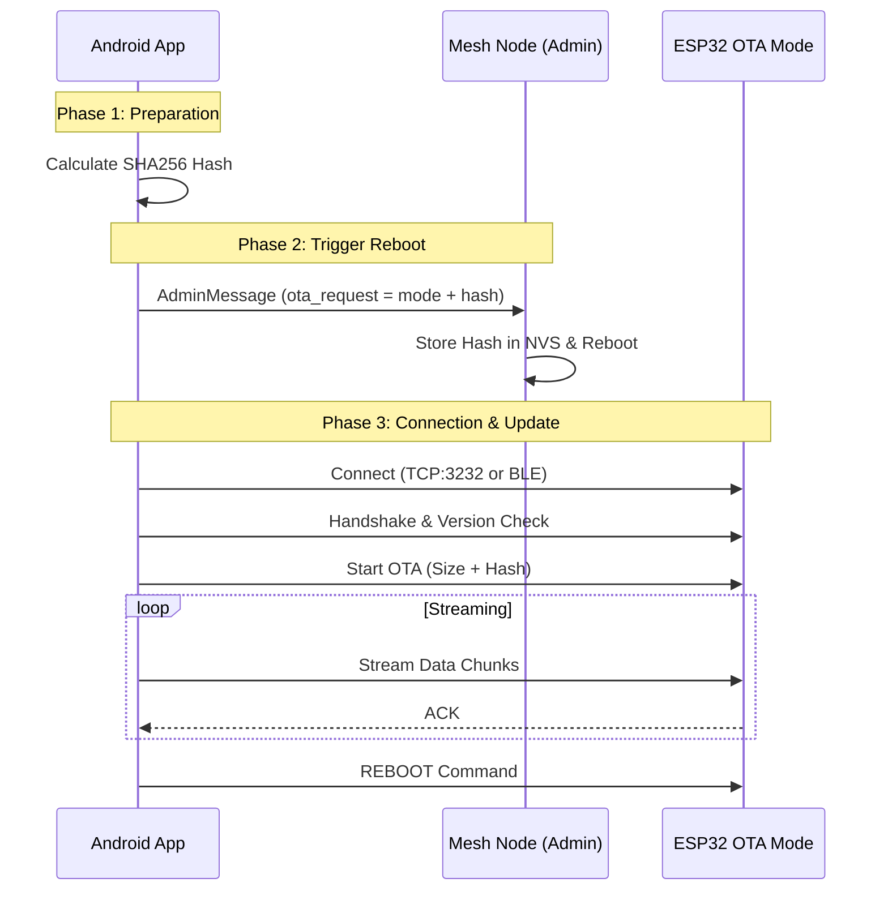
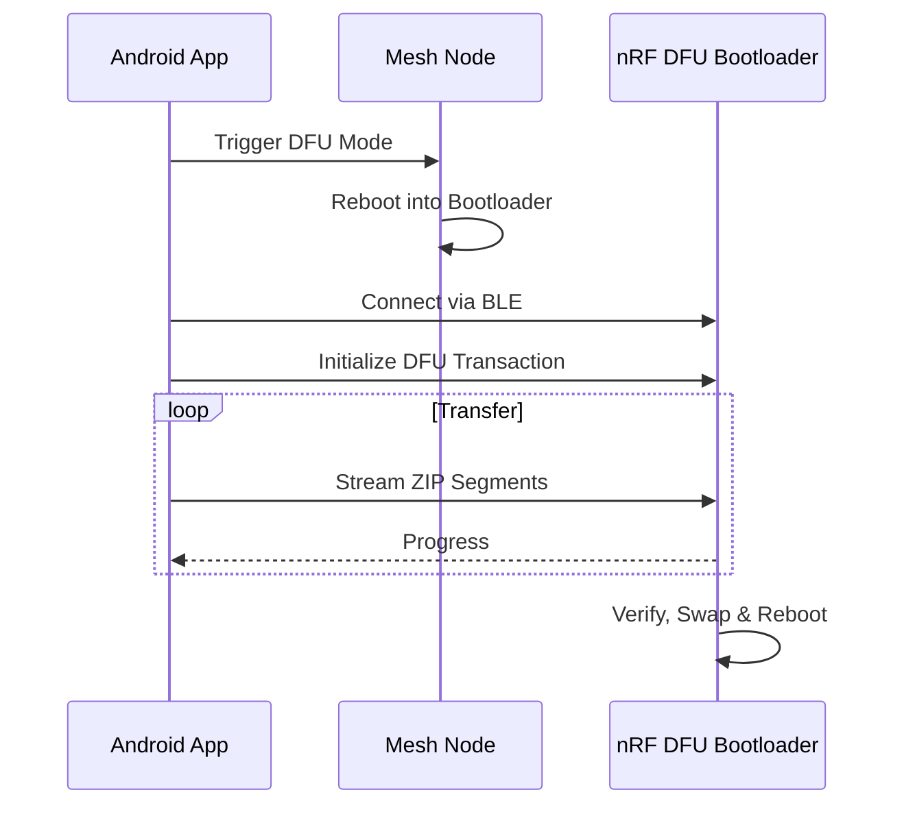
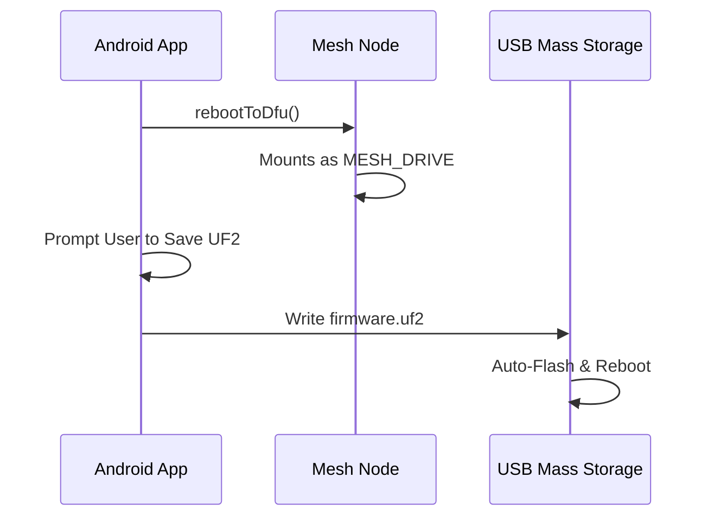

# `:feature:firmware`

## Module dependency graph

```mermaid
graph TB
  :feature:firmware[firmware]:::null

classDef android-application fill:#CAFFBF,stroke:#000,stroke-width:2px,color:#000;
classDef android-application-compose fill:#CAFFBF,stroke:#000,stroke-width:2px,color:#000;
classDef android-feature fill:#FFD6A5,stroke:#000,stroke-width:2px,color:#000;
classDef android-library fill:#9BF6FF,stroke:#000,stroke-width:2px,color:#000;
classDef android-library-compose fill:#9BF6FF,stroke:#000,stroke-width:2px,color:#000;
classDef android-test fill:#A0C4FF,stroke:#000,stroke-width:2px,color:#000;
classDef jvm-library fill:#BDB2FF,stroke:#000,stroke-width:2px,color:#000;
classDef kmp-library fill:#FFC1CC,stroke:#000,stroke-width:2px,color:#000;
classDef unknown fill:#FFADAD,stroke:#000,stroke-width:2px,color:#000;

```

<!--region graph-->

<!--endregion-->

## Firmware Update System

The `:feature:firmware` module provides a unified interface for updating Meshtastic devices across different platforms and connection types.

### Supported Platforms & Methods

Meshtastic-Android supports three primary firmware update flows:

#### 1. ESP32 Unified OTA (WiFi & BLE)
Used for modern ESP32 devices (e.g., Heltec V3, T-Beam S3). This method utilizes the **Unified OTA Protocol**, which enables high-speed transfers over TCP (port 3232) or BLE. The BLE transport uses the **Nordic Semiconductor Kotlin-BLE-Library** for architectural consistency with the rest of the application.

**Key Features:**
- **Pre-shared Hash Verification**: The app sends the firmware SHA256 hash in an initial `AdminMessage` trigger. The device stores this in NVS and verifies the incoming stream against it.
- **Connection Retry**: Robust logic to wait for the device to reboot and start the OTA listener.

#### 2. nRF52 BLE DFU
The standard update method for nRF52-based devices (e.g., RAK4631). It leverages the **Nordic Semiconductor DFU library**.

#### 3. USB / UF2 (RP2040, nRF52, STM32)
For devices supporting USB Mass Storage updates. The app triggers the device into its native bootloader mode, then guides the user to save the UF2 firmware file to the mounted drive.

### Key Classes

- `UpdateHandler.kt`: Entry point for choosing the correct handler.
- `Esp32OtaUpdateHandler.kt`: Orchestrates the Unified OTA flow.
- `WifiOtaTransport.kt`: Implements the TCP/UDP transport logic for ESP32.
- `BleOtaTransport.kt`: Implements the BLE transport logic for ESP32 using the Nordic BLE library.
- `FirmwareRetriever.kt`: Handles downloading and extracting firmware assets (ZIP/BIN/UF2).
