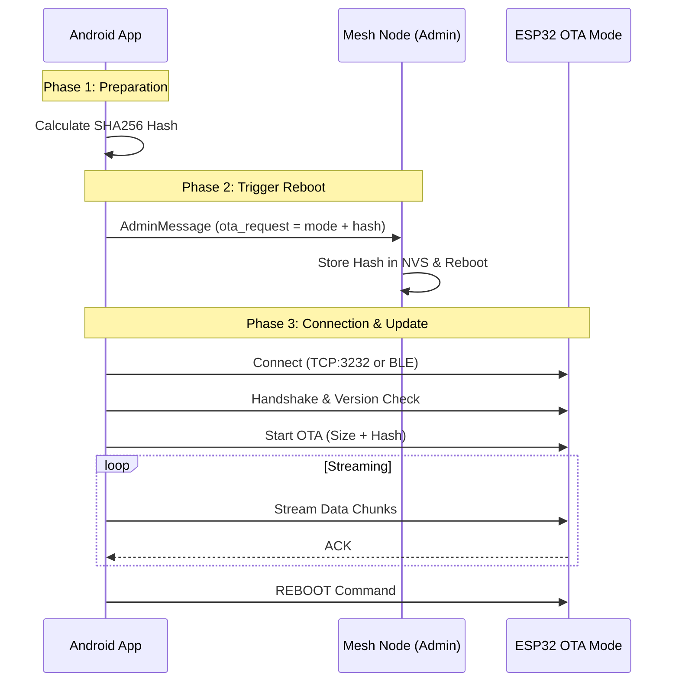
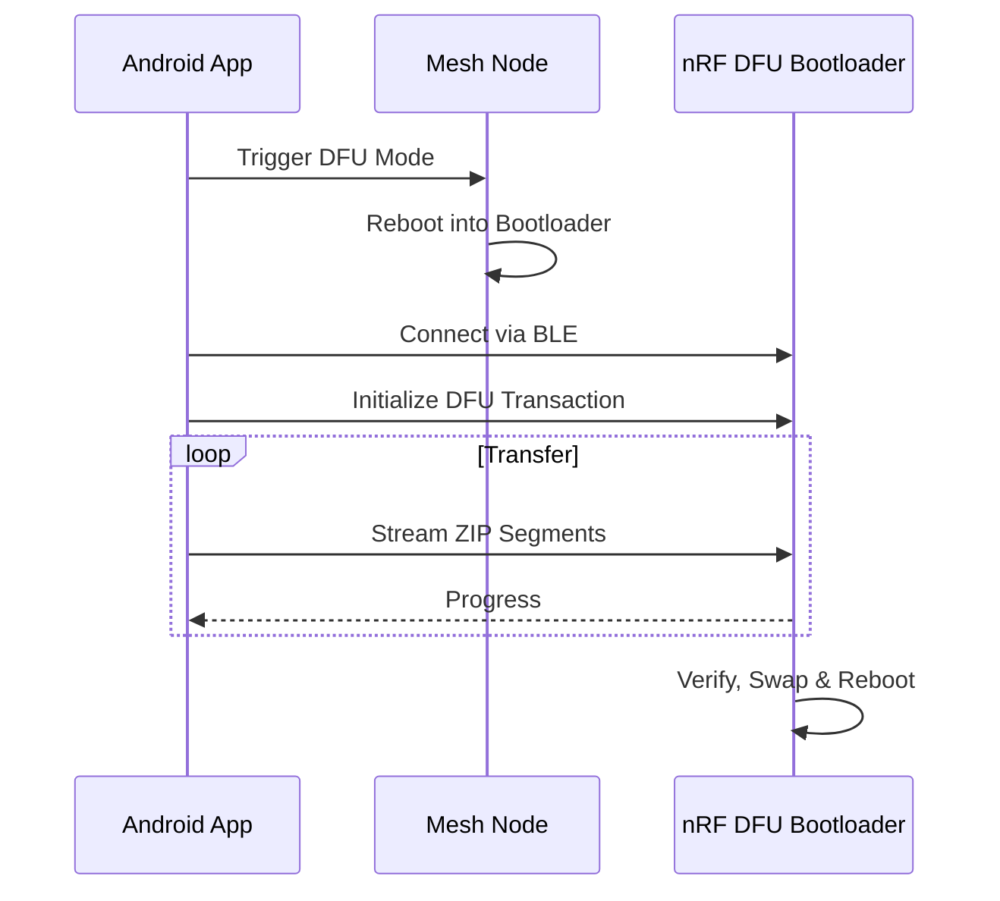
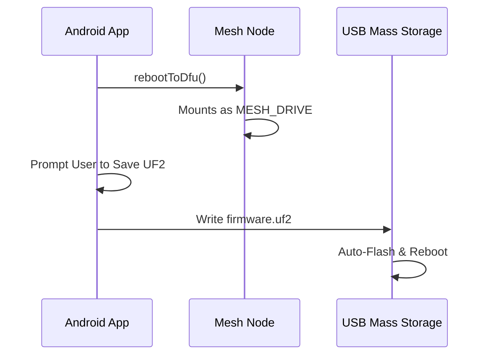
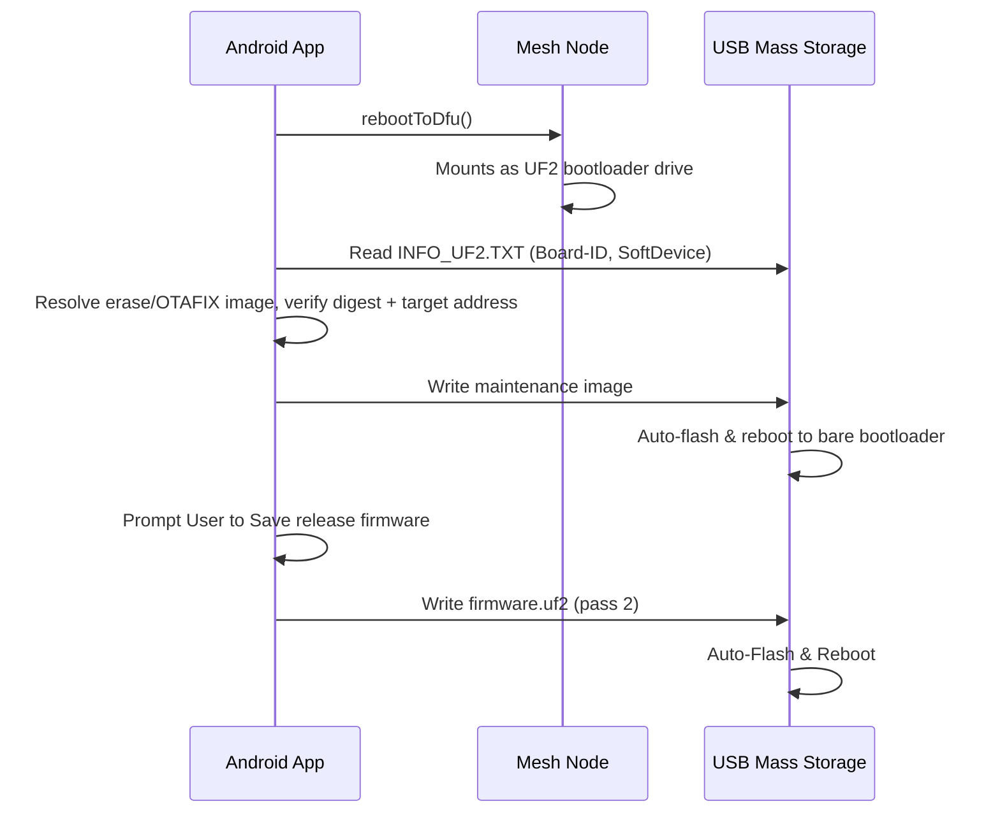

# `:feature:firmware`

## Firmware Update System

The `:feature:firmware` module provides a unified interface for updating Meshtastic devices across different platforms and connection types.

### Supported Platforms & Methods

Meshtastic-Android supports three primary firmware update flows:

#### 1. ESP32 Unified OTA (WiFi & BLE)
Used for modern ESP32 devices (e.g., Heltec V3, T-Beam S3). This method utilizes the **Unified OTA Protocol**, which enables high-speed transfers over TCP (port 3232) or BLE. The BLE transport uses the **Kable** multiplatform library for architectural consistency and modern coroutine support.

**Key Features:**
- **Pre-shared Hash Verification**: The app sends the firmware SHA256 hash in an initial `AdminMessage` trigger. The device stores this in NVS and verifies the incoming stream against it.
- **Connection Retry**: Robust logic to wait for the device to reboot and start the OTA listener.
- **Automatic MTU Handling & Fragmentation**: The BLE transport automatically detects the negotiated MTU and fragments data chunks into packets that fit. It carefully manages acknowledgments for each fragmented packet to ensure reliability even on congested connections.

```mermaid
sequenceDiagram
    participant App as Android App
    participant Radio as Mesh Node (Admin)
    participant OTA as ESP32 OTA Mode

    Note over App: Phase 1: Preparation
    App->>App: Calculate SHA256 Hash

    Note over App, Radio: Phase 2: Trigger Reboot
    App->>Radio: AdminMessage (ota_request = mode + hash)
    Radio->>Radio: Store Hash in NVS & Reboot

    Note over App, OTA: Phase 3: Connection & Update
    App->>OTA: Connect (TCP:3232 or BLE)
    App->>OTA: Handshake & Version Check
    App->>OTA: Start OTA (Size + Hash)
    loop Streaming
        App->>OTA: Stream Data Chunks
        OTA-->>App: ACK
    end
    App->>OTA: REBOOT Command
```

#### 2. nRF52 BLE DFU
The standard update method for nRF52-based devices (e.g., RAK4631). Uses a **pure KMP Nordic Secure DFU implementation** built on Kable — no dependency on the Nordic DFU library. The protocol stack (`SecureDfuTransport`, `SecureDfuProtocol`, `SecureDfuHandler`) handles DFU ZIP parsing, init packet validation, firmware streaming with CRC verification, and PRN-based flow control.

```mermaid
sequenceDiagram
    participant App as Android App
    participant Radio as Mesh Node
    participant DFU as nRF DFU Bootloader

    App->>Radio: Trigger DFU Mode
    Radio->>Radio: Reboot into Bootloader
    App->>DFU: Connect via BLE
    App->>DFU: Initialize DFU Transaction
    loop Transfer
        App->>DFU: Stream ZIP Segments
        DFU-->>App: Progress
    end
    DFU->>DFU: Verify, Swap & Reboot
```

#### 3. USB / UF2 (RP2040, nRF52, STM32)
For devices supporting USB Mass Storage updates. The app triggers the device into its native bootloader mode, then guides the user to save the UF2 firmware file to the mounted drive.

```mermaid
sequenceDiagram
    participant App as Android App
    participant Radio as Mesh Node
    participant USB as USB Mass Storage

    App->>Radio: rebootToDfu()
    Radio->>Radio: Mounts as MESH_DRIVE
    App->>App: Prompt User to Save UF2
    App->>USB: Write firmware.uf2
    USB->>USB: Auto-Flash & Reboot
```

#### 4. USB Maintenance: Factory Erase & OTAFIX Bootloader Upgrade
An nRF52/RP2040 device can also run a **factory erase** (wipes the internal filesystem, useful for a device stuck in a bad state or carrying stale event-firmware state) or, on boards OTAFIX ships a bootloader for, a **bootloader self-update**. The erase is reached through the update screen's "Erase device during update" opt-in (default off) rather than a standalone action, so a wipe always ends with the selected release installed; over BLE/WiFi the same opt-in instead sends an admin factory reset once the update is verified. Both USB flows are two-pass sequences: the maintenance image (erase or OTAFIX) is written first, which reboots the device back into a bare bootloader; the release firmware is then written as the second, ordinary UF2 pass.

Two runtime facts make the maintenance image itself safety-critical, not just another UF2 write:

- **The nRF52 erase image is SoftDevice-version-specific.** Writing the S140 6.1.1 image to a 7.3.0 device (or vice versa) corrupts the SoftDevice with no on-device recovery. `MaintenanceUf2.kt` treats the mounted volume's own `INFO_UF2.TXT` `SoftDevice:` line as authoritative over the bundled hardware-catalog hint — the two must agree, or the app refuses rather than guessing (`EraseImageResolution.Conflict`).
- **OTAFIX bootloaders are resolved by `Board-ID`, not by build target or USB VID/PID** — both of the latter collide across multiple boards. `otafixUf2ForBoardId()` looks up the exact bootloader image for the `Board-ID:` line the volume reports; the Meshtastic build-target name is only ever used to decide whether to *offer* the action in the UI.

```mermaid
sequenceDiagram
    participant App as Android App
    participant Radio as Mesh Node
    participant USB as USB Mass Storage

    App->>Radio: rebootToDfu()
    Radio->>Radio: Mounts as UF2 bootloader drive
    App->>USB: Read INFO_UF2.TXT (Board-ID, SoftDevice)
    App->>App: Resolve erase/OTAFIX image, verify digest + target address
    App->>USB: Write maintenance image
    USB->>USB: Auto-flash & reboot to bare bootloader
    App->>App: Prompt User to Save release firmware
    App->>USB: Write firmware.uf2 (pass 2)
    USB->>USB: Auto-Flash & Reboot
```

A `FirmwareMaintenanceLock` (`:core:common`) is held for the duration of the sequence so `SharedRadioInterfaceService`'s environmental-recovery listeners don't claim the erase firmware's bare CDC port out from under the flow; it is released when the sequence's terminal pass completes, fails, or the ViewModel is cleared mid-sequence.

### Key Classes

- `FirmwareUpdateManager.kt`: Top-level orchestrator for all firmware update flows.
- `FirmwareUpdateViewModel.kt`: UI state management (MVI pattern) for the firmware update screen.
- `FirmwareRetriever.kt`: Handles downloading and extracting firmware assets (ZIP/BIN/UF2) with manifest-based ESP32 resolution.
- `Esp32OtaUpdateHandler.kt`: Orchestrates the Unified OTA flow for ESP32 devices.
- `WifiOtaTransport.kt`: Implements the TCP transport logic for ESP32 OTA.
- `BleOtaTransport.kt`: Implements the BLE transport logic for ESP32 OTA using Kable.
- `UnifiedOtaProtocol.kt`: Shared OTA protocol framing (handshake, streaming, acknowledgment).
- `SecureDfuHandler.kt`: Orchestrates the nRF52 Secure DFU flow (bootloader entry, DFU ZIP parsing, firmware transfer).
- `SecureDfuProtocol.kt`: Low-level Nordic Secure DFU protocol operations (init packet, data transfer, CRC verification).
- `SecureDfuTransport.kt`: BLE transport layer for Secure DFU using Kable (control/data point characteristics, PRN flow control).
- `DfuZipParser.kt`: Parses Nordic DFU ZIP archives (manifest, init packet, firmware binary).
- `UsbUpdateHandler.kt`: Handles USB/UF2 firmware updates across platforms.
- `MaintenanceUf2.kt`: Pinned erase/OTAFIX image tables, `INFO_UF2.TXT` parsing (Board-ID, SoftDevice), and the drive-vs-map SoftDevice resolution used to pick a safe erase image.
- `UsbMaintenance.kt`: Pure gating (`usbMaintenanceGate`) and volume-inspection/image-choice types for the factory-erase and bootloader-upgrade actions.
- `UsbUpdateSupport.kt`: Sequences a maintenance pass (download → reboot to DFU → vet volume → write → confirm landed) and drives the two-pass state machine.

## Dependency Graph

<!--region graph-->

```mermaid
graph TB
  :feature:firmware[firmware]:::kmp-feature
  :feature:firmware -.-> :core:ble
  :feature:firmware -.-> :core:common
  :feature:firmware -.-> :core:data
  :feature:firmware -.-> :core:database
  :feature:firmware -.-> :core:datastore
  :feature:firmware -.-> :core:di
  :feature:firmware -.-> :core:model
  :feature:firmware -.-> :core:navigation
  :feature:firmware -.-> :core:network
  :feature:firmware -.-> :core:prefs
  :feature:firmware -.-> :core:repository
  :feature:firmware -.-> :core:service
  :feature:firmware -.-> :core:resources
  :feature:firmware -.-> :core:ui
  :feature:firmware -.-> :core:testing

classDef android-application fill:#CAFFBF,stroke:#000,stroke-width:2px,color:#000;
classDef android-application-compose fill:#CAFFBF,stroke:#000,stroke-width:2px,color:#000;
classDef compose-desktop-application fill:#CAFFBF,stroke:#000,stroke-width:2px,color:#000;
classDef android-feature fill:#FFD6A5,stroke:#000,stroke-width:2px,color:#000;
classDef android-library fill:#9BF6FF,stroke:#000,stroke-width:2px,color:#000;
classDef android-library-compose fill:#9BF6FF,stroke:#000,stroke-width:2px,color:#000;
classDef android-test fill:#A0C4FF,stroke:#000,stroke-width:2px,color:#000;
classDef jvm-library fill:#BDB2FF,stroke:#000,stroke-width:2px,color:#000;
classDef kmp-feature fill:#FFD6A5,stroke:#000,stroke-width:2px,color:#000;
classDef kmp-library-compose fill:#FFC1CC,stroke:#000,stroke-width:2px,color:#000;
classDef kmp-library fill:#FFC1CC,stroke:#000,stroke-width:2px,color:#000;
classDef unknown fill:#FFADAD,stroke:#000,stroke-width:2px,color:#000;

```
<!--endregion-->
