# `:feature:intro`

## Overview

**Targets:** Android · JVM (Desktop) · iOS

The `:feature:intro` module provides the onboarding experience for new users. It handles the initial welcome flow and requests mandatory permissions (Location, Bluetooth, Notifications).

## Key Components

### 1. `AppIntroductionScreen`
Orchestrates the multi-step onboarding process. The flow opens with `WelcomeScreen`, then steps through the permission screens below.

### 2. Permission Screens
Dedicated screens for explaining and requesting specific permissions:
- `LocationScreen`: Necessary for mapping and BLE scanning (on older Android versions).
- `BluetoothScreen`: Necessary for connecting to radios.
- `NotificationsScreen`: Necessary for foreground service and message alerts.
- `CriticalAlertsScreen`: Necessary for emergency alerts that bypass Do Not Disturb.

## Dependency Graph

```mermaid
graph TB
  :feature:intro[intro]:::kmp-feature
  :feature:intro -.-> :core:service
  :feature:intro -.-> :core:common
  :feature:intro -.-> :core:model
  :feature:intro -.-> :core:repository
  :feature:intro -.-> :core:ui
  :feature:intro -.-> :core:resources
  :feature:intro -.-> :core:testing

classDef android-application fill:#CAFFBF,stroke:#000,stroke-width:2px,color:#000;
classDef android-application-compose fill:#CAFFBF,stroke:#000,stroke-width:2px,color:#000;
classDef compose-desktop-application fill:#CAFFBF,stroke:#000,stroke-width:2px,color:#000;
classDef android-feature fill:#FFD6A5,stroke:#000,stroke-width:2px,color:#000;
classDef android-library fill:#9BF6FF,stroke:#000,stroke-width:2px,color:#000;
classDef android-library-compose fill:#9BF6FF,stroke:#000,stroke-width:2px,color:#000;
classDef android-test fill:#A0C4FF,stroke:#000,stroke-width:2px,color:#000;
classDef jvm-library fill:#BDB2FF,stroke:#000,stroke-width:2px,color:#000;
classDef kmp-feature fill:#FFD6A5,stroke:#000,stroke-width:2px,color:#000;
classDef kmp-library-compose fill:#FFC1CC,stroke:#000,stroke-width:2px,color:#000;
classDef kmp-library fill:#FFC1CC,stroke:#000,stroke-width:2px,color:#000;
classDef unknown fill:#FFADAD,stroke:#000,stroke-width:2px,color:#000;

```

<!--region graph-->

<!--endregion-->
