# `:feature:map`

## Overview
The `:feature:map` module provides the mapping interface for the application. Map rendering is decomposed into three focused `CompositionLocal` provider contracts, each with per-flavor implementations in `:app`.

## Architecture

### Provider Contracts (in `core:ui/commonMain`)

| Contract | Purpose | Implementations |
|---|---|---|
| `MapViewProvider` | Main map (nodes, waypoints, controls) | `GoogleMapViewProvider`, `FdroidMapViewProvider` |
| `NodeTrackMapProvider` | Per-node GPS track overlay (embedded in `PositionLogScreen`) | Google: `NodeTrackMap` → `MapView(GoogleMapMode.NodeTrack)`, F-Droid: `NodeTrackMap` → `NodeTrackOsmMap` |
| `TracerouteMapProvider` | Traceroute route visualization | Google: `TracerouteMap` → `MapView(GoogleMapMode.Traceroute)`, F-Droid: `TracerouteMap` → `TracerouteOsmMap` |

All providers are injected via `CompositionLocal` in `MainActivity.kt` and consumed by feature modules without direct dependency on Google Maps or osmdroid.

### Shared ViewModels (in `commonMain`)

- **`BaseMapViewModel`** — Core contract for all map state management, node markers, camera positions, and traceroute node selection logic (`TracerouteNodeSelection`, `tracerouteNodeSelection()`).
- **`NodeMapViewModel`** — Shared logic for per-node map views (track display, position history).

### Key Data Types

- **`TracerouteOverlay`** (`core:model/commonMain`) — Pure data class representing traceroute route segments. Extracted from `feature:map` for cross-module reuse.
- **`TracerouteNodeSelection`** (`feature:map/commonMain`) — Data class modeling node selection results during traceroute visualization.
- **`GeoConstants`** (`core:model/commonMain`) — Centralized geographic constants (`DEG_D`, `HEADING_DEG`, `EARTH_RADIUS_METERS`).

## Map Providers

- **Google Maps (`google` flavor)**: Uses Google Play Services Maps SDK. Implementations in `app/src/google/kotlin/org/meshtastic/app/map/`.
- **OpenStreetMap (`fdroid` flavor)**: Uses `osmdroid` for a fully open-source experience. Implementations in `app/src/fdroid/kotlin/org/meshtastic/app/map/`.

## Features
- **Live Node Tracking**: Real-time position updates for nodes on the mesh.
- **Waypoints**: Create and share points of interest.
- **Per-Node Track Overlay**: Embedded map in `PositionLogScreen` showing a node's GPS track history.
- **Traceroute Visualization**: Dedicated map view showing route segments between mesh nodes.
- **Offline Maps**: Support for pre-downloaded map tiles (via `osmdroid`).

## Module dependency graph

```mermaid
graph TB
  :feature:map[map]:::kmp-feature

classDef android-application fill:#CAFFBF,stroke:#000,stroke-width:2px,color:#000;
classDef android-application-compose fill:#CAFFBF,stroke:#000,stroke-width:2px,color:#000;
classDef compose-desktop-application fill:#CAFFBF,stroke:#000,stroke-width:2px,color:#000;
classDef android-feature fill:#FFD6A5,stroke:#000,stroke-width:2px,color:#000;
classDef android-library fill:#9BF6FF,stroke:#000,stroke-width:2px,color:#000;
classDef android-library-compose fill:#9BF6FF,stroke:#000,stroke-width:2px,color:#000;
classDef android-test fill:#A0C4FF,stroke:#000,stroke-width:2px,color:#000;
classDef jvm-library fill:#BDB2FF,stroke:#000,stroke-width:2px,color:#000;
classDef kmp-feature fill:#FFD6A5,stroke:#000,stroke-width:2px,color:#000;
classDef kmp-library-compose fill:#FFC1CC,stroke:#000,stroke-width:2px,color:#000;
classDef kmp-library fill:#FFC1CC,stroke:#000,stroke-width:2px,color:#000;
classDef unknown fill:#FFADAD,stroke:#000,stroke-width:2px,color:#000;

```

<!--region graph-->

<!--endregion-->
