# `:feature:map`

## Overview
The `:feature:map` module provides the mapping interface for the application. It supports multiple map providers and displays node positions, tracks, and waypoints.

## Key Components

### 1. `MapScreen`
The main mapping interface. It integrates with flavor-specific map implementations (Google Maps for `google`, OpenStreetMap for `fdroid`).

### 2. `BaseMapViewModel`
The base logic for managing map state, node markers, and camera positions.

## Map Providers

-   **Google Maps (`google` flavor)**: Uses Google Play Services Maps SDK.
-   **OpenStreetMap (`fdroid` flavor)**: Uses `osmdroid` for a fully open-source mapping experience.

## Features
- **Live Node Tracking**: Real-time position updates for nodes on the mesh.
- **Waypoints**: Create and share points of interest.
- **Offline Maps**: Support for pre-downloaded map tiles (via `osmdroid`).

## Module dependency graph

```mermaid
graph TB
  :feature:map[map]:::android-feature
  :feature:map -.-> :core:common
  :feature:map -.-> :core:data
  :feature:map -.-> :core:database
  :feature:map -.-> :core:datastore
  :feature:map -.-> :core:model
  :feature:map -.-> :core:navigation
  :feature:map -.-> :core:prefs
  :feature:map -.-> :core:proto
  :feature:map -.-> :core:service
  :feature:map -.-> :core:strings
  :feature:map -.-> :core:ui

classDef android-application fill:#CAFFBF,stroke:#000,stroke-width:2px,color:#000;
classDef android-application-compose fill:#CAFFBF,stroke:#000,stroke-width:2px,color:#000;
classDef android-feature fill:#FFD6A5,stroke:#000,stroke-width:2px,color:#000;
classDef android-library fill:#9BF6FF,stroke:#000,stroke-width:2px,color:#000;
classDef android-library-compose fill:#9BF6FF,stroke:#000,stroke-width:2px,color:#000;
classDef android-test fill:#A0C4FF,stroke:#000,stroke-width:2px,color:#000;
classDef jvm-library fill:#BDB2FF,stroke:#000,stroke-width:2px,color:#000;
classDef kmp-library fill:#FFC1CC,stroke:#000,stroke-width:2px,color:#000;
classDef unknown fill:#FFADAD,stroke:#000,stroke-width:2px,color:#000;

```

<!--region graph-->

<!--endregion-->
