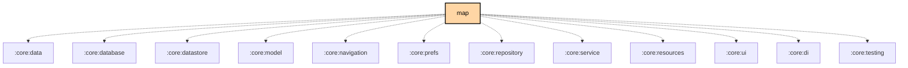

# `:feature:map`

## Overview
The `:feature:map` module provides the flavor- and platform-neutral mapping interface for the application: shared state, shared policy, and the waypoint editor. The rendering surfaces themselves live behind provider contracts with two implementations — Google Maps for the `google` flavor, and `:feature:map-maplibre` for the `fdroid` flavor and Desktop.

## Architecture

### Provider Contracts (in `core:ui/commonMain`)

`MapViewProvider` is a named interface (exposed via `LocalMapViewProvider`); the rest are `CompositionLocal`s in `core/ui/.../util/`.

| Contract | Purpose | Implementations |
|---|---|---|
| `MapViewProvider` | Main map (nodes, waypoints, controls) | Google: `GoogleMapViewProvider`, F-Droid + Desktop: `MapLibreMapViewProvider` |
| `LocalMapMainScreenProvider` | The Map tab itself, so the host decides what the tab renders | Both hosts provide `MapScreen` from this module; the flavor split happens below it, in `MapViewProvider` |
| `LocalNodeTrackMapProvider` | Per-node GPS track overlay (embedded in `PositionLogScreens.kt`, `feature:node`) | Google: `NodeTrackMap` → `MapView(GoogleMapMode.NodeTrack)`, F-Droid + Desktop: `NodeTrackMap` → `MapLibreNodeTrackMap` |
| `LocalTracerouteMapProvider` | Traceroute route visualization | Google: `TracerouteMap` → `MapView(GoogleMapMode.Traceroute)`, F-Droid: `TracerouteMap` → `MapLibreTracerouteMap`, Desktop: `DesktopTracerouteMap` |
| `LocalDiscoveryMapProvider` | Embedded discovery-scan map (node markers + topology polylines, `feature:discovery`) | Google: `DiscoveryMap` → `DiscoveryGoogleMap`, F-Droid + Desktop: `DiscoveryMap` → `MapLibreDiscoveryMap` |
| `LocalInlineMapProvider` | Node-detail mini-map | Google: `InlineMap` → `GoogleMap`, F-Droid + Desktop: `InlineMap` → `MapLibreInlineMap` |

All providers are injected via `CompositionLocal` — in `MainActivity.kt` on Android and in `desktopApp`'s `Main.kt` on Desktop — and consumed by feature modules without a direct dependency on Google Maps or MapLibre.

### Shared ViewModels (in `commonMain`)

- **`BaseMapViewModel`** — Core contract for all map state management, node markers, camera positions, and traceroute node selection logic (`TracerouteNodeSelection`, `tracerouteNodeSelection()`).
- **`NodeMapViewModel`** — Shared logic for per-node map views (track display, position history).

### Shared Logic (in `commonMain`)

Rules both renderers must agree on, so a behaviour difference between the flavors is a test failure rather than a bug report:

- **`MapNodePolicy`** — which nodes appear on the map at all, and their draw order.
- **`MapBounds`** — the bounding box to open on. Returns `null` rather than a box at (0, 0) when there is no position data.
- **`MapTimeWindows`** — the `LastHeardFilter` window test and the "just heard" pulse threshold, so both renderers filter tracks and pulse nodes on one definition.
- **`EditWaypointDialog`** (`commonMain/.../component/`) — the waypoint editor, on Material 3 date/time pickers so Desktop can create waypoints too.

### Key Data Types

- **`TracerouteOverlay`** (`core:model/commonMain`) — Pure data class representing traceroute route segments. Extracted from `feature:map` for cross-module reuse.
- **`TracerouteNodeSelection`** (`feature:map/commonMain`) — Data class modeling node selection results during traceroute visualization.
- **`GeoConstants`** (`core:model/commonMain`) — Centralized geographic constants (`DEG_D`, `HEADING_DEG`, `EARTH_RADIUS_METERS`).
- **`PositionPrecision`** (`core:model/commonMain/util/`) — `precisionRadiusMetersOrNull()`, the one definition of the position-precision circle radius both renderers draw.

## Map Providers

- **Google Maps (`google` flavor)**: Uses Google Play Services Maps SDK. Implementations in `androidApp/src/google/kotlin/org/meshtastic/app/map/`.
- **MapLibre (`fdroid` flavor and Desktop)**: Uses `maplibre-compose` for a fully open-source experience. The surfaces live in the multiplatform `:feature:map-maplibre` module and are shared verbatim by both hosts; the thin flavor-unified entry points that pick up Android-only extras (file-picker layer import, Site Planner) are in `androidApp/src/fdroid/kotlin/org/meshtastic/app/map/`. `osmdroid` is gone.

## Features
- **Live Node Tracking**: Real-time position updates for nodes on the mesh.
- **Waypoints**: Create and share points of interest.
- **Per-Node Track Overlay**: Embedded map in `PositionLogScreens.kt` (`feature:node`) showing a node's GPS track history.
- **Traceroute Visualization**: Dedicated map view showing route segments between mesh nodes.
- **Tile sources**: `MapTileCatalogue` in this module defines every raster base map and overlay — URL templates, zoom ranges, attribution — so both renderers draw the same set from one definition. `tileUrl()` resolves a single tile for renderers that ask per tile rather than taking a template (the Google map does; MapLibre substitutes its own).
- **Custom tile sources**: `CustomTileProviderConfig`, `CustomTileProviderRepository` and `CustomTileProviderManager` all live here, so Desktop offers them too. Local `.mbtiles` archives are Android-only, injected as a resolver rather than duplicated.
- **KML import**: `KmlToGeoJson` converts KML into the GeoJSON both renderers already draw, parsed with xmlutil so it is common code rather than Android's pull parser. A placemark's `<IconStyle><Icon><href>` becomes an `icon-url` property, and `geoJsonIconUrls` reads the distinct icons out of a finished document — MapLibre has to know a layer's images before it composes. `<GroundOverlay>` images come back beside the GeoJSON from `convertDocument` — an image draped over a box has no GeoJSON form — with their corners (rotation applied) computed by `corners()`, tested where the parser is. Recognising a KMZ and unpacking the zip stays with the host, which is the part that is genuinely a file.
- **Offline Maps**: Downloadable MapLibre offline packs, managed from the layers sheet in `:feature:map-maplibre`, and gated on `offlineMapsSupported` — the API compiles everywhere but only downloads on Android. The `google` flavor has no download; it imports pre-made MBTiles instead.

## Dependency Graph

<!--region graph-->

```mermaid
graph TB
  :feature:map[map]:::kmp-feature
  :feature:map -.-> :core:data
  :feature:map -.-> :core:database
  :feature:map -.-> :core:datastore
  :feature:map -.-> :core:model
  :feature:map -.-> :core:navigation
  :feature:map -.-> :core:prefs
  :feature:map -.-> :core:repository
  :feature:map -.-> :core:service
  :feature:map -.-> :core:resources
  :feature:map -.-> :core:ui
  :feature:map -.-> :core:di
  :feature:map -.-> :core:testing

classDef android-application fill:#CAFFBF,stroke:#000,stroke-width:2px,color:#000;
classDef android-application-compose fill:#CAFFBF,stroke:#000,stroke-width:2px,color:#000;
classDef compose-desktop-application fill:#CAFFBF,stroke:#000,stroke-width:2px,color:#000;
classDef android-feature fill:#FFD6A5,stroke:#000,stroke-width:2px,color:#000;
classDef android-library fill:#9BF6FF,stroke:#000,stroke-width:2px,color:#000;
classDef android-library-compose fill:#9BF6FF,stroke:#000,stroke-width:2px,color:#000;
classDef android-test fill:#A0C4FF,stroke:#000,stroke-width:2px,color:#000;
classDef jvm-library fill:#BDB2FF,stroke:#000,stroke-width:2px,color:#000;
classDef kmp-feature fill:#FFD6A5,stroke:#000,stroke-width:2px,color:#000;
classDef kmp-library-compose fill:#FFC1CC,stroke:#000,stroke-width:2px,color:#000;
classDef kmp-library fill:#FFC1CC,stroke:#000,stroke-width:2px,color:#000;
classDef unknown fill:#FFADAD,stroke:#000,stroke-width:2px,color:#000;

```
<!--endregion-->
