# `:feature:messaging`

## Overview
The `:feature:messaging` module handles the core communication features of the app, including text messages, direct messages (DMs), and channel-based chat.

## Key Components

### 1. `MessageViewModel`
Manages the state of the chat screen, including loading messages from the database, sending new messages, and handling message reactions.

### 2. `QuickChat`
A simplified chat interface for quickly sending and receiving messages without entering the full message screen.

### 3. Homoglyph substitution (payload-size optimization)
Uses `HomoglyphCharacterStringTransformer` (from `:core:common`) to optionally replace national-alphabet characters with visually identical Latin homoglyphs (e.g. Cyrillic "А" → Latin "A") on outgoing text. This is a preference-gated byte-size optimization — such characters encode smaller in UTF-8, fitting roughly 140-145 characters per message instead of ~115-120. It is not a security or anti-phishing feature.

## Features
- **Channel Chat**: Group communication on public or private channels.
- **Direct Messaging**: One-on-one encrypted communication between nodes.
- **Message Reactions**: Support for reacting to messages with emojis.
- **Delivery Status**: Indicators for "Sent", "Received", and "Read" (ACK/NACK).

## Dependency Graph

```mermaid
graph TB
  :feature:messaging[messaging]:::kmp-feature
  :feature:messaging -.-> :core:common
  :feature:messaging -.-> :core:data
  :feature:messaging -.-> :core:database
  :feature:messaging -.-> :core:domain
  :feature:messaging -.-> :core:model
  :feature:messaging -.-> :core:navigation
  :feature:messaging -.-> :core:prefs
  :feature:messaging -.-> :core:resources
  :feature:messaging -.-> :core:service
  :feature:messaging -.-> :core:ui
  :feature:messaging -.-> :core:testing

classDef android-application fill:#CAFFBF,stroke:#000,stroke-width:2px,color:#000;
classDef android-application-compose fill:#CAFFBF,stroke:#000,stroke-width:2px,color:#000;
classDef compose-desktop-application fill:#CAFFBF,stroke:#000,stroke-width:2px,color:#000;
classDef android-feature fill:#FFD6A5,stroke:#000,stroke-width:2px,color:#000;
classDef android-library fill:#9BF6FF,stroke:#000,stroke-width:2px,color:#000;
classDef android-library-compose fill:#9BF6FF,stroke:#000,stroke-width:2px,color:#000;
classDef android-test fill:#A0C4FF,stroke:#000,stroke-width:2px,color:#000;
classDef jvm-library fill:#BDB2FF,stroke:#000,stroke-width:2px,color:#000;
classDef kmp-feature fill:#FFD6A5,stroke:#000,stroke-width:2px,color:#000;
classDef kmp-library-compose fill:#FFC1CC,stroke:#000,stroke-width:2px,color:#000;
classDef kmp-library fill:#FFC1CC,stroke:#000,stroke-width:2px,color:#000;
classDef unknown fill:#FFADAD,stroke:#000,stroke-width:2px,color:#000;

```

<!--region graph-->

<!--endregion-->
