# `:feature:messaging`

## Overview
The `:feature:messaging` module handles the core communication features of the app, including text messages, direct messages (DMs), and channel-based chat.

## Key Components

### 1. `MessageViewModel`
Manages the state of the chat screen, including loading messages from the database, sending new messages, and handling message reactions.

### 2. `QuickChat`
A simplified chat interface for quickly sending and receiving messages without entering the full message screen.

### 3. `HomoglyphCharacterStringTransformer`
A security-focused utility that detects and transforms homoglyphs (visually similar characters from different scripts) to prevent phishing and impersonation attacks.

## Features
- **Channel Chat**: Group communication on public or private channels.
- **Direct Messaging**: One-on-one encrypted communication between nodes.
- **Message Reactions**: Support for reacting to messages with emojis.
- **Delivery Status**: Indicators for "Sent", "Received", and "Read" (ACK/NACK).

## Module dependency graph

```mermaid
graph TB
  :feature:messaging[messaging]:::android-feature

classDef android-application fill:#CAFFBF,stroke:#000,stroke-width:2px,color:#000;
classDef android-application-compose fill:#CAFFBF,stroke:#000,stroke-width:2px,color:#000;
classDef android-feature fill:#FFD6A5,stroke:#000,stroke-width:2px,color:#000;
classDef android-library fill:#9BF6FF,stroke:#000,stroke-width:2px,color:#000;
classDef android-library-compose fill:#9BF6FF,stroke:#000,stroke-width:2px,color:#000;
classDef android-test fill:#A0C4FF,stroke:#000,stroke-width:2px,color:#000;
classDef jvm-library fill:#BDB2FF,stroke:#000,stroke-width:2px,color:#000;
classDef kmp-library fill:#FFC1CC,stroke:#000,stroke-width:2px,color:#000;
classDef unknown fill:#FFADAD,stroke:#000,stroke-width:2px,color:#000;

```

<!--region graph-->

<!--endregion-->
