# `:feature:node`

## Overview
The `:feature:node` module handles node-centric features, including the node list, detailed node information, telemetry charts, and the compass.

## Key Components

### 1. `NodeListScreen`
Displays all nodes currently known to the application.

### 2. `NodeDetailScreen`
Shows exhaustive details for a specific node, including hardware info, position history, and last heard status.

### 3. `MetricsViewModel`
Manages the retrieval and display of telemetry data (e.g., battery, SNR, environment metrics) using charts.

### 4. `CompassViewModel`
Provides a compass interface to show the relative direction and distance to other nodes.

## Module dependency graph

```mermaid
graph TB
  :feature:node[node]:::kmp-feature

classDef android-application fill:#CAFFBF,stroke:#000,stroke-width:2px,color:#000;
classDef android-application-compose fill:#CAFFBF,stroke:#000,stroke-width:2px,color:#000;
classDef compose-desktop-application fill:#CAFFBF,stroke:#000,stroke-width:2px,color:#000;
classDef android-feature fill:#FFD6A5,stroke:#000,stroke-width:2px,color:#000;
classDef android-library fill:#9BF6FF,stroke:#000,stroke-width:2px,color:#000;
classDef android-library-compose fill:#9BF6FF,stroke:#000,stroke-width:2px,color:#000;
classDef android-test fill:#A0C4FF,stroke:#000,stroke-width:2px,color:#000;
classDef jvm-library fill:#BDB2FF,stroke:#000,stroke-width:2px,color:#000;
classDef kmp-feature fill:#FFD6A5,stroke:#000,stroke-width:2px,color:#000;
classDef kmp-library fill:#FFC1CC,stroke:#000,stroke-width:2px,color:#000;
classDef unknown fill:#FFADAD,stroke:#000,stroke-width:2px,color:#000;

```

<!--region graph-->

<!--endregion-->
