# `:feature:settings`

## Overview
The `:feature:settings` module manages all application and radio-side configurations. This includes user preferences, channel configuration, and advanced radio settings.

## Key Components

### 1. `SettingsScreen`
The main entry point for application-wide settings.

### 2. `RadioConfigViewModel`
Handles the complex logic of reading and writing configuration to the Meshtastic device over the radio link (BLE, USB, or TCP).

### 3. `AboutScreen`
Displays version information, licenses, and project links.

## Features
- **Channel Configuration**: Manage encryption keys, channel names, and radio frequency settings.
- **Node Database Management**: Options to clear or prune the local and remote node databases.
- **App Preferences**: Theme selection, unit system (metric/imperial), and notification settings.

## Module dependency graph

```mermaid
graph TB
  :feature:settings[settings]:::android-feature
  :feature:settings -.-> :core:common
  :feature:settings -.-> :core:data
  :feature:settings -.-> :core:database
  :feature:settings -.-> :core:datastore
  :feature:settings -.-> :core:model
  :feature:settings -.-> :core:navigation
  :feature:settings -.-> :core:nfc
  :feature:settings -.-> :core:prefs
  :feature:settings -.-> :core:proto
  :feature:settings -.-> :core:service
  :feature:settings -.-> :core:resources
  :feature:settings -.-> :core:ui
  :feature:settings -.-> :core:barcode

classDef android-application fill:#CAFFBF,stroke:#000,stroke-width:2px,color:#000;
classDef android-application-compose fill:#CAFFBF,stroke:#000,stroke-width:2px,color:#000;
classDef android-feature fill:#FFD6A5,stroke:#000,stroke-width:2px,color:#000;
classDef android-library fill:#9BF6FF,stroke:#000,stroke-width:2px,color:#000;
classDef android-library-compose fill:#9BF6FF,stroke:#000,stroke-width:2px,color:#000;
classDef android-test fill:#A0C4FF,stroke:#000,stroke-width:2px,color:#000;
classDef jvm-library fill:#BDB2FF,stroke:#000,stroke-width:2px,color:#000;
classDef kmp-library fill:#FFC1CC,stroke:#000,stroke-width:2px,color:#000;
classDef unknown fill:#FFADAD,stroke:#000,stroke-width:2px,color:#000;

```

<!--region graph-->

<!--endregion-->
