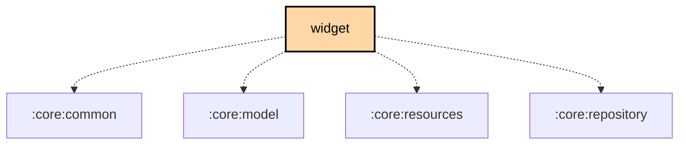

# `:feature:widget`

## Overview

The `:feature:widget` module is an **Android-only Jetpack Glance home-screen widget** (API 26+). It exposes a single widget — `LocalStatsWidget` — that displays live mesh statistics sourced from the running Meshtastic service.

**Target: Android only** (not KMP — uses `meshtastic.android.library` + `meshtastic.android.library.compose` convention plugins)

## Key Responsibilities

- Display live mesh statistics on the Android home screen via Jetpack Glance
- Combine four reactive data sources into a single `StateFlow<LocalStatsWidgetUiState>` for efficient re-renders
- Support three responsive widget sizes: small square, wide rectangle, and large square
- Fulfil the `AppWidgetUpdater` interface from `:core:repository` so the mesh service can trigger widget refreshes without depending on Android widget APIs

## Source Structure

```
src/main/kotlin/org/meshtastic/feature/widget/
├── LocalStatsWidget.kt              ← GlanceAppWidget, 3 responsive sizes
├── LocalStatsWidgetReceiver.kt      ← GlanceAppWidgetReceiver
├── LocalStatsWidgetState.kt         ← LocalStatsWidgetUiState + StateProvider
├── AndroidAppWidgetUpdater.kt       ← implements AppWidgetUpdater (core:repository)
├── RefreshLocalStatsAction.kt       ← GlanceActionCallback (refresh button)
└── di/
    └── FeatureWidgetModule.kt
```

## Widget Content

The widget shows the following information when connected:

| Section | Data shown |
|---|---|
| Node identity | Short name chip with node colours |
| Battery | Level percentage + progress bar |
| Channel utilization | Percentage + progress bar |
| Air utilization | Percentage + progress bar |
| Traffic | TX / RX packet counts, duplicates, relay TX, relay cancelled, dropped, bad RX |
| Diagnostics | Noise floor (dBm), free heap / total heap |
| Footer | Online nodes / total nodes, device uptime, last-updated timestamp |

When disconnected, the widget shows a "Not Connected" state with the last-known node name.

## Key Types

### `LocalStatsWidgetUiState`

```kotlin
data class LocalStatsWidgetUiState(
    val connectionState: ConnectionState,
    val isConnecting: Boolean,
    val showContent: Boolean,
    // Node identity
    val nodeShortName: String?,
    val nodeColors: Pair<Int, Int>?,
    // Battery
    val batteryLevel: Int?,
    val hasBattery: Boolean,
    // Utilization
    val channelUtilization: Float,
    val airUtilization: Float,
    // Traffic counters
    val numPacketsTx: Int, val numPacketsRx: Int,
    val numRxDupe: Int, val numTxRelay: Int, val numTxRelayCanceled: Int,
    val numTxDropped: Int, val numPacketsRxBad: Int,
    // Diagnostics
    val noiseFloor: Int?,
    val heapFreeBytes: Long, val heapTotalBytes: Long,
    // Footer
    val totalNodes: Int, val onlineNodes: Int,
    val uptimeSecs: Int?,
    val updateTimeMillis: Long,
)
```

### `LocalStatsWidgetStateProvider`

Koin `@Single` that eagerly combines four reactive flows (`ConnectionStateProvider` is injected as the constructor param `connectionStateProvider`):
- `ConnectionStateProvider.connectionState`
- `NodeRepository.nodeDBbyNum` (online/total counts)
- `NodeRepository.localStats`
- `NodeRepository.ourNodeInfo`

```kotlin
val state: StateFlow<LocalStatsWidgetUiState>
```

### `LocalStatsWidget`

```kotlin
class LocalStatsWidget : GlanceAppWidget(), KoinComponent {
    override val sizeMode = SizeMode.Responsive(
        setOf(DpSize(100.dp, 100.dp), DpSize(250.dp, 100.dp), DpSize(250.dp, 250.dp))
    )
}
```

Tapping the widget opens the app. The refresh button fires `RefreshLocalStatsAction`, which calls `AppWidgetUpdater.updateAll()`.

## `AppWidgetUpdater` integration

The mesh service holds a reference to `AppWidgetUpdater` (defined in `:core:repository`) without depending on Android widget APIs. `AndroidAppWidgetUpdater` in this module provides the concrete implementation:

```kotlin
// Simplified — the real updateAll() wraps the call in a try/catch
@Single
class AndroidAppWidgetUpdater(
    private val context: Context,
    stateProvider: LocalStatsWidgetStateProvider,
) : AppWidgetUpdater {
    override suspend fun updateAll() {
        LocalStatsWidget().updateAll(context)
    }
}
```

It also observes `stateProvider.state` itself (debounced 500 ms, ignoring timestamp-only changes) and re-renders whenever widget instances exist — Glance compositions are ephemeral, so re-renders must be driven externally. This keeps the service layer platform-agnostic while still enabling widget refresh on data changes.

## Dependency Graph

### Key Dependencies

```text
feature:widget (Android only)
  ├── core:common, core:model, core:resources, core:repository
  ├── androidx.glance.appwidget, glance.material3, glance.preview, glance.appwidget.preview
  └── compose.multiplatform.ui (LocalConfiguration, LocalDensity)
```

<!--region graph-->

<!--endregion-->
