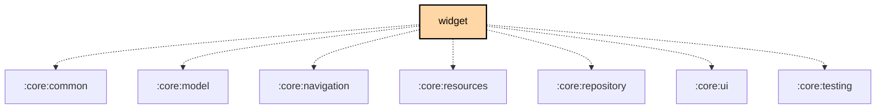

# `:feature:widget`

## Overview

The `:feature:widget` module holds the **Android-only Jetpack Glance home-screen widgets** (API 26+):

- `LocalStatsWidget` shows live mesh statistics for the connected node.
- `NodeTrackerWidget` follows one node the user picks: battery, signal, last heard, hops away and distance from our node.

**Target: Android only** (not KMP — uses `meshtastic.android.library` + `meshtastic.android.library.compose` convention plugins)

## Key Responsibilities

- Display live mesh statistics and a tracked node on the Android home screen via Jetpack Glance
- Combine four reactive data sources into a single `StateFlow<LocalStatsWidgetUiState>` for efficient re-renders
- Pick the tracked node in `NodeTrackerConfigActivity`, the widget's configuration activity, and store it per instance in Glance state
- Fulfill the `AppWidgetUpdater` interface from `:core:repository` so the mesh service can trigger widget refreshes without depending on Android widget APIs

## Source Structure

```text
src/main/kotlin/org/meshtastic/feature/widget/
├── WidgetSizes.kt                   ← size thresholds, line budget and type scale shared by both widgets
├── WidgetComponents.kt              ← brand header, identity row, stat and bar rows, status body
├── LocalStatsWidget.kt              ← GlanceAppWidget, header and refresh
├── LocalStatsLayouts.kt             ← one layout per breakpoint
├── LocalStatsWidgetReceiver.kt      ← GlanceAppWidgetReceiver
├── LocalStatsWidgetState.kt         ← LocalStatsWidgetUiState + StateProvider
├── NodeTrackerWidget.kt             ← GlanceAppWidget, readings, not-found state
├── NodeTrackerLayouts.kt            ← one layout per breakpoint
├── NodeTrackerWidgetReceiver.kt     ← GlanceAppWidgetReceiver
├── NodeTrackerWidgetState.kt        ← NodeTrackerWidgetState, nodeTrackerState(), DataSource
├── NodeTrackerConfigActivity.kt     ← APPWIDGET_CONFIGURE node picker (Compose, Material 3)
├── NodeTrackerCandidates.kt         ← picker filter and order
├── WidgetNodeChip.kt                ← node chip shared by both widgets
├── AndroidAppWidgetUpdater.kt       ← implements AppWidgetUpdater (core:repository)
├── RefreshLocalStatsAction.kt       ← ActionCallback (refresh button)
├── WidgetResourceEnvironment.kt     ← bridges Compose resources into Glance
└── di/
    └── FeatureWidgetModule.kt
```

## Node Tracker

Each instance stores its node number under `TRACKED_NODE_NUM_KEY` in its Glance Preferences state, and the last reading it rendered from a node DB under the `last_known_*` keys, which it shows dimmed while no node DB is open. `NodeTrackerConfigActivity` writes it, from the launcher's `APPWIDGET_CONFIGURE` on placement or reconfiguration (`widgetFeatures="reconfigurable"`), or from the widget's own "Node not found" state. The activity is exported for the launcher, so it honors only widget ids bound to `NodeTrackerWidgetReceiver`, and it returns `RESULT_CANCELED` unless a node is picked.

| Size | Data shown |
|---|---|
| Under 90 dp tall (one landscape row) | Mark, node chip, battery, long name, last heard; wide adds hops |
| 90 to 180 dp tall (2x1 portrait on a Pixel) | Compact header, chip and battery, long name beside last heard; wide adds hops |
| Two rows and up | Header, chip and battery, long name (two lines when the readings leave a line over), then the first four of last heard, hops, distance (only while connected), SNR and RSSI (direct, non-MQTT nodes only); three rows show all five at the default font scale (a larger font drops lines, and from four cells wide columns), and four cells wide lays them out two to a line |

`nodeTrackerState()` maps the node DB to what one instance renders. A node not heard within the app's online window keeps its chip colors and greys its values; the provider's 30-minute `updatePeriodMillis` re-renders a node that has gone quiet. Tapping opens the node's details through the `nodes/<num>` deep link. The picker lists favorites first, then the most recently heard, leaving out our own node and ignored nodes.

The widget holds no lazy collection, which the `ActionTrampolineActivity` removal in `androidApp/src/main/AndroidManifest.xml` relies on.

## Local Stats Content

The widget shows the following information when connected:

| Section | Data shown |
|---|---|
| Node identity | Short name chip with node colors, battery as the hero value |
| Channel utilization | Percentage + progress bar |
| Air utilization | Percentage + progress bar |
| Readings | Nodes online / total, uptime to the minute, sent, received, noise floor, free memory, relayed, bad, dropped, relays canceled, in that order; the last-updated time at any three-row size |

The readings fill a grid: one column up to three cells wide, two columns from four (the width counted in font-scaled dp, so a large font keeps one column), with as many lines as the cell's real height holds once the header, identity row and bars (stacked at two cells wide) are taken out (`WidgetSizes.lines`, which scales the text rows and the lines by the font scale so a large font drops a line instead of clipping one). A cell whose lines hold every reading in one column uses one, whatever its width. Nodes online moves into the identity row from three cells wide. When the readings run out before the lines do, the lines spread across the leftover height; otherwise what is left, under a line, sits under them. One row shows the mark, chip, battery and channel utilization, plus nodes online when wide. The refresh button sits in the header only at two rows and two-plus cells wide, where the title leaves room for it; elsewhere tapping the widget opens the app.

Both widgets share one design: a header with the theme-tinted Meshtastic mark and the widget's name (one-row sizes lead their row with the mark instead), the node chip with battery beside it, and the same stat rows and type scale (`WidgetSizes.Type`). A stale tracked node keeps its chip colors and greys its values.

When not connected, the widget shows the app icon (a progress spinner while connecting) and the connection status: **Disconnected**, **Connecting**, or **Device sleeping**.

## Key Types

### `LocalStatsWidgetUiState`

```kotlin
data class LocalStatsWidgetUiState(
    val connectionState: ConnectionState,
    val isConnecting: Boolean,
    val showContent: Boolean,
    // Node identity
    val nodeShortName: String?,
    val nodeColors: Pair<Int, Int>?,
    // Battery
    val batteryLevel: Int,
    val hasBattery: Boolean,
    // Utilization
    val channelUtilization: Float, val channelUtilizationProgress: Float,
    val airUtilization: Float, val airUtilizationProgress: Float,
    // Traffic counters
    val hasStats: Boolean,
    val numPacketsTx: Int, val numPacketsRx: Int,
    val numTxRelay: Int, val numTxRelayCanceled: Int,
    val numTxDropped: Int, val numPacketsRxBad: Int,
    // Diagnostics
    val noiseFloor: Int?,
    val heapFreeBytes: Int, val heapTotalBytes: Int,
    // Footer
    val totalNodes: Int, val onlineNodes: Int,
    val uptimeSecs: Long,
    val updateTimeMillis: Long,
)
```

Every field has a default in the source; the listing leaves them out. Until the node has sent `LocalStats` (`hasStats` false), utilization and uptime fall back to the node's own device metrics.

### `LocalStatsWidgetStateProvider`

Koin `@Single` that eagerly combines four reactive flows (`ConnectionStateProvider` is injected as the constructor param `connectionStateProvider`):
- `ConnectionStateProvider.connectionState`
- `NodeRepository.nodeDBbyNum` (online/total counts)
- `NodeRepository.localStats`
- `NodeRepository.ourNodeInfo`

```kotlin
val state: StateFlow<LocalStatsWidgetUiState>
```

### `LocalStatsWidget`

```kotlin
class LocalStatsWidget : GlanceAppWidget(), KoinComponent {
    override val sizeMode: SizeMode = WidgetSizes.sizeMode
}
```

### `WidgetSizes`

Both widgets compose under `SizeMode.Responsive`: the launcher picks the breakpoint that fits the cell (three widths, 130, 200 and 320 dp, at five heights, 48, 90, 180, 260 and 350 dp, every combination, since a missing one would route a 4x3 cell to a two-row tier), and `WidgetSizes.cell` reads the cell's real bounds from the widget options as `AppWidgetManager` holds them now (Glance's own copy refreshes only on the launcher's options broadcast, which a resize does not always send) (min width by max height is the portrait cell, max width by min height the landscape one), taking the current orientation's cell when the breakpoint fits in it and the other's when it fits there, so the tall layouts count their reading lines from the height they really have. `SizeMode.Exact` would hand the real bounds over directly, but it composes only for the sizes the launcher reports, and a Pixel launcher that reported stale sizes after a resize showed the compact layout in a four-row cell. A stale option under `Responsive` costs slack, never the wrong layout, and the cell is capped at the next breakpoint in each direction, so the layout the launcher shows between a resize and the recomposition it triggers was counted for a cell of its own tier. Each threshold sits just under the smallest cell span it catches. On a Pixel 6a a 2x2 widget measures 179x202 dp in portrait and 394x107 dp in landscape; on the API 36 emulator's Pixel launcher 2x2 is 172x234 dp and a row is 117 dp. The picker preview has no cell to read, so `previewSizeMode` is a smaller `Responsive` set with two measured 2x2 cells added. Both providers set `targetCellWidth`/`targetCellHeight` to 2x2 and `minResizeHeight` to one row.

Tapping the Local Stats widget opens the app. The refresh button fires `RefreshLocalStatsAction`, which asks the local node for fresh `LOCAL_STATS` and `DEVICE` telemetry through `CommandSender`; the new values then reach the widget through the state flow. A rejected or unanswerable request is logged and skipped.

Glance doesn't provide the Compose UI locals that Compose Multiplatform's `stringResource` reads, so `WidgetResourceEnvironment` bridges them into the widget's composition; every translated string in the widget depends on it. A composition failure shows the `widget_composition_error` layout through `onCompositionError` instead of crashing the app.

## `AppWidgetUpdater` integration

The mesh service holds a reference to `AppWidgetUpdater` (defined in `:core:repository`) without depending on Android widget APIs. `AndroidAppWidgetUpdater` in this module provides the concrete implementation:

```kotlin
// Simplified — the real update wraps each call in a try/catch
@Single
class AndroidAppWidgetUpdater(
    private val context: Context,
    stateProvider: LocalStatsWidgetStateProvider,
    trackerDataSource: NodeTrackerWidgetDataSource,
) : AppWidgetUpdater {
    override suspend fun updateAll() {
        LocalStatsWidget().updateAll(context)
        NodeTrackerWidget().updateAll(context)
    }
}
```

It also drives re-renders itself, because Glance compositions are ephemeral:

- Local Stats: observes `stateProvider.state` (debounced 500 ms, ignoring timestamp-only changes) while instances exist.
- Node Tracker: samples `trackerDataSource.inputs` once a second, maps it to each instance's rendered state, and updates only when one of those changes. Sampling rather than debouncing keeps a busy mesh from starving the update.

This keeps the service layer platform-agnostic while still enabling widget refresh on data changes.

## Dependency Graph

### Key Dependencies

```text
feature:widget (Android only)
  ├── core:common, core:model, core:navigation, core:resources, core:repository, core:ui
  ├── androidx.glance.appwidget, glance.material3, glance.preview, glance.appwidget.preview
  ├── androidx.activity.compose, compose.multiplatform.material3 (NodeTrackerConfigActivity)
  ├── compose.multiplatform.ui (LocalConfiguration, LocalDensity), compose.multiplatform.resources
  └── kermit
```

## Testing

This is a plain Android library, so its unit tests run under `./gradlew :feature:widget:testDebugUnitTest` (or the root `test` task), with Robolectric and Glance's testing artifacts.

<!--region graph-->

```mermaid
graph TB
  :feature:widget[widget]:::android-feature
  :feature:widget -.-> :core:common
  :feature:widget -.-> :core:model
  :feature:widget -.-> :core:navigation
  :feature:widget -.-> :core:resources
  :feature:widget -.-> :core:repository
  :feature:widget -.-> :core:ui
  :feature:widget -.-> :core:testing

classDef android-application fill:#CAFFBF,stroke:#000,stroke-width:2px,color:#000;
classDef android-application-compose fill:#CAFFBF,stroke:#000,stroke-width:2px,color:#000;
classDef compose-desktop-application fill:#CAFFBF,stroke:#000,stroke-width:2px,color:#000;
classDef android-feature fill:#FFD6A5,stroke:#000,stroke-width:2px,color:#000;
classDef android-library fill:#9BF6FF,stroke:#000,stroke-width:2px,color:#000;
classDef android-library-compose fill:#9BF6FF,stroke:#000,stroke-width:2px,color:#000;
classDef android-test fill:#A0C4FF,stroke:#000,stroke-width:2px,color:#000;
classDef jvm-library fill:#BDB2FF,stroke:#000,stroke-width:2px,color:#000;
classDef kmp-feature fill:#FFD6A5,stroke:#000,stroke-width:2px,color:#000;
classDef kmp-library-compose fill:#FFC1CC,stroke:#000,stroke-width:2px,color:#000;
classDef kmp-library fill:#FFC1CC,stroke:#000,stroke-width:2px,color:#000;
classDef unknown fill:#FFADAD,stroke:#000,stroke-width:2px,color:#000;

```
<!--endregion-->
