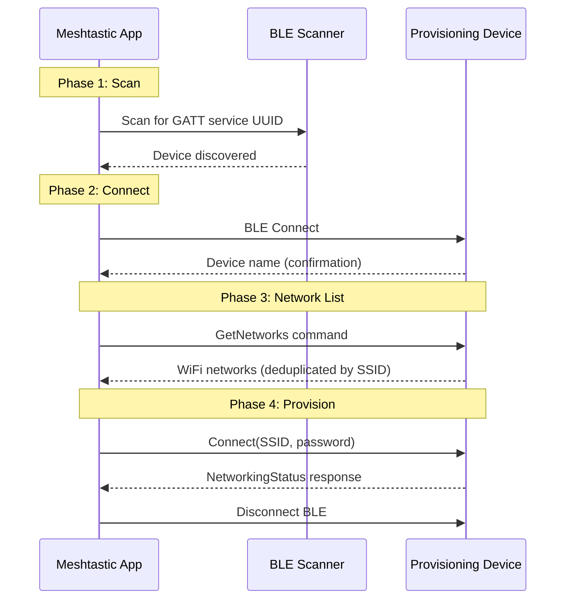

# `:feature:wifi-provision`

## Module dependency graph

```mermaid
graph TB
  :feature:wifi-provision[wifi-provision]:::kmp-feature

classDef android-application fill:#CAFFBF,stroke:#000,stroke-width:2px,color:#000;
classDef android-application-compose fill:#CAFFBF,stroke:#000,stroke-width:2px,color:#000;
classDef compose-desktop-application fill:#CAFFBF,stroke:#000,stroke-width:2px,color:#000;
classDef android-feature fill:#FFD6A5,stroke:#000,stroke-width:2px,color:#000;
classDef android-library fill:#9BF6FF,stroke:#000,stroke-width:2px,color:#000;
classDef android-library-compose fill:#9BF6FF,stroke:#000,stroke-width:2px,color:#000;
classDef android-test fill:#A0C4FF,stroke:#000,stroke-width:2px,color:#000;
classDef jvm-library fill:#BDB2FF,stroke:#000,stroke-width:2px,color:#000;
classDef kmp-feature fill:#FFD6A5,stroke:#000,stroke-width:2px,color:#000;
classDef kmp-library-compose fill:#FFC1CC,stroke:#000,stroke-width:2px,color:#000;
classDef kmp-library fill:#FFC1CC,stroke:#000,stroke-width:2px,color:#000;
classDef unknown fill:#FFADAD,stroke:#000,stroke-width:2px,color:#000;

```

<!--region graph-->

<!--endregion-->

## WiFi Provisioning System — for mPWRD-OS

The `:feature:wifi-provision` module provides BLE-based WiFi provisioning for [mPWRD-OS](https://github.com/mPWRD-OS/mPWRD-OS) devices using the Nymea network manager protocol. mPWRD-OS is a community project that combines Armbian and Meshtastic for Linux-native mesh networking hardware. This module scans for provisioning-capable devices, retrieves available WiFi networks, and applies credentials — all over BLE via the Kable multiplatform library.

### Architecture

- **Protocol:** Nymea BLE network manager (GATT service `e081fec0-f757-4449-b9c9-bfa83133f7fc`)
- **Transport:** BLE via `core:ble` Kable abstractions with chunked packet codec
- **UI:** Single-screen Material 3 Expressive flow with 6 phases (Idle, ConnectingBle, DeviceFound, LoadingNetworks, Connected, Provisioning)

### Key Classes

- `WifiProvisionViewModel.kt`: MVI state machine with 6 phases and SSID deduplication.
- `WifiProvisionScreen.kt`: Material 3 Expressive single-screen UI with Crossfade transitions.
- `NymeaWifiService.kt`: BLE service layer — connect, scan networks, provision, close.
- `NymeaPacketCodec.kt`: Chunked BLE packet encoder/decoder with reassembly.
- `NymeaProtocol.kt`: JSON serialization for Nymea network manager commands and responses.
- `ProvisionStatusCard.kt`: Inline status feedback card (idle/success/failed) with Material 3 colors.
