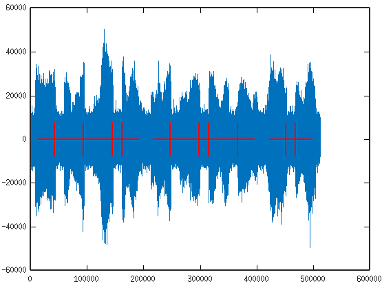
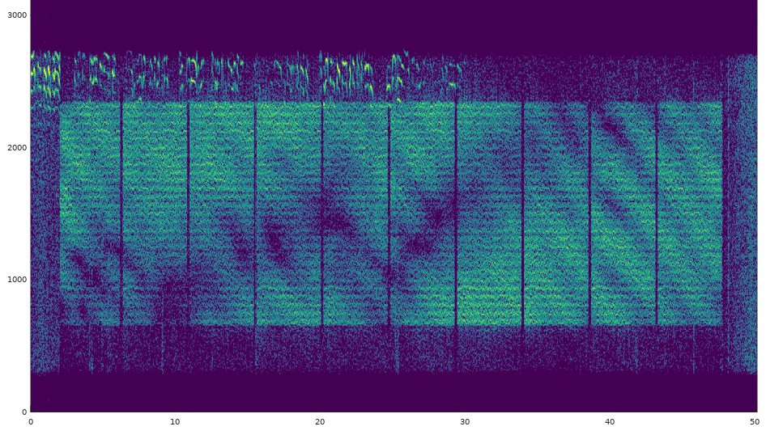
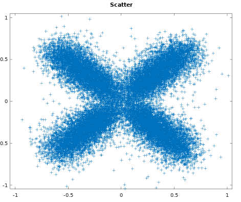

# README_data.md

# Introduction

FreeDV can be used to send data over radio channels.  Two APis are supported:
+ VHF packet data channel which uses Ethernet style framing.
+ Raw frames of modem data over VHF and HF channels.

## Credits

The VHF data channel was developed by Jeroen Vreeken.

## Quickstart

VHF packet data API:

1. Simple test using mode 2400A and VHF packet data

   ```sh
   $ cd ~/codec2/build_linux
   $ ./src/freedv_data_tx 2400A - --frames 15 | ./src/freedv_data_rx 2400A -  

   ```
   You can listen to the modem signal using:
   ```sh
   $ ./src/freedv_data_tx 2400A - --frames 15 | aplay -f S16_LE -r 48000

   ```

2. Same for 2400B and 800XA

   ```sh
   $ ./src/freedv_data_tx 2400B - --frames 15 | ./src/freedv_data_rx 2400B -  
   $ ./src/freedv_data_tx 800XA - --frames 15 | ./src/freedv_data_rx 800XA -  

   ```

3. Using a different callsign and secondary station id

   ```sh
   $ ./src/freedv_data_tx 2400A - --callsign T3ST --ssid 15 --frames 15 | src/freedv_data_rx 2400A -  
   ```

Raw modem frame API:

1. Let's send a 128 byte frame containing some text over the modem:
   ```sh
   padding=$(head -c 115 < /dev/zero | tr '\0' '-'); echo "Hello World" $padding > in.txt
   ./src/freedv_data_raw_tx --bursts 1 datac3 in.txt - | ./src/freedv_data_raw_rx --framesperburst 1 datac3 - - 
   Hello World --------
   ```
   Note we've padded the input frame to 126 bytes, the DATAC3 framesize (less CRC).

# VHF Packet Data Channel

The FreeDV VHF data channel operates on a packet level. The FreeDV modems however typically operate on a fixed frame base. This means that data packets have to be sent in multiple frames.

The packet format is modeled after Ethernet. As a result, any protocol that is compatible with Ethernet can potentially be used over a FreeDV data link. (There are of course practical limits. Browsing the world wide web with just a few hundred bits per second will not be a pleasant experience.)

## Header optimization

When there are no packets available for transmission a small 'filler' packet with just the sender's address will be sent.
When there is a packet available not all of the header needs to be sent. The sender's address can often be left out if it was already sent in a previous frame. Likewise when the packet has no specific destination but is targeted at a multicast address, this can also be transmitted in a single bit as opposed to a 6 byte broadcast address.


## Addressing

Since the format is based on Ethernet, a 6 byte sender and destination address is used. It is possible to encode an ITU compatible callsign in these bytes. See http://dmlinking.net/eth_ar.html for more info. Or have a look at freedv_data_tx.c and freedv_data_rx.c for an actual implementation.

## Packet types

The 2 byte EtherType field is used to distinguish between various protocols.

## Checks

Not all channels are perfect, and especially since a packet is split up over multiple frames, bits might get lost. Each packet therefore has a CRC which is checked before it is accepted.  Note there is No FEC on 2400A/2400B/800XA.

## Available modes

The data channel is available for modes 2400A, 2400B and 800XA.

## API

The data channel is part of the regular FreeDV API.

### Initialization

After creating a new freedv instance with freedv_open(), a few more calls need to be done before the data channel is usable.

  ```
   void freedv_set_data_header             (struct freedv *freedv, unsigned char *header);
  ```

The address that will be used for 'filler' packets must be set. The freedv_set_data_header() function must be called with a 6 byte header.

  ```
   typedef void (*freedv_callback_datarx)(void *, unsigned char *packet, size_t size);
   typedef void (*freedv_callback_datatx)(void *, unsigned char *packet, size_t *size);
   void freedv_set_callback_data           (struct freedv *freedv, freedv_callback_datarx datarx, freedv_callback_datatx datatx, void *callback_state);
  ```

Using freedv_set_callback_data() two callback functions can be provided. The datarx callback will be used whenever a new data packet has been successfully received. The datatx callback will be used when a new data packet is required for transmission.

### Operation

  ```
   void freedv_datatx  (struct freedv *f, short mod_out[]);
  ```

During normal operation the freedv_datatx() function can be used whenever a data frame has to be sent. If no data is available it will request new data using the datatx callback. The callback function is allowed to set 'size' to zero if no data is available or if it wishes to send an address frame.

For reception the regular freedv_rx() functions can be used as received data will automatically be reported using the datarx callback. Be aware that these functions return the actual number of received speech samples. When a data frame is received the return value will be zero. This may lead to 'gaps' in the audio stream which will have to be filled with silence.

### Examples

The freedv_data_tx and freedv_data_rx test programs implement the minimum needed to send and receive data packets.

## Mixing voice and data

Encoding only voice data is easy with the FreeDV API. Simply use the freedv_tx() function and provide it with speech samples.
Likewise encoding only data is also easy. Make sure to provide a source of data frames using the freedv_set_callback_data() function, and use the freedv_datatx() function to generate frames.

However there are many use cases where one would like to transmit a mix of voice and data. For example one might want to transmit their callsign in a machine readable format, or a short position report. There are a few ways to do this:

### Data bursts at start and/or end of transmission

This method simply transmits voice frames during the transmission, except for a few moments. For example when the user keys the radio the software uses the freedv_datatx() function for a number of frames before switching to regular voice frames.
Likewise when the user releases the key the software may hold it for a number of frames to transmit data before it releases the actual radio.

Be careful though: depending on your setup (radio, PC, soundcard, etc) the generated frames and the keying of your radio might not be perfectly in sync and the first or last frames might be lost in the actual transmission. Make sure to take this into account when using this method.

### Data and voice interleaved

Another method is to generate a mixed stream of frames. Compared to a small burst at the beginning or end a lot more data can be sent. We only need a way to choose between voice or data such that the recovered speech at the other side is not impacted.

#### Detect voice activity

When it is possible to determine activity in the voice signal (and it almost always is) this presence can be used to insert a data frame by calling freedv_datatx() instead of freedv_tx()/freedv_codectx(). This method is used in the freedv_mixed_tx demo program. When the option --codectx is given the codec2 library is used to determine the activity.

  ```
   $ ./src/freedv_mixed_tx 2400A ../raw/hts1a.raw - --codectx | src/freedv_data_rx 2400A -
   $ ./src/freedv_mixed_tx 2400A ../raw/hts1a.raw - | src/freedv_data_rx 2400A -
  ```

The advantage of this method is that the audio is not distorted, there was nothing (or near nothing) to distort. A drawback is that constant voice activity may mean there are insufficient frames for data.

### Receiving mixed voice and data

Receiving and decoding a mixed voice and data stream is (almost) as easy as receiving a regular voice-only transmission.
One simply uses the regular API calls for reception of speech samples. In addition, the callback functions are used for data.
There is one caveat though: when a data frame is received the API functions (like freedv_rx) will return zero as this is the amount of codec/voice data received.
For proper playback silence (or comfort noise) should be inserted for the duration of a frame to restore the timing of the original source speech samples.
An example of how this is done is provided in freedv_mixed_rx

  ```
   $ ./src/freedv_mixed_tx 2400A ../raw/hts1a.raw - | src/freedv_mixed_rx 2400A - ./hts1a_out.raw
  ```

### Insert a data frame periodically

This is a very simple method, simply insert a data frame every n frames, (e.g. once every 10 seconds). Since single FreeDV frames are relatively short (tens of milliseconds) the effect on received audio will be minor. The advantage of this method is that one can create a guaranteed amount of data bandwidth. A drawback is some interruption in the audio that may be noticed.

### Combination of the above.

A combination of the two methods may also be used. Send data when no voice is active and insert a frame when this does not occur for a long time.

# Raw Data using the FreeDV API

The raw data API can be used to send frames of bytes over radio channels.   The frames are protected with FEC and have a 16-bit checksum to verify correct transmission.  However the raw data API may lose frames due to channel impairments, loss of sync, or acquisition delays.  The caller must handle these situations.  The caller is also responsible for segmentation/re-assembly of the modem frames into larger blocks of data.

Several modes are available which support FSK and OFDM modulation. FSK is aimed at VHF And UHF applications, and the OFDM modes have been optimised for multipath HF radio channels.

For simple examples of how use the FreeDV API with raw data frames, see the demo programs [freedv_data1_tx.c](demo/freedv_data1_tx.c) and [freedv_data1_rx.c](src/freedv_data1_rx.c) The full featured sample programs [freedv_data_raw_tx.c](src/freedv_data_raw_tx.c) and [freedv_data_raw_rx.c](src/freedv_data_raw_rx.c) can be used to experiment with the raw data API.  

## FSK LDPC Raw Data Mode

The FSK_LDPC mode uses 2 or 4 FSK in combination with powerful LDPC codes, and was designed for VHF or UHF AWGN channels. Parameters such as the number of FSK tones, sample rate, symbol rate, and LDPC code can be selected at initialisation time.  The frame format is:
```
| Preamble | UW | payload data | CRC | parity | UW | payload data | CRC | parity | ........... |
           | frame 1 -------------------------| frame 2 -------------------------| ... frame n |
```
Only one preamble is transmitted for each data burst, which can contain as many frames as you like.  Each frame starts with a 32 bit Unique Word (UW), then the FEC codeword consisting of the data and parity bits.  At the end of the data bits, we reserve 16 bits for a CRC.

Here is an example of sending some text:
```
$ cd codec2/build_linux/src
$ echo 'Hello World                    ' |
  ./freedv_data_raw_tx FSK_LDPC - - 2>/dev/null |
  ./freedv_data_raw_rx FSK_LDPC - - 2>/dev/null |
  hexdump -C
00000000  48 65 6c 6c 6f 20 57 6f  72 6c 64 20 20 20 20 20  |Hello World     |
00000010  20 20 20 20 20 20 20 20  20 20 20 20 20 20        |              ..|
00000020
```
Notes:
1. The input data is padded to 30 bytes.  The (512,256) code sends 256 data bits every frame, we reserve 16 for a CRC, so there are 240 bits, or 30 bytes of payload data required for one frame.
1. The '2>/dev/null' command redirects stderr to nowhere, removing some of the debug information the test programs usually display to make this example easier to read.

When testing, it's convenient to use an internal source of test data. Here is an example where we send a single burst of 10 test frames:
```
$ cd codec2/build_linux/src
$ ./freedv_data_raw_tx --testframes 10 FSK_LDPC /dev/zero - | ./freedv_data_raw_rx --testframes FSK_LDPC - /dev/null
Nbits: 50 N: 4000 Ndft: 1024
bits_per_modem_frame: 256 bytes_per_modem_frame: 32
bytes_per_modem_frame: 32
Frequency: Fs:  8.0 kHz Rs:  0.1 kHz Tone1:  1.0 kHz Shift:  0.2 kHz M: 2

frames processed: 131  output bytes: 320 output_packets: 10
BER......: 0.0000 Tbits:  5440 Terrs:     0
Coded BER: 0.0000 Tbits:  2560 Terrs:     0
```
The default is 100 bits/s 2FSK. The (512,256) code sends 256 data bits (32 bytes) with every codeword, the remaining 256 bits reserved for parity.  The `--testframes` mode reports `320 output bytes` (10 frames where sent), and `Tbits: 2560`, so all of our data made it through.

In real world operation, 16 of the data bits are reserved for a CRC, leaving 240 payload data bits per frame. Taking into account the overhead of the UW, CRC, and parity bits, we send 240 payload data bits for every out of 544, so the payload data rate in this example is (240/512)*(100 bits/s) = 44.1 bits/s.

We can add some channel noise using the `ch` tool and see how it performs:
```
$ ./freedv_data_raw_tx --testframes 1 --bursts 10 FSK_LDPC /dev/zero - |
  ./ch - - --No -5 --ssbfilt 0 |
  ./freedv_data_raw_rx --testframes -v FSK_LDPC - /dev/null
<snip>
frames processed: 336  output bytes: 320 output_packets: 10
BER......: 0.0778 Tbits:  5440 Terrs:   423
SNR3k(dB): -13.00 C/No: 21.8 PAPR:  7.5
Coded BER: 0.0000 Tbits:  2560 Terrs:     0
```
The `ch` stderr reporting is mixed up with the testframes results but we can see that over a channel with a -13dB SNR, we obtained a raw bit error rate of 0.0778 (nearly 8%).  However the LDPC code cleaned that up nicely and still received all 10 packets with no errors.

Here is an example running 4FSK at 20000 bits/s (10000 symbols/s), at a sample rate of 200 kHz:
```
$./freedv_data_raw_tx -m 4 --Fs 200000 --Rs 10000 --tone1 10000 --shift 10000 --testframes 100 --bursts 10 FSK_LDPC /dev/zero - |
 ./ch - - --No -12 --ssbfilt 0 |
 ./freedv_data_raw_rx -m 4 --testframes -v --Fs 200000 --Rs 10000 FSK_LDPC --mask 10000 - /dev/null
 <snip>
 frames processed: 5568  output bytes: 30144 output_packets: 942
BER......: 0.0691 Tbits: 528224 Terrs: 36505
Coded BER: 0.0022 Tbits: 248576 Terrs:   535
```
Some notes on this example:
1. We transmit 10 bursts, each of 100 frames in length, 1000 packets total.  There are a couple of frames silence between each burst.  This gives the acquisition algorithms a good work out.
1. Only 942 packets make it though this rather noisy channel, a 6% Packet Error Rate (PER).  In a real world application, a higher protocol layer would need to detect this, and arrange for re-transmission of missing packets.  If the SNR was a few dB better, all 1000 packets would likely make it through.  If it was 1dB worse, nothing would get through; LDPC codes have a very sharp "knee" in the PER versus SNR curve.
1. Our first tone `--tone` is at 10kHz, and each tone is spaced `--shift` by 10kHz, so we have FSK tones at 10,20,30, and 40 kHz.  For good performance, FSK tones must be spaced by at least the symbol rate Rs.
1. Although the `ch` utility is designed for 8kHz sample rate operation, it just operates on sampled signals, so it's OK to use at higher sample rates.  It does have some internal filtering so best to keep your signal well away from 0 and (sample rate)/2.  The SNR measurement is calibrated to a 3000 Hz noise bandwidth, so won't make much sense at other sample rates.  The third argument `-12` sets the noise level of the channel.
1. The `--mask` frequency offset algorithm is used, which gives better results on noisy channels, especially for 4FSK.

### Reading Further

1. Examples in the [ctests](CMakeLists.txt).
1. [FSK_LDPC blog post](http://www.rowetel.com/?p=7467)

## OFDM Raw Data modes for HF Radio

These modes use an OFDM modem with powerful LDPC codes and are designed for sending data over HF radio channels with multipath fading.  At the time of writing (April 2021) they are a work in progress, but usable as is.  The current modes supported are:

| FreeDV Mode | RF bandwidth (Hz) | Payload data rate bits/s | Payload bytes/frame | FEC | Duration (sec) | MPP test | Use case |
| :-: | :-: | :-: | :-: | :-: | :-: | :-: | :-: |
| DATAC0 | 500 | 291 | 14 | (256,128) | 0.44 | 70/100 at 0dB | Reverse link ACK packets (all SNRs) |
| DATAC1 | 1700 | 980 | 510 | (8192,4096) | 4.18 | 92/100 at 5dB | Forward link data (medium SNR) |
| DATAC3 | 500 | 321 | 126 | (2048,1024) | 3.19 | 74/100 at 0dB | Forward link data (low SNR) |

Notes:
1. 16 bits (2 bytes) per frame are reserved for a 16 bit CRC, e.g. for `datac3` we have 128 byte frames, and 128-2=126 bytes/frame of payload data.
1. SNR is the target operating point SNR for each mode.
1. "MPP test" is the number of packets received/transmitted on a simulated MultiPath Poor channel (1Hz Doppler spread, 2ms delay) at the operating point SNR.

From the callers point of view, the frame format of each burst is:
```
| Preamble | payload data | CRC | payload data | CRC | ........... | Postamble | 
           | frame 1 -----------| frame 2 -----------| ... frame N |
```
In the next layer down, each frame is comprised of several OFDM "modem frames", that contain pilot, unique word, and FEC symbols to handle syncronisation and error correction over the challenging HF channel.  The preamble and postamble are used to locate the burst and estimate it's frequency offset.  Having both a pre and postamble increases the probability of successful detection of the burst in a fading channel. Here are some single frame bursts on a MPP channel at 5dB SNR:



You can see what a mess the MPP channel makes.  Sometimes we find the pre-amble, other times the post-amble.  Using both increases the probability of detecting the burst, it's a form of time diversity.  If the probability of missing the pre-amble is P(fail)=0.1, then the probability of missing the pre and post-amble is P(fail)*P(fail)=0.01. If we find either we can work out where the burst starts and start demodulating.

Here is an example of sending 3 bursts of 2 frames/burst, a total of 6 frames:
```
./src/freedv_data_raw_tx --framesperburst 2 --bursts 3 --testframes 6 DATAC0 /dev/zero - |
./src/freedv_data_raw_rx --framesperburst 2 --testframes DATAC0 - /dev/null --vv
<snip>
BER......: 0.0000 Tbits:  1536 Terrs:     0
Coded BER: 0.0000 Tbits:   768 Terrs:     0
Coded PER: 0.0000 Tpkts:     6 Tpers:     0
```

Lets add some noise and a 20 Hz frequency offset:
```
./src/freedv_data_raw_tx --framesperburst 2 --bursts 3 --testframes 6 DATAC0 /dev/zero - |
./src/ch - - --No -20 -f 20 |
./src/freedv_data_raw_rx --framesperburst 2 --testframes DATAC0 - /dev/null --vv
<snip>
marks:space: 0.83 SNR offset: -0.79
ch: SNR3k(dB):    -0.36  C/No....:    34.42
<snip>
BER......: 0.0195 Tbits:  1536 Terrs:    30
Coded BER: 0.0000 Tbits:   768 Terrs:     0
Coded PER: 0.0000 Tpkts:     6 Tpers:     0
```
We still received 6 frames OK (Tpkts field), but in this case there was a raw BER of about 2% which the FEC cleaned up nicely (Coded BER 0.0).  Just above that we can see the "SNR offset" and "ch: SNR3k" fields.  In the silence between bursts the modem signal has zero power, which biases the SNR measured by the `ch` channels simulation tool.  This bias is the "SNR offset".  So the true SNR for this test is actually:
```
SNR = -0.36 - (-0.79) = 0.43 dB
```

In the `raw` directory is a real world off-air sample of a signal sent between Adelaide and Melbourne (800km) using about 20W on 40m.  This can be decoded with:
```
./src/freedv_data_raw_rx datac1 --framesperburst 1 --testframes ../raw/test_datac1_006.raw /dev/null --vv
<snip>
BER......: 0.0134 Tbits: 73728 Terrs:   986
Coded BER: 0.0000 Tbits: 36864 Terrs:     0
Coded PER: 0.0000 Tpkts:     9 Tpers:     0
```

It's also useful to listen to the file, you can hear co-channel SSB, the bursts starting and stopping, and some fading:
```
aplay -f S16_LE ../raw/test_datac1_006.raw
```

Here is a spectrogram (waterfall on it's side - time flows from left to right, frequency on the Y axis):



The multipath channel carves notches out of the signal, and the level rises and falls.  The 27 carriers of the `datac1` channel can also be observed.  The SSB is the fuzz along the top. The SNR varied between 8 and 16dB. The fading is even more obvious on the scatter diagram:



The X shape is due to the level of each carrier changing with the fading.  In some cases a carrier is faded down to zero.  The FEC helps clean up any errors due to faded carriers.

## SNR estimation and clipping

The modem estimates the SNR of every received packet, which can be useful for selecting the best mode to maximise bit rate while  minimising the packet error rate.

Clipping (compression) is enabled by default on each modem waveform to maximise the Peak to Average Power Ratio (PAPR).  Power amplifiers are usually rated in terms of peak power (PEP). For a given peak power, clipping increases SNR over the channel by 3-4dB.

Clipping works by introducing controlled distortion, which affects the SNR estimator in the modem.  When clipping is enabled, the SNR reported by the datac0 and datac3 modes will start to roll off and reach a plateau at about 8dB with no channel noise.  For the same channel SNR, datac1 will return a higher (and more accurate) SNR estimate.  If clipping is disabled, the datac0 and datac3 modes will report a more accurate SNR.

This command line demonstrates the effect:
```
./src/freedv_data_raw_tx datac3 /dev/zero - --testframes 10 --bursts 10 --clip 1 | ./src/ch - - --No -100 --fading_dir unittest | ./src/freedv_data_raw_rx datac3 - /dev/null --testframes --framesperburst 1 -v
```
Try adjusting `--clip` and `No` argument of `ch` (noise level) for different modes.  Note the SNR estimates returned from `freedv_data_raw_rx` compared to the SNR from the channel simulator `ch`. You will notice clipping also increases the RMS power and reduces the PER for a given noise level.

## Reading Further

Resources:
1. See the raw data example in Quickstart section above.
1. For simple examples of how use the FreeDV API, see the demo programs [freedv_datac1_tx.c](demo/freedv_datac1_tx.c) and [freedv_datac1_rx.c](demo/freedv_datac1_rx.c) 
1. [freedv_data_raw_tx.c](src/freedv_data_raw_tx.c) and [freedv_data_raw_rx.c](src/freedv_data_raw_rx.c) are more full deatured example programs.  
1. The modem waveforms designs are described in this [spreadsheet](doc/modem_codec_frame_design.ods).
1. Examples in the [ctests](CMakeLists.txt) (look for "FreeDV API raw data")
1. [Codec 2 HF Data Modes Part 1 blog post](http://www.rowetel.com/?p=7167)
1. [HF Data Acquisition](https://github.com/drowe67/codec2/pull/171) GitHub Pull Request
