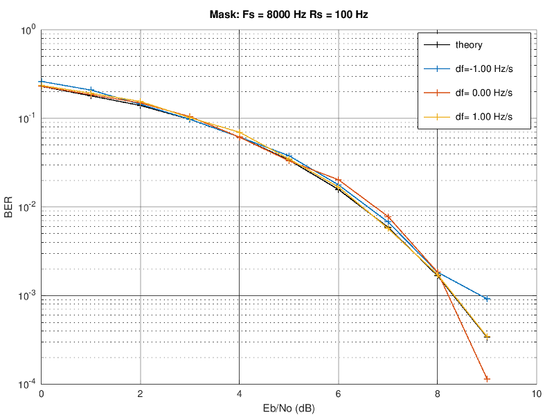
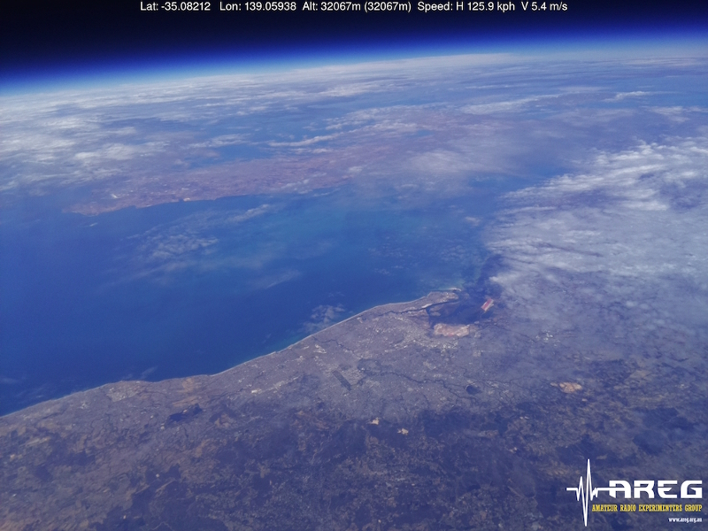

# README_fsk

A FSK modem with a non-coherent demodulator.  Performance is within a fraction of a dB of ideal.  The demodulator automagically estimates the tone frequencies and tracks frequency drift.

Here is a typical Bit Error Rate (BER) versus Eb/No curve:



Note how close the theory line is to measured performance.

This modem can demodulate FSK signals that sound like [this sample](doc/lockdown_3s.wav); and is used to receive images from the [edge of space](https://github.com/projecthorus/wenet):



## Credits

The Octave version of the modem was developed by David Rowe.  Brady O'Brien ported the modem to C, and wrote the C/Octave tests.  The modem is being maintained by David Rowe.  Mark Jessop has helped improve the modem operation by testing against various balloon telemtry waveforms.  Bill Cowley has developed the Log Likelihood Ratio (LLR) algorithms for 4FSK.

## Quickstart

1. Build codec2:
   ```
   $ cd codec2 && mkdir build_linux && cmake .. && make
   ```

1. Generate 1000 test bits, modulate them using 2FSK using a 8000 Hz sample rate, 100 bits/s, play on your sound card:
   ```    
   $ cd ~/codec2/build_linux/src
   $ ./fsk_get_test_bits - 1000 | ./fsk_mod 2 8000 100 1200 1200 - - | aplay -f S16_LE
   ```
    The low tone frequency is 1200Hz, and the upper tone 1200 + 1200 = 2400Hz.

1. Add the demodulator and measure the bit error rate over 10,000 bits of 100 bit/s 2FSK:
   ```
   $ ./fsk_get_test_bits - 10000 | ./fsk_mod 2 8000 100 1200 100 - - | ./fsk_demod 2 8000 100 - - | ./fsk_put_test_bits -
   <snip>
   [0099] BER 0.000, bits tested   9900, bit errors    0
   PASS
   ```
   We get a Bit Error Rate (BER) of 0, as there is no channel noise to induce bit errors.
   
1. Same thing but this time with 4FSK, and less verbose output:
   ```
   $ ./fsk_get_test_bits - 10000 | ./fsk_mod 4 8000 100 1200 100 - - | ./fsk_demod 4 8000 100 - - | ./fsk_put_test_bits -q -
   <snip>
   [0099] BER 0.000, bits tested   9900, bit errors    0
   PASS
   ```

1. Lets add some channel noise:
   ```
   $ ./fsk_get_test_bits - 10000 | ./fsk_mod 2 8000 100 1200 100 - - | ./ch - - --No -26 | ./fsk_demod 2 8000 100 - - | ./fsk_put_test_bits -b 0.015 -
   <snip>
   SNR3k(dB): -5.76 C/No: 29.0 PAPR:  3.0 
   [0099] BER 0.010, bits tested   9900, bit errors  103
   PASS
   ```
   The `ch` utility takes the FSK modulator signal, and adds calibrated noise to it (the `--No -26` value specifies the noise).  Try changing the noise level, and note how the Bit Error Rate (BER) changes.  The BER is 0.01, which is right on theory for this sort of FSK demodulator at this SNR (2FSK non-coherent demodulator Eb/No=9dB).  

   The SNR is calculated using the signal power divided by the noise power in 3000 Hz.  The C/No value is the same thing, but uses a noise bandwidth of 1 Hz.  There is less noise power when you look at just 1Hz, so C/No is higher. Peak to Average Power ratio (PAPR) is 3dB as a FSK signal is just a single sine wave, and a sine wave peak is 3dB higher than it's average.

1. You can visualise the C modem operation with a companion python script, for example:
   ```
   $ ./fsk_get_test_bits - 10000 | ./fsk_mod -p 10 4 8000 400 400 400 - - | ./fsk_demod -p 10 -t1 4 8000 400 - /dev/null 2>stats.txt
   $ python ../../octave/plot_fsk_demod_stats.py stats.txt
   ```

1. Send some digital voice using FSK at 800 bits/s, and try the two 2400 bits/s FSK modes:
   ```
   $ ./freedv_tx 800XA ../../raw/ve9qrp.raw - | ./freedv_rx 800XA - - -vv | aplay -f S16_LE
   $ ./freedv_tx 2400A ../../raw/ve9qrp.raw - | ./freedv_rx 2400A - - -vv | aplay -f S16_LE
   $ ./freedv_tx 2400B ../../raw/ve9qrp.raw - | ./freedv_rx 2400B - - -vv | aplay -f S16_LE
   ```

1. LDPC encoded 4FSK, with framing:
   ```
   $ cd ~/codec2/build_linux/src
   $ ./ldpc_enc /dev/zero - --code H_256_512_4 --testframes 200 |
     ./framer - - 512 5186 | ./fsk_mod 4 8000 100 1000 100 - - |
     ./ch - - --No -24 |
     ./fsk_demod -s 4 8000 100 - - |
     ./deframer - - 512 5186  |
     ./ldpc_dec - /dev/null --code H_256_512_4 --testframes
   <snip>
   SNR3k(dB): -7.74 C/No: 27.0 PAPR:  3.0 
   Raw   Tbits: 100352 Terr:   6701 BER: 0.067
   Coded Tbits:  50176 Terr:    139 BER: 0.003
         Tpkts:    196 Tper:      4 PER: 0.020
   ```
   In this example the unique word is the 16 bit sequence `5186`.  See also several ctests using these application. Other codes are also available:
   ```
   $ ./ldpc_enc --listcodes

   H2064_516_sparse     rate 0.80 (2580,2064) 
   HRA_112_112          rate 0.50 (224,112) 
   HRAb_396_504         rate 0.79 (504,396) 
   H_256_768            rate 0.33 (768,256) 
   H_256_512_4          rate 0.50 (512,256) 
   HRAa_1536_512        rate 0.75 (2048,1536) 
   H_128_256_5          rate 0.50 (256,128)
   ```
   If you change the code you also need to change the `frameSizeBits` argument in `framer/deframer` (`512` in the example above).

1. The FSK/LDPC/framer steps above have been combined in a FreeDV API mode.  See "FSK LDPC Raw Data Mode" in [README_data.md](README_data.md).

1. FSK modem C files in ```codec2/src```:

   | File | Description |
   | ---  | --- |
   | fsk.c/fsk.h | core FSK modem library |
   | fsk_mod.c | command line modulator |
   | fsk_demod.c | command line demodulator |
   | fsk_get_test_bits.c | source of test bits |
   | fsk_put_test_bits.c | test bit sync, counts bit errors and packet errors |
   | fsk_mod_ext_vco.c | modulator that uses an external FSK oscillator |
   | framer.c | adds a unique word to a frame of bits to implement frame sync for LDPC codewords |
   | deframer.c | locates and strips a unique word to implement frame sync for LDPC codewords |
   | tollr.c | converts bits to LLRs for testing LDPC framing |

1. GNU Octave files in ```codec2/octave```:

   | File | Description |
   | ---  | --- |
   | fsk_lib.m | Core FSK modem library |
   | fsk_lib_demo.m | A demonstration of fsk_lib, runs a single point BER test |
   | fsk_demod_file.m | Demodulates FSK signals from a file, useful for debugging FSK waveforms |
   | fsk_lock_down.m | simulations to support the "lock down" low SNR waveform |
   | tfsk.m | automated test that compares the C and Octave versions of the modem |
   | fsk_cml.m | Symbol rate experiments with FSK modem LLR estimation and LDPC |
   | fsk_cml_sam.m | Sample rate experiments with FSK modem LLR estimation and LDPC |
   | fsk_llr_plot.m | Plots curves from fsk_cml.m & fsk_cml_sam.m |
   | fsk_lib_ldpc_demo.m | CML library LLR routines and LDPC codes with fsk_lib.m |
   
   You can run many of them from the Octave command line:
   ```
   $ octave --no-gui
   octave:1> fsk_lib_demo
   ```

1. A suite of automated ctests that exercise the C and Octave code:
   ```
   $ cd ~/codec2/build_linux
   $ ctest -R test_fsk
   1/9 Test #39: test_fsk_lib ......................   Passed    3.37 sec
   3/9 Test #41: test_fsk_modem_octave_port ........   Passed    4.17 sec
   4/9 Test #42: test_fsk_modem_mod_demod ..........   Passed    0.06 sec
   5/9 Test #43: test_fsk_2fsk_ber .................   Passed    0.24 sec
   6/9 Test #44: test_fsk_4fsk_ber .................   Passed    0.12 sec
   7/9 Test #45: test_fsk_4fsk_ber_negative_freq ...   Passed    0.07 sec
   8/9 Test #46: test_fsk_4fsk_lockdown ............   Passed    2.84 sec
   9/9 Test #47: test_fsk_vhf_framer ...............   Passed    0.06 sec
   ```
   These are written in ```codec2/CmakeLists.txt```, inspect them to find out how we test the modem.

1. ```fsk_demod_file.m``` is useful for peering inside the modem, for example when debugging.
   ```
   $ cd ~/codec2/build_linux/src
   $ ./fsk_get_test_bits - 1000 | ./fsk_mod 2 8000 100 1000 1000 - ../../octave/fsk.s16
   $ octave --no-gui
   octave:1> fsk_demod_file("fsk.s16",format="s16",8000,100,2)
   ```
   
## Further Reading

   Here are some links to projects and blog posts that use this modem:

   1. [Horus Binary](https://github.com/projecthorus/horusbinary) High Altitude Balloon (HAB) telemetry protocol, 3 second updates, works at 7dB lower SNR that RTTY.
   1. [Testing HAB Telemetry, Horus binary waveform](http://www.rowetel.com/?p=5906)
   1. A really useful reference on a variety of modulation techniques from [Atlanta DSP](http://www.atlantarf.com/FSK_Modulation.php).  I keep this handy when experimenting with modems.
   1. The [RTTY modem project](http://www.rowetel.com/?p=4629) that kicked off the FSK modem work.
   1. [Wenet](https://github.com/projecthorus/wenet) - high speed SSTV images from balloons at the edge of space
   1. [Wenet High speed SSTV images](http://www.rowetel.com/?p=5344)
   1. [FreeDV 2400A and 2400B](http://www.rowetel.com/?p=5219), digital speech for VHF/UHF radios.
   1. [HF FSK with Rpitx](http://www.rowetel.com/?p=6317), a zero hardware FSK transmitter using a Pi
   1. [Eb/No and SNR worked Example](http://www.rowetel.com/wordpress/?p=4621)
   1. [FSK LLR LDPC Code Experiments](https://github.com/drowe67/codec2/pull/129)
   1. [FreeDV API FSK LDPC Raw Data Mode](README_data.md)


