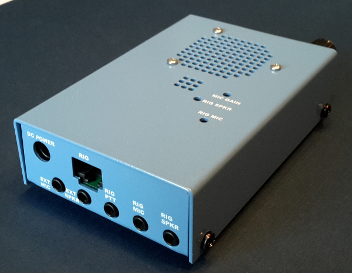
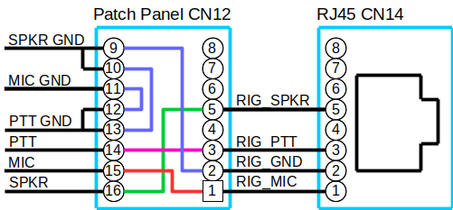
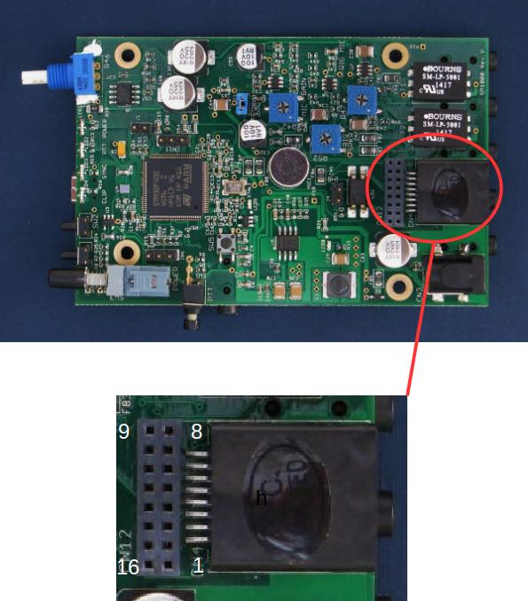

# SM1000 Manual



# Getting Started

1. Connect 12V, set the volume to half way and power on.  You will hear morse playing the firmware version number (e.g. "V4") and the current mode.

1. The SELECT button steps through the mode:
   + Analog pass through (ANA)
   + FreeDV 1600 (1600)
   + FreeDV 700D (700D)
   + FreeDV 700E (700E)

1. Select 1600 mode.
  
1. Connect the SM1000 ***Rig SPKR 3.5mm connector*** to your PC or laptop 3.5mm headphone socket.

1. Download and play the [ve9qrp_1600.wav](https://github.com/drowe67/freedv-gui/tree/master/wav) sample from your PC or laptop to the SM1000.

1. Adjust ***RIG SPKR Trimmer*** on the top of the SM1000 with a screwdriver until the clip/error LED on the front stops blinking.  Occasional blinks are OK.  If it blinks all the time you are clipping.

1. If all is well you will hear decoded speech from the SM1000 speaker.

1. Change modes to 700D with SELECT and try the [ve9qrp_700d.wav](https://github.com/drowe67/freedv-gui/tree/master/wav) sample.

# Connection to your Radio

This is the hardest part of SM1000 set up and will take some time.

***Sorry, we do not have specific instructions for your radio***.

Study the wiring of you radio, the [SM1000 schematic](https://svn.code.sf.net/p/freetel/code/smartmic/SM1000-F/MFG-SM1000-F/SCH-SM1000-F.pdf) **Rig Interface** section, and this section of the manual.  Draw a schematic or wiring diagram.  Take it slowly.  Connect one part of the interface at at time and test. For example start with PTT. When that is working, connect receive audio and test, then transmit audio.

1. You can connect the SM1000 to your radio using the 3.5mm sockets or the RJ45 connector. The RIG MIC, RIG SPKR and RIG PTT signals are connected in parallel to the 3.5mm sockets and the RJ45.

   

1. Stereo 3.5mm plugs should be used if possible. The stereo 3.5mm SM1000 sockets are wired to use the sleeve for ground and tip for signal, with ring unconnected.

1. RJ45 connection to your radio – The CN12 Patch Panel is configured to connect the audio and PTT connections to your radio. You only need to configure the CN12 Patch Panel if you are using the RJ45. If you are using the 3.5mm connectors you do not need to configure the CN12 Patch Panel. Here is an example for a Yaesu radio:

   
   

1. All grounds are floating (unconnected) by default, but can be connected together using the extra ground connections on CN12. In the Yaesu example above all grounds are connected together using the wires between pins 10-13 and 11-12. Some radios have a separate microphone ground.

1. Some radios have reversed numbering for their RJ45.

1. Use 5cm lengths of 24GA (0.5mm) maximum diameter solid core wire for the patch panel. Using wire greater than 24GA (0.5mm) may damage the patch panel sockets. Insert one end of the wire at a time using needle nose pliers.

1. For level set up, you can adjust the RIG SPKR, MIC GAIN, and RIG MIC trimmers through holes in the SM1000 top cover.

1. On receive, adjust the radio volume (AF gain) and/or SM1000 RIG SPKR trimmer R52 so the clip/error led is not blinking. The receive level is not critical. It doesn’t work better with a louder signal. FreeDV 1600 and 700D use phase shift keying so are level insensitive. Constant clipping on the audio is bad, when this happens you’ll see the error led blink.

1. Press PTT, and adjust MIC GAIN trimmer R42 so that the clip led just blinks occasionally, at the peaks of yr speech. Once again, this is not very critical, as it’s Digital Voice. A louder microphone signal won’t make your signal stronger. However a badly clipped mic signal will sound bad. Note on some versions MIC GAIN increases when turned anticlockwise.

1. Jumper J5 selects high or low range RIG MIC level. Add J5 if your radio requires a “line level” mic input of several hundred mVpp. Remove J5 for low, mV level mic input into your radio. Then finely adjust the RIG MIC level with R47 (next step). Prior to Rev E it is possible to solder a resistor onto your SM1000 to achieve the same boost in mic input level.

1. The RIG MIC trimmer R47 is the most critical. This controls the level of the modem signal sent to your radio on transmit. With PTT pressed and your radio transmitting adjust RIG MIC so that your radio ALC is just moving. Too much transmit drive will lead to a distorted modem signal, splatter on adjacent frequencies, and bit errors. Your Digital Voice signal will not be improved! Over driving transmitters when using digital voice is the most common mistake for new users! For finer adjustment use a 2nd receiver to monitoring your FreeDV transmission. Connect this receiver to the x86 PC version of FreeDV to monitor the spectrum and scatter plot. Here is a blog post and video [describing](http://www.rowetel.com/?p=3109) scatter plots and how they can be used to tune your FreeDV transmission.

1. External Microphone – Jumper J3 provides electret microphone DC bias. Remove J3 if you do not want DC bias.

1. External Speaker – The SM1000 3.5mm sockets are wired to use stereo or mono plugs. If you wish to use a mono plug for Ext Spkr (CN8) remove the jumper J2 on the PCB. This prevents a mono plug shorting the speaker amplifier output to ground resulting in no audio. Note the first production SM1000 (Rev D) did not have jumper J2 and should only be used with a stereo plug.

# Morse Menus

The SM1000 has a comprehensive menu system with morse code prompts developed by Stuart, VK4MSL.

There are two buttons for UI operation, SELECT and BACK. Outside of the menu, these simply cycle between the available modes. The current mode is announced (morse code) after a short delay.

Holding down SELECT puts you in menu mode. The POWER LED will now flash to indicate this. To navigate, press the SELECT and BACK buttons momentarily to move up and down in the menu. Again, after a pause the item will be read out. Holding SELECT or BACK either chooses the option, or backs out.

Pressing PTT while in a menu exits the entire menu tree without saving changes to flash storage.

The menu structure looks like this:
```
    -> Root menu:
        |---> "MODE": Boot-up Operating mode
        |       |---> "ANA":    Analogue mode
        |       |---> "1600":   FreeDV 1600
        |       |---> "700D":   FreeDV 700D
        |       '---> "700E":   FreeDV 700E
        |
        |---> "TOT": Time-out timer
        |       |---> "TIME":   Total time-out period (0 == disabled)
        |       |               0-10 minutes in 5 second steps
        |       '---> "WARN":   Warning beep period (0 == disabled)
        |                       0-${TIME} seconds in 5 second steps
        |
        '---> "UI": User interface options
                |---> "FREQ":   Morse frequency
                |               50-2000 Hz in 50Hz steps
                |---> "WPM":    Morse send speed (PARIS standard)
                |               5-60 WPM in 5 WPM steps
                '---> "VOL":    Menu volume
                                1-15 units.
```
Settings are saved when you hold down BACK to leave the root menu.

# Flashing Your SM1000

You can program the flash memory on your SM1000 via USB using a Windows or Linux PC. Download the latest SM1000 firmware here:

| Version | Date | Download .bin | Release Notes |
|:---:|---|---|---|
| 1 | May 2015 | [sm1000.bin](http://www.rowetel.com/downloads/codec2/smartmic/sm1000.bin) | Original release with FreeDV 1600 |
| 2 | July 2019 | [sm1000v2.bin](http://www.rowetel.com/downloads/codec2/smartmic/sm1000v2.bin) | FreeDV 700D and morse menus |
| 3 | March 2020 | [sm1000v3.bin](http://www.rowetel.com/downloads/codec2/smartmic/sm1000v3.bin) | Menu bug fixes, 700D modem improvements & automatic Mic EQ |
| 4 | May 2020 | [sm1000v4.bin](http://www.rowetel.com/downloads/codec2/smartmic/sm1000v4.bin) | 700D sync logic to reduce stop burbling with no signal |
| 5 | August 2021 | [sm1000v5.bin](http://www.rowetel.com/downloads/codec2/smartmic/sm1000v5.bin) | FreeDV 700E and Tx band pass filter for 700D & E |

## Windows

Find and install the **STM32CubeProgrammer** software by searching on the [ST web site](http://www.st.com).

1. Connect the SM1000 USB to a Windows PC.
1. Apply power with PTT held down, then release PTT.
1. Run the `STM32CubeProgrammer` application and select the down arrow on the left side, and navigate to the "Erasing & Programming" section.
1. Select the `Verify programming` option.
1. In the "File path" on the left-hand side, select Open file and navigate to the .bin file you'd like to flash.
1. Select "USB" from the drop-down list on the upper right and push the Refresh button next to the Port drop-down in the "USB configuration" area. The SM1000 will appear as "USB1" or similar in the list; select that entry.
1. Click on the Connect button.
1. Ensure that "PID" displays as DF11 and "VID" as 0483.
1. Select `Start Programming` and the firmware procedure will commence.
1. A message in the log at the bottom of the window will display once complete.

Power cycle the SM1000 and the new firmware will run.

## Linux

1. Apply power with PTT held down, then release PTT.
1. Connect the SM1000 to a Ubuntu Linux PC and type “dmesg”. You should see a STM32F4 boot device.
1. To flash the SM1000
   ```
   $ sudo apt-get install dfu-util
   $ sudo dfu-util -d 0483:df11 -c 1 -i 0 -a 0 -s 0x08000000 -D sm1000v5.bin
   ```
   After about 10 seconds you will be returned to the command line.
1. Power cycle the SM1000 and the new firmware will run.

# Tips

1. A sound blaster record input connected to RIG MIC CN7 is a good way to test if the SM1000 is transmitting a signal. You can receive your FreeDV signal on the bench using FreeDV GUI on your PC. No radio is required for this test.

1. Small external speakers and an external mic tend to make FreeDV sound better.  A low cost analog headset works well.

1. You may notice background noise from the SM1000 with no signal connected, especially at high volume levels. This becomes inaudible when the SM1000 is connected to a SSB radio in either analog or digital mode.

1. The squelch threshold is fixed at 2dB for FreeDV 1600 and is off for 700D to optimise low SNR reception.  However 700D will squelch if the Forward Error Correction (FEC) fails to decode.

# Building the Firmware and Development

1. [The SM1000 source code](https://github.com/drowe67/codec2/blob/master/stm32/README.md)

1. You can use a STM32F4 Discovery board as an emulator pod for tetsing SM1000 firmware.

1. [Comprehensive unit test system](https://github.com/drowe67/codec2/blob/master/stm32/unittest/README_unittest.md), thanks Don W7DMR.

1. The SM1000 has a 115200 bit/s serial output from the 3 pin CN11 connector that dumps debug information as it runs.

## Factory Reset

To perform a factory reset, hold down BACK whilst powering the device on. A loud beep should be heard and the SYNC LED should flash. Release, and the device should boot up with factory defaults.

# References

1. [Support - Codec 2 Mailing List](https://lists.sourceforge.net/lists/listinfo/freetel-codec2).
1. [Buy a SM1000](http://rowetel.com/sm1000.html) - Your purchase supports FreeDV development
1. [SM1000 Ref F Schematic](https://svn.code.sf.net/p/freetel/code/smartmic/SM1000-F/MFG-SM1000-F/SCH-SM1000-F.pdf)
1. [SM1000 Hardware Design](https://svn.code.sf.net/p/freetel/code/smartmic)
1. [Series of blog posts on the SM1000 development](http://www.rowetel.com/?page_id=6172) (2014 section of archive)
1. Nice write up of a mobile [Codan NGT SM1000 installation](http://rfhead.net/?p=582) by Mark VK5QI including tips on testing and debugging a microphone level problem.
1. [Sample wiring](http://rowetel.com/downloads/freedv/vk5kx_radio_sm1000_connections_model.pdf) diagrams for several radios from Peter, VK5KX.  These are not tested and provided as examples only.

# Credits

The SM1000 hardware was developed by David Rowe VK5DGR and Rick Barnich KA8BMA. It is being manufactured, tested and shipped by our good friend Edwin at Dragino in Shenzhen, China.

Steve (K5OKC) helped develop the fine OFDM modem used for FreeDV 700D. Don (W7DMR), spearheaded the port of FreeDV 700D to the SM1000, including code optimisation and a comprehensive unit test system.  Don, Danilo (DB4PLE), and Richard (KF5OIM) have done some fantastic work on the cmake build and test system for the stm32 port of 700D. Stuart VK4MSL developed the morse menu system for the SM1000.  Mooneer, K6AQ, ported FreeDV 700E to the SM1000.

Thanks also to the many Hams who kindly helped out with testing new firmware releases.

This is an open source/open hardware project, developed by Hams - for Hams.  Thanks!
