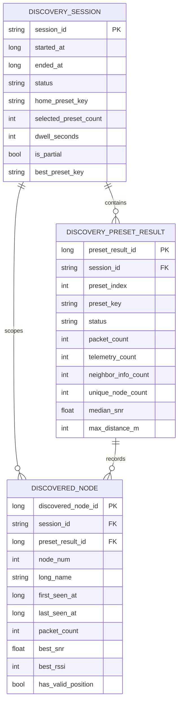

# Data Model — Local Mesh Discovery

This document defines the Room KMP persistence model for Local Mesh Discovery. The model is intentionally normalized around **session**, **per-preset result**, and **per-node discovery observation** so that history, summary, map, and export views can be rebuilt from persisted state without a live radio connection.

## Design Goals

- Match Meshtastic-Android Room KMP conventions (`androidx.room3`, denormalized searchable columns, `Flow`-friendly DAO APIs).
- Keep the scan state machine in `commonMain` while letting Room store only durable facts.
- Preserve preset-specific observations instead of flattening all node sightings into a single session-level node table.
- Support cascade deletion and efficient session-detail loading.

## Proposed Package Layout

- `core/database/src/commonMain/kotlin/org/meshtastic/core/database/entity/DiscoverySessionEntity.kt`
- `core/database/src/commonMain/kotlin/org/meshtastic/core/database/entity/DiscoveryPresetResultEntity.kt`
- `core/database/src/commonMain/kotlin/org/meshtastic/core/database/entity/DiscoveredNodeEntity.kt`
- `core/database/src/commonMain/kotlin/org/meshtastic/core/database/dao/DiscoverySessionDao.kt`
- `core/database/src/commonMain/kotlin/org/meshtastic/core/database/dao/DiscoveryPresetResultDao.kt`
- `core/database/src/commonMain/kotlin/org/meshtastic/core/database/dao/DiscoveredNodeDao.kt`

## Entity Definitions

> Notes
>
> - Examples use `androidx.room3` imports, matching the rest of the project.
> - Status values are stored as strings for schema readability and future-proofing.
> - `sessionId` is a string UUID generated in `commonMain`.

### `DiscoverySessionEntity`

```kotlin
@Entity(
    tableName = "discovery_session",
    indices = [
        Index(value = ["started_at"]),
        Index(value = ["status"]),
        Index(value = ["my_node_num"]),
    ],
)
data class DiscoverySessionEntity(
    @PrimaryKey
    @ColumnInfo(name = "session_id")
    val sessionId: String,
    @ColumnInfo(name = "started_at")
    val startedAt: Long,
    @ColumnInfo(name = "ended_at")
    val endedAt: Long? = null,
    @ColumnInfo(name = "status")
    val status: String,
    @ColumnInfo(name = "display_name")
    val displayName: String,
    @ColumnInfo(name = "my_node_num")
    val myNodeNum: Int?,
    @ColumnInfo(name = "home_preset_key")
    val homePresetKey: String,
    @ColumnInfo(name = "selected_preset_count")
    val selectedPresetCount: Int,
    @ColumnInfo(name = "dwell_seconds")
    val dwellSeconds: Int,
    @ColumnInfo(name = "completed_preset_count")
    val completedPresetCount: Int = 0,
    @ColumnInfo(name = "failed_preset_count")
    val failedPresetCount: Int = 0,
    @ColumnInfo(name = "is_partial", defaultValue = "0")
    val isPartial: Boolean = false,
    @ColumnInfo(name = "best_preset_key")
    val bestPresetKey: String? = null,
    @ColumnInfo(name = "recommendation_source")
    val recommendationSource: String? = null,
    @ColumnInfo(name = "recommendation_text")
    val recommendationText: String? = null,
    @ColumnInfo(name = "error_message")
    val errorMessage: String? = null,
)
```

### `DiscoveryPresetResultEntity`

```kotlin
@Entity(
    tableName = "discovery_preset_result",
    foreignKeys = [
        ForeignKey(
            entity = DiscoverySessionEntity::class,
            parentColumns = ["session_id"],
            childColumns = ["session_id"],
            onDelete = ForeignKey.CASCADE,
        ),
    ],
    indices = [
        Index(value = ["session_id"]),
        Index(value = ["session_id", "preset_index"], unique = true),
        Index(value = ["session_id", "preset_key"], unique = true),
        Index(value = ["status"]),
    ],
)
data class DiscoveryPresetResultEntity(
    @PrimaryKey(autoGenerate = true)
    @ColumnInfo(name = "preset_result_id")
    val presetResultId: Long = 0,
    @ColumnInfo(name = "session_id")
    val sessionId: String,
    @ColumnInfo(name = "preset_index")
    val presetIndex: Int,
    @ColumnInfo(name = "preset_key")
    val presetKey: String,
    @ColumnInfo(name = "status")
    val status: String,
    @ColumnInfo(name = "started_at")
    val startedAt: Long? = null,
    @ColumnInfo(name = "ended_at")
    val endedAt: Long? = null,
    @ColumnInfo(name = "planned_dwell_seconds")
    val plannedDwellSeconds: Int,
    @ColumnInfo(name = "actual_dwell_seconds")
    val actualDwellSeconds: Int = 0,
    @ColumnInfo(name = "reconnect_count")
    val reconnectCount: Int = 0,
    @ColumnInfo(name = "packet_count")
    val packetCount: Int = 0,
    @ColumnInfo(name = "telemetry_count")
    val telemetryCount: Int = 0,
    @ColumnInfo(name = "neighbor_info_count")
    val neighborInfoCount: Int = 0,
    @ColumnInfo(name = "unique_node_count")
    val uniqueNodeCount: Int = 0,
    @ColumnInfo(name = "median_snr")
    val medianSnr: Float? = null,
    @ColumnInfo(name = "best_snr")
    val bestSnr: Float? = null,
    @ColumnInfo(name = "best_rssi")
    val bestRssi: Int? = null,
    @ColumnInfo(name = "max_distance_m")
    val maxDistanceMeters: Int? = null,
    @ColumnInfo(name = "topology_edge_count")
    val topologyEdgeCount: Int = 0,
    @ColumnInfo(name = "notes")
    val notes: String? = null,
)
```

### `DiscoveredNodeEntity`

```kotlin
@Entity(
    tableName = "discovered_node",
    foreignKeys = [
        ForeignKey(
            entity = DiscoverySessionEntity::class,
            parentColumns = ["session_id"],
            childColumns = ["session_id"],
            onDelete = ForeignKey.CASCADE,
        ),
        ForeignKey(
            entity = DiscoveryPresetResultEntity::class,
            parentColumns = ["preset_result_id"],
            childColumns = ["preset_result_id"],
            onDelete = ForeignKey.CASCADE,
        ),
    ],
    indices = [
        Index(value = ["session_id"]),
        Index(value = ["preset_result_id"]),
        Index(value = ["node_num"]),
        Index(value = ["preset_result_id", "node_num"], unique = true),
        Index(value = ["has_valid_position"]),
    ],
)
data class DiscoveredNodeEntity(
    @PrimaryKey(autoGenerate = true)
    @ColumnInfo(name = "discovered_node_id")
    val discoveredNodeId: Long = 0,
    @ColumnInfo(name = "session_id")
    val sessionId: String,
    @ColumnInfo(name = "preset_result_id")
    val presetResultId: Long,
    @ColumnInfo(name = "node_num")
    val nodeNum: Int,
    @ColumnInfo(name = "user_id")
    val userId: String? = null,
    @ColumnInfo(name = "long_name")
    val longName: String? = null,
    @ColumnInfo(name = "short_name")
    val shortName: String? = null,
    @ColumnInfo(name = "first_seen_at")
    val firstSeenAt: Long,
    @ColumnInfo(name = "last_seen_at")
    val lastSeenAt: Long,
    @ColumnInfo(name = "packet_count")
    val packetCount: Int = 0,
    @ColumnInfo(name = "telemetry_count")
    val telemetryCount: Int = 0,
    @ColumnInfo(name = "neighbor_mention_count")
    val neighborMentionCount: Int = 0,
    @ColumnInfo(name = "best_snr")
    val bestSnr: Float? = null,
    @ColumnInfo(name = "best_rssi")
    val bestRssi: Int? = null,
    @ColumnInfo(name = "min_hops_away")
    val minHopsAway: Int? = null,
    @ColumnInfo(name = "battery_level")
    val batteryLevel: Int? = null,
    @ColumnInfo(name = "distance_m")
    val distanceMeters: Int? = null,
    @ColumnInfo(name = "latitude")
    val latitude: Double? = null,
    @ColumnInfo(name = "longitude")
    val longitude: Double? = null,
    @ColumnInfo(name = "has_valid_position", defaultValue = "0")
    val hasValidPosition: Boolean = false,
    @ColumnInfo(name = "saw_position", defaultValue = "0")
    val sawPosition: Boolean = false,
    @ColumnInfo(name = "saw_neighbor_info", defaultValue = "0")
    val sawNeighborInfo: Boolean = false,
    @ColumnInfo(name = "via_mqtt", defaultValue = "0")
    val viaMqtt: Boolean = false,
)
```

## Relation Models

```kotlin
data class DiscoverySessionWithPresetResults(
    @Embedded val session: DiscoverySessionEntity,
    @Relation(
        entity = DiscoveryPresetResultEntity::class,
        parentColumn = "session_id",
        entityColumn = "session_id",
    )
    val presetResults: List<DiscoveryPresetResultEntity> = emptyList(),
)

data class DiscoveryPresetResultWithNodes(
    @Embedded val presetResult: DiscoveryPresetResultEntity,
    @Relation(
        entity = DiscoveredNodeEntity::class,
        parentColumn = "preset_result_id",
        entityColumn = "preset_result_id",
    )
    val nodes: List<DiscoveredNodeEntity> = emptyList(),
)
```

## DAO Interfaces

The project often uses `@Upsert`, but for this feature the baseline contract below uses `@Insert(onConflict = REPLACE)` plus focused `@Query` updates so the row lifecycle is explicit during scan progression.

### `DiscoverySessionDao`

```kotlin
@Dao
interface DiscoverySessionDao {
    @Query("SELECT * FROM discovery_session ORDER BY started_at DESC")
    fun observeSessions(): Flow<List<DiscoverySessionEntity>>

    @Transaction
    @Query("SELECT * FROM discovery_session WHERE session_id = :sessionId")
    fun observeSession(sessionId: String): Flow<DiscoverySessionWithPresetResults?>

    @Insert(onConflict = OnConflictStrategy.REPLACE)
    suspend fun insert(session: DiscoverySessionEntity)

    @Query(
        """
        UPDATE discovery_session
        SET status = :status,
            ended_at = :endedAt,
            completed_preset_count = :completedPresetCount,
            failed_preset_count = :failedPresetCount,
            is_partial = :isPartial,
            best_preset_key = :bestPresetKey,
            recommendation_source = :recommendationSource,
            recommendation_text = :recommendationText,
            error_message = :errorMessage
        WHERE session_id = :sessionId
        """,
    )
    suspend fun completeSession(
        sessionId: String,
        status: String,
        endedAt: Long,
        completedPresetCount: Int,
        failedPresetCount: Int,
        isPartial: Boolean,
        bestPresetKey: String?,
        recommendationSource: String?,
        recommendationText: String?,
        errorMessage: String?,
    )

    @Delete
    suspend fun delete(session: DiscoverySessionEntity)
}
```

### `DiscoveryPresetResultDao`

```kotlin
@Dao
interface DiscoveryPresetResultDao {
    @Query(
        "SELECT * FROM discovery_preset_result WHERE session_id = :sessionId ORDER BY preset_index ASC",
    )
    fun observePresetResults(sessionId: String): Flow<List<DiscoveryPresetResultEntity>>

    @Transaction
    @Query(
        "SELECT * FROM discovery_preset_result WHERE preset_result_id = :presetResultId",
    )
    fun observePresetResult(presetResultId: Long): Flow<DiscoveryPresetResultWithNodes?>

    @Insert(onConflict = OnConflictStrategy.REPLACE)
    suspend fun insert(result: DiscoveryPresetResultEntity): Long

    @Query(
        """
        UPDATE discovery_preset_result
        SET status = :status,
            ended_at = :endedAt,
            actual_dwell_seconds = :actualDwellSeconds,
            reconnect_count = :reconnectCount,
            packet_count = :packetCount,
            telemetry_count = :telemetryCount,
            neighbor_info_count = :neighborInfoCount,
            unique_node_count = :uniqueNodeCount,
            median_snr = :medianSnr,
            best_snr = :bestSnr,
            best_rssi = :bestRssi,
            max_distance_m = :maxDistanceMeters,
            topology_edge_count = :topologyEdgeCount,
            notes = :notes
        WHERE preset_result_id = :presetResultId
        """,
    )
    suspend fun finalizePresetResult(
        presetResultId: Long,
        status: String,
        endedAt: Long?,
        actualDwellSeconds: Int,
        reconnectCount: Int,
        packetCount: Int,
        telemetryCount: Int,
        neighborInfoCount: Int,
        uniqueNodeCount: Int,
        medianSnr: Float?,
        bestSnr: Float?,
        bestRssi: Int?,
        maxDistanceMeters: Int?,
        topologyEdgeCount: Int,
        notes: String?,
    )

    @Delete
    suspend fun delete(result: DiscoveryPresetResultEntity)
}
```

### `DiscoveredNodeDao`

```kotlin
@Dao
interface DiscoveredNodeDao {
    @Query(
        "SELECT * FROM discovered_node WHERE preset_result_id = :presetResultId ORDER BY packet_count DESC, node_num ASC",
    )
    fun observeNodesForPreset(presetResultId: Long): Flow<List<DiscoveredNodeEntity>>

    @Query(
        "SELECT * FROM discovered_node WHERE session_id = :sessionId ORDER BY last_seen_at DESC",
    )
    fun observeNodesForSession(sessionId: String): Flow<List<DiscoveredNodeEntity>>

    @Insert(onConflict = OnConflictStrategy.REPLACE)
    suspend fun insert(node: DiscoveredNodeEntity)

    @Insert(onConflict = OnConflictStrategy.REPLACE)
    suspend fun insertAll(nodes: List<DiscoveredNodeEntity>)

    @Query("DELETE FROM discovered_node WHERE preset_result_id = :presetResultId")
    suspend fun deleteNodesForPreset(presetResultId: Long)

    @Delete
    suspend fun delete(node: DiscoveredNodeEntity)
}
```

## Mermaid Relationship Diagram



## Validation Rules

1. **Session identity**
   - `sessionId` must be globally unique.
   - `displayName` must be non-blank.
   - `homePresetKey` must be non-blank once the session leaves `PREPARING`.

2. **Session timing**
   - `startedAt > 0`.
   - `endedAt` must be `null` while status is non-terminal.
   - If `endedAt != null`, then `endedAt >= startedAt`.

3. **Session counts**
   - `selectedPresetCount >= 1`.
   - `completedPresetCount + failedPresetCount <= selectedPresetCount`.
   - `dwellSeconds >= 900` (15 minutes).

4. **Preset uniqueness and order**
   - `presetIndex` must be unique per `sessionId`.
   - `presetKey` must be unique per `sessionId`.
   - `plannedDwellSeconds >= 900`.
   - `actualDwellSeconds >= 0` and must not exceed the total recorded time span by more than a small timer tolerance.

5. **Metric monotonicity**
   - All count fields are non-negative.
   - `bestSnr`, `medianSnr`, and `bestRssi` may be null only when no relevant packet exists.
   - `maxDistanceMeters >= 0` when present.

6. **Discovered node uniqueness**
   - There may be only one `DiscoveredNodeEntity` per `(presetResultId, nodeNum)`.
   - `firstSeenAt <= lastSeenAt`.
   - `packetCount`, `telemetryCount`, and `neighborMentionCount` are non-negative.

7. **Position validity**
   - `hasValidPosition` may be true only if latitude is within `[-90, 90]` and longitude is within `[-180, 180]`.
   - `distanceMeters` may be non-null only if the local node and the discovered node both had valid positions at aggregation time.

## State Transitions

### Session status transitions

| From | To | Allowed | Notes |
|---|---|---:|---|
| `PREPARING` | `RUNNING` | Yes | After home preset snapshot and first preset dispatch. |
| `PREPARING` | `FAILED` | Yes | Validation failure, config-read failure, unsupported hardware. |
| `RUNNING` | `ANALYZING` | Yes | Final preset completed. |
| `RUNNING` | `CANCELLED` | Yes | User stop or radio switch. |
| `RUNNING` | `FAILED` | Yes | Non-recoverable reconnect / config failure. |
| `ANALYZING` | `COMPLETED` | Yes | Summary persisted. |
| `ANALYZING` | `CANCELLED` | No | Cancellation should be handled before entering analysis. |
| `COMPLETED` / `CANCELLED` / `FAILED` | any other state | No | Terminal states. |

### Preset-result status transitions

| From | To | Allowed | Notes |
|---|---|---:|---|
| `PENDING` | `SWITCHING` | Yes | Preset about to be applied. |
| `SWITCHING` | `WAITING_FOR_RECONNECT` | Yes | Admin message accepted and radio expected to bounce. |
| `WAITING_FOR_RECONNECT` | `DWELLING` | Yes | Connection stable and preset confirmed. |
| `DWELLING` | `COMPLETED` | Yes | Planned dwell elapsed. |
| `DWELLING` | `CANCELLED` | Yes | User stopped. |
| `WAITING_FOR_RECONNECT` | `FAILED` | Yes | Timeout or config mismatch. |
| `PENDING` | `SKIPPED` | Yes | Session cancelled before reaching this preset. |
| `COMPLETED` / `FAILED` / `CANCELLED` / `SKIPPED` | any other state | No | Terminal. |

## Query Patterns the UI Needs

1. **History list**: newest-first sessions with completed/partial badges.
2. **Session detail**: one `DiscoverySessionWithPresetResults` and all `DiscoveredNodeEntity` rows grouped by preset.
3. **Map tab**: session-scoped node query with optional preset filter and `hasValidPosition = 1` optimization.
4. **Summary tab**: preset-result rows ordered by `presetIndex` plus session-level recommendation fields.
5. **Delete flow**: single session delete, relying on FK cascade to remove related rows.

## MeshtasticDatabase Integration

When implemented:

1. Add the three entities to `MeshtasticDatabase.entities`.
2. Add the three DAO accessors to `MeshtasticDatabase`.
3. Bump the schema version to the next available value (`38 -> 39` at the time this spec was written).
4. Prefer auto-migration if only new tables / indices are added; introduce a manual migration spec only if backfill or data transforms are needed.
5. Extend migration and DAO tests in `core/database` to cover insert, relation loading, and cascade deletion.

## Recommended Repository Boundary

A `DiscoveryRepository` in `feature/discovery` or `core:data` should shield the UI from Room details. Typical responsibilities:

- start / stop / finalize session persistence
- upsert per-preset metrics
- aggregate packet observations into `DiscoveredNodeEntity`
- expose `Flow` APIs for history, session detail, summary, and map filters

This keeps Room-specific code out of screen/viewmodel classes while preserving a testable, KMP-friendly domain model.
