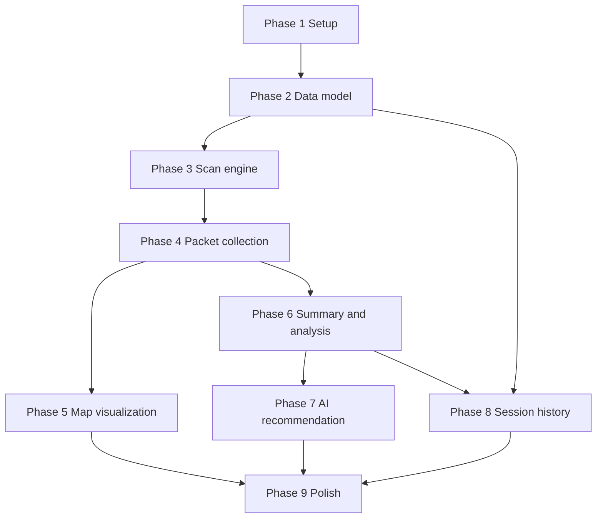

# Tasks — Local Mesh Discovery

## Legend

- `[ ]` not started
- `[P]` can be done in parallel with other tasks in the same phase once dependencies are met
- Task IDs are ordered for dependency tracking, not necessarily for one-commit-per-task execution

## Phase 0 — Design Standards Gate (Blocking)

- [ ] **D000** `[UI-GATE]` Review `.skills/design-standards/SKILL.md` and upstream Meshtastic design standards; record constraints for discovery scan screen, map overlays, summary cards, session history list, and AI recommendation UI.

**Phase dependency**: none  
**Exit criteria**: Design constraints are documented and ready to guide implementation.

## Phase 1 — Setup (module creation, navigation routes, DI)

- [ ] **D001** Create `feature/discovery/` with `meshtastic.kmp.feature` + serialization plugin setup, source sets, namespace, and baseline dependencies.
- [ ] **D002** Add `FeatureDiscoveryModule` with `@Module` + `@ComponentScan("org.meshtastic.feature.discovery")`.
- [ ] **D003** Register the module in `settings.gradle.kts` and include it in Android / Desktop Koin roots.
- [ ] **D004** Add typed discovery routes to `core/navigation/src/commonMain/kotlin/org/meshtastic/core/navigation/Routes.kt`.
- [ ] **D005** Extend `DeepLinkRouter` and navigation tests for discovery entry paths.
- [ ] **D006** Add the Settings > Advanced entry point and placeholder discovery screen wiring.

**Phase dependency**: none  
**Exit criteria**: the app can navigate to an empty/placeholder Local Mesh Discovery screen and compile across KMP targets.

## Phase 2 — Data model (Room entities, DAOs, migrations)

- [ ] **D007** [P] Add `DiscoverySessionEntity`, `DiscoveryPresetResultEntity`, and `DiscoveredNodeEntity` under `core:database`.
- [ ] **D008** [P] Add discovery DAO interfaces and relation models.
- [ ] **D009** Register entities / DAOs in `MeshtasticDatabase` and bump the schema version.
- [ ] **D010** Add DAO tests for insert, relation loading, sort order, and cascade deletion.
- [ ] **D011** Add migration coverage for the new schema version.

**Depends on**: D001  
**Exit criteria**: discovery data can be persisted and queried in tests.

## Phase 3 — Scan engine (preset cycling, admin messages, BLE reconnection)

- [ ] **D012** [P] Add discovery prefs contract in `core:repository` and DataStore implementation in `core:prefs`.
- [ ] **D013** [P] Implement `DiscoveryScanState` / state machine in `commonMain`.
- [ ] **D014** [P] Implement `DiscoveryScanCoordinator` to validate inputs, snapshot home preset, switch presets, and manage dwell timing.
- [ ] **D014b** [P] Implement `DiscoveryViewModel` in `commonMain` to expose scan state, session data, and user actions to the UI layer. Wire to `DiscoveryScanCoordinator` and `DiscoveryRepository`.
- [ ] **D015** [P] Reuse the existing radio config/admin path to apply `Config.LoRaConfig` preset changes.
- [ ] **D016** [P] Observe shared connection state and pause/resume around BLE reconnects without introducing a custom reconnect loop.
- [ ] **D017** [P] Persist scan lifecycle milestones (session start, preset start, stop/cancel/fail, restore result).
- [ ] **D018** Add unit tests for normal flow, reconnect delays, timeout, cancel, and home-preset restore failure.

**Depends on**: D007-D009  
**Exit criteria**: a scan can run end-to-end against fake or mocked dependencies and persist lifecycle state correctly.

## Phase 4 — Packet collection (integrate with existing packet pipeline)

- [ ] **D019** [P] Implement `DiscoveryPacketCollector` that listens to shared packet / node / neighbor flows.
- [ ] **D020** [P] Trigger neighbor info requests at dwell boundaries through the existing command path.
- [ ] **D021** [P] Aggregate per-preset metrics (packet count, telemetry count, neighbor count, unique nodes, best distance, link quality).
- [ ] **D022** [P] Upsert `DiscoveredNodeEntity` rows with deduped per-preset observations.
- [ ] **D023** Add tests for duplicate packets, nodes without positions, and neighbor-info-only sightings.

**Depends on**: D014-D017  
**Exit criteria**: preset results and per-node observations are populated from live/shared data sources.

## Phase 5 — Map visualization (CompositionLocal map, markers, topology)

- [ ] **D024** [P] Build shared discovery map presentation models and preset filter state in `commonMain`.
- [ ] **D025** [P] Implement `DiscoveryMapScreen` and node detail sheet/cards using Compose Multiplatform. Verify that distance displays use `MetricFormatter` / `Node.distance(...)` shared formatting (FR-016).
- [ ] **D026** [P] Reuse or extend platform map providers for discovery overlays on Android.
- [ ] **D027** [P] Provide Desktop map fallback (provider or placeholder/list hybrid) that does not break the feature.
- [ ] **D028** Add UI tests for preset filtering, mapped/unmapped counts, and topology toggle behavior.

**Depends on**: D019-D022  
**Exit criteria**: persisted discovery sessions can render a map tab or safe fallback on supported targets.

## Phase 6 — Summary / analysis (per-preset metrics, charts)

- [ ] **D029** [P] Implement `DiscoveryRankingEngine` deterministic heuristic in `commonMain`.
- [ ] **D030** [P] Build summary presentation models for overview cards, comparison table, and tie explanations.
- [ ] **D031** [P] Implement `DiscoverySummaryScreen` with per-preset ranking, warnings, and partial-session handling.
- [ ] **D032** Add tests for ranking ties, failed presets, and deterministic fallback output.

**Depends on**: D021-D022  
**Exit criteria**: every completed or partial session produces a usable non-AI summary.

## Phase 7 — AI recommendation (Gemini Nano integration)

- [ ] **D033** [P] Define `DiscoveryRecommendationEngine` and result contracts in `commonMain`.
- [ ] **D034** [P] Bind `RuleBasedDiscoveryRecommendationEngine` as the always-available default.
- [ ] **D035** [P] Implement Android Google-flavor Gemini Nano adapter and availability checks.
- [ ] **D036** [P] Add opt-in UI and non-blocking fallback behavior.
- [ ] **D037** Add tests for supported / unsupported / failure cases.

**Depends on**: D029-D031  
**Exit criteria**: AI can enhance the summary on supported devices without blocking unsupported targets.

## Phase 8 — Session history (list, detail, delete)

- [ ] **D038** [P] Implement `DiscoveryHistoryScreen` with newest-first sessions and status chips.
- [ ] **D039** [P] Implement session detail routing and history-to-detail navigation.
- [ ] **D040** [P] Implement delete flow with cascade validation.
- [ ] **D041** Ensure historical sessions load entirely from Room without requiring a live radio connection.
- [ ] **D042** Add tests for history sorting, deep-link session load, and delete behavior.

**Depends on**: D007-D010, D029-D031  
**Exit criteria**: stored sessions can be reopened and managed after app restart.

## Phase 9 — Polish (PDF export, accessibility, edge cases)

- [ ] **D043** [P] Implement Android share / PDF export and Desktop save/export fallback.
- [ ] **D044** [P] Add accessibility polish: semantics, progress announcements, disabled-preset explanations, and large-screen layout checks.
- [ ] **D045** [P] Finalize 2.4 GHz hardware gating using `DeviceHardwareRepository` + current radio metadata.
- [ ] **D046** [P] Add logging / diagnostics and make sure the feature is debuggable through existing app logging tools.
- [ ] **D047** [P] Add strings, icons, and docs updates (`core/resources`, deep-link docs, quickstart references).
- [ ] **D048** Run targeted and full verification commands.

**Depends on**: all previous phases  
**Exit criteria**: feature is shippable, documented, accessible, and validated.

## Dependency Graph



## Parallelization Opportunities

### After Phase 1

- `[P]` D007-D008 (data model) can proceed while D006 finishes the initial placeholder UI.
- `[P]` Deep-link tests and settings entry UI work can be split between navigation and UI contributors.

### After Phase 2

- `[P]` D012 (prefs) can run in parallel with D013-D014 (scan state machine).
- `[P]` DAO tests and migration tests can be split because they touch different `core:database` test suites.

### After Phase 4

- `[P]` Phase 5 map work and Phase 6 summary work can proceed in parallel because both depend on persisted discovery aggregates rather than each other.
- `[P]` Android-specific map bindings and Desktop fallback work can be split by target owner.

### After Phase 6

- `[P]` Phase 7 AI integration can proceed independently from Phase 8 history UI once the summary contract is stable.
- `[P]` Export work in Phase 9 can start early once summary/detail presentation models are frozen.

## Suggested Validation Commands

### Targeted during development

```bash
./gradlew :feature:discovery:allTests
./gradlew :core:database:allTests
./gradlew :app:testFdroidDebugUnitTest
./gradlew kmpSmokeCompile
```

### Final local verification

```bash
./gradlew spotlessApply detekt assembleDebug test allTests
./gradlew lintFdroidDebug lintGoogleDebug
```

## Suggested Commit / PR Slices

1. **Navigation + module skeleton**
2. **Room schema + DAO tests**
3. **Scan engine + persistence**
4. **Summary + history UI**
5. **Map overlays + export**
6. **Optional Gemini Nano integration**

Keeping AI as the last slice reduces risk and makes it easy to land the core diagnostic feature even if device/model support needs extra iteration.
