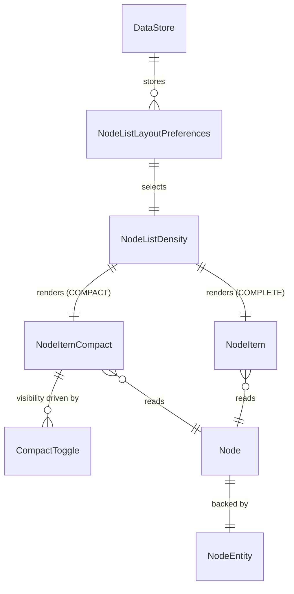

# Data Model — Node List Layout

## Overview

The Node List Layout feature does not introduce new database entities. It adds **preference keys** to DataStore and a **density enum** that controls how existing `Node` model data is rendered. The data model is entirely read-only from the layout perspective — node data comes from the existing Room KMP pipeline.

## Entity Relationship



## Density Enum

```kotlin
package org.meshtastic.feature.node.model

enum class NodeListDensity {
    COMPLETE,
    COMPACT;
}
```

- Persisted as a `String` (enum name) in DataStore under key `nodeListDensity`.
- Default: `COMPLETE`.

## Preference Keys

```kotlin
package org.meshtastic.core.prefs.ui

enum class NodeListLayoutPreferences(val key: String, val defaultValue: Boolean) {
    SHOW_POWER("shouldShowPower", true),
    SHOW_LAST_HEARD("shouldShowLastHeard", true),
    LAST_HEARD_RELATIVE("lastHeardIsRelative", false),
    SHOW_LOCATION("shouldShowLocation", true),
    SHOW_HOPS("shouldShowHops", true),
    SHOW_SIGNAL("shouldShowSignal", true),
    SHOW_CHANNEL("shouldShowChannel", true),
    SHOW_ROLE("shouldShowRole", true),
    SHOW_TELEMETRY("shouldShowTelemetry", true);
}
```

### Preference Access Pattern

Each key is exposed as a `StateFlow<Boolean>` in `UiPrefsImpl`:

```kotlin
val shouldShowPower: StateFlow<Boolean> = dataStore.data
    .map { it[booleanPreferencesKey("shouldShowPower")] ?: true }
    .stateIn(scope, SharingStarted.Eagerly, true)
```

The density preference follows the same pattern but maps to the enum:

```kotlin
val nodeListDensity: StateFlow<NodeListDensity> = dataStore.data
    .map { prefs ->
        val name = prefs[stringPreferencesKey("nodeListDensity")] ?: "COMPLETE"
        NodeListDensity.valueOf(name)
    }
    .stateIn(scope, SharingStarted.Eagerly, NodeListDensity.COMPLETE)
```

## Node Data Fields Used by Layout

The layout reads from the existing `Node` model in `core:model`. No new fields are added.

| Field | Type | Used By | Condition |
|-------|------|---------|-----------|
| `longName` | `String?` | Both | Always shown |
| `shortName` | `String?` | Both | NodeChip avatar |
| `lastHeard` | `Long` | Both | Non-zero, not > 1 year future |
| `hopsAway` | `Int` | Both | `> 0` for hop count, `== 0` for signal |
| `snr` | `Float` | Both | `!= 0` and `!viaMqtt` |
| `rssi` | `Int` | Both | Signal quality via `determineSignalQuality(snr, rssi)` |
| `batteryLevel` | `Int?` | Both | Non-null |
| `channel` | `Int` | Both | `> 0` |
| `position` | `Position?` | Both | Non-null, valid lat/lon |
| `role` | `DeviceRole` | Both | Always (defaults to 0) |
| `viaMqtt` | `Boolean` | Both | Signal exclusion gate |
| `isFavorite` | `Boolean` | Both | Star icon |
| `hasPositionLog` | `Boolean` | Both | Log icon visibility |
| `hasEnvironmentLog` | `Boolean` | Both | Log icon visibility |
| `hasDetectionSensorLog` | `Boolean` | Both | Log icon visibility |
| `hasTracerouteLog` | `Boolean` | Both | Log icon visibility |
| `hasDeviceMetricsLog` | `Boolean` | Both | Log icon visibility |

## Adaptive Chip Sizing

The compact `NodeChip` size is derived from a `lineCount` property:

```kotlin
val lineCount: Int = buildList {
    add(1) // Row 1: name — always present
    if (shouldShowLastHeard) add(1)
    if (shouldShowLocation || shouldShowHops || shouldShowSignal ||
        shouldShowChannel || shouldShowRole || shouldShowTelemetry) add(1)
}.size

val chipSize: Dp = max(36.dp, min(70.dp, 24.dp * lineCount))
```

| lineCount | Chip Size | Active Rows |
|-----------|-----------|-------------|
| 1 | 36.dp | Name only |
| 2 | 48.dp | Name + last heard OR Name + combined |
| 3 | 70.dp | Name + last heard + combined |

## Validation Rules

- `nodeListDensity` must be a valid `NodeListDensity` enum name. Invalid values fall back to `COMPLETE`.
- `lastHeardIsRelative` is functionally irrelevant when `shouldShowLastHeard` is `false` (the UI disables the toggle).
- All boolean preferences default to `true` except `lastHeardIsRelative` which defaults to `false`.
- The layout never writes to `Node` data — all mutations flow through the existing packet processing pipeline.
