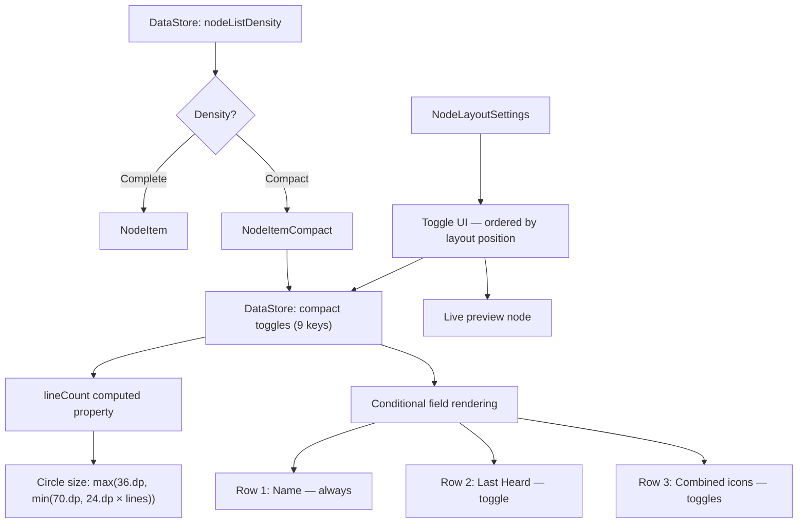

# Feature Specification: Node List Layout

**Feature Branch**: `002-node-list-layout`
**Created**: 2026-05-07
**Status**: Not Started
**Input**: Node layout engine with complete and compact views for Compose Multiplatform

## Summary

Node List Layout introduces a density-switching system for the Meshtastic node list, giving users a choice between a full-detail "Complete" layout and a condensed "Compact" layout with per-field toggle controls. The feature lives entirely in `commonMain` (Compose Multiplatform) and persists preferences via DataStore.

## Goals

1. Let users reduce visual noise and scrolling on large meshes (100+ nodes) by switching to a compact row layout.
2. Give users fine-grained control over which data fields appear in compact mode via individually toggleable switches.
3. Provide adaptive circle sizing so the compact layout scales gracefully as fields are enabled or disabled.
4. Document signal strength color semantics in a discoverable help sheet.

## Non-Goals

- Modifying the Complete layout to support per-field toggles (it intentionally shows everything).
- Adding new data fields or metrics beyond what the node model already provides.
- Platform-specific layout variations — all UI is shared `commonMain`.

## User Scenarios & Testing *(mandatory)*

### User Story 1 — Switch Between Complete and Compact Density (Priority: P1)

A Meshtastic user with a large mesh (100+ nodes) wants a denser node list to reduce scrolling. They navigate to Settings > App Settings > Node Layout, switch from "Complete" to "Compact" using a segmented button, and the node list immediately re-renders with smaller rows. Switching back to "Complete" restores the full-detail layout.

**Why this priority**: The density switch is the core mechanic — all compact-specific toggles depend on it existing.

**Independent Test**: Open Settings > Node Layout, toggle between Complete and Compact, navigate to the Nodes tab, and verify the list renders with the correct row style.

**Acceptance Scenarios**:

1. **Given** the user has "Complete" selected, **When** they view the node list, **Then** each row displays the full-detail `NodeItem` layout with all available data fields.
2. **Given** the user switches to "Compact," **When** the node list re-renders, **Then** each row uses `NodeItemCompact` with a condensed two-column layout.
3. **Given** the user switches density, **When** the segmented button animates, **Then** the transition is smooth and a live preview node in Settings updates immediately.
4. **Given** the app is relaunched, **When** the node list loads, **Then** the previously selected density is restored from DataStore preferences.

---

### User Story 2 — Configure Compact Layout Fields (Priority: P1)

A user in Compact mode wants to hide fields they don't care about (e.g., telemetry log icons) and keep only what matters (e.g., last heard time and signal). They open Settings > Node Layout, see toggles for each compact field ordered to match the visual layout, and flip individual switches. The live preview node at the bottom of the settings section updates in real time.

**Why this priority**: Per-field toggles are the primary value proposition of the compact layout — without them, compact is just a fixed alternative.

**Independent Test**: Switch to Compact, disable all toggles one by one, verify each field disappears from both the preview and the node list. Re-enable them and verify they reappear.

**Acceptance Scenarios**:

1. **Given** the user is in Compact mode, **When** they toggle "Power" off, **Then** the battery indicator below the circle disappears.
2. **Given** "Last Heard Time" is toggled off, **When** the node list renders, **Then** the last-heard row (online/offline icon + timestamp) is hidden and the circle shrinks.
3. **Given** "Distance and Bearing" is toggled off, **When** a node has position data, **Then** the distance text and compass arrow are hidden from the combined row.
4. **Given** "Hops Away" is toggled off, **When** a node has `hopsAway > 0`, **Then** the hop count indicator is hidden.
5. **Given** "Signal (Direct Only)" is toggled off, **When** a direct node has SNR data, **Then** the color-coded signal indicator is hidden.
6. **Given** "Channel" is toggled off, **When** a node is on channel > 0, **Then** the channel number indicator is hidden.
7. **Given** "Device Role" is toggled off, **When** the node list renders, **Then** the role icon, unmessagable icon, store-and-forward icon, and MQTT icon are all hidden.
8. **Given** "Log Icons" is toggled off, **When** a node has telemetry logs, **Then** the device metrics, positions, environment, sensor, and trace route icons are hidden.
9. **Given** "Relative Last Heard Time" is toggled on and "Last Heard Time" is on, **When** the row renders, **Then** the timestamp shows relative format (e.g., "2 hours ago") instead of absolute date/time.
10. **Given** "Last Heard Time" is toggled off, **When** the user views the "Relative Last Heard Time" toggle, **Then** it is disabled (grayed out).

---

### User Story 3 — Adaptive Circle Sizing (Priority: P2)

As the user disables rows in the compact view, the short-name circle should shrink proportionally so that single-row nodes don't have an oversized avatar. The circle always renders as a `CircleText` composable — never collapsing to a flat capsule.

**Why this priority**: Visual consistency and density optimization. Without adaptive sizing, disabling rows wastes vertical space.

**Independent Test**: Disable all optional rows (last heard + combined row), verify the circle shrinks to minimum size (36.dp). Enable all rows, verify it grows to maximum (70.dp).

**Acceptance Scenarios**:

1. **Given** all toggleable rows are enabled (`lineCount == 3`), **When** the compact row renders, **Then** the circle diameter is 70.dp.
2. **Given** only the name row is active (`lineCount == 1`), **When** the compact row renders, **Then** the circle diameter is 36.dp (minimum).
3. **Given** any toggle configuration, **When** the compact row renders, **Then** the short name always displays as a `CircleText`, never as a capsule or pill shape.

---

### User Story 4 — Signal Strength Help Documentation (Priority: P3)

A user sees colored signal indicators on their node list and wants to understand what the colors mean. They tap the help button (?) at the bottom of the node list and see a documented legend with color-coded signal entries and a description of the gradient gauge bar.

**Why this priority**: Discoverability — without documentation the color scheme is opaque to new users.

**Independent Test**: Open the node list, tap the help icon, scroll to the "Node Details" section, verify all four signal color entries (Good/Fair/Bad/Very Bad) and the gradient meter entry are present with correct colors and descriptions.

**Acceptance Scenarios**:

1. **Given** the user opens Node List Help, **When** they scroll to "Node Details," **Then** they see four signal strength entries with green, yellow, orange, and red signal icons using MeshtasticIcons.
2. **Given** the user reads "Signal: Good," **Then** the subtitle explains SNR is above the modem preset limit.
3. **Given** the user reads "Signal Strength Meter," **Then** the entry shows a mini gradient gauge and explains it combines SNR and RSSI relative to the modem preset (Complete layout only).

---

### Edge Cases

- **All compact toggles disabled**: Only the name row (long name, lock icon, favorite star) and the circle remain. The circle shrinks to 36.dp. Battery is hidden.
- **Node has no data for a toggled-on field**: The field is simply absent — no placeholder or empty state. For example, "Distance and Bearing" enabled but node has no position → nothing shown.
- **Signal vs. Hops mutual exclusivity**: Signal (Direct Only) only renders when `hopsAway == 0` (direct connection). Hops Away only renders when `hopsAway > 0`. They never appear simultaneously for the same node.
- **Channel 0**: Channel indicator is hidden when `channel == 0` regardless of toggle state, since channel 0 is the default primary channel.
- **Connected node excluded from distance**: Distance and bearing are never shown for the directly connected node (`connectedNode == node.num`).
- **MQTT nodes excluded from signal**: Signal strength is hidden for nodes heard via MQTT (`viaMqtt == true`), since SNR/RSSI is not meaningful for internet-relayed packets.
- **Future date filtering**: Last heard time is hidden if the timestamp is more than 1 year in the future (guards against clock-skew or corrupted data).

## Architecture

### Layout Structure — Compact

```
┌──────────────────────────────────────────────────────┐
│ ┌──────────┐  Row 1: 🔒 Long Name          ★ (fav)  │
│ │  Circle   │  Row 2: ● Last Heard Time              │
│ │  (Short)  │  Row 3: [dist] [hops|signal] [ch]      │
│ │  Battery  │         [role] [telemetry icons]        │
│ └──────────┘                                          │
└──────────────────────────────────────────────────────┘
```

- **Column 1** (fixed width): `CircleText` composable + optional `MaterialBatteryInfo`
- **Column 2** (weight 1f): `Column(verticalArrangement = spacedBy(2.dp))` with up to 3 rows
  - Row 1 (always visible): Lock/key icon, long name, favorite star
  - Row 2 (toggle: Last Heard Time): Online/offline icon + timestamp via `LastHeardInfo`
  - Row 3 (toggle: any of Distance/Hops/Signal/Channel/Role/Telemetry): Combined `Row` of chips separated by `VerticalDivider(height = 15.dp)`

### Layout Structure — Complete

```
┌──────────────────────────────────────────────────────┐
│ ┌──────────┐  Row 1: 🔒 Long Name          ★ (fav)  │
│ │  Circle   │  Row 2: 📡 Connected (if direct)       │
│ │  (Short)  │  Row 3: ● Last Heard (always shown)    │
│ │  Battery  │  Row 4: 👤 Role: <name>                │
│ └──────────┘  Row 5: 📏 Distance + Bearing           │
│               Row 6: Channel + MQTT                   │
│               Row 7: 📜 Logs: [icons]                 │
│               Row 8: 🐇 Hops Away OR Signal Gauge     │
└──────────────────────────────────────────────────────┘
```

- No user-configurable toggles — all fields shown when data exists
- Signal shown as `LoRaSignalStrengthMeter` gradient gauge (red→green)
- Circle is fixed at 70.dp

### Data Flow



### Key Components

| Component | Module / File | Purpose |
|-----------|---------------|---------|
| `NodeListDensity` | `feature/node` | Enum: `COMPLETE` / `COMPACT` |
| `NodeListLayoutPreferences` | `core/prefs` | DataStore keys for density + 9 compact toggles |
| `NodeItemCompact` | `feature/node/component/` | Compact row composable with toggle-driven visibility |
| `NodeItem` | `feature/node/component/` | Complete row composable — no toggles, all data shown |
| `NodeLayoutSettings` | `feature/settings/` | Density picker (SegmentedButton) + compact toggles + live preview |
| `NodeListScreen` | `feature/node/list/` | Parent composable — reads density, delegates to correct item |
| `NodeListHelp` | `feature/node/component/` | Help bottom sheet with signal legend + gradient gauge docs |
| `CircleText` | `core/ui/component/` | Reusable short-name avatar circle |
| `MaterialBatteryInfo` | `core/ui/component/` | Battery level indicator |
| `HopsInfo` | `core/ui/component/` | Hop count chip |
| `DistanceInfo` | `core/ui/component/` | Distance + bearing chip |
| `Snr` / `Rssi` | `core/ui/component/` | Signal quality chips |
| `LastHeardInfo` | `core/ui/component/` | Last heard timestamp chip |
| `LoRaSignalStrengthMeter` | `core/ui/component/` | Gradient gauge (Complete mode) |

## Requirements *(mandatory)*

### Functional Requirements

- **FR-001**: The system MUST provide a "Node Layout" section in App Settings with a `SegmentedButton` offering "Complete" and "Compact" density options.
- **FR-002**: The selected density MUST persist across app launches via DataStore using the `nodeListDensity` preference key in `core:prefs`.
- **FR-003**: When "Compact" is selected, the system MUST display 9 toggles (`Switch` composables) in the order they appear in the compact layout: Power, Last Heard Time, Relative Last Heard Time, Distance and Bearing, Hops Away, Signal (Direct Only), Channel, Device Role, Log Icons.
- **FR-004**: Each toggle MUST persist its state via DataStore using the corresponding `NodeListLayoutPreferences` key.
- **FR-005**: All toggles MUST default to `true` (enabled) except "Relative Last Heard Time" which defaults to `false`.
- **FR-006**: The "Relative Last Heard Time" toggle MUST be disabled (grayed out via `enabled = false`) when "Last Heard Time" is toggled off.
- **FR-007**: When "Complete" is selected, the toggle section MUST be replaced with descriptive text: "The Complete layout displays all available node data. Fields with no data are automatically hidden."
- **FR-008**: A live preview MUST render below the toggles using a representative node from Room KMP, reflecting the current density and toggle state in real time via `collectAsState()`.
- **FR-009**: The compact layout MUST render as a two-column `Row`: Column 1 (fixed width: circle + battery), Column 2 (`Modifier.weight(1f)`: `Column` of up to 3 content rows).
- **FR-010**: The short name MUST always render as a `CircleText` composable in compact mode, never as a capsule or alternative shape.
- **FR-011**: The circle diameter MUST scale adaptively: `max(36.dp, min(70.dp, 24.dp × lineCount))` where `lineCount` counts active row groups (1 base + 1 if last-heard enabled + 1 if any combined-row toggle is enabled).
- **FR-012**: Row 1 (name) MUST always display: lock/key encryption icon (from MeshtasticIcons), long name, and favorite star (if favorited). This row is not toggleable.
- **FR-013**: Row 2 (last heard) MUST display when the "Last Heard Time" toggle is on and the node has a valid `lastHeard` timestamp (non-zero, not more than 1 year in the future). It shows an online (green checkmark) or offline (orange moon) icon plus the formatted timestamp via `LastHeardInfo`.
- **FR-014**: Row 3 (combined icons) MUST display as a `Row(horizontalArrangement = spacedBy(6.dp))` with `VerticalDivider(modifier = Modifier.height(15.dp))` between groups, in this order: Distance+Bearing, Hops Away, Signal, Channel, Device Role, Log Icons.
- **FR-015**: Distance and Bearing MUST only render when the toggle is on, the node has positions, the node is not the connected node, and valid location data is available for both the user and the node.
- **FR-016**: Hops Away MUST only render when the toggle is on and `node.hopsAway > 0`.
- **FR-017**: Signal MUST only render when the toggle is on, `node.hopsAway == 0`, `node.snr != 0`, and `node.viaMqtt == false`. The icon color MUST use `getSnrColor(snr, preset)`.
- **FR-018**: Channel MUST only render when the toggle is on and `node.channel > 0` (non-default channel).
- **FR-019**: Device Role MUST render the role's MeshtasticIcons icon plus conditional unmessagable, store-and-forward, and MQTT icons when the toggle is on.
- **FR-020**: Log Icons MUST render when the toggle is on and the node has at least one of: positions, environment metrics, detection sensor metrics, or trace routes. Icons shown: device metrics, positions (mappin), environment, detection sensor, trace routes (signpost) — all from MeshtasticIcons.
- **FR-021**: The complete layout (`NodeItem`) MUST display all data fields unconditionally (no user toggles), hiding fields only when the underlying data is absent.
- **FR-022**: The complete layout MUST show signal strength as a `LoRaSignalStrengthMeter` with a red→orange→yellow→green gradient, not as a single colored icon.
- **FR-023**: The Node List Help sheet MUST document signal strength colors (Good/green, Fair/yellow, Bad/orange, Very Bad/red) with the appropriate MeshtasticIcons signal icon for each.
- **FR-024**: The Node List Help sheet MUST document the gradient signal strength meter used in the Complete layout, with a mini `LinearProgressIndicator` or custom gauge as the visual symbol.
- **FR-025**: Both compact and complete layouts MUST include full TalkBack accessibility via `Modifier.semantics` and `contentDescription` covering: name, connection status, favorite status, last heard, online/offline, role, hops, battery, distance, heading, and signal strength.
- **FR-026**: Compact rows MUST use `Column(verticalArrangement = spacedBy(2.dp))` for consistent tight inter-row spacing.
- **FR-027**: Compact rows MUST have 2.dp top and bottom padding. Complete rows MUST have 3.dp top and bottom padding.

### Non-Functional Requirements

- **NFR-001**: Toggle state changes MUST reflect in the UI within one recomposition cycle (no perceptible delay).
- **NFR-002**: The compact layout MUST render smoothly at 60fps when scrolling a `LazyColumn` of 200+ nodes.
- **NFR-003**: DataStore preference keys MUST use the `NodeListLayoutPreferences` enum values to prevent key string drift.
- **NFR-004**: The compact view MUST use `LazyColumn` with stable `key` parameters for efficient rendering and item reuse.

### Signal Strength Thresholds

Signal color is determined by `getSnrColor(snr, preset)` relative to the active modem preset's SNR limit:

| Condition | Color | Help Label |
|-----------|-------|------------|
| SNR > preset limit | Green | Good |
| SNR < preset limit AND SNR > (limit − 5.5) | Yellow | Fair |
| SNR ≥ (limit − 7.5) | Orange | Bad |
| SNR < (limit − 7.5) | Red | Very Bad |

## Success Criteria *(mandatory)*

### Measurable Outcomes

- **SC-001**: A user can switch between Complete and Compact density and see the node list re-render within 1 second.
- **SC-002**: All 9 compact toggles persist across app launches and correctly show/hide their corresponding UI elements.
- **SC-003**: The live preview in Settings accurately reflects the current toggle configuration for both density modes.
- **SC-004**: The help sheet documents all signal strength indicators including the 4 color-coded icon entries and the gradient gauge entry.
- **SC-005**: Compact mode reduces visible row height by at least 40% compared to Complete mode for a node with full data.
- **SC-006**: TalkBack reads a complete, meaningful description for nodes in both Complete and Compact layouts.

## Toggle Reference

| Toggle Label | DataStore Key | Default | Layout Position | Data Condition |
|---|---|---|---|---|
| Power | `shouldShowPower` | `true` | Column 1, below circle | `node.batteryLevel != null` |
| Last Heard Time | `shouldShowLastHeard` | `true` | Row 2 | Valid `lastHeard` timestamp |
| Relative Last Heard Time | `lastHeardIsRelative` | `false` | Row 2 (format only) | `shouldShowLastHeard == true` |
| Distance and Bearing | `shouldShowLocation` | `true` | Row 3, position 1 | Node has positions + not connected node + valid location |
| Hops Away | `shouldShowHops` | `true` | Row 3, position 2 | `hopsAway > 0` |
| Signal (Direct Only) | `shouldShowSignal` | `true` | Row 3, position 3 | `hopsAway == 0` + `snr != 0` + `!viaMqtt` |
| Channel | `shouldShowChannel` | `true` | Row 3, position 4 | `channel > 0` |
| Device Role | `shouldShowRole` | `true` | Row 3, position 5 | Always (role defaults to 0) |
| Log Icons | `shouldShowTelemetry` | `true` | Row 3, position 6 | Node has positions/environment/sensor/traces |

## Assumptions

- The node list data model (`Node` in `core:model`, backed by `NodeEntity` in `core:database`) is fully populated by the packet processing pipeline. The layout engine only reads — it never writes to the model.
- `CircleText`, `MaterialBatteryInfo`, `HopsInfo`, `DistanceInfo`, `Snr`, `Rssi`, and `LastHeardInfo` are pre-existing reusable components in `core:ui`. The layout engine composes them but does not modify them.
- `getSnrColor` uses modem-preset-relative thresholds, not absolute SNR values. The user's active modem preset is read from DataStore preferences.
- The live preview uses the first node from a Room KMP query sorted by `lastHeard` descending — it requires at least one node in the database to render.
- The Complete layout is intentionally not configurable — its purpose is to show everything, acting as the baseline reference.
- All business logic and UI composables reside in `commonMain` source set. No platform-specific code is required for this feature.
- String resources for toggle labels and help text are added to `core/resources/src/commonMain/composeResources/values/strings.xml` using `stringResource(Res.string.key)`.
