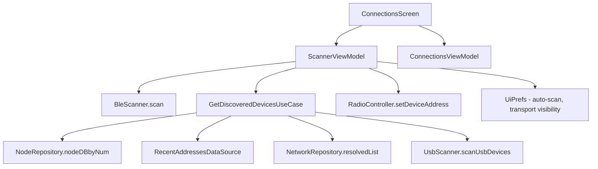

# Feature Specification: Device Connections

**Feature Branch**: `005-device-connections`  
**Created**: 2026-07-14  
**Status**: Migrated  
**Input**: Brownfield migration — reverse-engineered from existing `feature/connections` module

## Summary

Device Connections is the central connection management feature of Meshtastic-Android. It provides BLE scanning, USB/Serial enumeration, TCP/NSD (mDNS) network discovery, manual IP entry, and device selection/disconnection — all from a unified Connections screen. The feature drives a `ScannerViewModel` with platform subclasses (`AndroidScannerViewModel`, `JvmScannerViewModel`) that handle bonding, permissions, and transport-specific pairing. All business logic and Compose Multiplatform UI reside in `commonMain`; platform-specific bonding and USB permission flows are delegated to `androidMain` and `jvmMain` source sets.

## Goals

1. Allow users to discover nearby Meshtastic nodes via BLE, USB, and TCP/NSD and connect to them with a single tap.
2. Provide transport-visibility filter chips so users can hide irrelevant transports (e.g., hide USB on a phone with no OTG cable).
3. Support manual TCP address entry (IP + port) for direct connections without mDNS.
4. Display real-time connection status, progress chatter, and RSSI signal quality for BLE devices.
5. Persist recent TCP addresses and BLE auto-scan / network auto-scan preferences across sessions.

## Non-Goals

- Firmware update or OTA — handled by a separate feature module.
- Channel or radio configuration — managed by `feature/settings`.
- Bluetooth permissions prompts — handled by `core/ble` and the OS; this feature assumes permissions are already granted.
- Mesh topology display or route management — handled by `feature/nodes`.

## User Scenarios & Testing *(mandatory)*

### User Story 1 — Discover and Connect via BLE (Priority: P1)

A user opens the Connections screen and taps "Scan Bluetooth" to discover nearby Meshtastic devices. They see a list of bonded and scanned BLE devices, each showing the device name, MAC address, signal strength (RSSI), and (if previously connected) a node chip with the mesh identity. Tapping a bonded device immediately initiates a connection; tapping an unbonded device triggers the OS bonding dialog first.

**Why this priority**: BLE is the primary transport for the majority of Meshtastic users. Without BLE discovery, users cannot connect to their radios.

**Independent Test**: Can be tested by starting a BLE scan, verifying devices appear in the list with correct RSSI indicators, and tapping a device to connect.

**Acceptance Scenarios**:

1. **Given** the Connections screen is open and BLE auto-scan is enabled, **When** the screen opens, **Then** BLE scanning starts automatically and the scanning indicator is visible.
2. **Given** a BLE scan is running, **When** a Meshtastic device is discovered, **Then** it appears in the BLE section with its advertised name and RSSI.
3. **Given** a bonded BLE device is in the list, **When** the user taps it, **Then** the connection is initiated immediately and the status card shows "Connecting…".
4. **Given** an unbonded BLE device is in the list, **When** the user taps it, **Then** the platform bonding dialog is shown; on success, the connection proceeds.
5. **Given** a BLE scan is running, **When** the user taps "Stop", **Then** scanning stops but discovered devices remain visible.
6. **Given** multiple devices are discovered, **When** the list renders, **Then** bonded devices sort by name first, then unbonded devices appear in discovery order (RSSI updates do not reorder).

---

### User Story 2 — Discover and Connect via TCP/Network (Priority: P2)

A user enables network scanning to discover Meshtastic devices via NSD/mDNS on the local network. Discovered devices show their short name and device ID derived from TXT records. Previously connected TCP devices appear in a "Recent" section for quick reconnection.

**Why this priority**: TCP is the second most common transport, especially for users connecting to stationary nodes or using the device over Wi-Fi.

**Independent Test**: Can be tested by enabling network scan, verifying NSD-discovered devices appear, and tapping one to connect.

**Acceptance Scenarios**:

1. **Given** the user taps "Scan Network", **When** NSD discovery resolves services, **Then** discovered TCP devices appear with display names derived from mDNS TXT records (`shortname` + `id`).
2. **Given** a device was previously connected via TCP, **When** the Connections screen opens, **Then** it appears in the "Recent Network Devices" section (unless currently discovered via NSD).
3. **Given** a discovered TCP device exists in the local node database, **When** it renders, **Then** a NodeChip with the mesh identity is shown.
4. **Given** the user long-presses a recent TCP device, **When** the context action fires, **Then** it can be removed from the recent list.
5. **Given** Android 15+ requires `ACCESS_LOCAL_NETWORK` for NSD, **When** permission is not yet granted, **Then** the system permission dialog is shown before scanning starts.

---

### User Story 3 — Add a Manual TCP Device (Priority: P2)

A user taps "Add network device manually" and enters an IP address and optional port in a bottom sheet dialog. The device is added to the recent list and a connection is initiated immediately.

**Why this priority**: Not all networks support mDNS; manual entry is essential for advanced users and enterprise deployments.

**Independent Test**: Can be tested by opening the manual-add dialog, entering a valid IP, and verifying the device is added and selected.

**Acceptance Scenarios**:

1. **Given** the user taps "Add network device manually", **When** the bottom sheet opens, **Then** an address field and a port field (defaulting to `4403`) are shown.
2. **Given** the user enters a valid IP address, **When** they tap "Add", **Then** the device is added to recent addresses and selected as the active device.
3. **Given** the user enters an invalid address, **When** they tap "Add", **Then** nothing happens (validation prevents submission).

---

### User Story 4 — Connect via USB/Serial (Priority: P3)

A user plugs in a Meshtastic device via USB. The device appears in the USB section of the Connections list. On Android, the USB permission dialog is shown if not already granted.

**Why this priority**: USB is a less common transport but critical for firmware development and desktop use.

**Independent Test**: Can be tested by connecting a USB device and verifying it appears in the list; tapping grants permission and connects.

**Acceptance Scenarios**:

1. **Given** a USB device is connected, **When** the Connections screen is open, **Then** the device appears in the USB section with its device name and serial path.
2. **Given** USB permission has not been granted, **When** the user taps the device, **Then** the Android USB permission dialog is shown; on approval, connection proceeds.
3. **Given** a demo/mock transport is enabled, **When** the device list renders, **Then** a "Demo Mode" entry appears in the USB section.

---

### User Story 5 — View Connection Status and Disconnect (Priority: P1)

A user can see the current connection state at the top of the Connections screen. When connected, the status card shows the node's battery level, firmware version, signal strength, and a disconnect button. When connecting, it shows a progress spinner and status text. When no device is selected, it shows an empty state.

**Why this priority**: Connection status visibility is essential for all users to know whether their radio is accessible.

**Independent Test**: Can be tested by connecting a device and verifying the status card transitions correctly between NO_DEVICE → CONNECTING → CONNECTED states.

**Acceptance Scenarios**:

1. **Given** no device is selected, **When** the screen renders, **Then** the card shows "No device selected" with a muted icon.
2. **Given** a device is selected but not yet connected, **When** the screen renders, **Then** the card shows the device name, address, and a "Connecting…" spinner with progress text.
3. **Given** a device is connected and node info is available, **When** the screen renders, **Then** the card shows the node chip, battery info, RSSI (for BLE), firmware version, and a disconnect button.
4. **Given** a device is connected, **When** the user taps "Disconnect", **Then** the device address is cleared, the persisted device name is reset, and the card transitions to the "No device selected" state.
5. **Given** a device is connected and the LoRa region is not set, **When** the status card renders, **Then** a "Set your region" warning card is shown below.

---

### User Story 6 — Filter Transport Sections (Priority: P3)

A user toggles transport filter chips (BLE, Network, USB) to show or hide sections in the device list. Preferences are persisted across sessions.

**Why this priority**: UX refinement — reduces clutter when users only use one transport.

**Independent Test**: Can be tested by toggling each chip and verifying the corresponding section appears or disappears.

**Acceptance Scenarios**:

1. **Given** all transport chips are selected, **When** the device list renders, **Then** BLE, Network, and USB sections are all visible.
2. **Given** the user deselects the BLE chip, **When** the list re-renders, **Then** the BLE section is hidden.
3. **Given** the user re-opens the Connections screen, **When** preferences were persisted, **Then** the same transport filter state is restored.

---

### Edge Cases

- What happens when BLE scanning starts but no devices are found? → Section shows inline empty-state hint: "No Bluetooth devices seen — try scanning."
- What happens when the user disconnects mid-bonding? → `requestBonding()` catches exceptions and surfaces error via `serviceRepository.setErrorMessage()`.
- What happens when NSD resolves a device already in the recent list? → The device appears only in the Discovered section; it is filtered out of the Recent section.
- What happens when a TCP address has a non-default port? → The port is appended to the address string (e.g., `192.168.1.50:5000`).
- What happens when RSSI updates arrive during a scan? → RSSI is updated on the card but does not trigger a re-sort of the device list.

## Architecture

### Key Components

| Component | Module / File | Purpose |
|-----------|---------------|---------|
| `ScannerViewModel` | `feature/connections/ScannerViewModel.kt` | Platform-neutral ViewModel: BLE/USB/TCP scan control, device selection, disconnect |
| `AndroidScannerViewModel` | `feature/connections/AndroidScannerViewModel.kt` | Android override: `createBond()` for BLE, USB permission via `UsbRepository` |
| `JvmScannerViewModel` | `feature/connections/JvmScannerViewModel.kt` | JVM/Desktop override: direct GATT connect without explicit bonding |
| `ConnectionsScreen` | `feature/connections/ui/ConnectionsScreen.kt` | Top-level Composable: animated status card + device list + transport chips |
| `DeviceList` | `feature/connections/ui/components/DeviceList.kt` | Unified `LazyColumn` with BLE/Network/USB sections and manual-add dialog |
| `DeviceListItem` | `feature/connections/ui/components/DeviceListItem.kt` | Individual device row: icon, headline, address, RSSI, radio button |
| `TransportFilterChips` | `feature/connections/ui/components/TransportFilterChips.kt` | BLE/Network/USB filter chip row |
| `CurrentlyConnectedInfo` | `feature/connections/ui/components/CurrentlyConnectedInfo.kt` | Connected state card: battery, RSSI polling, node chip, firmware version |
| `ConnectingDeviceInfo` | `feature/connections/ui/components/ConnectingDeviceInfo.kt` | Connecting state card: spinner, status label, disconnect button |
| `DeviceListEntry` | `feature/connections/model/DeviceListEntry.kt` | Sealed class: `Ble`, `Usb`, `Tcp`, `Mock` device entries |
| `DiscoveredDevices` | `feature/connections/model/DiscoveredDevices.kt` | Data class aggregating all discovered device lists |
| `CommonGetDiscoveredDevicesUseCase` | `feature/connections/domain/usecase/CommonGetDiscoveredDevicesUseCase.kt` | Platform-agnostic device aggregation: TCP + USB + mock |
| `AndroidGetDiscoveredDevicesUseCase` | `feature/connections/domain/usecase/AndroidGetDiscoveredDevicesUseCase.kt` | Android-specific: adds bonded BLE + USB serial devices |
| `TcpDiscoveryHelpers` | `feature/connections/domain/usecase/TcpDiscoveryHelpers.kt` | Shared helpers: `processTcpServices`, `matchDiscoveredTcpNodes`, `buildRecentTcpEntries` |
| `UsbScanner` | `feature/connections/domain/usecase/UsbScanner.kt` | Interface for platform-specific USB device enumeration |
| `ConnectionsNavigation` | `feature/connections/navigation/ConnectionsNavigation.kt` | Navigation 3 graph: `ConnectionsRoute.Connections` and `ConnectionsRoute.ConnectionsGraph` |
| `FeatureConnectionsModule` | `feature/connections/di/FeatureConnectionsModule.kt` | Koin DI module with `@ComponentScan` |

### Data Flow

## Requirements *(mandatory)*

### Functional Requirements

- **FR-001**: System MUST discover nearby BLE devices advertising the Meshtastic service UUID and display them with name, address, and RSSI.
- **FR-002**: System MUST distinguish bonded from unbonded BLE devices and route unbonded devices through the platform bonding flow before connecting.
- **FR-003**: System MUST discover TCP/Network devices via NSD/mDNS and display them with short name and device ID derived from TXT records.
- **FR-004**: System MUST gate NSD scanning behind a user-initiated toggle to avoid Android 15+ system consent dialogs on screen entry.
- **FR-005**: System MUST allow manual TCP device addition by IP address and optional port (default 4403).
- **FR-006**: System MUST persist recent TCP addresses via `RecentAddressesDataSource` and display them in a "Recent" section when not currently discovered via NSD.
- **FR-007**: System MUST enumerate connected USB/Serial devices and display them in the USB section with device name and serial path.
- **FR-008**: System MUST show the current connection status in three states: NO_DEVICE, CONNECTING (with progress chatter), and CONNECTED (with node info, battery, firmware version).
- **FR-009**: System MUST allow the user to disconnect the current device, clearing the persisted device address and name.
- **FR-010**: System MUST provide transport filter chips (BLE, Network, USB) that toggle section visibility, with preferences persisted via `UiPrefs`.
- **FR-011**: System MUST sort bonded BLE devices by name and unbonded scanned devices by discovery order; RSSI updates MUST NOT trigger re-sorting.
- **FR-012**: System MUST match discovered/recent devices to nodes in the local database (by device ID or MAC suffix) and display a `NodeChip` when matched.
- **FR-013**: System MUST display a "Set your region" warning when the connected device's LoRa region is unset (unless in mock/demo mode).
- **FR-014**: System MUST provide a mock/demo transport entry in the USB section when the mock transport is enabled.

### Non-Functional Requirements

- **NFR-001**: BLE scan results MUST appear in the list within 1 scan interval of advertisement reception.
- **NFR-002**: RSSI display on device cards MUST throttle updates to every 2 seconds to prevent excessive recomposition.
- **NFR-003**: Connected device RSSI polling MUST timeout after 1 second per read to avoid blocking the UI.
- **NFR-004**: All UI composables MUST reside in `commonMain` — no `android.*` imports in UI code.
- **NFR-005**: Device addresses MUST be anonymized in log output via `anonymize()` extension to protect user privacy.

## Source-Set Impact

| Source Set | Impact | Justification |
|-----------|--------|---------------|
| `commonMain` | 20 files / ~2,496 lines | All business logic, UI, models, use cases, navigation |
| `commonTest` | 3 files / ~760 lines | ViewModel tests, use case tests, TCP helper tests |
| `androidMain` | 3 files / ~293 lines | `AndroidScannerViewModel` (bonding), `AndroidGetDiscoveredDevicesUseCase` (BLE + USB), `AndroidUsbDeviceData` |
| `jvmMain` | 4 files / ~174 lines | `JvmScannerViewModel`, `JvmGetDiscoveredDevicesUseCase`, `JvmUsbScanner`, `JvmUsbDeviceData` |

## Design Standards Compliance

- [x] New screens reviewed against [design standards](https://raw.githubusercontent.com/meshtastic/design/refs/heads/master/standards/meshtastic_design_standards_latest.md)
- [x] M3 component selection verified (e.g., `FilterChip` for transports, `OutlinedButton` for disconnect, `Card` for device rows)
- [x] Accessibility: TalkBack semantics (`selectable`, `selected`, `Role.RadioButton`), combined-clickable with `onClickLabel`, content descriptions for transport icons
- [x] Typography: `titleSmall` for section headers, `headlineSmall` for device name, `bodyLarge` for addresses, `labelLarge` for status

## Privacy Assessment

- [x] No PII, location data, or cryptographic keys logged or exposed — device addresses anonymized via `anonymize()`
- [x] No new network calls that transmit user data — NSD discovery is local-only
- [x] Proto submodule (`core/proto`) not modified (read-only upstream)

## Success Criteria *(mandatory)*

### Measurable Outcomes

- **SC-001**: User can discover and connect to a BLE device in ≤3 taps from the Connections screen.
- **SC-002**: NSD-discovered TCP devices display correct short name and device ID within 5 seconds of network scan start.
- **SC-003**: Recent TCP addresses persist across app restarts and are restored on the Connections screen.
- **SC-004**: Transport filter chip state persists across screen navigation and app restarts.
- **SC-005**: Connection state transitions (NO_DEVICE → CONNECTING → CONNECTED) render with animated crossfade within 1 frame.
- **SC-006**: All 3 test files (26 tests total) pass in `commonTest` via `allTests`.
- **SC-007**: BLE device list remains stable (no reordering) when RSSI updates arrive.

## Assumptions

- All business logic and UI composables reside in `commonMain` source set.
- String resources added to `core/resources/src/commonMain/composeResources/values/strings.xml`.
- Icons use `MeshtasticIcons` (from `core/ui/icon/`).
- Float values pre-formatted with `NumberFormatter.format()` (CMP constraint).
- `BleScanner` is injected as nullable — platforms without BLE (JVM desktop) pass `null`.
- `UsbScanner` is injected as nullable — platforms without USB enumeration pass `null`.
- `ACCESS_LOCAL_NETWORK` runtime permission (Android 15+) is handled at the `ConnectionsScreen` Composable level via `rememberRequestLocalNetworkPermission`.
- The `ConnectionsViewModel` (from `core/ui`) provides `connectionState`, `connectionStatus`, `ourNodeForDisplay`, and `regionUnset` — this feature does not own those flows.

