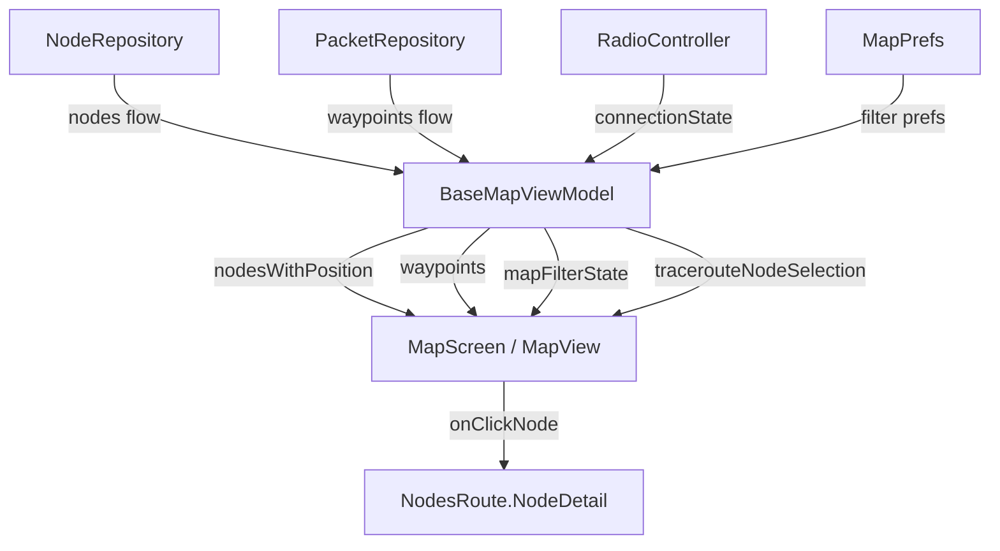

# Feature Specification: Map View

**Feature Branch**: `009-map-view`  
**Created**: 2026-06-11  
**Status**: Migrated  
**Input**: Brownfield migration — reverse-engineered from existing `feature/map/` module

## Summary

Map View displays Meshtastic mesh node positions on an interactive map, overlays waypoints, supports traceroute visualization, and provides filtering/preference controls. The feature uses a shared `BaseMapViewModel` in `commonMain` with platform-specific map rendering delegated via `LocalMapViewProvider` (Google Maps on Android/Google, OSM on F-Droid). Users can filter nodes by last-heard time, toggle favorites-only mode, show/hide waypoints and precision circles, manage custom tile layers (KML/GeoJSON), and visualize traceroute paths with snapshot positions.

## Goals

1. Display all mesh nodes with valid GPS positions as markers on an interactive map.
2. Allow users to filter visible nodes by last-heard time window and favorites-only mode.
3. Render waypoints (with automatic expiration) and allow creation/deletion of waypoints from the map.
4. Visualize traceroute paths between nodes, using historical snapshot positions when available.
5. Support custom map layers (KML, GeoJSON) from local files and network URLs.

## Non-Goals

- Offline map tile caching or download management (handled by platform map providers).
- Turn-by-turn navigation or routing between nodes.
- Modifying node positions — the map is read-only for position data.
- Real-time GPS streaming from the phone to the mesh (handled by `core/service`).

## User Scenarios & Testing *(mandatory)*

### User Story 1 — View Node Positions on Map (Priority: P1)

A Meshtastic user opens the Map tab to see where all mesh nodes are located. Nodes with valid GPS positions appear as markers on the map. The user's own node is highlighted, and tapping a node marker navigates to that node's detail screen. Ignored nodes are excluded from display.

**Why this priority**: Core value proposition — the map exists to show node locations.

**Independent Test**: Connect to a mesh with 3+ nodes that have GPS positions; open the Map tab; verify each node appears at its reported coordinates. Tap a marker and verify navigation to Node Detail.

**Acceptance Scenarios**:

1. **Given** a mesh with 5 nodes where 3 have GPS positions, **When** the user opens the Map tab, **Then** exactly 3 node markers are displayed (nodes without positions are omitted).
2. **Given** a node is marked as "ignored," **When** the map renders, **Then** that node's marker is not shown.
3. **Given** the device is connected, **When** the user views the Map screen, **Then** the top app bar shows the connected node chip; tapping the chip navigates to the node's detail.
4. **Given** a node marker is visible, **When** the user taps it, **Then** the app navigates to `NodesRoute.NodeDetail(id)`.

---

### User Story 2 — Filter Nodes by Last Heard Time (Priority: P1)

A user with a large mesh wants to focus on recently active nodes. They open the map filter controls and select a last-heard window (1 hour, 8 hours, 1 day, 2 days, or "Any"). Only nodes heard within the selected window remain visible on the map. The filter preference persists across sessions.

**Why this priority**: Essential for usability on large meshes with stale nodes.

**Independent Test**: Set filter to "1 Hour"; verify only nodes heard within the last hour are shown. Change to "Any"; verify all nodes reappear. Restart app; verify filter persists.

**Acceptance Scenarios**:

1. **Given** the last-heard filter is set to "One Hour," **When** a node was last heard 2 hours ago, **Then** that node's marker is hidden.
2. **Given** the filter is "Any" (0 seconds), **When** the map renders, **Then** all nodes with valid positions are shown regardless of last-heard time.
3. **Given** an unknown seconds value is loaded from preferences, **When** `LastHeardFilter.fromSeconds()` is called, **Then** it defaults to `Any`.
4. **Given** the user changes the filter, **When** the app is relaunched, **Then** the previously selected filter is restored from `MapPrefs`.

---

### User Story 3 — Display and Manage Waypoints (Priority: P2)

A user creates or receives waypoints on the mesh. The map displays active (non-expired) waypoints as distinct markers. Users can send new waypoints and delete existing ones. Expired waypoints are automatically hidden.

**Why this priority**: Waypoints are a core mesh feature for marking points of interest, but secondary to node display.

**Independent Test**: Send a waypoint with a future expiration; verify it appears on the map. Wait for expiration (or set past expiration); verify it disappears. Delete a waypoint; verify removal.

**Acceptance Scenarios**:

1. **Given** waypoints exist with `expire = 0` (never expires), **When** the map renders with "Show Waypoints" enabled, **Then** those waypoints appear as markers.
2. **Given** a waypoint has `expire` in the past, **When** the map renders, **Then** that waypoint is excluded.
3. **Given** "Show Waypoints" is toggled off, **When** the map renders, **Then** no waypoint markers are displayed.
4. **Given** the user deletes a waypoint, **When** `deleteWaypoint(id)` is called, **Then** the waypoint is removed from the packet repository.
5. **Given** the user creates a waypoint, **When** `sendWaypoint(wpt, contactKey)` is called with a valid ID, **Then** the waypoint is transmitted via `RadioController`.

---

### User Story 4 — Visualize Traceroute Paths (Priority: P2)

A user runs a traceroute to another node and wants to see the path on the map. The map overlays the forward and return routes as polylines, with markers at each hop. When snapshot positions (recorded at traceroute time) are available, those are used instead of live positions for accurate historical visualization.

**Why this priority**: Traceroute visualization helps diagnose mesh topology issues, but is an advanced feature.

**Independent Test**: Run a traceroute between two nodes with intermediate hops; verify polyline and hop markers appear. Verify snapshot positions override live positions when available.

**Acceptance Scenarios**:

1. **Given** a traceroute overlay with `forwardRoute = [10, 20]`, **When** snapshot positions exist for nodes 10 and 20, **Then** markers use snapshot coordinates, not live DB positions.
2. **Given** a traceroute overlay with no snapshot positions, **When** the map renders, **Then** markers fall back to live node positions filtered to overlay node nums.
3. **Given** a traceroute overlay with empty routes, **When** `tracerouteNodeSelection()` is called, **Then** `overlayNodeNums` and `nodesForMarkers` are both empty.
4. **Given** a snapshot includes node 30 not in the overlay routes, **When** markers are rendered, **Then** node 30 appears in `nodeLookup` (for polylines) but not in `nodesForMarkers`.

---

### User Story 5 — Map Controls and Preferences (Priority: P2)

A user interacts with the map toolbar to control compass orientation, toggle location tracking, switch map types/tile sources, manage custom overlay layers (KML/GeoJSON), and toggle favorites-only mode and precision circles. All preferences persist across sessions.

**Why this priority**: Controls enhance usability but are not required for basic map viewing.

**Independent Test**: Toggle each control (compass, location tracking, favorites, precision circles, waypoints); verify visual feedback and persistence after app restart.

**Acceptance Scenarios**:

1. **Given** the compass button is clicked, **When** the map bearing is non-zero, **Then** the map rotates to north and the compass icon color changes.
2. **Given** "Show Only Favorites" is toggled on, **When** the map re-renders, **Then** only favorited nodes are shown.
3. **Given** "Show Precision Circle" is toggled on, **When** nodes have precision data, **Then** precision circles render around node markers.
4. **Given** the user adds a network map layer with a `.geojson` URL, **When** the layer is added, **Then** it is detected as `LayerType.GEOJSON`.
5. **Given** the user adds a layer with a `.kml` URL, **When** the layer is added, **Then** it defaults to `LayerType.KML`.

---

### Edge Cases

- What happens when no nodes have GPS positions? The map renders empty with controls still functional.
- What happens when the device is disconnected? `isConnected` becomes `false`; the node chip is hidden from the app bar but existing markers remain.
- What happens when a waypoint `expire` field is `0`? It is treated as "never expires" and always shown.
- What happens when `contactKey` in `sendWaypoint` has no leading digit? The entire key is used as `dest` with channel defaulting to the key itself.
- What happens when `LastHeardFilter.fromSeconds()` receives a negative value? It defaults to `Any`.

## Architecture

### Key Components

| Component | Module / File | Purpose |
|-----------|---------------|---------|
| `BaseMapViewModel` | `feature/map/src/commonMain/.../BaseMapViewModel.kt` | Shared ViewModel with node data, waypoints, filters, traceroute logic |
| `SharedMapViewModel` | `feature/map/src/commonMain/.../SharedMapViewModel.kt` | Koin-injectable ViewModel extending `BaseMapViewModel` |
| `NodeMapViewModel` | `feature/map/src/commonMain/.../node/NodeMapViewModel.kt` | Per-node map with position history log |
| `MapControlsOverlay` | `feature/map/src/commonMain/.../component/MapControlsOverlay.kt` | M3 Expressive floating toolbar with compass, filter, location controls |
| `MapButton` | `feature/map/src/commonMain/.../component/MapButton.kt` | Reusable `FilledIconButton` for map controls |
| `MapLayerItem` | `feature/map/src/commonMain/.../model/MapLayer.kt` | Data model for KML/GeoJSON overlay layers |
| `MapNavigation` | `feature/map/src/commonMain/.../navigation/MapNavigation.kt` | Navigation 3 graph entry for the map route |
| `FeatureMapModule` | `feature/map/src/commonMain/.../di/FeatureMapModule.kt` | Koin DI module with component scan |
| `MapScreen` | `feature/map/src/androidMain/.../MapScreen.kt` | Android Scaffold host delegating to `LocalMapViewProvider` |
| `LastHeardFilter` | `feature/map/src/commonMain/.../BaseMapViewModel.kt` | Enum for time-window filtering (Any, 1h, 8h, 1d, 2d) |
| `TracerouteNodeSelection` | `feature/map/src/commonMain/.../BaseMapViewModel.kt` | Data class resolving traceroute overlays to displayable nodes |

### Data Flow

## Requirements *(mandatory)*

### Functional Requirements

- **FR-001**: System MUST display all non-ignored nodes with valid GPS positions as markers on the map.
- **FR-002**: System MUST filter out nodes without valid positions from the map display (`nodesWithPosition` flow).
- **FR-003**: System MUST filter out ignored nodes from the map display.
- **FR-004**: System MUST support filtering nodes by last-heard time window with options: Any (0s), 1 Hour (3600s), 8 Hours (28800s), 1 Day (86400s), 2 Days (172800s).
- **FR-005**: System MUST persist last-heard filter, favorites-only, show-waypoints, and precision-circle preferences via `MapPrefs`.
- **FR-006**: System MUST display active (non-expired) waypoints on the map; waypoints with `expire > 0` and `expire <= now` MUST be excluded.
- **FR-007**: System MUST support sending waypoints to the mesh via `RadioController.sendMessage()`.
- **FR-008**: System MUST support deleting waypoints via `PacketRepository.deleteWaypoint()`.
- **FR-009**: System MUST resolve traceroute overlays into `TracerouteNodeSelection` using snapshot positions when available, falling back to live positions.
- **FR-010**: System MUST provide a compass button that rotates with map bearing and resets to north on click.
- **FR-011**: System MUST provide a location tracking toggle button switching between `MyLocation` and `LocationDisabled` icons.
- **FR-012**: System MUST support custom map overlay layers of type KML or GeoJSON, identifiable by file extension.
- **FR-013**: System MUST support per-node position history display via `NodeMapViewModel` using `MeshLogRepository` position packets, with deduplication by time or coordinates.
- **FR-014**: System MUST navigate to `NodesRoute.NodeDetail` when a node marker or app bar chip is tapped.

### Non-Functional Requirements

- **NFR-001**: Map controls overlay MUST use Material 3 Expressive `HorizontalFloatingToolbar` for consistent cross-flavor styling.
- **NFR-002**: All business logic and shared UI MUST reside in `commonMain`; platform-specific map rendering is provided via `LocalMapViewProvider`.
- **NFR-003**: ViewModel coroutines MUST use `safeLaunch` with `ioDispatcher` for IO operations.
- **NFR-004**: Strings MUST use `stringResource(Res.string.*)` — no hardcoded text.
- **NFR-005**: Icons MUST use `MeshtasticIcons` from `core/ui/icon/`.

## Source-Set Impact

| Source Set | Impact | Justification |
|-----------|--------|---------------|
| `commonMain` | 8 files (ViewModels, components, models, DI, navigation) | All business logic and shared UI |
| `androidMain` | 1 file (`MapScreen.kt`) | Scaffold host — delegates rendering to platform provider |
| `androidUnitTestGoogle` | 2 files | Google Maps-specific ViewModel and MBTiles tests |
| `commonTest` | 5 files | Shared ViewModel, filter, traceroute, and model tests |

## Design Standards Compliance

- [x] New screens reviewed against design standards — `MapControlsOverlay` uses M3 Expressive `HorizontalFloatingToolbar`
- [x] M3 component selection verified — `FilledIconButton`, `CircularProgressIndicator`, `Scaffold`
- [x] Accessibility: compass has content descriptions; control buttons have semantic labels
- [x] Typography: app bar uses `MainAppBar` component from `core:ui`

## Privacy Assessment

- [x] No PII, location data, or cryptographic keys logged or exposed — node positions come from the mesh, not the phone's GPS
- [x] No new network calls that transmit user data — network layers are user-initiated URL fetches only
- [x] Proto submodule (`core/proto`) not modified (read-only upstream)

## Success Criteria *(mandatory)*

### Measurable Outcomes

- **SC-001**: All non-ignored nodes with valid positions render as markers on the map within 1 second of screen load.
- **SC-002**: Last-heard filter correctly hides/shows nodes within 500ms of filter change.
- **SC-003**: Waypoints with past expiration are never displayed on the map.
- **SC-004**: Traceroute overlay uses snapshot positions when available, verified by unit tests asserting coordinate values.
- **SC-005**: `LastHeardFilter.fromSeconds()` returns `Any` for all unknown input values, verified by unit tests.
- **SC-006**: All map preferences persist across app restarts via `MapPrefs`.
- **SC-007**: Navigation from map marker to Node Detail completes successfully.
- **SC-008**: Custom map layers correctly detect KML vs. GeoJSON by file extension.

## Assumptions

- All business logic and UI composables reside in `commonMain` source set.
- String resources added to `core/resources/src/commonMain/composeResources/values/strings.xml`.
- Icons use `MeshtasticIcons` (from `core/ui/icon/`).
- Float values pre-formatted with `NumberFormatter.format()` (CMP constraint).
- Platform-specific map rendering (Google Maps / OSM) is provided via `LocalMapViewProvider` and `LocalMapMainScreenProvider` composition locals — the `feature/map` module does not depend on any specific map SDK directly.
- Waypoint IDs are unique integers generated by `RadioController.getPacketId()`.
- `TracerouteOverlay` and `Node` models are defined in `core/model`.
- `MapPrefs` is defined in `core/repository` and backed by DataStore.

