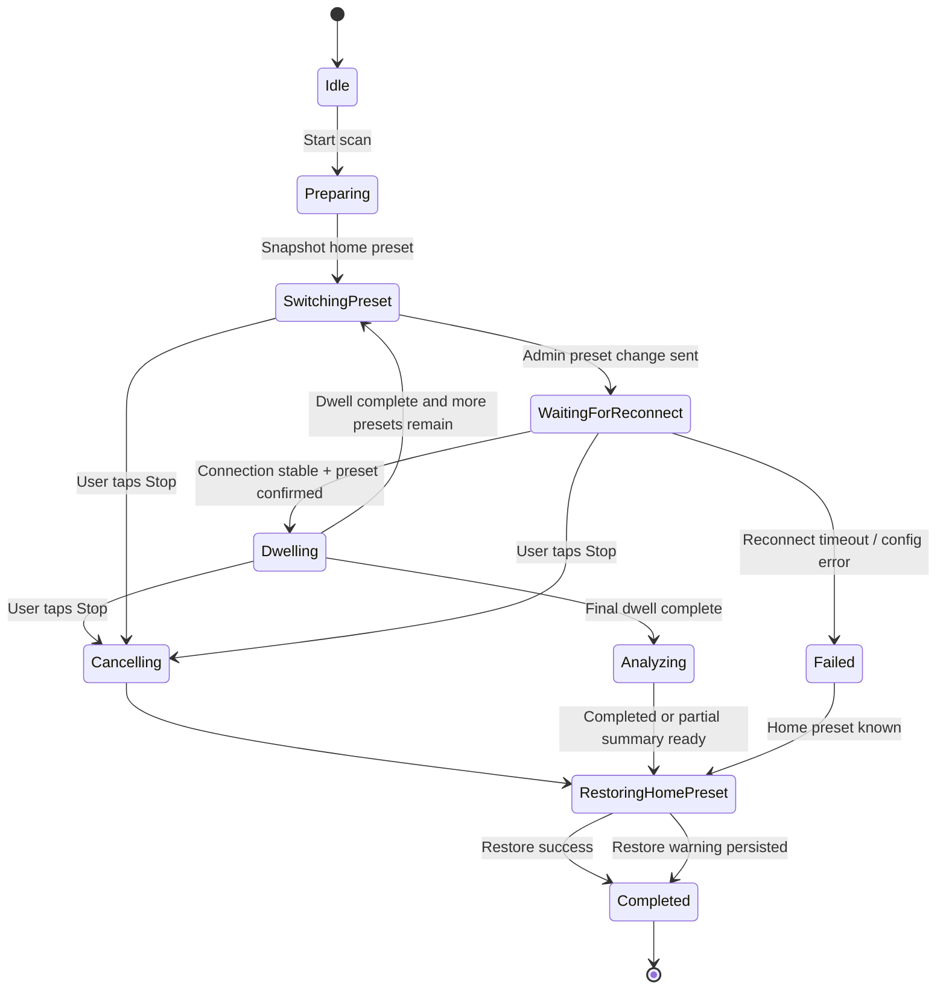
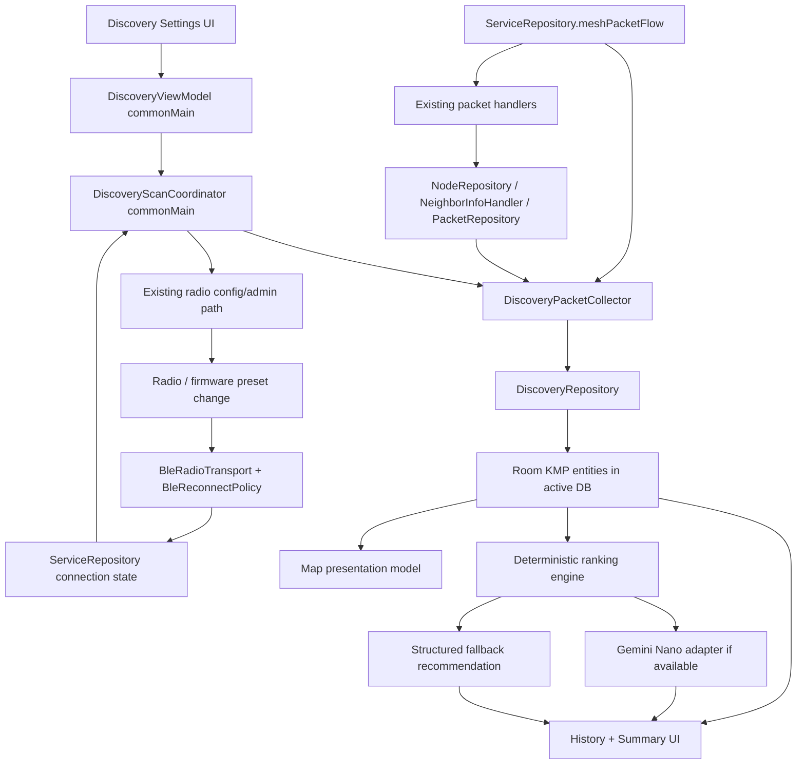

# Feature Specification: Local Mesh Discovery

**Feature Branch**: `feat/discovery`  
**Created**: 2026-05-07  
**Updated**: 2026-05-18  
**Status**: Implementation Complete (pending final verification D048)  
**Input**: User description: "Local Mesh Discovery — a high-fidelity diagnostic and community-mapping tool that cycles through modem presets to audit the local RF environment"  
**Cross-Platform Pair**: `meshtastic/Meshtastic-Apple:specs/001-local-mesh-discovery/` (Status: ✅ Merged to main)

## Summary

Local Mesh Discovery is a shared KMP feature for Meshtastic-Android that runs a controlled multi-preset RF scan against the currently connected radio, captures what the mesh looks like under each LoRa modem preset, and presents the results as maps, tables, topology overlays, and best-preset recommendations.

The implementation aligns with Meshtastic-Android's KMP architecture:

- **Persistence** uses **Room KMP** in `core:database`.
- **UI** uses **Compose Multiplatform + Material 3 Adaptive**.
- **Navigation** uses **Navigation 3 typed `NavKey` routes**.
- **Preferences** use **DataStore via `core:prefs`**.
- **Distance and metric formatting** use **`MetricFormatter` / shared formatters**.
- **Maps** use the existing **CompositionLocal provider pattern** (`LocalMapViewProvider`, `LocalInlineMapProvider`, related map locals).
- **AI recommendations** use **Gemini Nano through Google AI Edge SDK on supported Google-flavor Android devices**, with a deterministic structured fallback everywhere else.
- **Reconnect handling** reuses the existing **`BleReconnectPolicy` / `BleRadioTransport`** stack rather than introducing feature-specific BLE recovery logic.

## Goals

1. Let users compare local mesh visibility across one or more modem presets without manually editing LoRa settings between runs.
2. Persist results per radio in the existing Room KMP database so sessions can be reviewed later without reconnecting.
3. Present results in a way that is useful on Android and Desktop, while keeping all decision-making and aggregation logic in `commonMain`.
4. Reuse existing Meshtastic-Android infrastructure for packet capture, config mutation, BLE recovery, maps, logging, formatting, navigation, and DI.
5. Keep 2.4 GHz presets safely gated so unsupported hardware cannot start invalid scans.

## Non-Goals

- Replacing the standard map feature or node list.
- Creating a cloud-synced discovery history.
- Running AI analysis through a network service.
- Modifying firmware behavior or protobuf definitions.
- Guaranteeing discovery survives full process death; partial results are persisted instead.

## User Scenarios & Testing *(mandatory)*

### User Story 1 — Configure and Run a Multi-Preset Scan (Priority: P1)

A Meshtastic user wants to discover what nodes and activity exist in their local area across different LoRa modem presets. In Meshtastic-Android they open **Settings > Advanced > Local Mesh Discovery**, select one or more presets (for example `LongFast` and `MediumFast`), set a dwell time per preset, and tap **Start Scan**. The app cycles through each preset by sending the same LoRa config change path already used by `feature:settings`, waiting for the radio to become available again if it reboots, dwelling for the configured time while collecting packets, and then advancing to the next preset. The user sees which preset is active, how much dwell time remains, and whether the app is waiting for reconnect or analyzing results.

**Why this priority**: Without the scan engine there is no feature. This is the minimum viable product and all later visualization and recommendation work depends on these captured results.

**Independent Test**: Connect to a radio, select one preset, set the minimum dwell time (15 minutes), start the scan, and verify the radio changes preset, reconnects if necessary, and collects node / telemetry / neighbor data during the dwell window.

**Acceptance Scenarios**:
1. **Given** the user is connected to a Meshtastic radio, **When** they select two presets with a 15-minute dwell and tap Start Scan, **Then** the app snapshots the current home preset, sends an admin config change for the first selected preset, waits for the radio to become available, begins the dwell timer, and starts collecting incoming packets.
2. **Given** the radio reboots after a preset change, **When** the BLE connection drops, **Then** the app relies on `BleReconnectPolicy` / `BleRadioTransport` to reconnect automatically and resumes the same preset only after the connection is stable again.
3. **Given** a preset dwell window completes, **When** the timer expires, **Then** the app advances to the next preset, updates progress state, and repeats the switch / reconnect / dwell cycle.
4. **Given** all presets complete successfully, **When** the final dwell ends, **Then** the app transitions to an Analysis state, persists the session in Room KMP, and opens the session summary.
5. **Given** a scan is in progress, **When** the user taps Stop Scan, **Then** the scan halts gracefully, partial results are saved, and the user’s original home preset is restored.

---

### User Story 2 — Visualize Discovered Nodes on a Map (Priority: P2)

After a scan, a user wants to understand where discovered nodes were seen and how coverage differs by preset. They open a completed discovery session and switch to a map tab that uses the platform map provider already exposed through CompositionLocals. Nodes with valid positions appear as markers; preset chips filter the map; and, when neighbor information is available, the user can overlay simple topology edges to see who reported whom.

**Why this priority**: The core reason to run discovery is to understand local RF reach and mesh topology, not just raw packet counts. A map and topology view make the data actionable.

**Independent Test**: Complete a session that discovers at least two nodes with valid positions, open the session map on both `fdroid` and `google` Android flavors, switch preset filters, and verify that markers and optional topology overlays update correctly. On JVM/Desktop, verify a safe placeholder or supported provider path is shown instead of a crash.

**Acceptance Scenarios**:
1. **Given** a stored discovery session contains nodes with valid positions, **When** the user opens the Map tab, **Then** the app renders those nodes using the current platform map provider and shows a count of mapped vs unmapped nodes.
2. **Given** a node was discovered only on one preset, **When** the user filters by another preset, **Then** that node is hidden from the filtered view while session totals remain available elsewhere in the UI.
3. **Given** the session contains captured `NeighborInfo` relationships, **When** the user enables topology overlay, **Then** the app draws reporter-to-neighbor edges for nodes that have valid map coordinates.
4. **Given** the current target does not have a native map implementation available, **When** the user opens the Map tab, **Then** the app falls back to a placeholder or list-based presentation instead of failing.
5. **Given** the user taps a node marker or node card, **When** the detail sheet opens, **Then** the UI shows preset-specific metrics such as SNR, RSSI, hops, last heard, and distance from the local node when both positions are known.

---

### User Story 3 — Review Scan Summary and AI Recommendation (Priority: P3)

A user wants the app to summarize which preset performed best and why. After a session, the app presents per-preset metrics, rankings, and charts. If the app is running on the Google flavor of Android 14+ hardware that supports Gemini Nano through Google AI Edge SDK, the user can request an on-device narrative recommendation. On unsupported hardware, non-Google builds, desktop targets, or when the model is unavailable, the app shows a structured comparison table and deterministic recommendation instead.

**Why this priority**: Discovery results are only useful if the user can quickly interpret them and decide which preset to keep as their everyday operating mode.

**Independent Test**: Complete a session with at least two presets, open the summary on a supported Google-flavor Android device and on an unsupported or non-Google target, and verify that both the AI path and fallback path produce a usable recommendation without blocking the rest of the summary.

**Acceptance Scenarios**:
1. **Given** a completed discovery session, **When** the user opens the Summary tab, **Then** the app shows per-preset totals including unique node count, packet count, telemetry count, neighbor reports, best / median link quality, and best known distance.
2. **Given** Gemini Nano is available and the user explicitly requests analysis, **When** the recommendation engine runs, **Then** the app produces an on-device summary that ranks presets, explains tradeoffs, and does not send session data off-device.
3. **Given** Gemini Nano is unavailable, unsupported, disabled, or errors, **When** the Summary tab loads, **Then** the app shows the deterministic fallback recommendation and a structured table instead of an AI error screen.
4. **Given** a session is partial because the user stopped early or one preset failed, **When** the summary is generated, **Then** incomplete presets are marked clearly and are excluded from “best preset” calculations unless the user opts to inspect them manually.
5. **Given** two presets tie on the primary ranking metric, **When** the recommendation is computed, **Then** tie-breakers use additional metrics in a documented order and the UI explains the tie outcome.

---

### User Story 4 — Persist and Review Past Sessions (Priority: P4)

A user wants to compare today’s environment with older discovery runs. Each session is stored in Room KMP in the same per-device database system already managed by `DatabaseProvider`. The user can review a history list, open an old session without reconnecting to a radio, share or export the session summary, and delete old sessions when they are no longer needed.

**Why this priority**: Discovery is most useful over time. Users need historical comparisons instead of a single ephemeral run.

**Independent Test**: Run a discovery session, force-close and relaunch the app, open discovery history, verify the stored session is still available, delete it, and verify its related rows are removed.

**Acceptance Scenarios**:
1. **Given** a scan finishes or is stopped, **When** persistence completes, **Then** the session, per-preset result rows, and discovered node rows are stored in the active Room KMP database.
2. **Given** the app restarts, **When** the user opens Local Mesh Discovery history, **Then** previously stored sessions load without requiring an active radio connection.
3. **Given** the user opens a historical session, **When** the summary screen appears, **Then** the same tabs and filters work against persisted data instead of live packet flows.
4. **Given** the user deletes a session, **When** deletion is confirmed, **Then** related preset-result and discovered-node rows are removed atomically.
5. **Given** the user shares or exports a stored session, **When** the export completes, **Then** Android uses a Share / document flow and Desktop uses a local save flow, with a PDF-first result when map capture is available and a text / table fallback when it is not.

---

### User Story 5 — 2.4 GHz Preset Gating (Priority: P5)

A user must not be allowed to choose 2.4 GHz discovery presets on unsupported hardware. The app inspects current radio hardware metadata using the existing `DeviceHardwareRepository` and the radio’s reported model / target info, then enables or disables 2.4 GHz presets accordingly. If capability cannot be verified, the presets stay disabled with an explanation.

**Why this priority**: Invalid preset selection creates confusing failures, unnecessary reboots, and poor trust in the feature. Safe hardware gating avoids avoidable radio errors.

**Independent Test**: Connect to a radio known not to support 2.4 GHz and verify 2.4 GHz presets are disabled. Connect to a supported radio and verify those presets are selectable.

**Acceptance Scenarios**:
1. **Given** the connected radio does not support 2.4 GHz operation, **When** the preset selector is shown, **Then** 2.4 GHz presets are hidden or disabled with an explanatory message.
2. **Given** the connected radio does support 2.4 GHz operation, **When** the preset selector is shown, **Then** the user can include those presets in the scan queue.
3. **Given** hardware capability lookup fails or returns ambiguous results, **When** the screen loads, **Then** 2.4 GHz presets remain disabled and the UI explains that capability could not be verified.
4. **Given** a previously saved session references a 2.4 GHz preset but the currently connected device does not support it, **When** the user tries to rerun that session template, **Then** the app blocks start and explains which presets are incompatible.

## Scope Boundaries

### In Scope

- Scan orchestration across one or more modem presets.
- Reuse of the existing admin config path for changing LoRa presets.
- Reuse of existing packet handling for node, telemetry, position, text/activity, and neighbor info packets.
- Session persistence via Room KMP.
- Session history, summary, map, export/share, and deterministic recommendation.
- Optional on-device AI recommendation on supported Android Google-flavor devices.
- Android and Desktop host integration, with compile-safe KMP behavior for other targets.

### Out of Scope

- Firmware-side changes to emit new packet types.
- Cloud backup or cross-device sync.
- Automatically changing the user’s home preset without explicit restore-on-stop / restore-on-finish behavior.
- A fully background-resilient WorkManager / foreground-service scan scheduler in the first version.

## Functional Requirements

### Scan Configuration and Orchestration

- **FR-001**: The feature shall live in a new KMP module at `feature/discovery/` using the `meshtastic.kmp.feature` convention plugin.
- **FR-002**: The feature shall be reachable from the Settings flow through a typed Navigation 3 route in `SettingsGraph`.
- **FR-003**: The user shall be able to select **one or more** modem presets for a session; the UI should encourage multiple presets but not require more than one.
- **FR-004**: The user shall be able to configure a dwell time per preset with a minimum of 15 minutes.
- **FR-005**: Before the first preset change, the app shall snapshot the currently active home preset so it can be restored when the scan ends, is cancelled, or fails after at least one successful change.
- **FR-006**: The scan engine shall mutate modem presets using the existing admin/config path already used by `feature:settings` for `Config.LoRaConfig` updates.
- **FR-007**: The scan engine shall not advance from preset-switching to dwelling until the radio is reconnected and stable.
- **FR-008**: The scan engine shall expose state as a deterministic state machine with states for idle, preparing, switching, waiting for reconnect, dwelling, analyzing, completed, cancelled, and failed.
- **FR-009**: The user shall be able to stop a scan at any time; partial results must be preserved.
- **FR-010**: If preset restoration fails at the end of a run, the session shall still be saved and the UI shall display a recoverable warning.

### Packet Collection and Metrics

- **FR-011**: Packet collection shall reuse the existing packet pipeline (`ServiceRepository.meshPacketFlow`, repositories, handlers) rather than adding a parallel decoder.
- **FR-012**: The feature shall collect enough data to compute per-preset metrics from `Node`, `Packet`, `NeighborInfo`, telemetry, and position updates.
- **FR-013**: The feature shall explicitly integrate with the existing `NeighborInfoHandler` path so neighbor-report topology can be captured during each dwell.
- **FR-014**: The feature shall deduplicate discovered nodes within a preset while still tracking aggregate activity counts.
- **FR-015**: The feature shall retain preset-specific observations even when the same node appears in multiple presets.
- **FR-016**: Distance displays shall use shared Meshtastic formatting utilities and `Node.distance(...)` semantics when both nodes have valid positions.

### Persistence and History

- **FR-017**: Discovery data shall be stored in new Room KMP entities within the active per-device database managed by `DatabaseProvider`.
- **FR-018**: Persisted history shall include enough data to rebuild summary, map, topology, and exported reports without a live radio connection.
- **FR-019**: Deleting a session shall cascade to related preset-result and discovered-node rows.
- **FR-020**: Session history shall load reactively and sort newest-first by session start time.

### Visualization and Summary

- **FR-021**: The feature shall provide at least Overview, Map, and History surfaces.
- **FR-022**: The map view shall use the existing CompositionLocal map abstraction pattern so `google`, `fdroid`, and Desktop can render with target-appropriate providers.
- **FR-023**: The map UI shall support filtering by preset and toggling topology overlays when neighbor info is available.
- **FR-024**: The summary UI shall rank presets using a documented deterministic heuristic even when AI is unavailable.
- **FR-025**: The summary UI shall show incomplete or failed presets without silently dropping them from the historical record.

### AI Recommendation

- **FR-026**: The feature shall define a shared recommendation-engine contract in `commonMain` and platform-specific implementations where needed.
- **FR-027**: On supported Google-flavor Android devices, the app may use Gemini Nano through Google AI Edge SDK for an on-device narrative recommendation.
- **FR-028**: When AI is unavailable for any reason, the UI shall fall back automatically to a deterministic structured recommendation and comparison table.
- **FR-029**: AI usage shall remain opt-in per session or per feature preference and shall not upload session data to a remote service.

### Navigation, Preferences, and Export

- **FR-030**: The feature shall persist lightweight user defaults (last dwell time, last preset selection, whether AI expansion is enabled, last-used filters) through DataStore in `core:prefs`.
- **FR-031**: The feature shall expose a deep link under the Settings route family.
- **FR-032**: Android export shall use the platform share / document flow and should produce a PDF when platform snapshot generation succeeds.
- **FR-033**: Desktop export shall use a local save flow and may omit map imagery if no snapshot pipeline exists.
- **FR-034**: All user-visible strings shall live in `core/resources/src/commonMain/composeResources/values/strings.xml`.
- **FR-035**: The UI shall use `MeshtasticIcons` rather than Material icon constants.

### Hardware Gating

- **FR-036**: The preset picker shall gate 2.4 GHz presets based on connected-radio capability resolved through current radio metadata and `DeviceHardwareRepository` lookups.
- **FR-037**: Unsupported or unknown capability shall block scan start for 2.4 GHz presets.
- **FR-038**: Capability resolution shall tolerate partial hardware data by falling back from model lookup to target lookup where possible.

## Non-Functional Requirements

- **NFR-001**: All business logic, aggregation, session state, and recommendation heuristics shall live in `commonMain`.
- **NFR-002**: Platform-specific code shall be limited to map rendering, Gemini Nano integration, export/share flows, and other thin host integrations.
- **NFR-003**: Coroutine code shall use project conventions such as `safeCatching {}` and injected dispatchers / shared dispatcher utilities rather than ad-hoc exception handling or `Dispatchers.IO`.
- **NFR-004**: The feature shall be compatible with existing BLE reconnect behavior and must not introduce a second reconnect loop.
- **NFR-005**: History loading shall load and render the session list within 500 ms for up to 100 stored sessions with typical Meshtastic node counts, and the list shall scroll at 60 fps once loaded.
- **NFR-006**: Unsupported targets (for example Desktop without a native map snapshotter or Android without Gemini Nano) shall degrade gracefully rather than hiding the whole feature.
- **NFR-007**: The feature shall preserve privacy by keeping recommendations on-device and by avoiding unnecessary export of raw packet payloads in shared reports.
- **NFR-008**: The design shall remain buildable across Android, Desktop/JVM, and iOS source-set compilation expectations even if full host UI is only wired on Android and Desktop initially.

## State Machine

### State Notes

- **Preparing** gathers current config, validates selected presets, resolves hardware capability, and creates an in-memory session record.
- **SwitchingPreset** is a short-lived command-dispatch state.
- **WaitingForReconnect** reuses global radio connection state and must not count toward dwell time.
- **Dwelling** is the only state in which packet metrics accumulate toward the current preset result.
- **Analyzing** computes aggregates, rankings, summaries, and optional AI input payloads.
- **Completed** covers successful, cancelled-with-partial-results, and failed-but-persisted outcomes; terminal UI messaging differentiates them.

## Data Flow

## Architecture Notes

### Shared feature module

- `feature/discovery/src/commonMain/...` owns:
  - session state machine
  - scan coordinator
  - packet aggregation / ranking logic
  - summary presentation models
  - route-level screen composables
  - Koin module and ViewModels
- `feature/discovery/src/androidMain/...` owns:
  - Gemini Nano adapter
  - Android share / PDF implementation
  - Android map bindings if the discovery screen needs a specialized map provider beyond current `LocalMapViewProvider`
- `feature/discovery/src/jvmMain/...` owns:
  - Desktop export implementation
  - Desktop map placeholder or provider adapter

### Existing integration points

- **Neighbor info**: `core/data/src/commonMain/kotlin/org/meshtastic/core/data/manager/NeighborInfoHandlerImpl.kt`, `core/model/src/commonMain/kotlin/org/meshtastic/core/model/NeighborInfo.kt`
- **Preset mutation**: `feature/settings/src/commonMain/kotlin/org/meshtastic/feature/settings/radio/component/LoRaConfigItemList.kt`, `feature/settings/src/commonMain/kotlin/org/meshtastic/feature/settings/radio/RadioConfigViewModel.kt`, `core/data/src/commonMain/kotlin/org/meshtastic/core/data/manager/AdminPacketHandlerImpl.kt`
- **BLE reconnect**: `core/network/src/commonMain/kotlin/org/meshtastic/core/network/radio/BleReconnectPolicy.kt`, `core/network/src/commonMain/kotlin/org/meshtastic/core/network/radio/BleRadioTransport.kt`
- **Map state**: `feature/map/src/commonMain/kotlin/org/meshtastic/feature/map/BaseMapViewModel.kt`, `core/ui/src/commonMain/kotlin/org/meshtastic/core/ui/util/MapViewProvider.kt`
- **Database**: `core/database/src/commonMain/kotlin/org/meshtastic/core/database/MeshtasticDatabase.kt`, `core/database/src/commonMain/kotlin/org/meshtastic/core/database/entity/NodeEntity.kt`, `core/database/src/commonMain/kotlin/org/meshtastic/core/database/entity/Packet.kt`, `core/database/src/commonMain/kotlin/org/meshtastic/core/database/entity/MyNodeEntity.kt`
- **Navigation**: `core/navigation/src/commonMain/kotlin/org/meshtastic/core/navigation/Routes.kt`, `core/navigation/src/commonMain/kotlin/org/meshtastic/core/navigation/DeepLinkRouter.kt`
- **Prefs**: `core:repository` preference interfaces + `core:prefs` DataStore implementations

## Ranking and Recommendation Heuristic

The deterministic fallback recommendation shall be computed before any AI pass so it is always available. The default ranking order is:

1. Highest **unique discovered node count**.
2. Highest **neighbor-report diversity** (unique neighbor mentions / topology richness).
3. Highest **packet count** excluding duplicate self-noise where practical.
4. Best **median link quality** (median SNR first, then RSSI).
5. Greatest **best known distance** to a valid-position node.
6. Lowest **failure / reconnect penalty**.

If two presets still tie after all heuristics, the UI labels them as tied and avoids inventing a false winner.

## Edge Cases and Failure Handling

| Scenario | Expected Behavior |
|---|---|
| Radio disconnects during dwell | Pause the dwell timer, enter `WaitingForReconnect`, resume only when the connection is stable again. |
| Radio never reconnects after preset switch | Mark the preset failed, persist partial data, restore home preset if possible, and end the session with a warning. |
| User leaves the screen while scan runs | The ViewModel / coordinator may continue as long as the app process and radio service remain alive; on process death, partial results already flushed to DB remain available. |
| Home preset cannot be read before start | Block scan start with a clear error; the feature must never mutate presets without a restore target. |
| Duplicate packets or repeated node updates | Aggregate counts carefully and deduplicate discovered-node rows per preset / node. |
| Node has no valid position | Include it in summary and node lists, but exclude it from map-only totals and distance calculations. |
| Neighbor info references unknown nodes | Persist the relationship as numeric node IDs; resolve names opportunistically from `NodeRepository` when available. |
| 2.4 GHz capability lookup is stale or missing | Disable 2.4 GHz presets and explain that hardware capability could not be verified. |
| AI model not installed / not permitted / throws | Keep summary fully functional with deterministic fallback and a non-blocking notice. |
| Map provider unavailable on current target | Show placeholder or list-backed fallback rather than suppressing session access. |
| Export snapshot fails | Share a text/table-only report and explain that map imagery could not be attached. |
| User switches to another radio mid-session | Cancel the active session, save partial results against the original active DB, and require an explicit new start for the newly selected radio. |

## Success Criteria

### Measurable Outcomes

- **SC-001**: A user can complete a single-preset or multi-preset scan without manual radio reconnection steps.
- **SC-002**: Completed sessions can be reopened later and still show useful summary + map data.
- **SC-003**: Unsupported platforms still present a valid non-AI, non-map-crash experience.
- **SC-004**: The scan engine introduces zero new BLE reconnect logic; all reconnection uses `BleReconnectPolicy` exclusively. No parallel packet decoder is introduced — collection flows through `ServiceRepository.meshPacketFlow`.

## Open Implementation Constraints

1. The canonical deep link base is `meshtastic://meshtastic`.
2. Existing settings routing prefers lowercase hyphenated path segments; discovery should follow that convention while optionally accepting a camelCase compatibility alias.
3. Meshtastic-Android keeps separate per-device Room databases, so discovery history is naturally scoped to the currently active radio unless exported.
4. `core/proto` remains read-only; discovery must be implemented from existing packet types.

## References

- `core/data/src/commonMain/kotlin/org/meshtastic/core/data/manager/NeighborInfoHandlerImpl.kt`
- `core/data/src/commonMain/kotlin/org/meshtastic/core/data/manager/AdminPacketHandlerImpl.kt`
- `core/data/src/commonMain/kotlin/org/meshtastic/core/data/manager/CommandSenderImpl.kt`
- `core/network/src/commonMain/kotlin/org/meshtastic/core/network/radio/BleReconnectPolicy.kt`
- `core/network/src/commonMain/kotlin/org/meshtastic/core/network/radio/BleRadioTransport.kt`
- `feature/map/src/commonMain/kotlin/org/meshtastic/feature/map/BaseMapViewModel.kt`
- `core/ui/src/commonMain/kotlin/org/meshtastic/core/ui/util/MapViewProvider.kt`
- `core/navigation/src/commonMain/kotlin/org/meshtastic/core/navigation/Routes.kt`
- `core/navigation/src/commonMain/kotlin/org/meshtastic/core/navigation/DeepLinkRouter.kt`
- `core/database/src/commonMain/kotlin/org/meshtastic/core/database/MeshtasticDatabase.kt`

---

## Implementation Status (2026-05-18)

### User Story Completion

| User Story | Status | Notes |
|---|---|---|
| US1 — Multi-Preset Scan | ✅ Complete | Full state machine, reconnect, dwell, advancement |
| US2 — Map Visualization | ✅ Complete | CompositionLocal map, preset filter, topology overlay, direct/mesh color-coding |
| US3 — Summary + AI | ✅ Complete (AI fallback only) | Deterministic 6-level ranking, per-preset AI summaries field, Gemini Nano provider stubbed (delegates to algorithmic) |
| US4 — Persistence & History | ✅ Complete | Room KMP, cascade delete, history list, detail view |
| US5 — 2.4 GHz Gating | ✅ Complete | `Check24GhzCapability` checks hardware; ViewModel exposes `is24GhzBlocked`/`isLora24Region`; scan button disabled when region is LORA_24 on unsupported hardware |
| Export/Share | ✅ Complete | `PdfDiscoveryExporter` (Android) + `TextDiscoveryExporter` (Desktop); `rememberExportSaver` wires platform file-save (SAF on Android, JFileChooser on Desktop) |

### Implementation Divergences from Original Spec

The implementation evolved beyond the original spec in several areas. This section documents the actual state:

#### Data Model — Simplified Entity Structure

The actual Room entities use a simpler schema than `data-model.md` proposed:

- **`DiscoverySessionEntity`** uses auto-generated `Long` PK (not String UUID), fewer fields, and includes `userLatitude`/`userLongitude` (not in original spec).
- **`DiscoveryPresetResultEntity`** uses `presetName: String` (not `presetKey` + `presetIndex`), and adds full RF health fields: `numPacketsTx`, `numPacketsRx`, `numPacketsRxBad`, `numRxDupe`, `numTxRelay`, `numTxRelayCanceled`, `numOnlineNodes`, `numTotalNodes`, `uptimeSeconds`, `avgChannelUtilization`, `avgAirtimeRate`, `packetSuccessRate`, `packetFailureRate`, `aiSummary`.
- **`DiscoveredNodeEntity`** adds `neighborType: String` ("direct"/"mesh") and `messageCount`/`sensorPacketCount` — not in original spec but aligning with Apple implementation.
- A unified `DiscoveryDao` serves all queries (rather than 3 separate DAOs as proposed).

#### RF Health & LocalStats — Fully Implemented

The implementation captures full `LocalStats` proto fields per-preset (Apple FR-008/FR-012/FR-024 equivalent):
- `numPacketsTx`, `numPacketsRx`, `numPacketsRxBad`, `numRxDupe`
- `packetSuccessRate`, `packetFailureRate`
- `avgChannelUtilization` (from `DeviceMetrics.channel_utilization`)
- `avgAirtimeRate` (from delta `air_util_tx` via 2-Packet Rule)

UI: `RfHealthSection.kt` renders these in the preset result cards.

#### Direct vs. Mesh Node Classification — Implemented

Nodes are classified as `"direct"` (seen via their own packets) or `"mesh"` (discovered only through `NeighborInfo` from another node). Map visualization uses `DiscoveryNeighborType.DIRECT`/`MESH` for color differentiation — aligning with Apple's green/blue color-coding.

#### Per-Preset AI Summaries — Field Present

`DiscoveryPresetResultEntity.aiSummary` stores per-preset summaries (Apple FR-021 equivalent). The summary generator populates these with algorithmic descriptions; the field is ready for Gemini Nano output when integrated.

#### State Machine Implementation Names

| Spec Name | Implementation Name | Notes |
|---|---|---|
| WaitingForReconnect | Reconnecting | Semantic equivalent |
| SwitchingPreset | Shifting | Matches "Shifting to [preset]" UX text |
| Completed (terminal) | Complete | Differentiated by `completionStatus` on session entity |

#### Additional Implemented Features (Not in Original Spec)

These features were added during implementation for safety, reliability, and cross-platform parity:

| Feature | Description | File(s) |
|---|---|---|
| Interrupted session recovery | `markInterruptedSessions()` DAO query on ViewModel init marks any lingering `in_progress` sessions as `interrupted`. Handles app process death mid-scan. | `DiscoveryDao.kt`, `DiscoveryViewModel.kt` |
| Paused scan state | `DiscoveryScanState.Paused` provides a recoverable grace period during BLE reconnect before transitioning to `Failed`. Original spec only had direct `WaitingForReconnect → Failed`. | `DiscoveryScanState.kt` |
| Infrastructure node classification | Nodes with `ROUTER`, `ROUTER_LATE`, or `CLIENT_BASE` roles flagged via `isInfrastructure` on entity. `infrastructureNodeCount` aggregated per preset result. Aligns with Apple's relay/infrastructure tracking. | `DiscoveryScanEngine.kt`, `DiscoveredNodeEntity.kt`, `DiscoveryPresetResultEntity.kt` |
| Active NeighborInfo request | Engine actively requests `NeighborInfo` at dwell start and mid-dwell via `radioController.requestNeighborInfo()`. Original spec mentioned only passive collection. | `DiscoveryScanEngine.kt` |
| Deprecated preset filtering | `VERY_LONG_SLOW` and `LONG_SLOW` presets hidden from picker per meshtastic/design standards deprecation. | `PresetPickerCard.kt` |
| LoRa preset reference data | `LoRaPresetReference.kt` contains static range/throughput/capacity characteristics for all LoRa presets used by the deterministic summary generator. | `ai/LoRaPresetReference.kt` |
| Traffic minimum threshold | `TRAFFIC_MIN_PACKET_THRESHOLD = 5` prevents noise in traffic-mix classification when packet counts are too low. | `DiscoverySummaryGenerator.kt` |

---

## Cross-Platform Alignment with Meshtastic-Apple

The Apple implementation (`meshtastic/Meshtastic-Apple`) is merged to `main` and provides the cross-platform reference. This section documents alignment and intentional differences.

### Fully Aligned Areas

| Feature | Android | Apple | Status |
|---|---|---|---|
| Core scan concept | Cycle presets → dwell → collect → summarize | Same | ✅ Aligned |
| Entity triad | Session / PresetResult / DiscoveredNode | Same | ✅ Aligned |
| Minimum dwell | 15 minutes | 15 minutes | ✅ Aligned |
| 2.4 GHz gating approach | DeviceHardwareRepository tag check | DeviceHardwareEntity tags | ✅ Aligned |
| Home preset snapshot + restore | Before first switch, restore on end | Same | ✅ Aligned |
| NeighborInfo pipeline reuse | Existing handler | Same | ✅ Aligned |
| BLE reconnect reuse | BleReconnectPolicy | Existing BLE actor | ✅ Aligned |
| Deep link slug | `localMeshDiscovery` | `localMeshDiscovery` | ✅ Aligned |
| RF Health metrics | All LocalStats fields | Same | ✅ Aligned |
| Direct/mesh node classification | `neighborType` field | Same | ✅ Aligned |
| User position on session | `userLatitude`/`userLongitude` | Same | ✅ Aligned |
| Channel utilization + airtime | 2-Packet Rule computation | Same | ✅ Aligned |
| Per-preset AI summary field | `aiSummary` on PresetResult | Same | ✅ Aligned |
| Export | PDF primary, text fallback | PDF via UIGraphicsPDFRenderer | ✅ Aligned |

### Intentional Differences (Android Advantages)

| Feature | Android | Apple | Rationale |
|---|---|---|---|
| Navigation location | Settings > Advanced (production) | Settings > Developers (DEBUG only) | Android treats this as a power-user feature, not debug-only |
| Two-level state machine | Session + Preset-level states | Single-level | Better partial-session tracking, per-preset SKIPPED state |
| `isPartial` flag | Explicit bool on session | `completionStatus` string only | Clearer query semantics |
| `medianSnr` | On PresetResult | Not stored | Richer ranking input |
| `reconnectCount` | Per-preset | Not tracked | Useful for reliability analysis |
| `actualDwellSeconds` | Separate from planned | Not stored | Shows reconnect-time loss |
| KMP + Desktop | Full commonMain logic + JVM Desktop shell | iOS-only | Architectural requirement |
| `bestPresetKey` + `recommendationSource` | Stored on session | Computed at render time | Faster history list rendering |

### Known Divergences (Potential Future Alignment)

| Feature | Apple Has | Android Status | Priority |
|---|---|---|---|
| Radar sweep animation | `RadarSweepView` at 60fps | Not planned | 🟡 Low — cosmetic, high battery cost |
| Node social/sensor icon classification | `person.2.fill` vs `thermometer` | Data available (`messageCount`/`sensorPacketCount`) but no icon rule defined | 🟡 Medium — could add |
| Map auto-zoom (1.6×, 0.005° min, 0.8s ease) | Specified | Uses platform map default auto-fit | 🟡 Low — platform maps handle this differently |
| Dwell picker specific values | `[1, 5, 15, 30, 45, 60, 90, 120, 180]` min | Slider with 15-min minimum | 🟡 Low — UX preference |
| Historical sessions fed to AI | Trend/cross-session analysis | Session-level only currently | 🟡 Medium — future enhancement |
| Reconnect timeout default | 60 seconds explicit | Configurable, no spec'd default | 🟢 Low — uses BleReconnectPolicy defaults |
| Map filter chips in UI | Rendered in map toolbar | ViewModel has filter logic; UI not yet rendering filter chips | 🟡 Medium |
| Topology overlay toggle | Toggle in map settings | ViewModel has toggle; UI not yet wired | 🟡 Medium |
| Node detail sheet on map tap | Bottom sheet on marker tap | Markers rendered without tap callbacks | 🟡 Medium |

### Design Repo Status

The `meshtastic/design` repo (`standards/audits/cross-platform-spec-audit.md`) confirms:
- Android: All user stories complete on `feat/discovery`
- Apple: ✅ Implemented on main
- No feature-level design spec exists (design repo is visual standards only)
- Design standard color palette (Success green `#3FB86D`, Info blue `#5C6BC0`) should be used for direct/mesh node map colors
