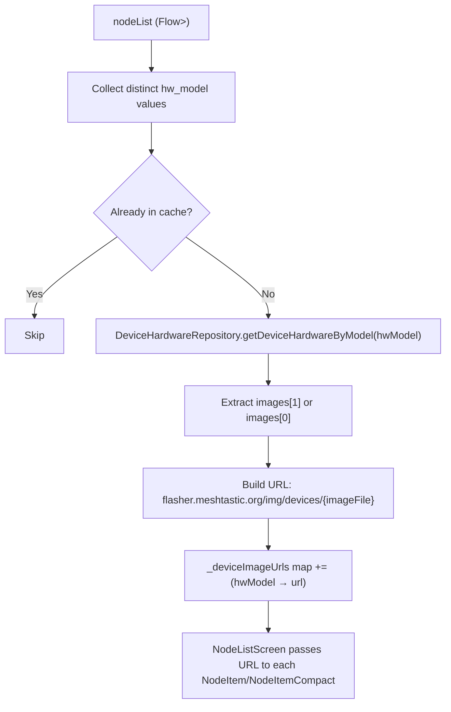
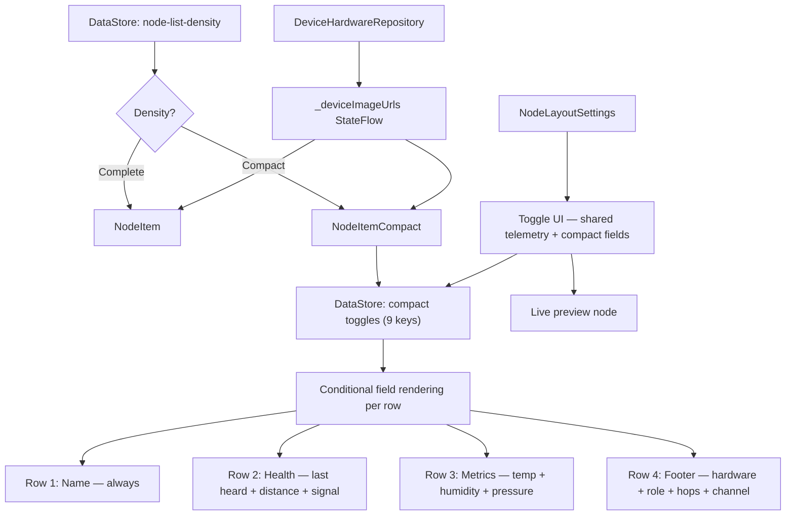

# Feature Specification: Node List Layout

**Feature Branch**: `feat/node-list`
**Created**: 2026-05-07
**Updated**: 2026-05-21
**Status**: Implemented
**Input**: Node layout engine with complete and compact views for Compose Multiplatform

## Summary

Node List Layout introduces a density-switching system for the Meshtastic node list, giving users a choice between a full-detail "Complete" layout and a condensed "Compact" layout with per-field toggle controls. Both layouts display device hardware images from the Meshtastic Flasher CDN. The feature lives entirely in `commonMain` (Compose Multiplatform) and persists preferences via DataStore.

## Goals

1. Let users reduce visual noise and scrolling on large meshes (100+ nodes) by switching to a compact row layout.
2. Give users fine-grained control over which data fields appear in compact mode via individually toggleable switches.
3. Display device hardware images (loaded from CDN) alongside hardware model names for visual device identification.
4. Document signal strength color semantics in a discoverable help sheet.

## Non-Goals

- Modifying the Complete layout to support per-field toggles (it intentionally shows everything).
- Adding new data fields or metrics beyond what the node model already provides.
- Platform-specific layout variations — all UI is shared `commonMain`.
- Adaptive chip sizing based on toggle state (chip uses `defaultMinSize` for font scaling but is not dynamically resized).

## User Scenarios & Testing *(mandatory)*

### User Story 1 — Switch Between Complete and Compact Density (Priority: P1)

A Meshtastic user with a large mesh (100+ nodes) wants a denser node list to reduce scrolling. They navigate to Settings > App Settings > Node Layout, switch from "Complete" to "Compact" using a segmented button, and the node list immediately re-renders with smaller rows. Switching back to "Complete" restores the full-detail layout.

**Why this priority**: The density switch is the core mechanic — all compact-specific toggles depend on it existing.

**Independent Test**: Open Settings > Node Layout, toggle between Complete and Compact, navigate to the Nodes tab, and verify the list renders with the correct row style.

**Acceptance Scenarios**:

1. **Given** the user has "Complete" selected, **When** they view the node list, **Then** each row displays the full-detail `NodeItem` layout with all available data fields.
2. **Given** the user switches to "Compact," **When** the node list re-renders, **Then** each row uses `NodeItemCompact` with a 4-row condensed layout.
3. **Given** the user switches density, **When** the segmented button animates, **Then** the transition completes within 300ms at 60fps and a live preview node in Settings updates immediately.
4. **Given** the app is relaunched, **When** the node list loads, **Then** the previously selected density is restored from DataStore preferences.

---

### User Story 2 — Configure Compact Layout Fields (Priority: P1)

A user in Compact mode wants to hide fields they don't care about (e.g., environment metrics) and keep only what matters (e.g., last heard time and signal). They open Settings > Node Layout, see a shared "Environment Metrics" toggle plus compact-specific toggles ordered to match the visual layout, and flip individual switches. The live preview node below the density picker updates in real time.

**Why this priority**: Per-field toggles are the primary value proposition of the compact layout — without them, compact is just a fixed alternative.

**Independent Test**: Switch to Compact, disable all toggles one by one, verify each field disappears from both the preview and the node list. Re-enable them and verify they reappear.

**Acceptance Scenarios**:

1. **Given** the user is in Compact mode, **When** they toggle "Power" off, **Then** the battery indicator below the chip disappears.
2. **Given** "Last Heard Time" is toggled off, **When** the node list renders, **Then** the last-heard segment in the health row is hidden.
3. **Given** "Distance and Bearing" is toggled off, **When** a node has position data, **Then** the distance text and compass arrow are hidden from the health row.
4. **Given** "Hops Away" is toggled off, **When** a node has `hopsAway > 0`, **Then** the hop count indicator is hidden from the footer row.
5. **Given** "Signal (Direct Only)" is toggled off, **When** a direct node has SNR data, **Then** the color-coded signal quality indicator is hidden from the health row.
6. **Given** "Channel" is toggled off, **When** a node is on channel > 0, **Then** the channel number icon is hidden from the footer row.
7. **Given** "Device Role" is toggled off, **When** the node list renders, **Then** the role icon, hardware model info, and MQTT icon are hidden from the footer row.
8. **Given** "Environment Metrics" is toggled off, **When** a node has environment metrics, **Then** the temperature, humidity, and pressure row is hidden in both compact and complete previews/list items.
9. **Given** "Relative Last Heard Time" is toggled on and "Last Heard Time" is on, **When** the row renders, **Then** the timestamp shows relative format (e.g., "2 hours ago") instead of absolute date/time.
10. **Given** "Last Heard Time" is toggled off, **When** the user views the "Relative Last Heard Time" toggle, **Then** it is disabled (grayed out).

---

### User Story 3 — Device Hardware Images from CDN (Priority: P2)

Both density layouts display a device hardware image beside the hardware model name in the footer row. Images are loaded asynchronously from the Meshtastic Flasher CDN (`https://flasher.meshtastic.org/img/devices/`) based on the node's `hw_model`. This provides instant visual identification of device types (Heltec V3, RAK4631, T-Beam, etc.).

**Why this priority**: Visual device identification improves the node list scanning experience, but the layout is fully functional without images (falls back to a generic hardware icon).

**Independent Test**: Connect to a mesh with multiple device types, verify that device images load in both compact and complete layouts. Disconnect from network, verify fallback icons appear for unresolved models.

**Acceptance Scenarios**:

1. **Given** a node with `hw_model = HELTEC_V3`, **When** the list renders, **Then** the footer shows an image loaded from the CDN for that hardware model.
2. **Given** the CDN is unreachable, **When** the list renders, **Then** the `MeshtasticIcons.HardwareModel` icon is shown as fallback (no crash or empty space).
3. **Given** 100+ nodes load, **When** the ViewModel resolves image URLs, **Then** only distinct `hw_model` values are fetched (not per-node), avoiding redundant network calls.
4. **Given** a node with an unknown hardware model not in the device database, **When** the URL resolves to null, **Then** the generic hardware icon is displayed.

---

### User Story 4 — Signal Strength Help Documentation (Priority: P3)

A user sees colored signal indicators on their node list and wants to understand what the colors mean. They tap the help button (?) at the bottom of the node list and see a documented legend with color-coded signal entries and a description of the signal quality indicator.

**Why this priority**: Discoverability — without documentation the color scheme is opaque to new users.

**Independent Test**: Open the node list, tap the help icon, scroll to the "Node Details" section, verify all four signal quality entries (Good/Fair/Bad/None) and the signal quality indicator entry are present with correct colors and descriptions.

**Acceptance Scenarios**:

1. **Given** the user opens Node List Help, **When** they scroll to "Node Details," **Then** they see four signal quality entries with green, yellow, orange, and red signal icons from the `Quality` enum drawables.
2. **Given** the user reads "Signal: Good," **Then** the subtitle explains SNR is above −7 dB and RSSI is above −115 dBm.
3. **Given** the user reads "Signal Quality Indicator," **Then** the entry shows the `LoraSignalIndicator` composable and explains it combines SNR and RSSI into a quality level (Complete layout only).

---

### Edge Cases

- **All compact toggles disabled**: Only the name row (long name, key status icon, favorite star) and footer row remain. Battery is hidden. Chip uses intrinsic width with `defaultMinSize`.
- **Node has no data for a toggled-on field**: The field is simply absent — no placeholder or empty state. For example, "Distance and Bearing" enabled but node has no position → nothing shown.
- **Signal vs. Hops mutual exclusivity**: Signal (Direct Only) only renders when `hopsAway == 0` (direct connection). Hops Away only renders when `hopsAway > 0`. They never appear simultaneously for the same node.
- **Channel 0**: Channel indicator is hidden when `channel == 0` regardless of toggle state, since channel 0 is the default primary channel.
- **Connected node excluded from distance**: Distance and bearing are never shown for the directly connected node (`connectedNode == node.num`).
- **MQTT nodes excluded from signal**: Signal strength is hidden for nodes heard via MQTT (`viaMqtt == true`), since SNR/RSSI is not meaningful for internet-relayed packets.
- **Future date filtering**: Last heard time is hidden if the timestamp is more than 1 year in the future (guards against clock-skew or corrupted data).
- **Device image loading failure**: AsyncImage uses `fallback` and `error` painters pointing to `Res.drawable.ic_memory`, ensuring the footer is never empty.
- **Signal quality additional guard**: SNR must be `< 100f` (sentinel value for unset) and RSSI must be `< 0` for signal to render.

## Architecture

### M3 Expressive Card Treatment

Both density layouts share a unified card styling system that uses M3 default card colors (`CardDefaults.cardColors()` → `surfaceContainerLow`) while preserving node identity via color accents:

#### Card Background
- Uses `CardDefaults.cardColors()` (M3 filled Card default: `surfaceContainerLow`)
- No explicit `containerColor` override — follows Material 3 theming

#### Card Border (Always Visible)
- Node's computed color (`node.colors.second`) applied as a `BorderStroke(1.5.dp, nodeColor.copy(alpha))`
- **Online/active nodes**: border alpha = `0.5f` (prominent)
- **Offline/inactive nodes**: border alpha = `0.2f` (subtle)

#### Packet-Received Glow Animation
When a packet is received from a node (detected via `lastHeard` timestamp change), the card emits a transient colored glow using M3 Expressive spring physics:

1. **Bloom phase**: `Animatable(0f → 1f)` using `MaterialTheme.motionScheme.fastSpatialSpec()` — spring overshoot creates visible "pop"
2. **Decay phase**: `Animatable(1f → 0f)` using `MaterialTheme.motionScheme.slowSpatialSpec()` — gentle fade back to rest
3. **Deduplication**: Tracks `previousLastHeard` to distinguish initial composition from actual changes

Implementation via `Modifier.nodeCardGlow()` extension:
```kotlin
val glowAlpha = remember { Animatable(0f) }
val previousLastHeard = remember { mutableIntStateOf(lastHeard) }
LaunchedEffect(lastHeard) {
    if (lastHeard > 0 && lastHeard != previousLastHeard.intValue) {
        glowAlpha.animateTo(1f, motionScheme.fastSpatialSpec())
        glowAlpha.animateTo(0f, motionScheme.slowSpatialSpec())
    }
    previousLastHeard.intValue = lastHeard
}
// Only apply shadow when alpha > 0 to avoid unnecessary draw calls
if (alpha > 0f) {
    Modifier.shadow(
        elevation = 8.dp * alpha,
        shape = cardShape,
        ambientColor = nodeColor.copy(alpha = alpha),
        spotColor = nodeColor.copy(alpha = alpha),
    )
}
```

#### Typography Hierarchy (M3 Expressive)
| Role | Style | Color Role | Usage |
|------|-------|-----------|-------|
| Primary (name) | `titleMediumEmphasized` (16sp Bold) | `onSurface` | Node long name |
| Secondary (values) | `labelLarge` (14sp Medium) | `onSurfaceVariant` | Metric values (battery %, distance, time) |
| Tertiary (footer) | `labelMedium` (12sp SemiBold) | `outline` | Footer metadata (hardware, role, hops, channel) |

**No alpha hacks for text**: Replace all `contentColor.copy(alpha = 0.7f)` with semantic M3 color roles (`onSurfaceVariant`, `outline`). Minor alpha on footer hardware icon (0.65f) and text (0.95f) is acceptable for visual weight.

#### Card Shape
- Uniform `CardDefaults.shape` (M3 default `RoundedCornerShape(12.dp)`) for both densities

---

### Layout Structure — Compact

```
    node-color border (always) ─────────── pulse glow on packet received
    ┌─────────────────────────────────────────────────────────────┐
    │                                                             │
    │  ┌────────┐                                                 │
    │  │  AB    │  🔑 Long Node Name              🔇  ★           │  Row 1: Identity
    │  │        │  ● 3m ago  📍 1.2km  ↗  📶 Good                │  Row 2: Health
    │  │ 🔋 72% │  🌡 23°C  💧 68%  🔽 1013hPa                   │  Row 3: Metrics
    │  └────────┘  [img] HELTEC_V3  👤  🐇 2  📻 1  📡           │  Row 4: Footer
    │                                                             │
    └─────────────────────────────────────────────────────────────┘
```

- **Column 1** (fixed width): `NodeChip` composable + optional `MaterialBatteryInfo` (vertical arrangement, spacedBy 4dp)
- **Column 2** (weight 1f): `Column(verticalArrangement = spacedBy(2.dp))` with up to 4 rows
  - **Row 1** (always visible): `CompactNameRow` — `NodeKeyStatusIcon`, long name, unmessageable icon, favorite star
  - **Row 2** (toggle-driven): `CompactHealthRow` — Last heard (status-tinted), distance, bearing (rotated compass), signal quality. `Arrangement.SpaceBetween`
  - **Row 3** (toggle: Telemetry): `CompactMetricsRow` — Temperature, humidity, pressure as icon+value segments. `Arrangement.SpaceBetween`
  - **Row 4** (always visible): `CompactFooterRow` — Hardware model (with CDN image), role icon, hops, channel, MQTT icon. `Arrangement.SpaceBetween`

### Layout Structure — Complete

```
    node-color border (always) ─────────── pulse glow on packet received
    ┌─────────────────────────────────────────────────────────────┐
    │                                                             │
    │  ┌────────┐  🔑 Long Node Name   📡          ★  🔇  📶     │
    │  │  AB    │     ● 3 minutes ago                             │
    │  └────────┘                                                 │
    │                                                             │
    │  📝 "Node status message here"                              │
    │                                                             │
    │  🔋 72% 3.7v         📍 1.2km  ↗  🏔 342m                  │
    │                                                             │
    │  🐇 2 hops     📶 SNR: -4.5  RSSI: -98     📻 Channel 1   │
    │                                                             │
    │  🌡 23°C    💧 68%    🔽 1013hPa                            │
    │                                                             │
    │  ─ ─ ─ ─ ─ ─ ─ ─ ─ ─ ─ ─ ─ ─ ─ ─ ─ ─ ─ ─ ─ ─ ─ ─ ─ ─  │
    │  [img] HELTEC V3      Client          !abc123de             │
    │                                                             │
    └─────────────────────────────────────────────────────────────┘
```

- No user-configurable toggles — all fields shown when data exists (except telemetry which has a toggle)
- Header: Chip + PKC icon + name (with transport icon) + last heard + status icons (favorite, muted, unmessageable, connection, device type)
- Node status message (if set by user)
- Battery + position row: battery level/voltage left, distance + bearing + elevation right
- Signal/connectivity row: hops OR (SNR + RSSI + quality) + channel + satellite count — rendered in `MetricsGrid` (3-column `FlowRow`)
- Sensor grid: environment metrics (temp, humidity, pressure, soil, voltage, current, IAQ, paxcount) in `MetricsGrid`
- Footer separated by `HorizontalDivider` with `outline` color at 0.3f alpha: hardware model (with CDN image) + role + node ID

### Device Hardware Images

Both layouts display device-specific images loaded from the Meshtastic Flasher CDN. The `NodeListViewModel` resolves URLs asynchronously:



- **Repository**: `DeviceHardwareRepository` (interface in `core:repository`, impl in `core:data`) fetches and caches device metadata including image filenames
- **CDN Base URL**: `https://flasher.meshtastic.org/img/devices/`
- **Image selection**: Prefers `images[1]` (side/angle view), falls back to `images[0]`
- **Rendering**: `AsyncImage` (Coil 3) with `ContentScale.Fit`, fallback/error painters from `Res.drawable.ic_memory`

### Data Flow



### Key Components

| Component | Module / File | Purpose |
|-----------|---------------|---------|
| `NodeListDensity` | `core/model/` | Enum: `COMPLETE` / `COMPACT` with `fromName()` parser |
| `NodeListLayoutPreferences` | `core/prefs/ui/` | DataStore keys for density + 9 compact toggles |
| `NodeItemCompact` | `core/ui/component/` | Compact row composable with toggle-driven visibility (4-row layout) |
| `NodeItem` | `core/ui/component/` | Complete row composable — full data with MetricsGrid for sensors/signal |
| `NodeLayoutSettings` | `feature/settings/component/` | Density picker + preview + shared telemetry toggle + compact-specific toggles |
| `NodeListScreen` | `feature/node/list/` | Parent composable — reads density, delegates to correct item |
| `NodeListViewModel` | `feature/node/list/` | Manages filtered node list + device image URL resolution |
| `NodeListHelp` | `feature/node/component/` | Help bottom sheet with signal legend + quality indicator docs |
| `NodeChip` | `core/ui/component/NodeChip.kt` | Reusable short-name avatar chip (Card-based, intrinsic sizing with `defaultMinSize`) |
| `MaterialBatteryInfo` | `core/ui/component/` | Battery level + voltage indicator (vertical fill style) |
| `HopsInfo` | `core/ui/component/` | Hop count display |
| `DistanceInfo` | `core/ui/component/` | Distance display |
| `Snr` / `Rssi` | `core/ui/component/LoraSignalIndicator.kt` | Signal quality value displays |
| `LastHeardInfo` | `core/ui/component/` | Last heard timestamp (absolute or relative format) |
| `IconInfo` | `core/ui/component/` | Reusable icon + text info composable |
| `LoraSignalIndicator` | `core/ui/component/LoraSignalIndicator.kt` | Signal quality icon + description (Complete mode) |
| `NodeKeyStatusIcon` | `core/ui/component/NodeKeyStatusIcon.kt` | PKC/key status icon |
| `NodeStatusIcons` | `feature/node/component/NodeStatusIcons.kt` | Favorite, muted, unmessageable, connection status, device type icons |
| `TransportIcon` | `core/ui/component/` | Last transport mode icon (BLE, WiFi, serial) |
| `NodeCardGlow` | `core/ui/component/NodeCardGlow.kt` | `Modifier.nodeCardGlow()` extension — packet-received glow animation |
| `DeviceHardwareRepository` | `core/repository/` | Interface for fetching device hardware metadata by model ID |
| `MetricsGrid` | `core/ui/component/NodeItem.kt` (private) | 3-column `FlowRow` for signal/sensor metrics in Complete layout |
| `CompactHealthRow` | `core/ui/component/NodeItemCompact.kt` (private) | Last heard + distance + bearing + signal in Row 2 |
| `CompactMetricsRow` | `core/ui/component/NodeItemCompact.kt` (private) | Environment metrics (temp/humidity/pressure) in Row 3 |
| `CompactFooterRow` | `core/ui/component/NodeItemCompact.kt` (private) | Hardware + role + hops + channel + MQTT in Row 4 |
| `HardwareModelInfo` | `core/ui/component/NodeItemCompact.kt` (private) | CDN image (AsyncImage) + hardware model name |

## Requirements *(mandatory)*

### Functional Requirements

- **FR-001**: The system MUST provide a "Node Layout" section in App Settings with a `SegmentedButton` offering "Complete" and "Compact" density options.
- **FR-002**: The selected density MUST persist across app launches via DataStore using the `node-list-density` preference key in `core:prefs`.
- **FR-003**: The settings UI MUST display one shared toggle for both density modes (`Environment Metrics`) and, when "Compact" is selected, 8 additional compact-specific toggles in layout order: Power, Last Heard Time, Relative Last Heard Time, Distance and Bearing, Hops Away, Signal (Direct Only), Channel, Device & Role.
- **FR-004**: Each toggle MUST persist its state via DataStore using the corresponding `NodeListLayoutPreferences` key.
- **FR-005**: All toggles MUST default to `true` (enabled) except "Relative Last Heard Time" which defaults to `false`.
- **FR-006**: The "Relative Last Heard Time" toggle MUST be disabled (grayed out via `enabled = false`) when "Last Heard Time" is toggled off.
- **FR-007**: When "Complete" is selected, the settings section MUST show the shared `Environment Metrics` toggle plus descriptive text: "The Complete layout displays all available node data. Fields with no data are automatically hidden."
- **FR-008**: A live preview MUST render below the density picker (above the toggle list) using a hardcoded representative sample node, reflecting the current density and toggle state in real time. The sample node populates all fields (battery, signal, position, hops, channel, role, environment metrics, PKC key, favorite) so users can observe the effect of every toggle.
- **FR-009**: The compact layout MUST render as a two-column `Row`: Column 1 (fixed width: `NodeChip` + battery, `spacedBy(4.dp)`), Column 2 (`Modifier.weight(1f)`: `Column` of up to 4 content rows, `spacedBy(2.dp)`).
- **FR-010**: The short name MUST always render as a `NodeChip` composable in compact mode, maintaining consistent card styling using `IntrinsicSize.Min` width with `defaultMinSize(minWidth = 64.dp, minHeight = 28.dp)`.
- **FR-011**: Row 1 (name) MUST always display: `NodeKeyStatusIcon` (PKC/key status icon from MeshtasticIcons), long name (weight 1f, ellipsis overflow), optional unmessageable icon, optional favorite star. This row is not toggleable.
- **FR-012**: Row 2 (health) MUST display as a `Row(Arrangement.SpaceBetween)` containing: last heard (status-tinted green when online), distance, bearing (rotated compass), and signal quality — each controlled by its respective toggle.
- **FR-013**: Row 2 last heard MUST display when the "Last Heard Time" toggle is on and the node has a valid `lastHeard` timestamp (non-zero, not more than 1 year in the future). It uses `LastHeardInfo` with `showLabel = false` and status color (green when online, `onSurface` when offline).
- **FR-014**: Row 3 (metrics) MUST display when the "Telemetry" toggle is on and the node has environment data (temperature, humidity, or pressure ≠ 0). Each metric shows icon + formatted value via `IconInfo`.
- **FR-015**: Row 4 (footer) MUST always display as a `SegmentedRow(Arrangement.SpaceBetween)` containing: hardware model with CDN image (toggle: Role), role icon (toggle: Role), hops (toggle: Hops, condition: `hopsAway > 0`), channel icon (toggle: Channel, condition: `channel > 0`), MQTT icon (toggle: Role, condition: `viaMqtt`).
- **FR-016**: Distance and Bearing MUST only render when the toggle is on, the node has positions, the node is not the connected node, and valid location data is available for both the user and the node.
- **FR-017**: Hops Away MUST only render when the toggle is on and `node.hopsAway > 0` and the node is not the connected node.
- **FR-018**: Signal MUST only render when the toggle is on, `node.hopsAway == 0`, `node.snr < 100f` (not sentinel), `node.rssi < 0`, and `node.viaMqtt == false`. The text and icon color MUST use the `Quality` enum from `determineSignalQuality(snr, rssi)`.
- **FR-019**: Channel MUST only render when the toggle is on and `node.channel > 0` (non-default channel). Channel icon uses numbered counter icons (Counter0..Counter8, Channel for 9+).
- **FR-020**: Device Role MUST render the role's MeshtasticIcons icon. When the Role toggle is on, the `HardwareModelInfo` composable shows the CDN device image (or fallback icon) + model name. MQTT icon renders when `viaMqtt == true`.
- **FR-021**: The complete layout (`NodeItem`) MUST display all data fields unconditionally (no user toggles for most fields, telemetry toggle controls sensor grid visibility), hiding fields only when the underlying data is absent.
- **FR-022**: The complete layout MUST show signal strength via SNR + RSSI + quality indicator in a `MetricsGrid` row, with hops OR signal quality (mutual exclusion based on `hopsAway`).
- **FR-023**: The Node List Help sheet MUST document signal quality levels (Good/green, Fair/yellow, Bad/orange, None/red) with the appropriate MeshtasticIcons signal icon for each.
- **FR-024**: The Node List Help sheet MUST document the `LoraSignalIndicator` composable used in the Complete layout, explaining how it combines SNR and RSSI into a quality level.
- **FR-025**: Both compact and complete layouts MUST include full TalkBack accessibility:
  - The outer `Card` MUST use `Modifier.semantics(mergeDescendants = true)` with a composed `contentDescription` that aggregates: name, connection status, favorite status, last heard, online/offline, role, hops, battery, distance, heading, and signal strength.
  - Clickable rows MUST declare `role = Role.Button` in their semantics block so TalkBack announces "double tap to activate."
  - The node name in compact mode MUST use `titleMediumEmphasized` (M3 Expressive) to match the complete layout typography.
- **FR-026**: Compact rows MUST use `Column(verticalArrangement = spacedBy(2.dp))` for consistent tight inter-row spacing. The outer Row MUST use `padding(horizontal = 12.dp, vertical = 8.dp)` with `spacedBy(10.dp)` between columns.
- **FR-027**: Any floating-point values displayed in the UI (e.g., distance, SNR, temperature) MUST be pre-formatted using `MetricFormatter` methods before rendering, per CMP string formatting constraints.
- **FR-028**: Card backgrounds MUST use `CardDefaults.cardColors()` as the base (`surfaceContainerLow`) with a very subtle node identity tint applied (`lerp(base, nodeColor, 0.08f)` when color is available).
- **FR-029**: Both layouts MUST display a `BorderStroke` using the node's computed color (`node.colors.second`) with alpha modulated by active-state emphasis: `0.65f` when active, `0.3f` when inactive.
- **FR-030**: Both layouts MUST animate a transient colored glow (`Modifier.nodeCardGlow()`) when a packet is received from that node (detected via `lastHeard` timestamp change, deduplicated against previous value). The animation MUST use M3 Expressive spring physics:
  - Bloom: `Animatable(0f → 1f)` with `MaterialTheme.motionScheme.fastSpatialSpec()` (spring overshoot)
  - Decay: `Animatable(1f → 0f)` with `MaterialTheme.motionScheme.slowSpatialSpec()` (gentle fade)
  - Shadow color: node's computed color at `glowAlpha` opacity
  - Shadow elevation: `8.dp * glowAlpha`
  - No-op when alpha is 0 (avoids unnecessary draw calls during scrolling)
- **FR-031**: Text emphasis MUST primarily use M3 color roles (limited alpha deemphasis is acceptable for compact metadata):
  - Primary text (node name): `MaterialTheme.colorScheme.onSurface`
  - Secondary text (metric values): `MaterialTheme.colorScheme.onSurfaceVariant` or `onSurface` (contextual)
  - Tertiary text (footer metadata): `MaterialTheme.colorScheme.outline`
- **FR-032**: Bearing MUST be displayed as a `MeshtasticIcons.MapCompass` icon rotated by the computed bearing degrees (`Modifier.rotate(bearingDegrees.toFloat())`), not as text.
- **FR-033**: Device hardware images MUST be resolved per distinct `hw_model` value (not per node) via `DeviceHardwareRepository`. The ViewModel MUST maintain a `StateFlow<Map<Int, String>>` mapping hw_model int to CDN URL. Images MUST render via `AsyncImage` with `ContentScale.Fit` and fallback/error painters from `Res.drawable.ic_memory`.
- **FR-034**: The complete layout MUST display a node status message (`thatNode.nodeStatus`) when present, shown below the header with a `Notes` icon prefix.
- **FR-035**: The complete layout header MUST show `TransportIcon` indicating last transport mode (BLE, WiFi, serial, or MQTT), separate from the `NodeStatusIcons` cluster.

### Non-Functional Requirements

- **NFR-001**: Toggle state changes MUST reflect in the UI within one recomposition cycle (no perceptible delay).
- **NFR-002**: The compact layout MUST render smoothly at 60fps when scrolling a `LazyColumn` of 200+ nodes.
- **NFR-003**: DataStore preference keys MUST use the `NodeListLayoutPreferences` enum values to prevent key string drift.
- **NFR-004**: The compact view MUST use `LazyColumn` with stable `key` parameters for efficient rendering and item reuse.
- **NFR-005**: Glow animations MUST NOT cause frame drops during scrolling. The `Animatable` MUST be scoped per-item (not a shared state) and MUST NOT trigger recomposition of sibling items. The modifier MUST return `this` (no shadow) when alpha is 0 to avoid unnecessary draw phase work.
- **NFR-006**: Device image URL resolution MUST deduplicate by `hw_model` value — only one network fetch per distinct hardware model across all nodes.
- **NFR-007**: AsyncImage MUST use Coil's memory/disk caching to avoid redundant CDN fetches on recomposition or scroll.

### Signal Quality Thresholds

Signal quality is determined by `determineSignalQuality(snr, rssi)` using absolute thresholds:

| Condition | Quality | Color | Help Label |
|-----------|---------|-------|------------|
| SNR > −7 dB AND RSSI > −115 dBm | `GOOD` | Green | Good |
| SNR > −12 dB AND RSSI > −120 dBm | `FAIR` | Yellow | Fair |
| SNR > −18 dB AND RSSI > −125 dBm | `BAD` | Orange | Bad |
| Below all thresholds | `NONE` | Red | None |

## Success Criteria *(mandatory)*

### Measurable Outcomes

- **SC-001**: A user can switch between Complete and Compact density and see the node list re-render within 1 second.
- **SC-002**: All 9 compact toggles persist across app launches and correctly show/hide their corresponding UI elements.
- **SC-003**: The live preview in Settings accurately reflects the current toggle configuration for both density modes.
- **SC-004**: The help sheet documents all signal quality indicators including the 4 color-coded icon entries and the `LoraSignalIndicator` entry.
- **SC-005**: Compact mode reduces visible row height by at least 40% compared to Complete mode for a node with full data.
- **SC-006**: TalkBack reads a complete, meaningful description for nodes in both Complete and Compact layouts.
- **SC-007**: Device hardware images load from CDN for known hardware models and display in both layout modes.
- **SC-008**: Screenshot reference tests pass for all node item variants (compact, complete, active, online, all-fields).

## Toggle Reference

| Toggle Label | DataStore Key | Default | Layout Row | Data Condition |
|---|---|---|---|---|
| Power | `node-layout-show-power` | `true` | Column 1, below chip | `node.batteryLevel != null` |
| Last Heard Time | `node-layout-show-last-heard` | `true` | Row 2 (health), position 1 | Valid `lastHeard` timestamp |
| Relative Last Heard Time | `node-layout-last-heard-relative` | `false` | Row 2 (format only) | `shouldShowLastHeard == true` |
| Distance and Bearing | `node-layout-show-location` | `true` | Row 2 (health), position 2-3 | Node has positions + not connected node + valid location |
| Hops Away | `node-layout-show-hops` | `true` | Row 4 (footer) | `hopsAway > 0` + not connected node |
| Signal (Direct Only) | `node-layout-show-signal` | `true` | Row 2 (health), position 4 | `hopsAway == 0` + `snr < 100f` + `rssi < 0` + `!viaMqtt` |
| Channel | `node-layout-show-channel` | `true` | Row 4 (footer) | `channel > 0` |
| Device & Role | `node-layout-show-role` | `true` | Row 4 (footer) | Always (controls hardware model, role icon, MQTT icon) |
| Environment Metrics (shared) | `node-layout-show-telemetry` | `true` | Row 3 (metrics in compact) / telemetry grid (complete) | Node has environment data (temp/humidity/pressure ≠ 0) |

## Assumptions

- The node list data model (`Node` in `core:model`, backed by `NodeEntity` in `core:database`) is fully populated by the packet processing pipeline. The layout engine only reads — it never writes to the model.
- `NodeChip`, `MaterialBatteryInfo`, `HopsInfo`, `DistanceInfo`, `LoraSignalIndicator`, `LastHeardInfo`, and `IconInfo` are pre-existing reusable components in `core:ui`. The layout engine composes them but does not modify them.
- `determineSignalQuality(snr, rssi)` uses absolute SNR/RSSI thresholds (not modem-preset-relative). The `Quality` enum (`GOOD`, `FAIR`, `BAD`, `NONE`) drives icon color for both layouts.
- The live preview uses a hardcoded sample node with all fields populated. This avoids a database dependency in settings and guarantees the preview always renders regardless of mesh state.
- The Complete layout is intentionally not configurable for most fields — its purpose is to show everything, acting as the baseline reference. Telemetry toggle is shared between both layouts.
- All business logic and UI composables reside in `commonMain` source set. No platform-specific code is required for this feature.
- String resources for toggle labels and help text are added to `core/resources/src/commonMain/composeResources/values/strings.xml` using `stringResource(Res.string.key)`.
- This feature does not log or expose PII, location data, or cryptographic keys. Node data is displayed read-only from the existing database — no new data collection introduced. Device image URLs are resolved from a public CDN (no authentication).
- **Cross-platform spec alignment**: This is a display-only UI feature. The information architecture is aligned with `meshtastic/Meshtastic-Apple:specs/002-node-list-layout` (identical toggle keys). M3 Expressive card styling (border, glow, color roles) is Android/Desktop-specific visual treatment.
- **DeviceHardwareRepository** is a pre-existing repository interface in `core:repository` (originally built for the node detail screen). The node list feature reuses it without modification.
