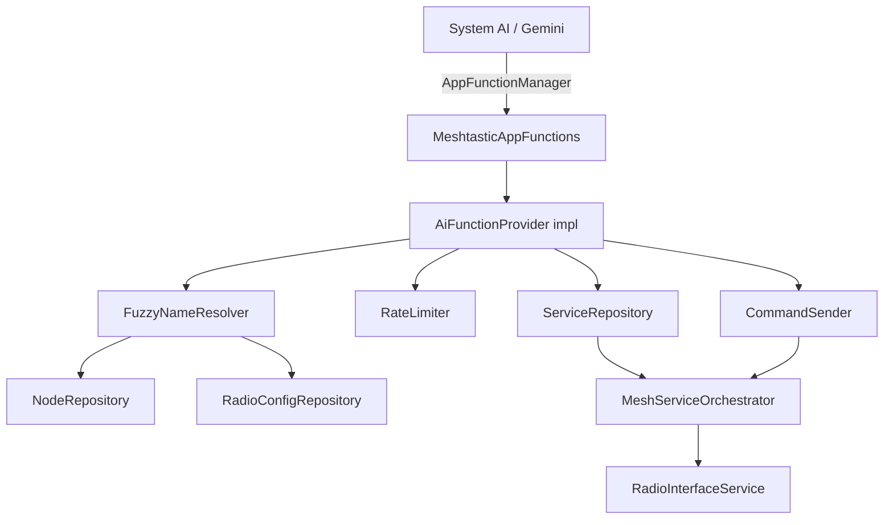

# Feature Specification: Android App Functions Integration

**Feature Branch**: `jamesarich/crispy-barnacle`  
**Created**: 2026-05-21  
**Status**: Draft  
**Input**: User description: "Set up App Functions so our app can integrate better with system AI"  
**Cross-Platform Spec**: KMP — interfaces defined in commonMain; Android implementation in androidApp (Google flavor first-class)

## Summary

Expose key Meshtastic capabilities as [Android App Functions](https://developer.android.com/ai/appfunctions) so system AI assistants (Gemini, etc.) can discover and invoke them on behalf of the user. App Functions act as on-device MCP tools, letting users interact with the mesh network through natural language — sending messages and checking mesh health — without manually navigating the app UI.

**Phase 1 (this spec)** focuses on a minimal MVP of 2 functions (`sendMessage` + `getMeshStatus`) to validate the integration end-to-end. Additional functions (listNodes, getRecentMessages, getNodePosition, waypoints, traceroute) will be added in Phase 2 after validation.

## Goals

1. Declare a minimal set of App Functions that validate the Meshtastic ↔ system AI integration pattern
2. Enable natural-language interactions like "Send a message to the mesh" or "How many nodes are online?"
3. Follow Android App Functions best practices: KDoc-described functions, `@AppFunctionSerializable` models, and proper `AppFunctionContext` usage
4. Define platform-agnostic interfaces in `commonMain` so other platforms (Desktop, iOS) can expose equivalent capabilities through their own AI systems in the future
5. Implement the Android-specific `@AppFunction` annotations in `androidApp` (Google flavor first-class)
6. Integrate with existing Koin DI to resolve repositories and managers

## Non-Goals

- Implementing a remote MCP server (App Functions are on-device only)
- Exposing radio configuration or admin operations to AI (security-sensitive; future consideration)
- Building custom AI/LLM features within the app itself
- Handling firmware updates or device provisioning through AI
- Exposing raw protobuf operations or low-level radio commands
- Phase 2+ functions (listNodes, getRecentMessages, getNodePosition, waypoints, traceroute) — deferred until Phase 1 validates the pattern
- F-Droid flavor implementation (platform API works there, but Google flavor is first-class target)

## User Scenarios & Testing *(mandatory)*

### User Story 1 - Send a Mesh Message via AI (Priority: P1)

As a user talking to my phone's AI assistant, I want to say "Send a message to the mesh saying I'll be at the trailhead in 30 minutes" so I can communicate without opening the app.

**Why this priority**: Messaging is the #1 use case for Meshtastic; it's the most natural AI-triggered action.

**Independent Test**: Can be verified by invoking the App Function through the test agent app and confirming the message appears in the mesh message list.

**Acceptance Scenarios**:

1. **Given** the device is connected to a Meshtastic radio, **When** the AI assistant invokes `sendMessage` with text and a channel name, **Then** the channel is resolved via fuzzy matching, the message is transmitted over the mesh, and a confirmation with message ID is returned
2. **Given** the device is NOT connected to a radio, **When** the AI invokes `sendMessage`, **Then** the function returns an error result indicating no active connection
3. **Given** a valid node name is provided as the recipient, **When** the AI invokes `sendMessage` with a direct message target, **Then** the node name is fuzzy-matched and the message is sent as a DM to that specific node
4. **Given** the AI invokes `sendMessage` more than 5 times within 60 seconds, **When** the rate limit is exceeded, **Then** `AppFunctionLimitExceededException` is thrown with a descriptive message
5. **Given** a node name matches multiple nodes (e.g., "Jake" → "Jake's Radio" + "Jake_hiking"), **When** the match is ambiguous, **Then** `AppFunctionInvalidArgumentException` is thrown listing the candidate names for the AI to disambiguate

---

### User Story 2 - Query Mesh Network Status (Priority: P1)

As a user, I want to ask my AI assistant "How's my mesh network doing?" and get a summary of online nodes, my node's battery, and connection state.

**Why this priority**: Status queries are read-only and safe — ideal first-class AI capabilities.

**Independent Test**: Can be verified by invoking `getMeshStatus` and confirming the returned data matches the app's node list.

**Acceptance Scenarios**:

1. **Given** the device is connected, **When** the AI invokes `getMeshStatus`, **Then** it returns online node count, total node count, local battery level, and connection state
2. **Given** the device is disconnected, **When** the AI invokes `getMeshStatus`, **Then** it returns the disconnected state with last-known node counts

---

### Edge Cases

- What happens when multiple nodes match a name query? Return `AppFunctionInvalidArgumentException` listing candidate names so the AI agent can ask the user to clarify.
- What happens when multiple channels match a name query? Same approach — return candidates for disambiguation.
- What happens when the radio connection drops mid-operation? Return an error result; do not crash or hang.
- What happens with very long messages? Enforce the Meshtastic message length limit (237 bytes for standard, longer for PKC) and return `AppFunctionInvalidArgumentException` if exceeded.
- What happens if the rate limit is hit? Throw `AppFunctionLimitExceededException`; the AI agent handles this gracefully per platform conventions.

## Architecture

### Key Components

| Component | Module / File | Purpose |
|-----------|---------------|---------|
| AiFunctionProvider (interface) | `core/data/src/commonMain/.../ai/AiFunctionProvider.kt` | Platform-agnostic contract defining operations exposable to AI systems |
| MeshtasticAppFunctions | `androidApp/src/main/kotlin/.../appfunctions/MeshtasticAppFunctions.kt` | `@AppFunction`-annotated Android implementation |
| AppFunctionModels | `androidApp/src/main/kotlin/.../appfunctions/models/` | `@AppFunctionSerializable` data classes for function inputs/outputs |
| FuzzyNameResolver | `core/data/src/commonMain/.../ai/FuzzyNameResolver.kt` | Fuzzy matching for node and channel names (longest-substring, error if ambiguous) |
| RateLimiter | `core/data/src/commonMain/.../ai/RateLimiter.kt` | Sliding-window rate limiter (5 calls / 60s) for send operations |
| NodeRepository | `core/repository/` (commonMain) | Existing node data access — unchanged |
| PacketRepository | `core/repository/` (commonMain) | Existing message data access — unchanged |
| ServiceRepository | `core/repository/` (commonMain) | Existing connection state — unchanged |
| CommandSender | `core/repository/` (commonMain) | Existing mesh command dispatch — unchanged |

### Data Flow

```
System AI Agent (Gemini)
    ↓ (EXECUTE_APP_FUNCTIONS permission)
AppFunctionManager (Android OS, API 35+)
    ↓
MeshtasticAppFunctions (@AppFunction annotated, androidApp)
    ↓
AiFunctionProvider interface (commonMain contract)
    ↓
FuzzyNameResolver → NodeRepository / RadioConfigRepository (name → ID resolution)
    ↓
CommandSender / ServiceRepository (execute operation)
    ↓
MeshServiceOrchestrator → Radio
```

### Dependency Graph



### KMP Architecture Pattern

```
commonMain/
├── ai/
│   ├── AiFunctionProvider.kt      # Interface: what operations AI can invoke
│   ├── AiFunctionResult.kt        # Sealed result types (success/error)
│   ├── FuzzyNameResolver.kt       # Name matching logic (testable, shared)
│   └── RateLimiter.kt             # Token-bucket limiter (testable, shared)

androidApp/ (Google flavor)
├── appfunctions/
│   ├── MeshtasticAppFunctions.kt  # @AppFunction declarations
│   ├── AppFunctionFactory.kt      # Koin-based factory for DI
│   └── models/                    # @AppFunctionSerializable types
```

## Requirements *(mandatory)*

### Functional Requirements

- **FR-001**: The app MUST declare App Functions using the `@AppFunction(isDescribedByKDoc = true)` annotation with comprehensive KDoc descriptions
- **FR-002**: All function parameters and return types MUST use `@AppFunctionSerializable` data classes with KDoc-described fields
- **FR-003**: `sendMessage` MUST resolve the destination via fuzzy name matching (channel name or node name), transmit the text message, and return a confirmation with message ID
- **FR-004**: `sendMessage` MUST enforce a rate limit of 5 invocations per 60-second sliding window, throwing `AppFunctionLimitExceededException` when exceeded
- **FR-005**: `getMeshStatus` MUST return current connection state, online/total node counts, and local device battery level
- **FR-006**: Fuzzy name matching MUST use longest-substring matching and throw `AppFunctionInvalidArgumentException` with candidate names when ambiguous
- **FR-007**: All functions MUST gracefully handle the disconnected state by throwing appropriate `AppFunctionException` subclasses (not generic exceptions)
- **FR-008**: The `sendMessage` function MUST validate message length against the Meshtastic protocol limit before transmission
- **FR-009**: A platform-agnostic `AiFunctionProvider` interface MUST be defined in `commonMain` with the operation contracts
- **FR-010**: The Android implementation MUST resolve dependencies through Koin via a custom `AppFunctionConfiguration.Provider`
- **FR-011**: `sendMessage` MUST send immediately without a confirmation dialog (AI invocation implies user intent per platform guidelines)

### Non-Functional Requirements

- **NFR-001**: App Functions MUST NOT expose sensitive configuration (admin channels, encryption keys, radio settings) to AI agents
- **NFR-002**: All App Function operations MUST complete within 5 seconds or throw a timeout error
- **NFR-003**: The App Functions layer requires `compileSdk` 36+ and MUST only be active on devices running Android 16 (API 35+)
- **NFR-004**: KDoc descriptions MUST be clear enough for an AI agent to understand the function's purpose without additional context
- **NFR-005**: The `AiFunctionProvider` interface in commonMain MUST have no Android dependencies
- **NFR-006**: Dependencies: `androidx.appfunctions:appfunctions:1.0.0-alpha09`, `appfunctions-service:1.0.0-alpha09`, `appfunctions-compiler:1.0.0-alpha09` (KSP)

## Source-Set Impact

| Source Set | Impact | Justification |
|-----------|--------|---------------|
| `commonMain` (core/data) | New: `AiFunctionProvider` interface, `FuzzyNameResolver`, `RateLimiter`, result types | Platform-agnostic contracts and shared logic |
| `androidMain` (androidApp, Google flavor) | New: `@AppFunction` declarations, serializable models, Koin factory | AppFunctions is an Android platform API |
| `jvmMain` | None | Desktop not affected (future: could implement via local MCP server) |
| `iosMain` | None | iOS not affected (future: could implement via App Intents) |

## Design Standards Compliance

- [x] New screens reviewed against design standards — N/A, no UI changes
- [x] M3 component selection verified — N/A, no UI components
- [x] Accessibility: N/A — App Functions are invoked by AI, not direct user interaction
- [x] Typography: N/A
- [x] KDoc documentation provides clear natural-language descriptions for AI discovery

## Privacy Assessment

- [x] No PII logged or exposed beyond what the user has already shared on the mesh
- [x] Position data gated behind existing privacy settings
- [x] Messages sent only with user's implicit consent (AI assistant invocation = user intent)
- [x] No encryption keys, admin channel configs, or radio settings exposed
- [x] Proto submodule (`core/proto`) not modified (read-only upstream)
- [x] `EXECUTE_APP_FUNCTIONS` permission required by callers — only authorized system agents can invoke

## Success Criteria *(mandatory)*

### Measurable Outcomes

- **SC-001**: Both declared App Functions are discoverable via `adb shell cmd app_function list-app-functions | grep org.meshtastic` on API 35+ devices
- **SC-002**: The test agent app can successfully invoke `sendMessage` and receive a confirmation with message ID when connected
- **SC-003**: The test agent app can invoke `getMeshStatus` and receive accurate node counts matching the app's UI within 1 second
- **SC-004**: `sendMessage` returns `AppFunctionLimitExceededException` after 5 rapid invocations within 60 seconds
- **SC-005**: Ambiguous name queries return `AppFunctionInvalidArgumentException` with candidate list
- **SC-006**: Zero crashes or ANRs introduced by App Function invocations

## Decisions Log

| # | Question | Decision | Rationale |
|---|----------|----------|-----------|
| 1 | User confirmation before sending? | No — send immediately | AI invocation implies user intent per platform guidelines; messaging is additive not destructive |
| 2 | Rate limiting? | Yes — 5 messages/60s sliding window | Aligns with radio duty-cycle constraints; platform provides `AppFunctionLimitExceededException` |
| 3 | Channel/node selection? | Fuzzy name matching | More natural for AI conversation; longest-substring match with error on ambiguity |
| 4 | Build flavor scope? | Google flavor first-class, KMP interfaces in commonMain | Platform API works everywhere but Gemini (primary caller) is Google; KMP future-proofs |
| 5 | Initial scope? | Minimal MVP (2 functions) | Validate integration pattern before expanding; sendMessage + getMeshStatus |

## Assumptions

- The user has already paired and connected to a Meshtastic radio device
- The app is installed on an Android 16+ (API 35) device that supports App Functions
- System AI agents have the `EXECUTE_APP_FUNCTIONS` permission (granted by the OS)
- The Jetpack AppFunctions library (`androidx.appfunctions:appfunctions-*` 1.0.0-alpha09) is stable enough for integration
- Koin dependency injection context is available when App Functions are invoked (app process is alive)
- The AppFunctions annotation processor (KSP) is compatible with the project's existing KSP setup
- `compileSdk` is already 37 (satisfies the ≥36 requirement for AppFunctions library)

## Open Questions

1. **Exact rate limit values**: Is 5 messages/60 seconds the right threshold, or should it align with a specific radio duty-cycle calculation?
2. **Background invocation**: Can App Functions be invoked when the app is in the background but the service is running? (Likely yes, since `AppFunctionService` runs in the app process)

## Future Considerations (Phase 2+)

- **listNodes**: "Who's on the mesh?" → return online nodes with names and last-heard
- **getRecentMessages**: "Any new messages?" → return unread messages with sender/text/time
- **getNodePosition**: "Where is Jake?" → return GPS coordinates (gated by privacy settings)
- **Waypoint management**: Create/delete waypoints via AI
- **Traceroute**: "Can I reach node X?" → invoke traceroute and return hop count
- **Channel info**: "What channels am I on?" → list configured channels
- **Device telemetry**: "How's my radio's battery?" → return device metrics
- **Location sharing**: "Share my location on the mesh" → trigger position broadcast
- **Desktop/iOS parity**: Implement `AiFunctionProvider` via local MCP server (Desktop) or App Intents (iOS)
