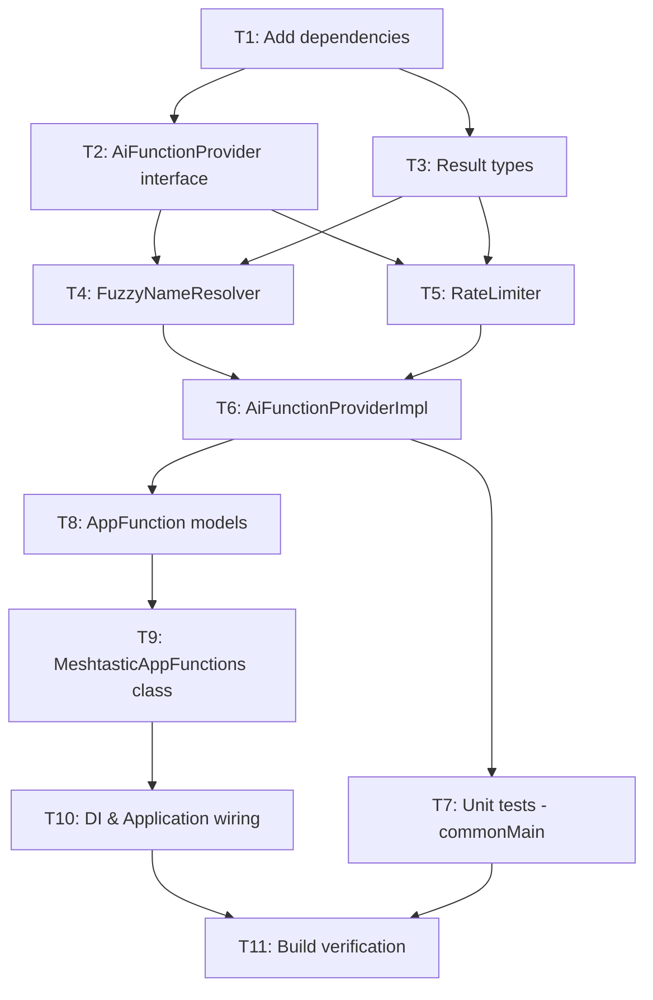

# Tasks: Android App Functions Integration

**Spec**: `specs/20260521-091500-app-functions/spec.md`  
**Plan**: `specs/20260521-091500-app-functions/plan.md`  
**Branch**: `jamesarich/crispy-barnacle`

## Task Dependency Graph



---

## T1: Add AppFunctions Dependencies & KSP Plugin

**Priority**: P0 (blocking)  
**Depends on**: None  
**Estimated effort**: Small

### Description
Add the `androidx.appfunctions` library suite to the version catalog and configure KSP in `androidApp`.

### Files to modify
- `gradle/libs.versions.toml` — add version + 3 library entries
- `androidApp/build.gradle.kts` — apply KSP plugin, add dependencies, add KSP arg

### Acceptance criteria
- [ ] `./gradlew :androidApp:dependencies | grep appfunctions` shows all 3 artifacts resolved
- [ ] `./gradlew :androidApp:compileGoogleDebugKotlin` compiles without errors

### Implementation notes
```toml
# In [versions]
appfunctions = "1.0.0-alpha09"

# In [libraries]
androidx-appfunctions = { group = "androidx.appfunctions", name = "appfunctions", version.ref = "appfunctions" }
androidx-appfunctions-service = { group = "androidx.appfunctions", name = "appfunctions-service", version.ref = "appfunctions" }
androidx-appfunctions-compiler = { group = "androidx.appfunctions", name = "appfunctions-compiler", version.ref = "appfunctions" }
```

In `androidApp/build.gradle.kts`:
- Add `alias(libs.plugins.ksp)` to plugins block (verify KSP plugin alias exists in catalog)
- Add `ksp { arg("appfunctions:aggregateAppFunctions", "true") }` block
- Add `implementation(libs.androidx.appfunctions)` 
- Add `implementation(libs.androidx.appfunctions.service)`
- Add `ksp(libs.androidx.appfunctions.compiler)`

---

## T2: Create AiFunctionProvider Interface

**Priority**: P0 (blocking)  
**Depends on**: T1  
**Estimated effort**: Small

### Description
Define the platform-agnostic interface in `core/data` commonMain that declares what operations AI systems can invoke.

### Files to create
- `core/data/src/commonMain/kotlin/org/meshtastic/core/data/ai/AiFunctionProvider.kt`

### Acceptance criteria
- [ ] Interface has `sendMessage` and `getMeshStatus` suspend functions
- [ ] No `android.*` or `java.*` imports
- [ ] `./gradlew :core:data:compileKotlinJvm` passes

### Implementation notes
```kotlin
package org.meshtastic.core.data.ai

interface AiFunctionProvider {
    suspend fun sendMessage(text: String, recipientName: String?, channelName: String?): SendMessageResult
    suspend fun getMeshStatus(): MeshStatusResult
}
```

---

## T3: Create Result Types (AiFunctionResult.kt)

**Priority**: P0 (blocking)  
**Depends on**: T1  
**Estimated effort**: Small

### Description
Define sealed result types for AI function operations. These are pure data classes with no platform dependencies.

### Files to create
- `core/data/src/commonMain/kotlin/org/meshtastic/core/data/ai/AiFunctionResult.kt`

### Acceptance criteria
- [ ] `SendMessageResult` sealed class with `Success`, `NotConnected`, `AmbiguousName`, `InvalidArgument`, `RateLimited` variants
- [ ] `MeshStatusResult` data class with `connectionState`, `onlineNodeCount`, `totalNodeCount`, `localBatteryLevel`, `localNodeName`
- [ ] No platform dependencies
- [ ] Compiles on all targets: `./gradlew :core:data:compileKotlinJvm`

---

## T4: Implement FuzzyNameResolver

**Priority**: P0 (blocking)  
**Depends on**: T2, T3  
**Estimated effort**: Medium

### Description
Implement longest-substring fuzzy name matching for resolving node names and channel names. Case-insensitive. Returns single match or error with candidates.

### Files to create
- `core/data/src/commonMain/kotlin/org/meshtastic/core/data/ai/FuzzyNameResolver.kt`

### Acceptance criteria
- [ ] Exact match (case-insensitive) returns immediately
- [ ] Unique fuzzy match (longest common substring ≥ 50% of query length) returns the match
- [ ] Multiple fuzzy matches returns `AmbiguousName` with candidate list
- [ ] No match returns empty/not-found
- [ ] `@Single` Koin annotation for DI registration
- [ ] Resolves node names from `NodeRepository.nodeDBbyNum`
- [ ] Resolves channel names from `RadioConfigRepository` channel list
- [ ] Admin channels excluded from resolution results (NFR-001: no sensitive config exposed)

### Implementation notes
- Constructor injects `NodeRepository` and `RadioConfigRepository`
- `resolveNodeName(query: String): NodeNameResult` → sealed: `Found(nodeNum, userId)`, `Ambiguous(candidates)`, `NotFound`
- `resolveChannelName(query: String): ChannelNameResult` → sealed: `Found(channelIndex, name)`, `Ambiguous(candidates)`, `NotFound`
- Longest Common Substring algorithm for fuzzy scoring

---

## T5: Implement RateLimiter

**Priority**: P0 (blocking)  
**Depends on**: T2, T3  
**Estimated effort**: Small

### Description
Sliding-window rate limiter: tracks last 5 invocation timestamps within a 60-second window. Thread-safe via Mutex.

### Files to create
- `core/data/src/commonMain/kotlin/org/meshtastic/core/data/ai/RateLimiter.kt`

### Acceptance criteria
- [ ] Permits up to 5 calls within 60 seconds
- [ ] Returns `RateLimited(retryAfterSeconds)` when all 5 slots are within the window
- [ ] Thread-safe (Mutex)
- [ ] Uses injected `Clock` for testability
- [ ] `@Single` Koin annotation

### Implementation notes
```kotlin
@Single
class RateLimiter(private val clock: Clock) {
    private val mutex = Mutex()
    private val maxCalls = 5
    private val windowDuration = 60.seconds
    private val timestamps = ArrayDeque<Instant>(maxCalls)

    suspend fun tryAcquire(): RateLimitResult { ... }
}

sealed class RateLimitResult {
    data object Permitted : RateLimitResult()
    data class Limited(val retryAfterSeconds: Int) : RateLimitResult()
}
```

---

## T6: Implement AiFunctionProviderImpl

**Priority**: P0 (blocking)  
**Depends on**: T4, T5  
**Estimated effort**: Medium

### Description
Wire the AI function interface to existing repositories. This is the core business logic bridge.

### Files to create
- `core/data/src/commonMain/kotlin/org/meshtastic/core/data/ai/AiFunctionProviderImpl.kt`

### Acceptance criteria
- [ ] `@Single` Koin annotation, binds `AiFunctionProvider` interface
- [ ] `sendMessage` flow: check connection → rate limit → resolve name → validate length → create DataPacket → send → return Success
- [ ] `getMeshStatus` flow: read connectionState, node counts, battery, node name
- [ ] Disconnected state returns `NotConnected` (not exception)
- [ ] Message length validated against 237-byte limit
- [ ] All operations complete within timeout (use `withTimeout(5.seconds)`)

### Implementation notes
- Inject: `NodeRepository`, `ServiceRepository`, `CommandSender`, `RadioConfigRepository`, `FuzzyNameResolver`, `RateLimiter`
- For `sendMessage`: construct `DataPacket(to = resolvedNodeId, bytes = text.encodeToByteString(), dataType = Portnums.TEXT_MESSAGE_APP, channel = resolvedChannelIndex)`
- For `getMeshStatus`: use `.value` on StateFlows (no suspension needed for connection state), `.first()` for counts
- `ConnectionState.CONNECTED` check before proceeding

---

## T7: Unit Tests for commonMain AI Layer

**Priority**: P1  
**Depends on**: T6  
**Estimated effort**: Medium

### Description
Comprehensive unit tests for FuzzyNameResolver, RateLimiter, and AiFunctionProviderImpl.

### Files to create
- `core/data/src/commonTest/kotlin/org/meshtastic/core/data/ai/FuzzyNameResolverTest.kt`
- `core/data/src/commonTest/kotlin/org/meshtastic/core/data/ai/RateLimiterTest.kt`
- `core/data/src/commonTest/kotlin/org/meshtastic/core/data/ai/AiFunctionProviderImplTest.kt`

### Acceptance criteria
- [ ] **FuzzyNameResolverTest**: exact match, unique fuzzy, ambiguous, no match, case insensitivity, channel name resolution, channel ambiguity
- [ ] **FuzzyNameResolverTest (security)**: admin channels excluded from resolution results (NFR-001)
- [ ] **RateLimiterTest**: permits under limit, blocks at limit, refills after window expires (use fake Clock)
- [ ] **AiFunctionProviderImplTest**: happy path send, disconnected error, rate limited, ambiguous name, message too long, getMeshStatus connected, getMeshStatus disconnected
- [ ] **AiFunctionProviderImplTest (timeout)**: verify operations throw timeout after 5 seconds when repository hangs (NFR-002)
- [ ] All tests pass: `./gradlew :core:data:allTests`

### Implementation notes
- Use `runTest(UnconfinedTestDispatcher())` for coroutine tests
- Mock repositories with fakes or mockk
- Inject fake `Clock` that can be advanced for rate limiter tests

---

## T8: Create AppFunction Serializable Models

**Priority**: P1  
**Depends on**: T6  
**Estimated effort**: Small

### Description
Define `@AppFunctionSerializable` response types for the Android platform layer.

### Files to create
- `androidApp/src/google/kotlin/org/meshtastic/app/appfunctions/models/SendMessageResponse.kt`
- `androidApp/src/google/kotlin/org/meshtastic/app/appfunctions/models/MeshStatusResponse.kt`

### Acceptance criteria
- [ ] Both classes annotated with `@AppFunctionSerializable(isDescribedByKDoc = true)`
- [ ] All fields have KDoc descriptions clear enough for AI agent understanding
- [ ] `SendMessageResponse`: messageId (Int), channelName (String), timestamp (Long)
- [ ] `MeshStatusResponse`: connectionState (String), onlineNodeCount (Int), totalNodeCount (Int), batteryLevel (Int?), localNodeName (String?)
- [ ] Compiles: `./gradlew :androidApp:compileGoogleDebugKotlin`

---

## T9: Implement MeshtasticAppFunctions Class

**Priority**: P1  
**Depends on**: T8  
**Estimated effort**: Medium

### Description
Create the `@AppFunction`-annotated class that the Android system discovers and invokes. Maps commonMain results to platform exceptions.

### Files to create
- `androidApp/src/google/kotlin/org/meshtastic/app/appfunctions/MeshtasticAppFunctions.kt`

### Acceptance criteria
- [ ] `sendMessage` annotated with `@AppFunction(isDescribedByKDoc = true)` with comprehensive KDoc
- [ ] `getMeshStatus` annotated with `@AppFunction(isDescribedByKDoc = true)` with comprehensive KDoc
- [ ] First param is always `AppFunctionContext`
- [ ] Error mapping: `NotConnected` → `AppFunctionAppException`, `AmbiguousName` → `AppFunctionInvalidArgumentException`, `RateLimited` → `AppFunctionLimitExceededException`, `InvalidArgument` → `AppFunctionInvalidArgumentException`
- [ ] Constructor takes `AiFunctionProvider`
- [ ] Compiles with KSP generating schema

---

## T10: DI Wiring & Application Configuration

**Priority**: P1  
**Depends on**: T9  
**Estimated effort**: Medium

### Description
Wire AppFunctions into Koin DI and configure the Application class to provide the factory.

### Files to create
- `androidApp/src/google/kotlin/org/meshtastic/app/appfunctions/di/AppFunctionsModule.kt`
- `androidApp/src/google/kotlin/org/meshtastic/app/GoogleMeshUtilApplication.kt`

### Files to modify
- `androidApp/src/google/kotlin/org/meshtastic/app/di/FlavorModule.kt` — add `AppFunctionsModule` to includes
- `androidApp/src/google/AndroidManifest.xml` — point `android:name` to `GoogleMeshUtilApplication`

### Acceptance criteria
- [ ] `AppFunctionsModule` provides `MeshtasticAppFunctions` via Koin
- [ ] `FlavorModule` includes `AppFunctionsModule`
- [ ] `GoogleMeshUtilApplication` extends `MeshUtilApplication` and implements `AppFunctionConfiguration.Provider`
- [ ] Google flavor manifest uses `GoogleMeshUtilApplication`
- [ ] F-Droid flavor unaffected (still uses base `MeshUtilApplication`)
- [ ] App launches without crash: `./gradlew :androidApp:assembleGoogleDebug`

### Implementation notes
- `GoogleMeshUtilApplication` overrides `appFunctionConfiguration`:
  ```kotlin
  override val appFunctionConfiguration: AppFunctionConfiguration
      get() = AppFunctionConfiguration.Builder()
          .addEnclosingClassFactory(MeshtasticAppFunctions::class.java) {
              get<MeshtasticAppFunctions>()
          }
          .build()
  ```
- Check if google flavor already has a custom Application subclass

---

## T11: Build Verification & Final Checks

**Priority**: P1  
**Depends on**: T7, T10  
**Estimated effort**: Small

### Description
Run full verification suite and confirm AppFunctions are properly registered.

### Commands to run
```bash
./gradlew spotlessApply
./gradlew spotlessCheck detekt
./gradlew assembleDebug
./gradlew test allTests
./gradlew :androidApp:assembleGoogleDebug
./gradlew :androidApp:assembleFdroidDebug
```

### Acceptance criteria
- [ ] All formatting passes (`spotlessCheck`)
- [ ] All static analysis passes (`detekt`)
- [ ] Both flavors compile (`assembleGoogleDebug`, `assembleFdroidDebug`)
- [ ] All tests pass (`test allTests`)
- [ ] No new warnings introduced
- [ ] KSP generates AppFunction schema XML in build output
